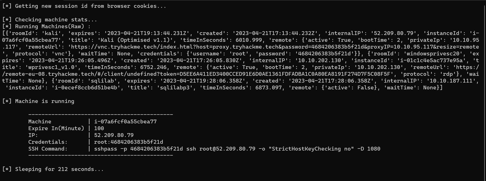

# security-writeups

- Some security traning during the internship at GSS corp.

- Writeups of HTB(Hack The Box) machine/challenge in my spare time.

- A script to renew THM(Try Hack Me) attacker machine automatically.

- Try Hack Me Writeups, including some learning paths and rooms.

## Table of Contents

| Topics                            | Description                                               |
| --------------------------------- | --------------------------------------------------------- |
| [GSS Internship](#gss-internship) | Some security research during the internship at GSS corp. |
| [Hack The Box](#hack-the-box)     | Hack The Box machine and challnge writeups/walkthroughs.  |
| [Try Hack Me](#try-hack-me)       | Try Hack Me related notes and scripts.                    |

## GSS Internship

- [DVWA (Damn Vulnerable Web Application)](./gss/DVWA.md)
- [Metasploit Practice](./gss/metasploit.md)
- [WebAp Penetration Testing](./gss/WebAp-PT.md)
- **Zimbra**
  - [How To Setup Zimbra CTF](https://medium.com/@opabravo/frist-time-deploying-a-ctf-challenge-c13871d45970)
  - [Zimbra CTF Writeup : Sneaky Way (Manually)](https://medium.com/@opabravo/zimbra-ctf-writeup-manually-6afe91be52a0)
  - [Zimbra CTF 說明](./gss/Zimbra-CTF-Intro.pdf)
  - [Zimbra CVE Reproduce](./gss/Zimbra.pdf)

## Hack The Box

Hack The Box is an online platform allowing you to test your penetration testing skills and exchange ideas and methodologies with other members of similar interests.

### Password

Active machine writeups/walkthroughs are encrypted with passwords, due to Hack The Box's rules.

Heard that the password might be in `$(cewl https://greybot.me)` though.

### Machine Writeup/Walkthrough

> [Machines](./htb/Machines)

### Challenges Writeup/Walkthrough

- [A Nightmare On Math Street](./htb/Challenges/A-Nightmare-On-Math-Street.pdf)

## Try Hack Me

TryHackMe is an online platform to learn and practice ethical hacking.

### Writeups

> [Writeups](./thm/writeups)

| Folder                                             | Description                                                                                                  |
| -------------------------------------------------- | ------------------------------------------------------------------------------------------------------------ |
| [Learning Paths](./thm/writeups/Learning%20Paths/) | Learning Paths include: `Introduction to Defensive Security`, `JR. Penetration Tester`, `Offensive Security` |
| [Rooms](./thm/writeups/Rooms)                      | Some practice and educational rooms other than learning paths                                                |

### Script

> [thm.py](./thm/machine-auto-renew/thm.py)

This script will renew tryhackme's attacker machine automatically, then generate an one line ssh command to let users connect to the machine quickly.

#### Demo

```bash
cd thm
pip3 install -r requirements.txt
python3 thm.py
```



- `-D 1080` will open socks5 proxy for burp suite or proxychains to access labs, very useful!