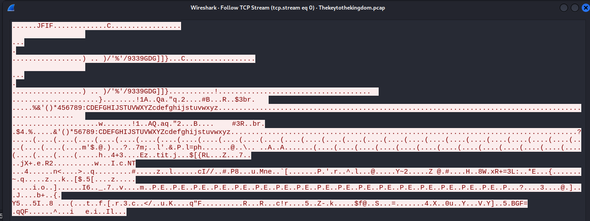

#ctf 
# Info

Other CTFs I solved from various sources

# Ghost Town

> https://ghosttown.deadface.io/

## Keys to the kingdom

Get an insight via **network miner**


Image was transferred with multiple tcp streams


And it looks like a `FJIF` file



Lets grab the data from all tcp streams and merge to a file (can be better done via **scrapy**)

```bash
┌──(bravosec㉿fsociety)-[/tmp]
└─$ mkdir tcp_dumps

┌──(bravosec㉿fsociety)-[/tmp]
└─$ for i in $(seq 0 40); do tshark -q -r Thekeytothekingdom.pcap -z follow,tcp,raw,$i > tcp_dumps/$i; done
```

```bash
┌──(bravosec㉿fsociety)-[/tmp]
└─$ cd tcp_dumps

┌──(bravosec㉿fsociety)-[/tmp/tcp_dumps]
└─$ ls
0  1  10  11  12  13  14  15  16  17  18  19  2  20  21  22  23  24  25  26  27  28  29  3  30  31  32  33  34  35  36  37  38  39  4  40  5  6  7  8  9
```

```bash
┌──(bravosec㉿fsociety)-[/tmp]
└─$ xonsh
```

```python
def get_data(content:str):
    if len(content.split()) != 15:
        return
    return content.split()[-2]
```

```python
datas=[get_data($(cat @(f))) for f in $(ls).splitlines()]
```

```python
for d in datas:
     if d:
         $(echo @(d) >> result.raw)
```

```bash
bravosec@fsociety /tmp/tcp_dumps @ xxd -r -p result.raw result.out
```

Result : 


