#ctf #ctf-ad #faust-ctf-2023 #masscan #nmap #linux #ipv6 #virtualbox #docker #pcap #tcpdump #tulip
# Info

Attack & Defense CTF

> https://2023.faustctf.net/information/rules/

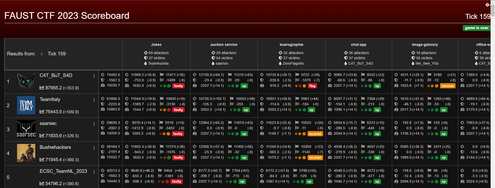

- Flag format : `FAUST_[A-Za-z0-9/+]{32}`
- IPv6 format : `fd66:666:<team-number>::2`
# Learnt

- Setup IDS like **Wazuh**, **Suricata**
- Use [lazydocker](https://github.com/jesseduffield/lazydocker) to manage docker in a non-GUI environment
- Capture packets from docker network
- Packet Analyzer to investigate payloads - [tulip](https://github.com/OpenAttackDefenseTools/tulip)
- `IPV6` scanning via **masscan** 
- SAST via **snyk scanner**
- **Snoopy** command logger requires **auditd** to be setup
# Setup Vulnbox

## Virtualbox Settings

- Create snapshots before or after important changes

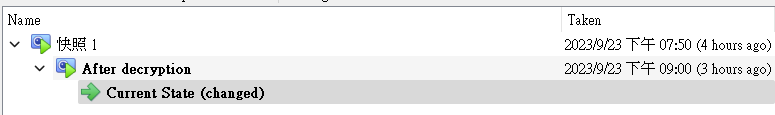

- Create and switch to a lab **NAT Network** 

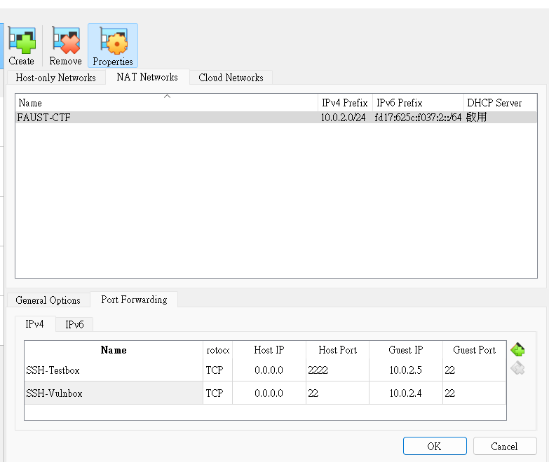

- Setup port forwarding for **NAT Network**

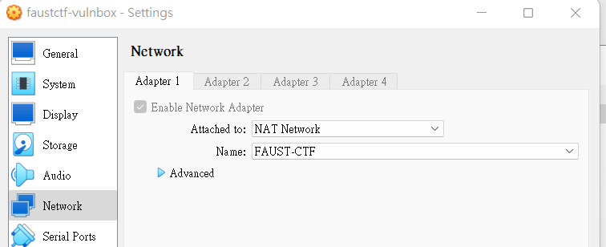

- Increase disk space to `40GB`
## Virtualbox Guest Addition

- Mainly for mounting shared folder between host and VM

Insert guest addition from `Settings -> Storage -> Controller`, then boot machine

```bash
/mnt/VBoxLinuxAdditions.run
reboot
```

After reboot, add shared folders with  `Auto-mount`, `Make Permanent`
## Connect to vulnbox

After connect via ssh, change the root password on VM first

```bash
┌──(bravosec㉿fsociety)-[~/ctf]
└─$ python3 -c 'import secrets; print(secrets.token_urlsafe())'
qUtqxTAKKvcz-imidL27DDEittVX3C44wWTWCc_cqMA
```

```bash
echo -e 'qUtqxTAKKvcz-imidL27DDEittVX3C44wWTWCc_cqMA\nqUtqxTAKKvcz-imidL27DDEittVX3C44wWTWCc_cqMA'|passwd
```

sshpass

```bash
cssh root@fd66:666:442::2 'tCiXBUvJsk7XKApVj_c-PxywGpz5It-m7a7JbT2LAo4'
```

## Run setup script provided by organizer

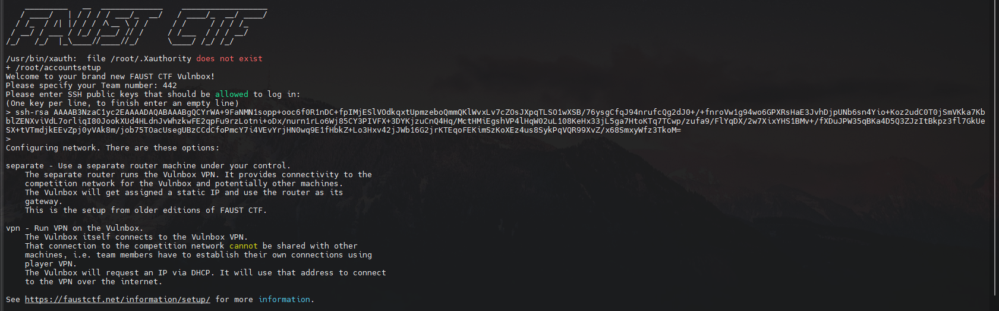

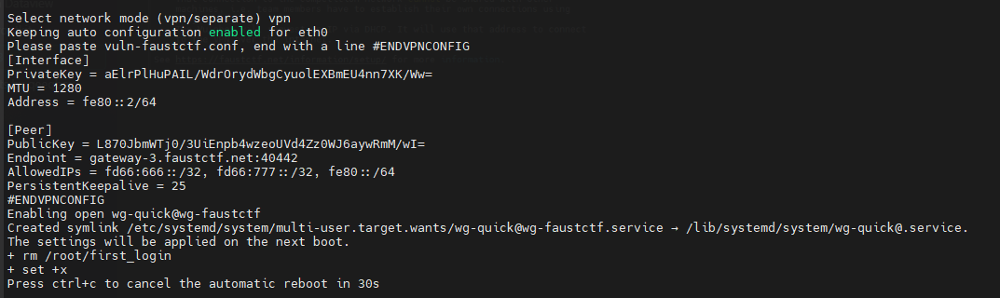

Check VPN connection status

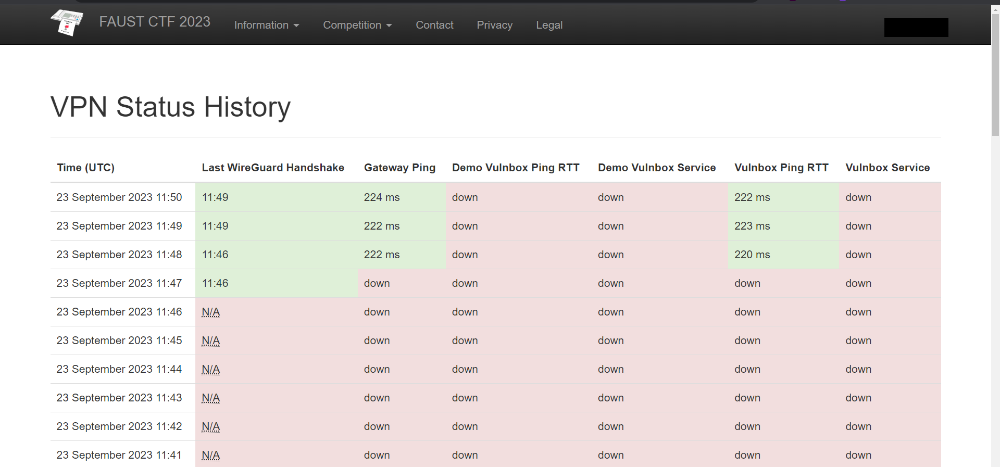
## Decrypt Services

> Once the CTF started, they will release decryption password for challenge services

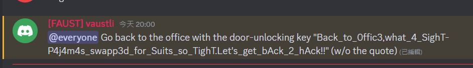

```bash
/srv/extract-services.py /srv/vulnbox_services.tar.xz.gpg
```

> Back_to_0ffic3,what_4_SighT-P4j4m4s_swapp3d_for_Suits_so_TighT.Let's_get_bAck_2_hAck!!

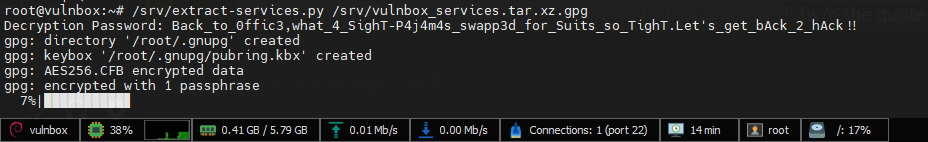

# IPv6 Scanning

## Discover targets via Masscan

Generate possible ipv6 addresses

> `gen_targets.py`

```python
"""
Generate ip v6 addresses for FAUSTCTF
"""
ips = [f"fd66:666:{i}::2" for i in range(700)]
with open("ipv6.txt", "w") as f:
    f.write("\n".join(ips))
```

Get the ipv6 address of `tun-faustctf`

```bash
┌──(bravosec㉿fsociety)-[~/ctf]
└─$ ip -6 a s tun-faustctf
5: tun-faustctf: <POINTOPOINT,MULTICAST,NOARP,UP,LOWER_UP> mtu 1280 qdisc fq_codel state UNKNOWN group default qlen 500
    inet6 fd66:666:442:ffff::1001/64 scope global
       valid_lft forever preferred_lft forever
    inet6 fe80::4c57:dbb:a13b:8545/64 scope link stable-privacy proto kernel_ll
       valid_lft forever preferred_lft forever
```

Specify `--source-ip` and `--interface tun-faustctf` then start scanning

```bash
sudo masscan --max-rate 100000 --source-ip fd66:666:442:ffff::1001 --interface tun-faustctf -iL ipv6.txt -p 22,1337,5000 | tee masscan_ipv6.txt
```

Extract alive ipv6 addresses

```bash
cat masscan_ipv6.txt|awk '{print $6}'|sort -u|tee valid_targets.txt
```

```bash
┌──(bravosec㉿fsociety)-[~/ctf]
└─$ cat valid_targets.txt|wc -l
164
```

## Scan a target

```bash
sudo nmap -6 -sVC -p- -Pn -T4 -vv fd66:666:441::2 -oA ./nmap/all_tcp_ports --open

cat "nmap/all_tcp_ports.nmap" | tail -n +2 | grep -i open | awk '{print $1}' | cut -d'/' -f1 | sed -z 's/\n/,/g;s/,$/\n/'

sudo nmap -6 -sVC -T4 -Pn -vv -oA ./nmap/full_tcp_scan fd66:666:441::2 -p 22,1234,1235,1337,3000,3333,5000,5005,5555,9966,12345,12346,13731
```
# Defend

## Enumuerate local Vulnbox machine

```bash
ss -ltnp
```

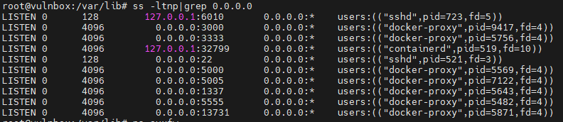

```bash
ps auxf
```

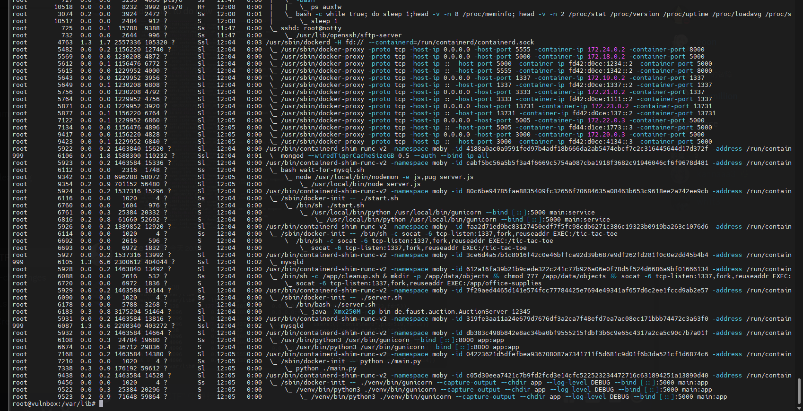

```bash
docker ps -a
```

```bash
CONTAINER ID   IMAGE                                   COMMAND                  CREATED         STATUS         PORTS                                           NAMES
7d18cafd8890   faust.cs.fau.de:5000/image-galoisry     "python ./main.py"       2 minutes ago   Up 2 minutes   0.0.0.0:5005->5000/tcp, :::5005->5000/tcp       image-galoisry
7bdeaa576677   faust.cs.fau.de:5000/chatapp            "./venv/bin/gunicorn…"   2 minutes ago   Up 2 minutes   0.0.0.0:3000->5000/tcp, :::3000->5000/tcp       chat-app_chatapp_1
18fe19e09f89   faust.cs.fau.de:5000/rsamail            "gunicorn --bind [::…"   2 minutes ago   Up 2 minutes   0.0.0.0:5555->8000/tcp, :::5555->8000/tcp       rsa-mail_rsamail_1
2e0ea683d779   mongo:4.4.6                             "docker-entrypoint.s…"   2 minutes ago   Up 2 minutes   27017/tcp                                       mongodb
aadd368d11df   faust.cs.fau.de:5000/tic-tac-toe        "/bin/sh -c 'socat -…"   2 minutes ago   Up 2 minutes   0.0.0.0:3333->1337/tcp, :::3333->1337/tcp       tic-tac-toe_tic-tac-toe_1
9ab90c00f464   mysql:8.1.0                             "docker-entrypoint.s…"   2 minutes ago   Up 2 minutes   3306/tcp, 33060/tcp                             buerographie_mysql_1
1f43b44f45fc   faust.cs.fau.de:5000/buerographie-app   "docker-entrypoint.s…"   2 minutes ago   Up 2 minutes   0.0.0.0:13731->13731/tcp, :::13731->13731/tcp   buerographie_app_1
ab2ac521849e   faust.cs.fau.de:5000/office_supplies    "/bin/sh -c '/app/cl…"   2 minutes ago   Up 2 minutes   0.0.0.0:1337->1337/tcp, :::1337->1337/tcp       office-supplies_office_supplies_1
068ecacba923   faust.cs.fau.de:5000/jokes              "./start.sh"             2 minutes ago   Up 2 minutes   0.0.0.0:5000->5000/tcp, :::5000->5000/tcp       jokes_web_1
c69601e7add6   mysql:8.1.0                             "docker-entrypoint.s…"   3 minutes ago   Up 2 minutes   3306/tcp, 33060/tcp                             chat-app_db_1
4088eee9951b   faust.cs.fau.de:5000/auction-service    "./server.sh"            3 minutes ago   Up 2 minutes                                                   auction-service_auction-service_1
```

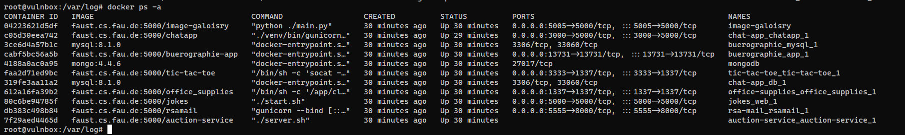

## Capture Traffics

**tcpdump** all docker containers

```bash
docker run --rm --net=host -v /media/sf_VM-Share/tcpdump:/tcpdump kaazing/tcpdump
```

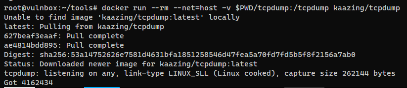

> Sync the packet dumps if Vulnbox was hosted on cloud services

```bash
┌──(bravosec㉿fsociety)-[~/ctf]
└─$ rsync -avzu -e "ssh -i ./faustctf" root@[fd66:666:442::2]:/root/tools/tcpdump .
```

## Analyze Packets via tulip

### Config

> https://github.com/OpenAttackDefenseTools/tulip

> `.env`

```bash
FLAG_REGEX="FAUST_[A-Za-z0-9/+]{32}"
TULIP_MONGO="mongo:27017"

# The location of your pcaps as seen by the host
TRAFFIC_DIR_HOST="C:\VM-Share\FirstDump"

# The location of your pcaps (and eve.json), as seen by the container
TRAFFIC_DIR_DOCKER="/traffic"

# Start time of the CTF (or network open if you prefer)
TICK_START="2023-09-23T21:00+08:00"
# Tick length in ms
TICK_LENGTH=180000
```

> `tulip\services\configurations.py`

```python
import os
from pathlib import Path

traffic_dir = Path(os.getenv("TULIP_TRAFFIC_DIR", "/traffic"))
tick_length = os.getenv("TICK_LENGTH", 2*60*1000)
start_date = os.getenv("TICK_START", "2023-09-23T21:00+08:00")
mongo_host = os.getenv("TULIP_MONGO", "localhost:27017")
mongo_server = f'mongodb://{mongo_host}/'
vm_ip = "fd66:666:442::2"

services = [{"ip": vm_ip, "port": 5000, "name": "jokes_web_1"},
            {"ip": vm_ip, "port": 1337, "name": "office-supplies_office_supplies_1"},
            {"ip": vm_ip, "port": 5555, "name": "rsa-mail_rsamail_1"},
            {"ip": vm_ip, "port": 3333, "name": "tic-tac-toe_tic-tac-toe_1"},
            {"ip": vm_ip, "port": 3000, "name": "scadnet_bin"},
            {"ip": vm_ip, "port": 13731, "name": "buerographie_app_1"}]
```

### Run

```bash
# First time run
docker-compose up -d --build

# To reload config
docker-compose up --build -d api
```
### Demos

- Jokes

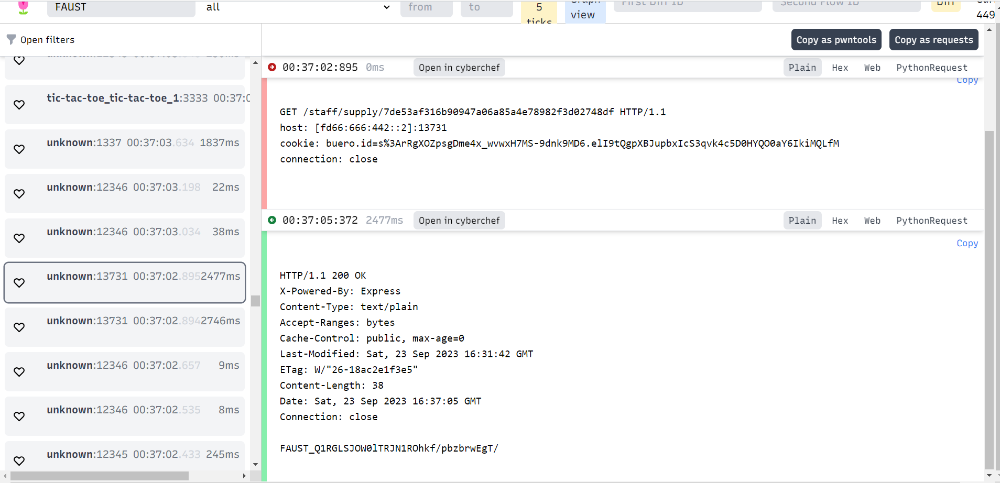

- auction

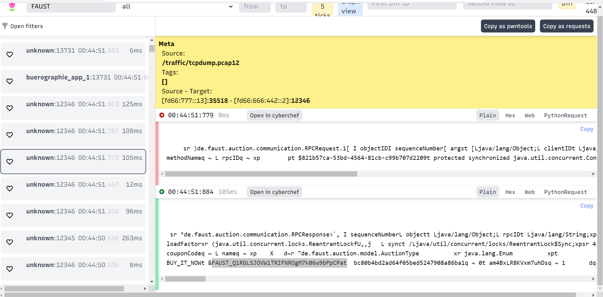

- Office Supply

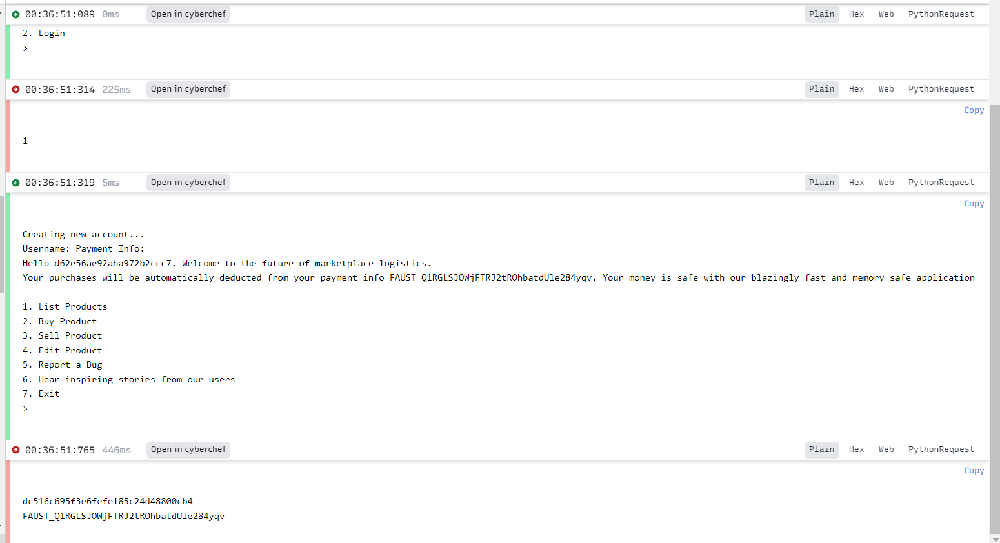

- scadnet_bin

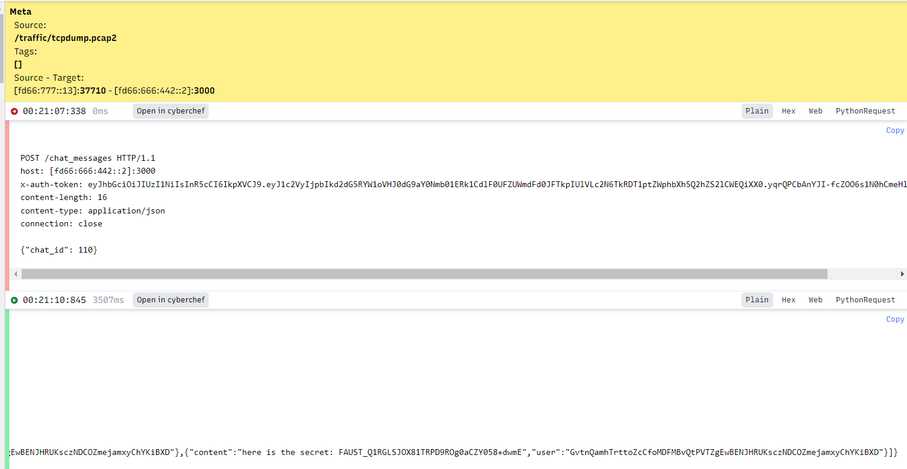

- tic-tac-toe

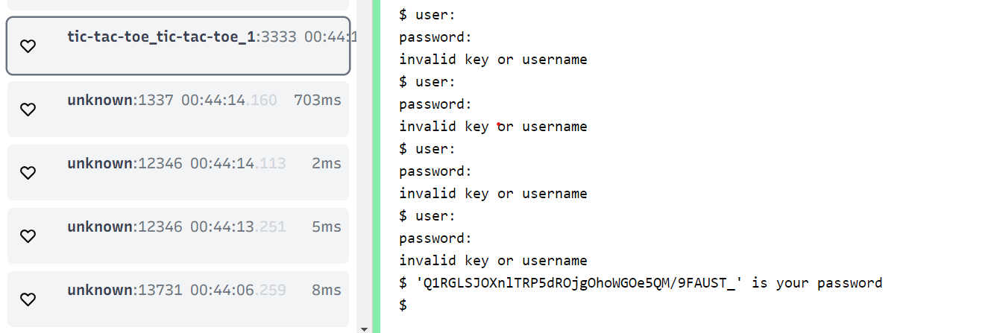

# Challenges

> Just some notes for one of the challenges
## Jokes

### Defend

Access

```bash
docker ps
docker exec -it jokes_web_1 sh
```

Copy Web APP Files to vulnbox

```bash
root@vulnbox:~/gray/Joker# docker cp jokes_web_1:/app/ .
```

Copy files to attacker machine

```bash
┌──(bravosec㉿fsociety)-[~/ctf]
└─$ scp -i faustctf -r root@[fd66:666:442::2]:/root/gray/ ./sync
```

Then use **snyk scanner** to perform SAST
### Attack

> http://[fd66:666:441:2]:5000

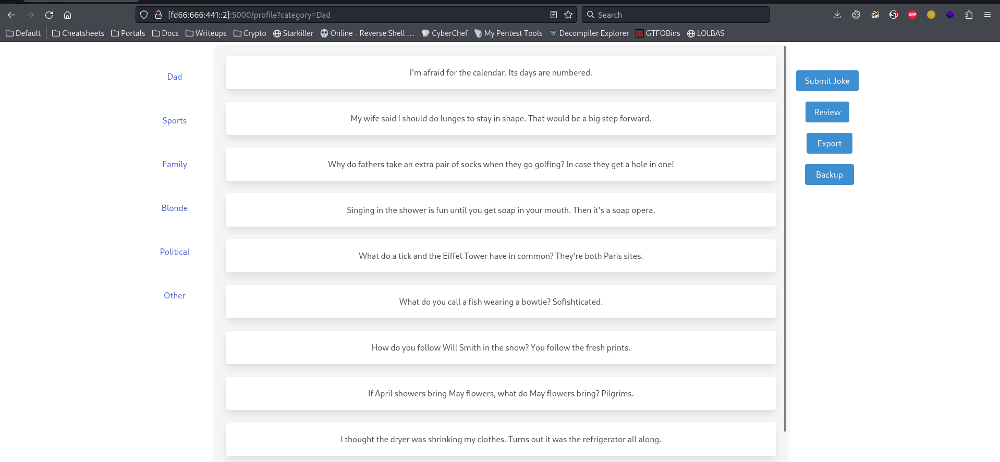

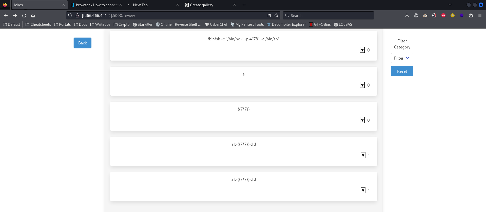

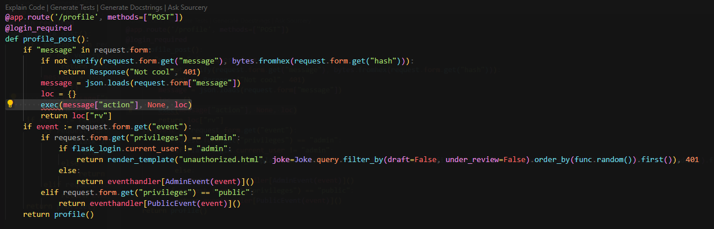

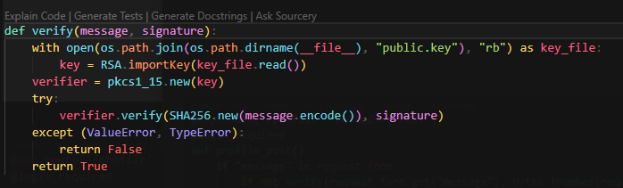
