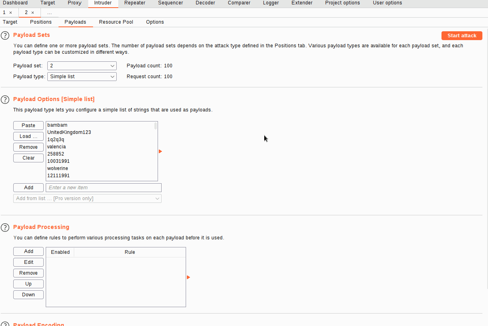
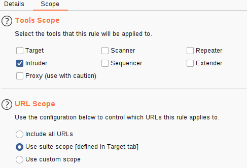
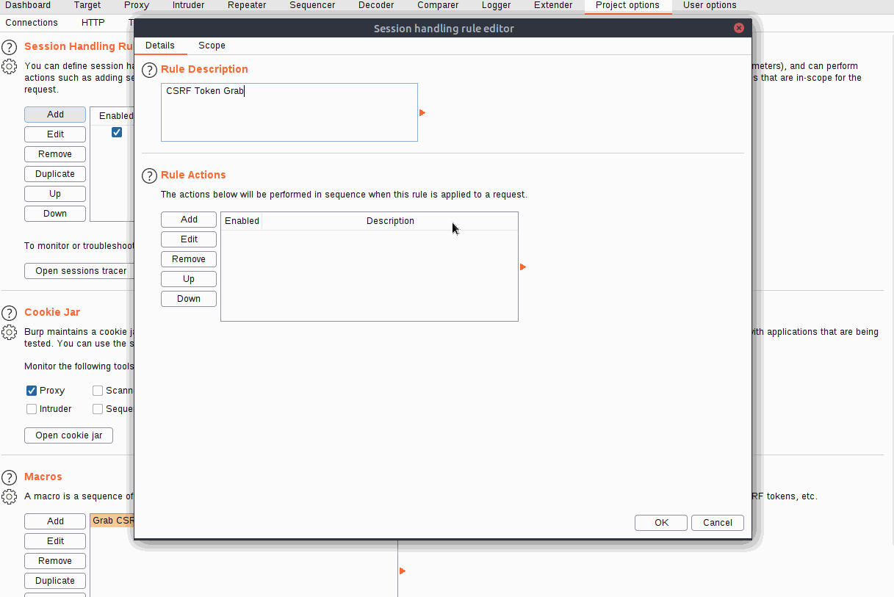

## CSRF Token Bypass

Let's start by catching a request to `http://10.10.96.3/admin/login/` and reviewing the response:

```http
HTTP/1.1 200 OK
Server: nginx/1.18.0 (Ubuntu)
Date: Fri, 20 Aug 2021 22:31:16 GMT
Content-Type: text/html; charset=utf-8
Connection: close
Set-Cookie: session=eyJ0b2tlbklEIjoiMzUyNTQ5ZjgxZDRhOTM5YjVlMTNlMjIzNmI0ZDlkOGEifQ.YSA-mQ.ZaKKsUnNsIb47sjlyux_LN8Qst0; HttpOnly; Path=/
Vary: Cookie
Front-End-Https: on
Content-Length: 3922
---
<form method="POST">
    <div class="form-floating mb-3">
        <input class="form-control" type="text" name=username  placeholder="Username" required>
        <label for="username">Username</label>
    </div>
    <div class="form-floating mb-3">
        <input class="form-control" type="password" name=password  placeholder="Password" required>
        <label for="password">Password</label>
    </div>
    <input type="hidden" name="loginToken" value="84c6358bbf1bd8000b6b63ab1bd77c5e">
    <div class="d-grid"><button class="btn btn-warning btn-lg" type="submit">Login!</button></div>
</form>
```

We have the same username and password fields as before, but now there is also a session cookie set in the response, as well as a CSRF (**C**ross-**S**ite **R**equest **F**orgery) token included in the form as a hidden field. If we refresh the page, we should see that both of these change with each request: this means that we will need to extract valid values for both _every time we make a request._

In other words, every time we attempt to log in, we will need unique values for the session cookie and `loginToken` hidden form input.

### Macros

Add the `/login/` get request to `Project Options` -> `Sessions` -> `Macros`



`Project Options -> Sessions -> Session Handling Rules`, add a rule

URL scope will be the global in-scope in `targets` tab



- Make it set new `loginToken` to post request (html's `name` value)
- Make it update the session ID in cookies

