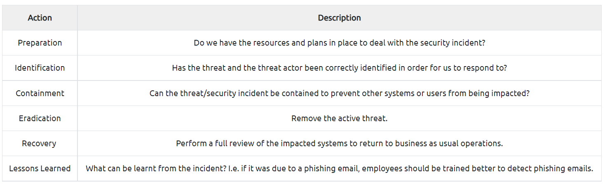

# Security Models Continued
  
What is the name of the model that uses the rule "**can't** read up, can read down"?

> The Bell LaPadula Model

  
What is the name of the model that uses the rule "**can** read up, can't read down"?
> The Biba Model

  
If you were a military, what security model would you use?
> The Bell LaPadula Model

  
If you were a software developer, what security model would the company perhaps use?
> The Biba Model

#  Threat Modelling & Incident Response

FrameWorks

- **STRIDE** (**S**poofing identity, **T**ampering with data, **R**epudiation threats, **I**nformation disclosure, **D**enial of Service and **E**levation of privileges)
- **PASTA** (**P**rocess for **A**ttack **S**imulation and **T**hreat **A**nalysis)

**CSIRT** (**C**omputer **S**ecurity **I**ncident **R**esponse **T**eam)

