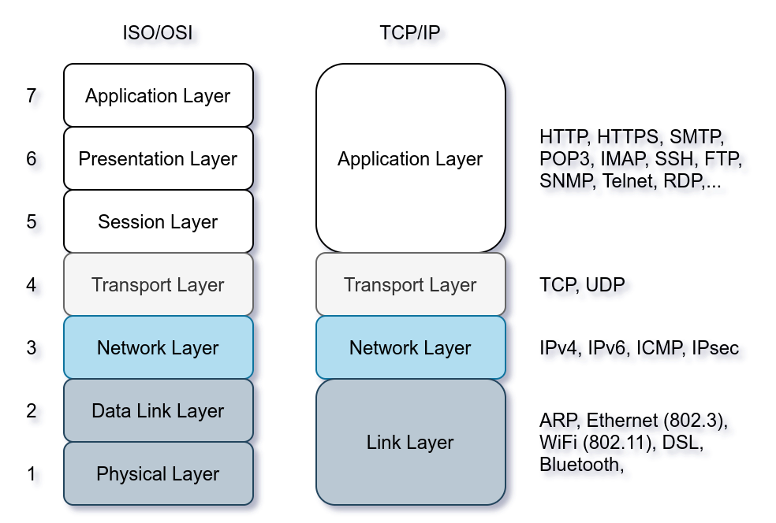

## Discovering Live Hosts

Let’s revisit the TCP/IP layers shown in the figure next. We will leverage the protocols to discover the live hosts. Starting from bottom to top, we can use:

-   ARP from Link Layer
-   ICMP from Network Layer
-   TCP from Transport Layer
-   UDP from Transport Layer

If you want to ping a system on the same subnet, an ARP query should precede the ICMP Echo.

Although TCP and UDP are transport layers, for network scanning purposes, a scanner can send a specially-crafted packet to common TCP or UDP ports to check whether the target will respond. This method is efficient, especially when ICMP Echo is blocked.

## Nmap Host Discovery Using TCP and UDP

**UDP Ping**

Finally, we can use UDP to discover if the host is online. Contrary to TCP SYN ping, sending a UDP packet to an open port is not expected to lead to any reply. However, if we send a UDP packet to a closed UDP port, we expect to get an ICMP port unreachable packet; this indicates that the target system is up and available.

In the following figure, we see a UDP packet sent to an open UDP port and not triggering any response. However, sending a UDP packet to any closed UDP port can trigger a response indirectly indicating that the target is online.

## Summary

You have learned how ARP, ICMP, TCP, and UDP can detect live hosts by completing this room. Any response from a host is an indication that it is online. Below is a quick summary of the command-line options for Nmap that we have covered.

Scan Type | Example Command
--- | ---
ARP Scan | `sudo nmap -PR -sn MACHINE_IP/24`
ICMP Echo Scan | `sudo nmap -PE -sn MACHINE_IP/24`
ICMP Timestamp Scan | `sudo nmap -PP -sn MACHINE_IP/24`
ICMP Address Mask Scan | `sudo nmap -PM -sn MACHINE_IP/24`
TCP SYN Ping Scan | `sudo nmap -PS22,80,443 -sn MACHINE_IP/30`
TCP ACK Ping Scan | `sudo nmap -PA22,80,443 -sn MACHINE_IP/30`
UDP Ping Scan | `sudo nmap -PU53,161,162 -sn MACHINE_IP/30`

Remember to add `-sn` if you are only interested in host discovery without port-scanning. Omitting `-sn` will let Nmap default to port-scanning the live hosts.

Option | Purpose
--- | ---
`-n` | no DNS lookup
`-R` | reverse-DNS lookup for all hosts
`-sn` | host discovery only

