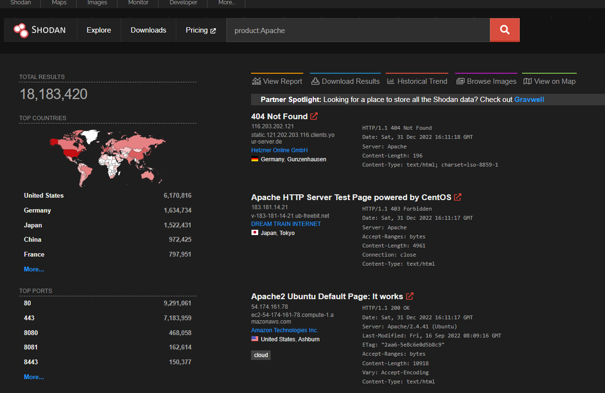
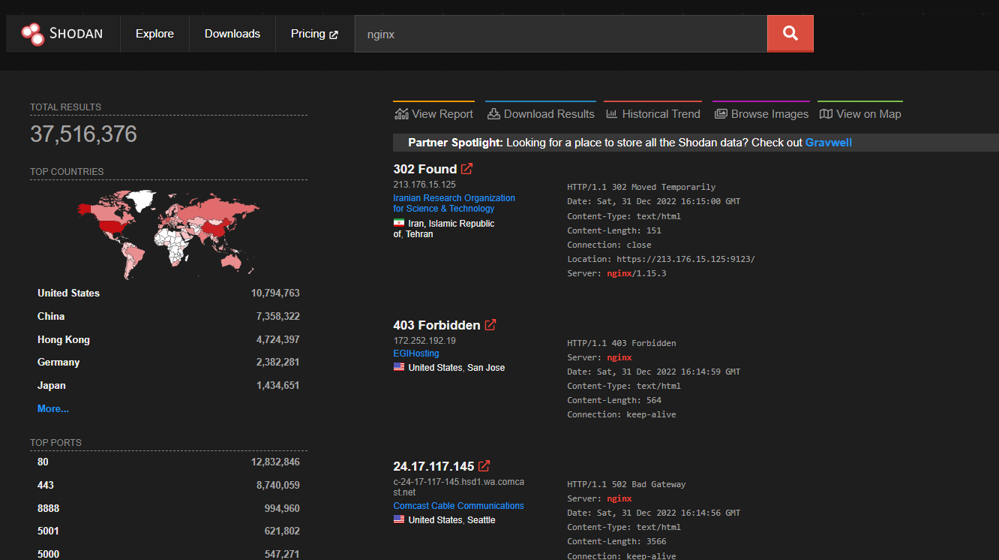

https://tryhackme.com/room/passiverecon

# Shodan.io

Use official shodan python library
Git - https://github.com/achillean/shodan-python
Demo - https://asciinema.org/~Shodan

```bash
pip3 install shodan
```

## According to Shodan.io, what is the 2nd country in the world in terms of the number of publicly accessible Apache servers?

```bash
┌──(root㉿IPTV)-[/mnt/c/Users/GOD/Desktop]
└─# shodan stats "apache"
Top 10 Results for Facet: country
US                             6,943,511
DE                             2,024,840
JP                             1,736,507
CN                             1,176,148
FR                               936,666
GB                               632,857
NL                               586,840
CA                               513,719
BR                               454,799
IN                               450,234

Top 10 Results for Facet: org
Amazon Technologies Inc.         992,655
Aliyun Computing Co., LTD        615,011
DigitalOcean, LLC                593,011
Amazon.com, Inc.                 582,594
GoDaddy.com, LLC                 389,735
OVH SAS                          367,304
Hetzner Online GmbH              340,469
Unified Layer                    324,955
Amazon Data Services Japan       300,742
Amazon Data Services NoVa        276,869

```

## Based on Shodan.io, what is the 3rd most common port used for Apache?



##   Based on Shodan.io, what is the 3rd most common port used for nginx?

