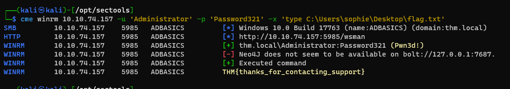
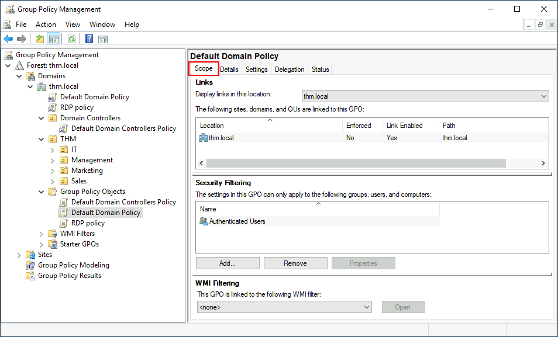
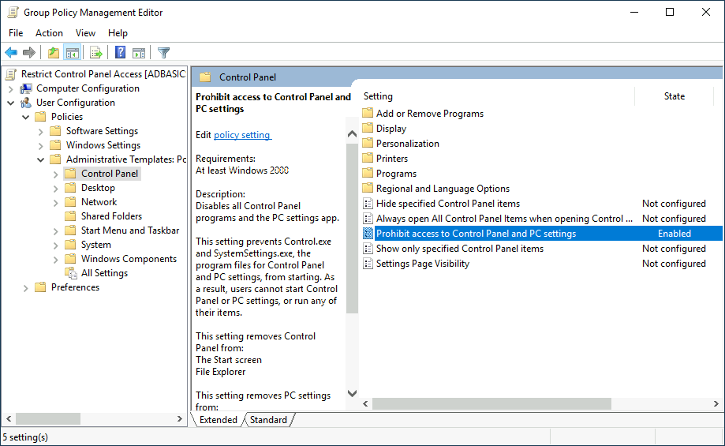
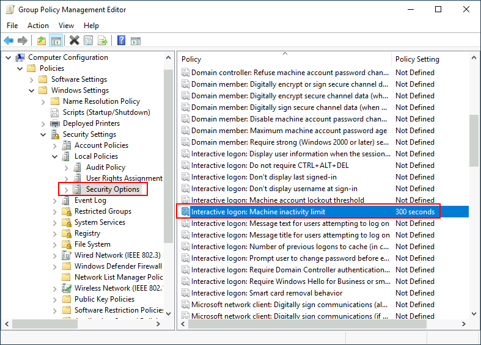
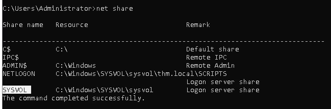
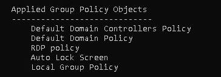
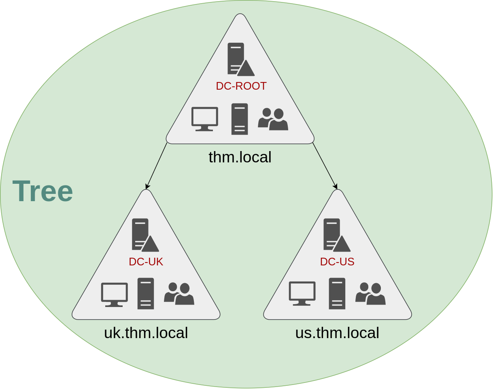
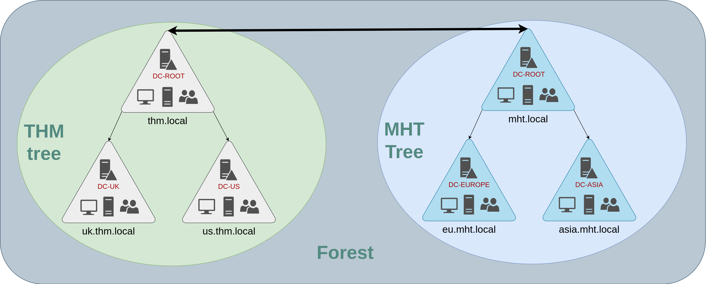

## Introduction

**Room Objectives**

In this room, we will learn about Active Directory and will become familiar with the following topics

- What Active Directory is
- What an Active Directory Domain is
- What components go into an Active Directory Domain
- Forests and Domain Trust
- And much more!

## Windows Domains

### Questions

#### In a Windows domain, credentials are stored in a centralised repository called...

> Active Directory

#### The server in charge of running the Active Directory services is called...

> Domain Controller


## Active Directory

Security Groups vs OUs

You are probably wondering why we have both groups and OUs. While both are used to classify users and computers, their purposes are entirely different:

- **OUs** are handy for **applying policies** to users and computers, which include specific configurations that pertain to sets of users depending on their particular role in the enterprise. Remember, a user can only be a member of a single OU at a time, as it wouldn't make sense to try to apply two different sets of policies to a single user.
- **Security Groups**, on the other hand, are used to **grant permissions over resources**. For example, you will use groups if you want to allow some users to access a shared folder or network printer. A user can be a part of many groups, which is needed to grant access to multiple resources.

### Questions

#### Which group normally administrates all computers and resources in a domain?

> Domain Admin

#### What would be the name of the machine account associated with a machine named TOM-PC?

> TOM-PC$

#### Suppose our company creates a new department for Quality Assurance. What type of containers should we use to group all Quality Assurance users so that policies can be applied consistently to them?

> Organization Units

## Managing Users in AD

### Questions

#### What was the flag found on Sophie's desktop?

```bash
Set-DomainUserPassword

powershell -C Enable-PSRemoting -Force
```

```bash
cme winrm 10.10.74.157 -u 'Administrator' -p 'Password321' -x 'type C:\Users\sophie\Desktop\flag.txt'
```



> THM{thanks_for_contacting_support}

#### The process of granting privileges to a user over some OU or other AD Object is called...

> Delegation

## Managing Computers in AD

**1. Workstations**

Workstations are one of the most common devices within an Active Directory domain. Each user in the domain will likely be logging into a workstation. This is the device they will use to do their work or normal browsing activities. These devices should never have a privileged user signed into them.  

**2. Servers**

Servers are the second most common device within an Active Directory domain. Servers are generally used to provide services to users or other servers.

**3. Domain Controllers**

Domain Controllers are the third most common device within an Active Directory domain. Domain Controllers allow you to manage the Active Directory Domain. These devices are often deemed the most sensitive devices within the network as they contain hashed passwords for all user accounts within the environment.

Since we are tidying up our AD, let's create two separate OUs for `Workstations` and `Servers` (Domain Controllers are already in an OU created by Windows). We will be creating them directly under the `thm.local` domain container. In the end, you should have the following OU structure:


Now, move the personal computers and laptops to the Workstations OU and the servers to the Servers OU from the Computers container. Doing so will allow us to configure policies for each OU later.

### Questions

pass

## Group Policies

- GPOs are simply a collection of settings that can be applied to OUs



- GPOs are distributed to the network via a network share called `SYSVOL`

As part of our new job, we have been tasked with implementing some GPOs to allow us to:

1. Block non-IT users from accessing the Control Panel.
2. Make workstations and servers lock their screen automatically after 5 minutes of user inactivity to avoid people leaving their sessions exposed.

**_Restrict Access to Control Panel_**



**_Auto Lock Screen GPO_**





```bash
gpupdate /force

# Run with administrator to view COMPUTER scope
gpresult /R
```


## Authentication Methods

**Kerberos Authentication**

Kerberos authentication is the default authentication protocol for any recent version of Windows. Users who log into a service using Kerberos will be assigned tickets. Think of tickets as proof of a previous authentication. Users with tickets can present them to a service to demonstrate they have already authenticated into the network before and are therefore enabled to use it.

## Trees, Forests and Trusts

### Trees

> Countries

- The **Enterprise Admins** group will grant a user administrative privileges over all of an enterprise's domains




### Forests

> Sub-Companies



### Trust Relationships

> Domains arranged in trees and forests are joined together by **trust relationships**

