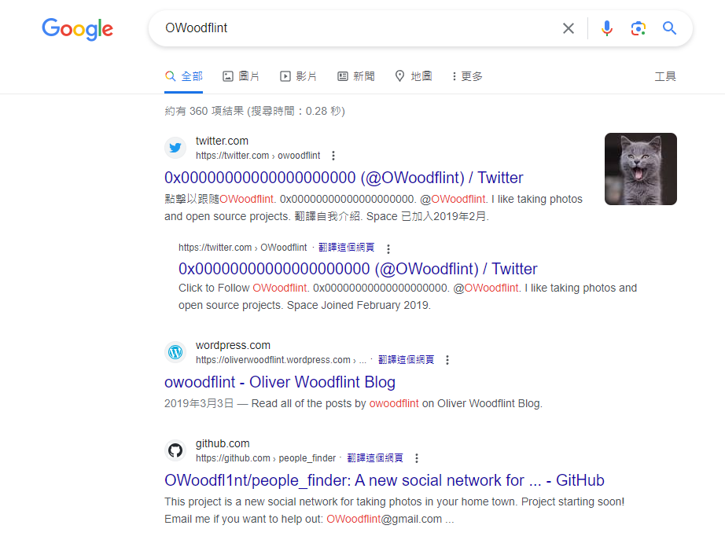
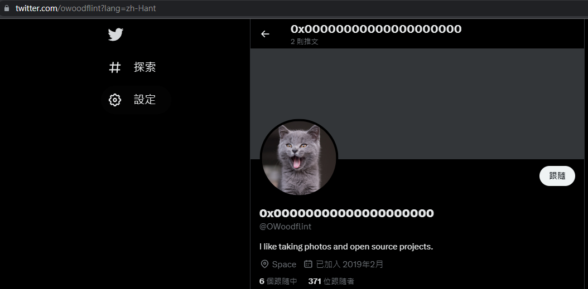
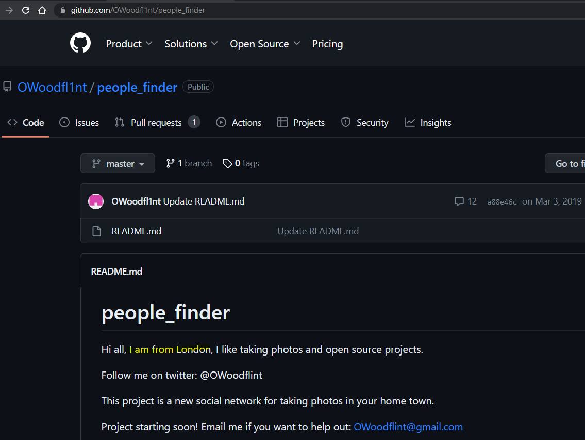
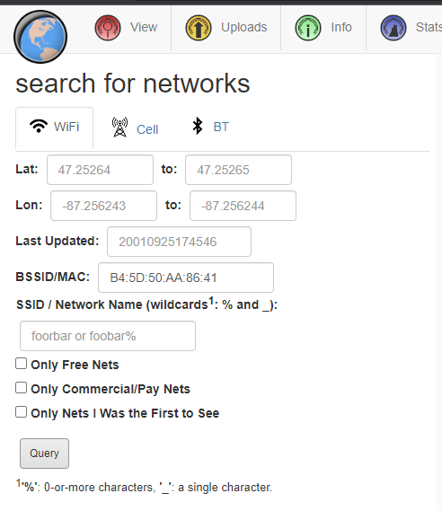
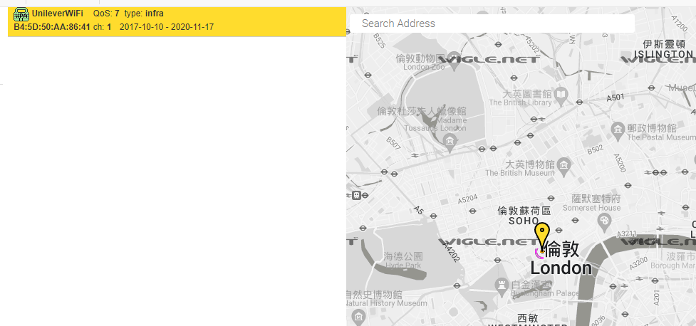
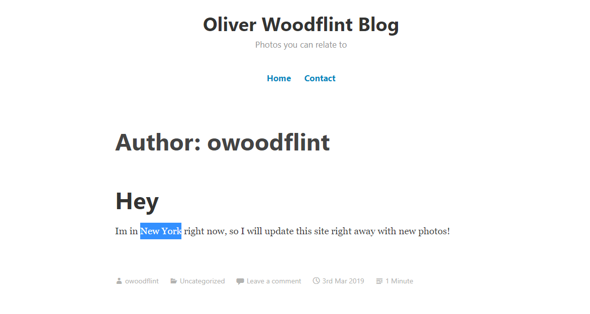

> https://tryhackme.com/room/ohsint

What information can you possible get with just one photo?


## What is this user's avatar of?

```bash
┌──(root㉿kali)-[~/www]
└─# exiftool WindowsXP.jpg
ExifTool Version Number         : 12.57
File Name                       : WindowsXP.jpg
Directory                       : .
File Size                       : 234 kB
File Modification Date/Time     : 2023:06:02 14:40:54+00:00
File Access Date/Time           : 2023:06:02 14:41:08+00:00
File Inode Change Date/Time     : 2023:06:02 14:40:54+00:00
File Permissions                : -rw-r--r--
File Type                       : JPEG
File Type Extension             : jpg
MIME Type                       : image/jpeg
XMP Toolkit                     : Image::ExifTool 11.27
GPS Latitude                    : 54 deg 17' 41.27" N
GPS Longitude                   : 2 deg 15' 1.33" W
Copyright                       : OWoodflint
Image Width                     : 1920
Image Height                    : 1080
Encoding Process                : Baseline DCT, Huffman coding
Bits Per Sample                 : 8
Color Components                : 3
Y Cb Cr Sub Sampling            : YCbCr4:2:0 (2 2)
Image Size                      : 1920x1080
Megapixels                      : 2.1
GPS Latitude Ref                : North
GPS Longitude Ref               : West
GPS Position                    : 54 deg 17' 41.27" N, 2 deg 15' 1.33" W
```

Google `OWoodflint`



First google result



> cat

## What city is this person in?

3rd google result



> London

## What is the SSID of the WAP he connected to?

Obtain target's home wifi BSSID based on tweets


Search it on wigle.net



Result:



> UnileverWifi

## What is his personal email address?

It's in the git repo


> OWoodflint@gmail.com

## What site did you find his email address on?

> github

## Where has he gone on holiday?

In his wordpress blog



## What is the person's password?

This is kinda tricky, and won't likely happen in real world instace

## ETC

Tried these

Google: `OSINT Kits`

### Sherlock

Find the username across multi platforms

```bash
┌──(root㉿kali)-[~/sectools/sherlock]
└─# python3 sherlock OWoodflint --nsfw
[*] Checking username OWoodflint on:

[+] Codecademy: https://www.codecademy.com/profiles/OWoodflint
[+] Enjin: https://www.enjin.com/profile/OWoodflint
[+] Fiverr: https://www.fiverr.com/OWoodflint
[+] G2G: https://www.g2g.com/OWoodflint
[+] Gravatar: http://en.gravatar.com/OWoodflint
[+] IFTTT: https://www.ifttt.com/p/OWoodflint
[+] Quizlet: https://quizlet.com/OWoodflint
[+] Twitter: https://twitter.com/OWoodflint
[+] Virgool: https://virgool.io/@OWoodflint
[+] ebio.gg: https://ebio.gg/OWoodflint
[+] jeuxvideo: http://www.jeuxvideo.com/profil/OWoodflint?mode=infos
[+] minds: https://www.minds.com/OWoodflint/

[*] Search completed with 12 results
```