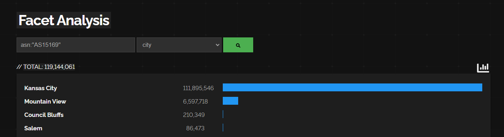

# Cheat Sheets
---
- https://github.com/jakejarvis/awesome-shodan-queries

# Google & Filtering
---

## Under Google's ASN, what is the most popular city?

Besides filters, there are top facet


Click more, got the URI

```
https://www.shodan.io/search/facet?query=asn%3A%22AS15169%22&facet=country
```

Change it to city

```bash
https://www.shodan.io/search/facet?query=asn%3A%22AS15169%22&facet=city
```



